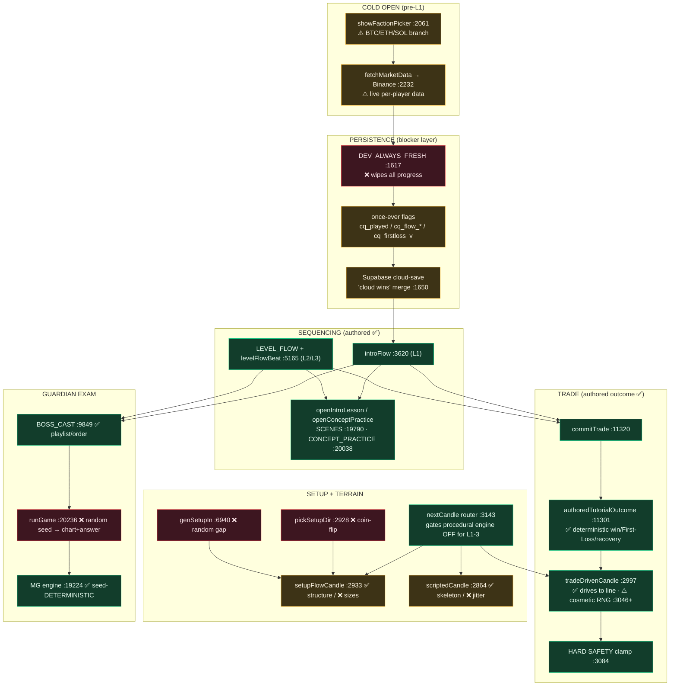

# ChartQuest — Operation First Impression
## Audit & Implementation Strategy for the Handcrafted L1–3 Campaign

**Date:** 2026-07-21 · **Baseline:** build 276 (working tree, uncommitted over HEAD build 271) · **Source of truth:** `chart-quest.html` (mirrored byte-for-byte to `index.html`)

**Method:** 10 parallel deep readers (5 over the runtime code, 5 over the ratified canon) → 5 adversarial verification passes → 1 completeness critic. ~2M tokens of analysis, every claim anchored to `file:line`. This document is the planning deliverable requested by the brief; **no game code was changed.**

---

## 0. Executive Summary — Read This First

**The premise has already been substantially solved.** The brief describes the problem as *"procedural curriculum and procedural trades continue producing inconsistent experiences… randomness is still reducing educational quality."* That was true at build 250. It is **largely stale at build 276.** The audit found, with verified `file:line` evidence, that the L1–3 onboarding is already ~70% a handcrafted campaign:

- **Trade outcomes are 100% authored and deterministic.** There is **zero** `Math.random()` in the L1–3 win/loss decision. `authoredTutorialOutcome()` ([chart-quest.html:11301](chart-quest.html)) scripts L1 = all wins, L2 = win → the one designed **First Loss** → scripted recovery win, L3 = all wins. The old "~58% coin flip" is deleted (0 occurrences). *[CONFIRMED]*
- **The chart is force-driven to agree with the authored outcome.** `tradeDrivenCandle()` ([:2997](chart-quest.html)) puppeteers price to the pre-decided line along one authored emotional arc, with hard-safety clamps ([:3084](chart-quest.html)) that RNG cannot flip. *[CONFIRMED]*
- **The lesson/practice/beat SEQUENCE is identical for every fresh player.** L1 via the `introFlow` state machine ([:3620](chart-quest.html)); L2/L3 via the `LEVEL_FLOW` sequencer ([:5165](chart-quest.html)). Fixed order, fixed content, fires all beats before every Guardian. *[CONFIRMED]*
- **Every lesson and practice is static authored data** — `LessonChart` SCENES ([:19790](chart-quest.html)) + `CONCEPT_PRACTICE` ([:20038](chart-quest.html)), already migrated to canonical candle archetypes (Phase 3A/3B). *[CONFIRMED]*
- **The curriculum is boss-aligned by design** — Hour N teaches what Guardian N tests ([`CURRICULUM` :4948](chart-quest.html)); ≥3-trades-before-boss and "never test the untaught" are code-enforced (`tradeGateRequired` [:5117](chart-quest.html), `conceptTier` [:5065](chart-quest.html)).

**So Operation First Impression is not "replace the procedural engine."** The procedural trade/terrain engine is *already bypassed* in L1–3 (`nextCandle` gates it on `_lvl <= 3` at [:3143](chart-quest.html)). The real mission is narrower, more tractable, and higher-leverage: **close the handful of genuine remaining leaks, make the campaign persist and replay, resolve two "identical journey" blockers the brief didn't mention, and finish a short felt-experience punch-list.**

### The five real gaps (ranked by educational impact)

| # | Gap | Why it matters | Severity |
|---|-----|----------------|----------|
| **G1** | **Guardian exam rounds are procedurally seeded** — different chart AND different correct answer every play (`runGame` seed `(Date.now()&0xffff)^(Math.random()*9999)` [:20236](chart-quest.html)) | The **one true break** from an identical authored journey inside the *educational test beat*. The lesson playlist is authored; the exam questions are not. | **BLOCKER** |
| **G2** | **The campaign does not persist or replay** — `DEV_ALWAYS_FRESH=true` wipes all progress every launch ([:1617](chart-quest.html)); once-ever flags (`cq_played`, `cq_flow_*`, `cq_firstloss_v`) mean a returning player drops into procedural free play and **never sees the First Loss**; a signed-in cloud save "wins" and can override a fresh start | "Every player experiences the identical journey" is broken by **resumption**, not by procedural content. Also the #1 beta deploy-blocker. | **BLOCKER** |
| **G3** | **The "identical" claim is undercut before L1 even starts** — a forced **BTC/ETH/SOL faction pick** ([`showFactionPicker` :2061](chart-quest.html)) re-skins the game and swaps difficulty framing; **live Binance data** ([`fetchMarketData` ~:2232](chart-quest.html)) renders per-player, network-dependent HUD/ticker values during the authored play | The journey is identical *at most within one faction, on a fresh guest online session.* Not reproducible for golden-master QA. | **MAJOR** |
| **G4** | **Setup direction/timing + terrain texture are procedural** — `pickSetupDir` coin-flip ([:2928](chart-quest.html)), `genSetupIn` random spacing ([:6940](chart-quest.html)), unseeded `rand()` terrain jitter ([:2875–2908](chart-quest.html)) | Outcomes are fixed, but *which way* a taught trade goes, *when* setups appear, and the exact terrain shape vary run-to-run. Educationally minor; matters only if "identical" must be literal. | **MAJOR** |
| **G5** | **Felt-experience punch-list** — no forward-compass on the pre-trade traversal (the #1 funnel leak), cold-open can paint ~30s of near-black, the quest-spine card is SKIP-only, no can't-fail retrieval tap, no shareable First-Win/Gambler-Falls artifact | These are the *why they continue playing* beats. Trade-feel is largely done (builds 273–276); getting non-gamers **to** the trade is now the bigger lever. | **MAJOR** |

**Strategic redirect in one sentence:** *Stop optimizing the engine; determinize the exam, make the campaign persist and replay, pin the "identical" boundary (faction + data), and finish the felt punch-list — all as small, additive, gate-respecting edits on top of the existing authored foundation.*

**Confidence:** High that the next sprint produces a stable, unforgettable first three levels — *because most of it already exists and is machine-locked by `verify.js`.* The risk is not architectural; it is (a) a few unmapped subsystems the brief ignored (faction, live data, cloud save, telemetry) and (b) getting the founder to pin ~8 decisions listed in §8.

---

## 1. Current State of Truth — What "Authored" Already Means at Build 276

| Layer | Status | Behavior in L1–3 | Evidence |
|-------|--------|------------------|----------|
| Trade **outcome** | ✅ Authored-deterministic | L1 all wins; L2 trade #2 = First Loss → recovery win; L3 all wins. Zero RNG. | `authoredTutorialOutcome()` [:11301](chart-quest.html); intro forced-win [:11388](chart-quest.html) |
| Outcome→chart **drive** | ✅ Authored-deterministic (result) | Price driven to the decided TP/SL line; win can't breach stop, loss reaches it. | `tradeDrivenCandle()` [:2997](chart-quest.html); HARD SAFETY clamp [:3084](chart-quest.html) |
| Trade **emotional arc** | ✅ Authored (phase order + depths) | Win: dip→hold→recover→run; Loss: drop→false-hope→stop-out. Dip depth fixed 0.72. | `_drivePhase` arc [:3012–3033](chart-quest.html) |
| Lesson/practice **sequence** | ✅ Authored-deterministic (fresh players) | L1 `introFlow` fixed chain; L2/L3 `LEVEL_FLOW` fixed beat array. | `introFlow` [:3620](chart-quest.html); `LEVEL_FLOW` [:5165](chart-quest.html) |
| Lesson/practice **content** | ✅ Authored-deterministic | Static `{o,h,l,c}` arrays + fixed answers + captions. Canonical archetypes (Phase 3A/3B). | `SCENES` [:19790](chart-quest.html); `CONCEPT_PRACTICE` [:20038](chart-quest.html) |
| First-win **bet** | ✅ Authored-deterministic | Two prediction cards with predetermined outcomes (green then red). | bet cards [:3648–3662](chart-quest.html) |
| Curriculum / concept gating | ✅ Authored-deterministic | Per-hour focus table, boss-aligned; term-visibility tiers. | `CURRICULUM` [:4948](chart-quest.html); `conceptTier` [:5065](chart-quest.html) |
| Boss **roster/playlist/order** | ✅ Authored-deterministic | `BOSS_CAST` names, round IDs, lives, rewards, lore — taught-aligned. | `BOSS_CAST` [:9849–9884](chart-quest.html) |
| Terrain **skeleton** | ✅ Authored base heights | `LVL_SCRIPTS` fixed base contour for L1–3. | `LVL_SCRIPTS` [:2858](chart-quest.html) |
| Setup **structure** | ✅ Authored by construction | momentum ≥2.5× pullback, tightening pullbacks, confirm ≥28u past high (Phase 3B). | `setupFlowCandle` [:2933](chart-quest.html) |
| Trade-**feel** juice | ✅ Shipped (273–276) | Win-shake ≥ loss, Finn witness face, dip heartbeat, camera-punch, shells-fly. | `resolveTrade` [:12203](chart-quest.html); TX-01 parity |
| — | — | — | — |
| Guardian **exam content** | ❌ **Procedural** | Different chart + different correct answer every play. | `runGame` random seed [:20236](chart-quest.html) |
| Setup **direction** | ❌ **Procedural** | Long/short is a mid-zone coin-flip. | `pickSetupDir` [:2928](chart-quest.html) |
| Setup **timing/position** | ❌ **Procedural** | Random cooldown decides when/where setups appear. | `genSetupIn` [:6940](chart-quest.html) |
| Terrain **texture** | ❌ **Procedural (cosmetic)** | Unseeded jitter on every candle height/wick/width/gap. | `rand()` [:2519](chart-quest.html), consumed [:2875–2908](chart-quest.html), [:3325](chart-quest.html) |
| Campaign **persistence** | ❌ **Broken / dev-disabled** | Every launch wipes progress; once-ever flags suppress replay; cloud save can override. | `DEV_ALWAYS_FRESH` [:1617](chart-quest.html); flags [:3621](chart-quest.html), [:5177](chart-quest.html), [:11304](chart-quest.html) |
| Pre-L1 **faction branch** | ⚠️ **Branches the journey** | BTC/ETH/SOL re-skin + difficulty framing + live-data source. | `showFactionPicker` [:2061](chart-quest.html) |
| Live **market data** | ⚠️ **Per-player, non-reproducible** | HUD/HTF/ticker render live Binance values during authored play. | `fetchMarketData` ~[:2232](chart-quest.html) |

---

## 2. The Six Audit Questions (answered)

### 2.1 — Systems to reuse UNCHANGED

These are the spine of the campaign. They already give every fresh player the identical journey and are machine-locked by `verify.js` (checks #10/#11). **Do not touch.**

- **Outcome oracle:** `authoredTutorialOutcome()` + the intro forced-win branch + First-Loss machinery (`_firstLossPending`/`_recoverNextWin`/`_isFirstLoss`) — [:11301–11318](chart-quest.html), [:11384–11402](chart-quest.html). This *is* canon's `apply.honestOutcome` model already.
- **Drive engine:** `tradeDrivenCandle()` + the HARD SAFETY clamp — [:2997](chart-quest.html), [:3084](chart-quest.html). Author-the-arc / drive-the-candles / never-breach-stop-on-a-win.
- **Sequencers:** `introFlow` chain ([:3620](chart-quest.html), [:16622–16731](chart-quest.html)) and `LEVEL_FLOW`+`levelFlowBeat` ([:5165–5201](chart-quest.html)); the LEARN→PRACTICE overlay pair `openIntroLesson`/`openConceptPractice` ([:20173](chart-quest.html)/[:20086](chart-quest.html)).
- **Teaching assets:** `LessonChart` engine + all 33 SCENES ([:19783–19977](chart-quest.html)); `CONCEPT_PRACTICE` charts ([:20038](chart-quest.html)); the between-level recap `IM_LESSONS`/`imOpenLesson` ([:5828](chart-quest.html)).
- **Boss skeleton:** `BOSS_CAST` roster + `rebuildBossesFromCast`; `openBoss`/`bossRound`/`launchRound`/`onRoundDone` control flow + HP/hearts/pass-on-70; the entire seed-**deterministic** MG mini-game engine (`ChartView`, per-game gen/validate, [:19224–20388](chart-quest.html)). *Only the seed source is random — the engine itself needs no rewrite.*
- **Guardrails:** `MIN_TRADE_CANDLES` breathe-gate ([:2996](chart-quest.html)); `tradeGateRequired`/`tradeGatePassed` ≥3-trades-before-boss ([:5113](chart-quest.html)); `SETUP_UNLOCK`/`setupLevelUnlocked` no-untaught-setup gate ([:11601](chart-quest.html)); the COLOR palette ([:2448](chart-quest.html)); the frozen physics seam `{candleTop, c.x, c.w, gap}` ([:2559](chart-quest.html)).
- **Feel layer:** the build-273→276 Trade Emotion Pass (reads outcome only, changes no odds) — keep as-is.
- **Process/toolchain:** the canon-first read order + PRE-FLIGHT ritual (`development_guardrails.md`, `CLAUDE_RULES.md`); the mirror rule + `verify.js` (11 checks); `scripts/cq.sh ship`; the `?fresh=1` verification rule. **Run the sprint *through* this toolchain, not around it.**

### 2.2 — Systems to BYPASS / OVERRIDE during L1–3

Already bypassed (keep them bypassed — *do not resurrect*):
- The procedural trade-outcome coin-flip (deleted; `authoredTutorialOutcome` owns L1–3).
- The free-roam terrain generator `nextCandle` MARKET_DATA path (only runs L4+).
- `calcLevels()` structure-derived SL/TP (overridden by the `_rd0` 2R math in L1–3).
- The curriculum-gated popup `teach()`/text-card path (intro early-return [:5127](chart-quest.html); `LEVEL_FLOW` sets `taught[key]=true` [:5180](chart-quest.html)).
- The **dead** legacy `BOSSES[].rounds` bank + `renderBossRound` engine ([:9511–9700](chart-quest.html), [:10292–10364](chart-quest.html)) — unwired, contains untaught doji/wick questions. `boss_canon.md` forbids reviving it.

Newly required overrides for the campaign (all small, localized):
- **The MG seed** ([:20236](chart-quest.html)) — for Guardians 0–3, derive the seed deterministically (e.g. `bfState.level*100 + bfState.idx`) instead of `Date.now()^Math.random`. **This one edit fixes G1** — every player then reads the identical exam chart *and* the identical correct answer, because each answer is derived from the seed.
- **`DEV_ALWAYS_FRESH`** ([:1617](chart-quest.html)) → `false` for real players (and add a `verify.js` gate that FAILs the ship if it's `true`).
- **Persistence gate** — the once-ever `cq_played`/`cq_flow_*`/`cq_firstloss_v` flags must be overridable by a "replay campaign" flag so resumption re-enters the authored L1–3 rather than dropping to free play.
- **`pickSetupDir`** ([:2928](chart-quest.html)) — replace the mid-zone coin-flip with an authored per-trade direction table (TES §6: Trade 1.1 long, 1.2 short). *(G4)*
- **`genSetupIn`/`setupCountdown`** ([:6940](chart-quest.html), [:12466](chart-quest.html)) — replace random spacing with an authored setup schedule. *(G4)*
- **The 6 cosmetic `Math.random()` in `tradeDrivenCandle`** ([:3046](chart-quest.html), [:3053](chart-quest.html), [:3056](chart-quest.html), [:3062](chart-quest.html), [:3066](chart-quest.html)) and terrain jitter in `scriptedCandle` ([:2875–2908](chart-quest.html)) — seed them **only if** the founder wants byte-identical terrain (see D1). These do **not** touch outcomes.
- **First guided win scare depth** ([:3023](chart-quest.html)) — the intro/Guardian-1 trade should feel a *shallow* EP-4 (TEC EC-1 `comfortable_winner`), not the full 0.72 `scary_winner` dip. *(D8)*
- **`quickRead`** ([:11816](chart-quest.html)) — the one procedural drill still active during L1–3 traversal (reads a random live candle). Gate off during L1–3 or feed it a scripted candle if "identical" must be literal.
- **Untaught-jargon leak** — gate `tradeVerdict`/variance-floater copy ([:3854](chart-quest.html), [:12241](chart-quest.html)) behind `conceptTier` so "confluence/A-grade/variance" never appear in L1–3.

### 2.3 — Systems to remain PROCEDURAL after Level 3

The authored spine is **L1–3 only**; the procedural engine remains the game from L4 onward and needs no change:
- Free-roam terrain generator `nextCandle`/`cartoonCandle` + `chartComplexity` ramp + structure-event system (BOS/ChoCh/sweep/OB) — [:3104](chart-quest.html), [:3172–3203](chart-quest.html). L4+ blends realism back in by design.
- Live setup **detector** (momentum/pullback/BOS/ChoCh/trend-break/VWAP) on live candles ([:12111–12160](chart-quest.html)) + `SETUP_UNLOCK` gating.
- Boss-round MG **chart instances** for Guardians 4–10 (procedural seed is *desirable* there — replayability).
- `calcLevels()` structure-based SL/TP resumes as the real sizing engine at L4+.
- **Honest win/loss variance** — `tradeDrivenCandle` is inherently L1–3-only (`_lvl<=3` gate); at L4+ price returns to real MARKET_DATA + honest `hitTP`/`hitSL`. "Real, honest variance begins at Guardian 4" ([:11300](chart-quest.html)).
- **Trading V2** (the author-first honest-outcome / genuine-variance engine) stays **GATED** behind the validate-first kill-chain — *not part of L1–3, not authorized* (`PROJECT_STATUS.md:33`; `trading_canon.md`; TEC). *[CONFIRMED]*
- Cosmetic decoration RNG (wicks/widths/volume/shells) — texture, not curriculum, everywhere. The Constitution actively *mandates* ±4–8% width jitter for the walkable Type-B road.

### 2.4 — Canonical documents that already define the correct behavior

| Concern | Canonical source | What it defines |
|---------|------------------|-----------------|
| Authored tutorial outcomes | `CHARTQUEST_TRADING_EXPERIENCE_SYSTEM_v1.1.md` (§A3 First Loss, §A5 Tier-1 "Authored Educational") | The confidence-phase model the runtime already implements. Forbidden #1 = no random tutorial loss. |
| The felt single trade | `CHARTQUEST_TRADE_EXPERIENCE_CONSTITUTION.md` + `CHARTQUEST_TRADE_SCHEMA.json` | EP phase model, EC-1..10 curve templates, TX-* validators, per-trade `curveTemplate`/`phaseBudget`. **PROPOSED / unratified** (needs ADR-TX-1). |
| Lessons & curriculum | `docs/curriculum-engine/` (LESSON_SCHEMA.json, CANONICAL_OBJECT_REGISTRY D1–D8, VALIDATION_CONTRACTS VR-*, CURRICULUM_GRAPH) | The target-state Lesson object (learn/practice/apply/test), single `guardian` placement (D1), one `taught(conceptKey)` gate (D2). **Spec only — not yet implemented.** |
| Candle/chart visuals | `CHARTQUEST_VISUAL_MARKET_CONSTITUTION.md` + `CHARTQUEST_EDUCATIONAL_CANDLE_LIBRARY_2026-07-16.md` | One slot-derived width formula, no-flat-candle body floor, neutral wicks/doji, reserved colours, the frozen `{candleTop,c.x,c.w,gap}` seam. L1–3 already migrated per-path (Phase 3A/3B). |
| Progression & teach-order | `docs/canon/progression_canon.md`, `gameplay_canon.md`, `boss_canon.md` | LEARN→PRACTICE→APPLY→TEST, ≥3 trades/level, never test the untaught, fixed boss difficulty. |
| Governance & freeze | `docs/architecture-ratified/*`, `docs/canon/protected_systems.md`, `development_guardrails.md` | The ADR process, the 9 protected runtime systems, the `CQ_ALLOW_PROTECTED` gate. |
| Product goals | Golden Path Review, Beta Onboarding/Retention/Top-10/Growth audits, First-Hour plans | The first-15-min defects and the "I can read a chart" confidence outcome. |

**Key point:** the founder's "authored Trade Scripts, each with a defined emotional arc" maps *exactly* to the TEC's EC-* curve templates and the Trade Schema's `curveTemplate`/`phaseBudget`/`agencyBeat` fields — **but that schema is PROPOSED, not ratified, and appears nowhere in code.** Adopting it as a first-class object is the one part of this mission that requires an ADR (see D7).

### 2.5 — Where the runtime DIVERGES from canon (ranked)

**BLOCKERS**
1. **Guardian exam is procedural** — random seed feeds every boss-round chart + answer (`runGame` [:20236](chart-quest.html)). Breaks "identical authored journey" at the *test* beat. Canon: LESSON_SCHEMA test beat references authored assets.
2. **No persistence** — `DEV_ALWAYS_FRESH=true` ([:1617](chart-quest.html)) wipes all progress every launch; contradicts protected-system #6 (frozen save schema) and the code's own must-flip-false warning ([:1614](chart-quest.html)).

**MAJOR (identical-journey integrity)**
3. Authored journey gated behind **once-ever flags** — a returning player without `?fresh=1` gets *no* authored lessons and drops into free play ([:3621](chart-quest.html), [:5177](chart-quest.html)).
4. **First Loss is once-ever-per-device** (`cq_firstloss_v` [:11304](chart-quest.html)) — returning players get L2 all-wins, losing the defining confidence-phase beat.
5. **Terrain / setup direction / setup timing vary run-to-run** — unseeded `rand()` ([:2519](chart-quest.html)); `pickSetupDir` coin-flip ([:2928](chart-quest.html)); `genSetupIn` random gap ([:6940](chart-quest.html)).
6. **No first-class authored Trade Script** — the arc is one imperative state machine shared by ALL wins ([:2997–3034](chart-quest.html)), not a per-trade EC-* template. Every win is effectively the same `scary_winner`.
7. **No Lesson object / no `taught(conceptKey)` gate** — runtime uses `conceptTier()` over a CONCEPTS map + a session `taught{}` de-dup flag ([:5065](chart-quest.html), [:5088](chart-quest.html)). (Canon D2.)
8. **The `window.CQ` "one engine, one formula" candle cure is not live** — all L1–3 visual compliance is per-path authored data, so surfaces can still drift independently.
9. **Boss exam renderer violates 3 visual floors** — 3px body floor (vs 14/12), rx=1.5 corners (vs 0), hue-only direction ([:9479–9482](chart-quest.html)). Frozen surface pending `window.CQ`.

**MAJOR (product/experience — from the audits)**
10. No forward "this way →" compass on the pre-trade traversal (the **#1 funnel leak**) — [:3692](chart-quest.html) only has verb coaching.
11. Cold-open can paint ~30s near-black with no fast auto-skip ([:17315](chart-quest.html) "no auto-skip past the reveal").
12. The 3-step quest-spine card is shown **only on SKIP** ([:17431](chart-quest.html)) — happy-path players never see the promise stated plainly.
13. No can't-fail **retrieval tap** ("Why did this win? [I waited]/[I got lucky]") — learning stays recognition-level.
14. No **shareable artifact** for First-Win / Gambler-Falls — the only zero-cost acquisition channel is missing.

**MINOR / hygiene (fix opportunistically)**
15. **Stale "~58% win" comment** ([:12066](chart-quest.html)) contradicts the all-authored logic — invites a dev to treat 58% as a tunable knob. TEC Appendix B explicitly says to scrub it.
16. **Dead `BOSSES[0]` doji/wick literal** ([:9522–9543](chart-quest.html)) — resolved (unwired) but a foot-gun; delete it + the unwired `renderBossRound`/`bfAnswer`/`bfNext`/`bfTrendTap` path.
17. **Dead Flash Quiz** — `triggerFlashQuiz` ([:16574](chart-quest.html)) is documented as step 1 of the intro but has zero callers; the real chain starts at green/red. Quarantine or remove.
18. **Guardian numbering ambiguity** — the Gambler is "Guardian 1" in TES (code `level 0`) but CURRICULUM comments map "Hour 1 → Boss 1 = the Eel." **Blocks the paywall boundary** (see D4).
19. **`protected_systems.md` line anchors are stale by 80–440 lines** — points contributors to the wrong code. `progression_canon.md` anchors likewise drifted.
20. **Working tree is 5 builds ahead of HEAD** — builds 272–276 uncommitted (incl. protected changes under `CQ_ALLOW_PROTECTED=1`); no clean baseline to diff campaign changes against.
21. **SW cache `v273` lags build 276** — returning PWA/iOS users get the stale game until the cache is bumped.
22. Minor concept-placement divergences from the canonical graph (vwap@6 vs canon@2; `hour`+`boss` dual placement vs single `guardian` D1; gate keys `confirmation`/`trend`/`sr` vs canonical `candle_close`/`what_is_trend`/`support_resist`).

### 2.6 — Smallest architectural changes to support the authored campaign

Ranked by leverage-per-line. **None require an engine rewrite.** The mission is achievable almost entirely with additive/override edits inside existing functions.

| Change | Where | Governance | Fixes |
|--------|-------|------------|-------|
| **Deterministic boss seed** for Guardians 0–3 | `runGame` [:20236](chart-quest.html) | Protected (boss) → founder yes + `CQ_ALLOW_PROTECTED` | **G1** |
| **Flip `DEV_ALWAYS_FRESH=false`** + add `verify.js` gate | [:1617](chart-quest.html); `scripts/verify.js` | Protected (save) → founder yes | **G2** deploy-blocker |
| **Campaign-replay flag** that overrides once-ever gates for a clean L1–3 re-entry | intro/`LEVEL_FLOW`/First-Loss gates | Protected (save/flow) → founder yes | **G2** |
| **Authored setup schedule** (direction table + fixed offsets) for L1–3 | override `pickSetupDir` [:2928](chart-quest.html), `genSetupIn` [:6940](chart-quest.html) | Content-adjacent; teach-order is frozen (verify #11) | **G4** |
| **One campaign PRNG seam** — a single seed at campaign start routed through `scriptedCandle`/`setupFlowCandle`/`gap`/`decorateCandleWicks` | `rand()` [:2519](chart-quest.html) call sites | Additive; **coordinate as ONE seam** (critic) | **G4** (optional, per D1) |
| **Faction pin / cosmetic-only** for the campaign | `showFactionPicker` [:2061](chart-quest.html) | Flow change → founder yes | **G3** |
| **Snapshot/pin authored data** so L1–3 is data-independent | `fetchMarketData` path ~[:2232](chart-quest.html) | Additive fallback | **G3** |
| **Felt punch-list**: forward compass, cold-open guaranteed frame + auto-skip, quest card on happy path, retrieval tap, share artifact | [:3692](chart-quest.html), [:17315](chart-quest.html), [:17431](chart-quest.html), new | Mostly additive/render | **G5** |
| **Shallow first-win scare** (EC-1) | `tradeDrivenCandle` dip target [:3023](chart-quest.html) | Protected (outcome-adjacent) → founder yes | Divergence #… (D8) |
| Hygiene: scrub 58% comment, delete dead `BOSSES`/Flash-Quiz, bump SW cache, commit 272–276, refresh doc anchors | various | Non-protected cleanup | #15–21 |
| *(Optional, ADR-gated)* First-class **Trade Script** / **Lesson** objects per the PROPOSED schemas | new registry | **Requires ADR** | #6, #7 (D7) |

---

## 3. Dependency Map

### 3.1 Runtime call graph (the L1–3 authored path)



### 3.2 Change → blast-radius table

| If you change… | It touches… | Could break… | Guardrail |
|----------------|-------------|--------------|-----------|
| MG seed ([:20236](chart-quest.html)) | every boss round (all levels) | L4–10 replayability if not gated to `level<=2` | Gate the deterministic seed to boss level ≤ 2 only |
| `DEV_ALWAYS_FRESH` | boot, all saves | veteran/resume paths (currently masked by the flag) | Test both fresh + returning; add verify gate |
| once-ever flags | intro, LEVEL_FLOW, First Loss | double-showing beats to veterans | Introduce a *campaign-run* flag, don't delete the once-ever logic |
| `pickSetupDir`/`genSetupIn` | L1–3 setup arming | teach-order freeze (verify #11), setup detector | Keep `SETUP_UNLOCK` gate; verify #11 must still pass |
| `rand()` seeding | scriptedCandle, setupFlowCandle, gap, wicks, **terrain physics** | the frozen `{candleTop,c.x,c.w,gap}` seam; anti-flat/anti-staircase realism | **One** coordinated seam; preserve the anti-flat constraints |
| first-win dip depth ([:3023](chart-quest.html)) | `tradeDrivenCandle` arc | the felt arc for *all* wins if not scoped to trade #1 | Scope to the intro/Guardian-1 trade only |
| faction pin | cold-open, live-data source, accent colours | Visual Constitution single-palette / reserved-colour laws | Reconcile accent bleed before shipping |

### 3.3 Frozen seams — DO NOT TOUCH
`{candleTop, c.x, c.w, gap}` physics contract ([:2559](chart-quest.html)) · HARD SAFETY clamp ([:3084](chart-quest.html)) · `MIN_TRADE_CANDLES` ([:2996](chart-quest.html)) · the momentum:1/pullback:2/bos:3 teach order · the authored (non-coin-flip) outcome (all three frozen by `verify.js` #11) · the 9 protected systems in `protected_systems.md`.

---

## 4. Migration Plan — Procedural Onboarding → Authored Onboarding

The founder's recommended Phase 1–5 is sound; here it is refined against the actual runtime. Each phase names concrete edits, the governance path, and the exit gate. **Every observable change is verified in `?fresh=1` mode before it's considered done.**

### Phase 1 — Freeze & baseline the current authored journey
*Goal: a clean, committed, observable starting point.*
- **Commit builds 272–276** as a pinned checkpoint (divergence #20) so `verify.js` #10 has a clean protected-diff baseline.
- **Flip `DEV_ALWAYS_FRESH=false`** and add a `verify.js` check that FAILs the ship if it's `true` — *this immediately unmasks the veteran/resume path the audit could not observe.* Then re-run the audit's returning-player scenarios.
- **Map the four unmapped subsystems** the critic surfaced (see §6): faction end-to-end, live-data path, two-tier persistence, telemetry funnel. These are prerequisites, not optional.
- **Author the golden-master:** with fresh mode, capture the intended L1–3 journey as the reference (beats, outcomes, screenshots) — *this is impossible while live data + random seeds vary, so it depends on Phase 3.*
- **Exit gate:** clean baseline committed; DEV flag gated; the four subsystems mapped; founder decisions D1–D8 (§8) answered.

### Phase 2 — Lock authored sequencing & persistence
*Goal: every player (fresh AND returning) enters the identical authored L1–3.*
- Introduce a **campaign-run flag** that lets `introFlow`/`LEVEL_FLOW`/First-Loss re-enter the authored journey on replay, overriding the once-ever gates (divergences #3, #4) *without deleting the once-ever logic that protects veterans.*
- Resolve the **two-tier persistence** interaction: define what `?fresh` + signed-in cloud-save does (critic risk: "cloud wins" can silently skip the First Loss). Define **mid-L2 checkpoint** semantics and a player-facing "restart campaign."
- Author the **setup schedule** — replace `pickSetupDir` coin-flip + `genSetupIn` random gap with a fixed per-trade direction table + offsets (G4). Verify #11 (teach order) must still pass.
- **Exit gate:** a returning player and a fresh player both experience the identical lesson/practice/beat/outcome sequence including the First Loss; setup direction/timing fixed.

### Phase 3 — Determinize the exam & pin the "identical" boundary
*Goal: close the one true educational leak and make the journey reproducible.*
- **Deterministic MG seed for Guardians 0–3** (G1) — the single highest-leverage edit. Every player reads the identical exam chart + answer.
- **Faction decision** (D2) — pin one chain for the campaign, or make faction cosmetic-only for L1–3.
- **Live-data decision** (D3) — snapshot/pin authored candle data for L1–3 so the journey is data-independent and golden-master screenshot-diffable.
- *(Optional, per D1)* the **single campaign PRNG seam** for byte-identical terrain.
- **Exit gate:** two fresh playthroughs produce the identical exam and (per D1) identical terrain; golden-master screenshot-diff passes.

### Phase 4 — Author the trade emotional arcs (within the existing frame)
*Goal: "every trade has a defined emotional arc" — per-trade, not one-size-fits-all.*
- Give each L1–3 trade a named arc (EC-1 `comfortable_winner` for the first win; EC-2 `scary_winner` later; EC-8 for the First Loss) by **parameterizing the existing `tradeDrivenCandle` phase constants per trade slot** — *not* by building the V2 engine (which stays gated).
- Apply the **shallow-first-win scare** (D8) as the first instance of this.
- *(Optional, ADR-gated per D7)* formalize this as a first-class **Trade Script** object per `CHARTQUEST_TRADE_SCHEMA.json`, and/or a **Lesson** object per LESSON_SCHEMA. This is the only part that touches ratified architecture and needs an ADR.
- **Exit gate:** each L1–3 trade instantiates a named, authored arc; outcome logic byte-unchanged (TX-13 guard); `verify.js` #11 green.

### Phase 5 — Felt punch-list, validate & iterate
*Goal: get every non-gamer to the trade and make the win worth sharing.*
- Ship the G5 felt items: forward compass (funnel leak #1), cold-open guaranteed frame + auto-skip, quest card on the happy path, can't-fail retrieval tap, shareable First-Win/Gambler-Falls artifact.
- Stand up the **funnel dashboard** (cold-open→trade→win→Guardian→save) *before* any paid traffic (growth-audit precondition).
- Accessibility + audio + localization passes (§6).
- **Playtest-iterate** with fresh 10-year-old testers until the first three levels *consistently* produce "I can actually read a chart."
- **Exit gate:** the acceptance criteria in §9 met across ≥N fresh playtests.

---

## 5. Risk Assessment

| Risk | L×I | Mitigation |
|------|-----|------------|
| **Signed-in "cloud wins" silently overrides a fresh campaign start** — veterans/multi-device players never see the authored journey or First Loss | High × High | Phase 2 defines the cloud/`?fresh` interaction explicitly; campaign-run flag must survive a cloud pull |
| **`DEV_ALWAYS_FRESH=true` forgotten at beta** — wipes every real player's progress on load; no verify gate today | Med × Critical | Phase 1 flips it + adds a hard `verify.js` FAIL gate |
| **Live Binance dependency** — school/mobile/blocked nets hang or degrade L1–3 HUD; per-player prices make the journey non-reproducible/un-QA-able | High × Med | D3: snapshot/pin authored data for L1–3; define offline behavior |
| **Faction accent colours bleed** into candle bodies/chrome, colliding with the single-palette + reserved gold/purple laws | Med × Med | D2 + reconcile accents against the Visual Constitution before ship |
| **Stale SW cache (v273 vs 276)** — finished campaign never reaches returning PWA/iOS users | High × High | Make the SW cache-bump a hard `verify.js` ship gate |
| **Four uncoordinated seedings** interact badly with the frozen physics seam → inconsistent partial determinism | Med × Med | Design **one** campaign-seed seam (Phase 3); operational def of "identical" (D1) |
| **Telemetry blind spot** — funnel unmeasured; origin allowlist may still 403 on Cloudflare (`_ALLOWED_HOSTS` still lists old netlify host [:1668](chart-quest.html)) | High × High | Phase 5 audits + fixes the funnel before paid traffic |
| **Autoplay policy** — if audio `unlock()` isn't bound to the first gesture, the ~30s cold-open plays silent (exactly when evangelists form opinions) | Med × Med | Verify `CineAudio.unlock` gesture binding; author the cold-open audio beats |
| **Photosensitivity / reduced-motion** on a 10-year-old audience — heartbeat pulse + camera-punch + shake + red edge-glow without a verified `prefers-reduced-motion` path | Med × High (safety/legal) | Accessibility pass in Phase 5; honor reduced-motion for build-276 juice |
| **COPPA / kids-privacy** — funnel telemetry on minors raises consent obligations | Med × High | Legal review of what the funnel captures before paid traffic |
| **Manual-close escapes the script** — closing during the L2 First-Loss dip books an off-script result; does the First Loss still "count"? `_recoverNextWin` mis-place? | Med × Med | Phase 2 verifies First-Loss edge cases (manual close, `sIdx<0`, level transition) |
| **Touching a protected system without the gate** | Low × High | Every protected edit routes through founder-yes + `CQ_ALLOW_PROTECTED=1` + `verify.js` #10/#11 |
| **Scope creep into V2** — pressure to "make trades honest" pulls in the gated engine | Med × High | Explicit non-goal; L1–3 stays authored-within-frame; TX-13 byte guard |
| **Guardian-numbering ambiguity mis-places the paywall** | Med × Med | D4 pins the boundary before any paywall/credits work |

---

## 6. Blind Spots the Brief Didn't Name (from the completeness critic)

These were invisible to a code-only view but are load-bearing for a Nintendo-grade identical campaign. **Do not skip Phase 1's mapping of these:**

1. **Faction/chain picker** (BTC/ETH/SOL, [:2061](chart-quest.html)) — permanent branch in the first-impression window with different difficulty framing. "Identical" holds at most *within one faction.*
2. **Live Binance market data** ([:2232](chart-quest.html)) — HUD/HTF/ticker render live, per-player, network-dependent values during authored play.
3. **Two-tier persistence** — localStorage flags + Supabase cloud "cloud wins" merge ([:1650](chart-quest.html)); `?fresh` wipes only `/^(cq_|shellTrade)/` and leaves `sb-*` cloud auth untouched.
4. **Telemetry / funnel** (`ContentLog.emit`, [:1914](chart-quest.html)) — unverified that authored beats emit events, and the origin allowlist may still 403 on Cloudflare.
5. **Service-worker / PWA cache** — `v273` vs build 276; the invalidation step that decides whether players *receive* the campaign.
6. **Audio/music as an authored beat layer** — determinism, beat-sync, and whether `unlock()` is bound to the first gesture (silent cold-open risk).
7. **Localization / i18n** — no string table; all copy inline English; verify against the 10-year-old reading-level rule.
8. **Accessibility beyond colour** — reduced-motion coverage for build-276 juice; colour-blind validation of faction + bull/bear palette; ▲/▼ glyph coverage on ticket/replay/boss/quick-read.
9. **Mid-level resume / checkpoint granularity** — undefined; a Nintendo-grade campaign needs explicit checkpoints + "replay campaign."
10. **One unified determinism seam + an operational definition of "identical"** (content/beats/outcomes vs frame-identical pixels — the latter is impractical: animations are `performance.now()`-based).
11. **Completion/credits beat + post-Guardian-3 handoff** into procedural L4+, and where it collides with the paywall.
12. **Manual-close / input-method determinism** — player agency escaping the authored script.
13. **The Notebook/Journal review** subsystem (part of the pre-boss mastery gate) — should be authored-deterministic too.

---

## 7. Recommended Execution Order

```
SPRINT 0 — Hygiene & baseline (½ day, no founder gate)
  • Commit builds 272–276 (pinned baseline)
  • Scrub stale "~58%" comment; delete dead BOSSES literal + Flash Quiz; refresh doc line-anchors
  • Bump SW cache to match build; add SW-bump + DEV_ALWAYS_FRESH verify.js gates
        ↓
SPRINT 1 — Unblock observation & persistence  [needs founder: D5]
  • Flip DEV_ALWAYS_FRESH=false → re-run returning-player audit
  • Map faction / live-data / cloud-save / telemetry (the four blind spots)
  • Campaign-run flag: authored L1–3 re-entry on replay (+ First Loss)
        ↓
SPRINT 2 — Determinize the educational spine  [needs founder: D1, D6]
  • Deterministic MG seed for Guardians 0–3  ← the single highest-leverage edit (G1)
  • Authored setup schedule (direction table + fixed offsets) (G4)
  • (optional per D1) one campaign-PRNG seam for terrain
        ↓
SPRINT 3 — Pin the "identical" boundary  [needs founder: D2, D3, D4]
  • Faction pin/cosmetic + live-data snapshot → data-independent, QA-diffable journey
  • Capture the golden-master reference playthrough
        ↓
SPRINT 4 — Author the trade arcs  [needs founder: D7, D8]
  • Per-trade EC-* arcs via tradeDrivenCandle params (shallow first-win first)
  • (ADR-gated) first-class Trade Script / Lesson objects — only if D7 = yes
        ↓
SPRINT 5 — Felt punch-list + validate  (G5)
  • Forward compass · cold-open frame+auto-skip · quest card on happy path · retrieval tap · share artifact
  • Funnel dashboard BEFORE paid traffic · accessibility · audio · localization
  • Playtest-iterate to the §9 acceptance bar
```

**Dependency logic:** Sprint 0 is unblocked and safe to start now. Sprint 1's DEV-flag flip *must* precede everything, because it's the only way to observe the returning-player path the audit was blind to. Sprint 2's MG-seed fix is the biggest single win and can run in parallel with Sprint 1's mapping. Sprints 3–4 need founder decisions. Sprint 5 is the longest and gates the beta.

---

## 8. Founder Decisions Required (the gates)

The plan can't finalize without these. Recommendations in **bold**.

- **D1 — Operational definition of "identical."** Educational-identical (same lessons, outcomes, beats, exam; terrain textured-but-authored) **[recommended]**, or byte/pixel-identical (needs the full campaign-PRNG seam and still can't beat `performance.now()` animation drift)? *This scopes Sprints 2–3.*
- **D2 — Faction in L1–3.** Pin one starter chain (BTC) for the campaign **[recommended]**, make faction cosmetic-only, or defer the pick until after Guardian 3?
- **D3 — Live data in L1–3.** Snapshot/pin authored candle data for reproducibility + QA **[recommended]**, or keep live Binance?
- **D4 — Guardian numbering & paywall boundary.** Are "Guardians 1–3" = Gambler+Eel+Crab, or Eel+Crab+Serpent? Where does "play 3 free" end? *Pin before any paywall/credits work.* **[recommend: name them explicitly in one place and align CURRICULUM + TES + CONCEPTS.]**
- **D5 — Persistence/replay model.** Confirm the campaign should **persist and be replayable** (campaign-run flag) **[recommended]** vs strictly once-ever.
- **D6 — Boss exam.** Deterministic authored charts for Guardians 1–3 **[recommended — closes G1]**, and note Guardian 1 (the Gambler) is *intentionally* unloseable (a deliberate confidence-builder, not a bug — Guardians 2–3 already have a real fail state).
- **D7 — Formalize authoring objects now?** Adopt first-class Trade Script / Lesson objects per the PROPOSED schemas (needs **ADR-TX-1** + a curriculum-engine ADR), or keep the imperative arc and defer? **[recommend: defer to a fast-follow — the imperative frame already delivers the campaign; the schema is a maintainability investment, not a blocker.]**
- **D8 — First-win scare depth.** Shallow EC-1 `comfortable_winner` on the intro/Guardian-1 trade **[recommended, per TEC ramp]** vs the current full 0.72 scare on the very first win.

---

## 9. Acceptance Criteria — What "Done" Means

At the end of the authored campaign, a complete beginner (fresh 10-year-old, `?fresh=1`) reliably:
- Reads green/red candles, bodies, wicks, and simple direction. ✅ *(taught + tested)*
- Understands *why* a trade is entered (wait for the close / confirmation).
- Experiences **multiple winning trades** and **exactly one meaningful, telegraphed loss** whose stop visibly kept it small. ✅ *(already authored)*
- Feels the trade (anticipation → scare → payoff). ✅ *(builds 273–276)*
- Beats Guardian 1 and reaches the save prompt believing **"I can actually read a chart."**

And operationally:
- **Two fresh playthroughs are identical** to the D1 definition (same lessons, outcomes, beats, exam chart+answer).
- **A returning player re-enters the identical authored journey** (or explicitly replays it) — no silent drop to free play, no skipped First Loss.
- The **cold-open→trade→win→Guardian→save funnel is measured** on the live host before any paid traffic.
- **`verify.js` (all 11 checks) is green**, the SW cache matches the build, and `DEV_ALWAYS_FRESH=false`.

---

## 10. Non-Negotiables — Honored

- ✅ **No architecture rewrite.** Every proposed change is an additive edit or a localized override inside an existing function.
- ✅ **No thrown-away systems.** The authored spine (outcomes, sequencing, lessons, boss skeleton, MG engine) is reused unchanged.
- ✅ **No duplicate engines.** The MG engine is already seed-deterministic; we change the *seed source*, not the engine. The procedural engine stays for L4+.
- ✅ **Build on the foundation.** The mission is a redirection of the existing architecture toward a handcrafted onboarding campaign — which, as this audit shows, it is already ~70% built to do.
- ✅ **Process respected.** Protected edits route through founder-yes + `CQ_ALLOW_PROTECTED` + `verify.js`; schema/architecture changes route through an ADR; every observable change is verified in `?fresh=1`; `chart-quest.html`→`index.html` stays mirrored.

---

## Appendix A — Key `file:line` Index

| Symbol | Line | Role |
|--------|------|------|
| `DEV_ALWAYS_FRESH` | [1617](chart-quest.html) | ❌ wipes progress every launch (beta blocker) |
| `showFactionPicker` | [2061](chart-quest.html) | ⚠️ BTC/ETH/SOL branch |
| `fetchMarketData` | ~2232 | ⚠️ live Binance data |
| `rand()` | [2519](chart-quest.html) | unseeded PRNG (all terrain RNG) |
| `LVL_SCRIPTS` | [2858](chart-quest.html) | ✅ authored terrain skeleton |
| `scriptedCandle` | [2864](chart-quest.html) | ✅ skeleton / ❌ jitter |
| `pickSetupDir` | [2928](chart-quest.html) | ❌ setup direction coin-flip |
| `setupFlowCandle` | [2933](chart-quest.html) | ✅ structure / ❌ sizes |
| `tradeDrivenCandle` | [2997](chart-quest.html) | ✅ drives to line / ❌ cosmetic RNG |
| `HARD SAFETY clamp` | [3084](chart-quest.html) | 🔒 frozen invariant |
| `nextCandle` router | [3143](chart-quest.html) | gates procedural engine off for L1–3 |
| `CURRICULUM` | [4948](chart-quest.html) | ✅ boss-aligned curriculum |
| `conceptTier` | [5065](chart-quest.html) | concept-visibility gate |
| `tradeGateRequired` | [5117](chart-quest.html) | ≥3-trades-before-boss |
| `LEVEL_FLOW` / `levelFlowBeat` | [5165](chart-quest.html) | ✅ L2/L3 sequencer |
| `genSetupIn` | [6940](chart-quest.html) | ❌ setup timing RNG |
| `BOSS_CAST` | [9849](chart-quest.html) | ✅ authored boss roster/playlist |
| `authoredTutorialOutcome` | [11301](chart-quest.html) | ✅ deterministic outcome oracle |
| `commitTrade` | [11320](chart-quest.html) | trade entry + `_l1Outcome` stamp |
| `runGame` (MG seed) | [20236](chart-quest.html) | ❌ random exam seed (G1 blocker) |
| `LessonChart` SCENES | [19790](chart-quest.html) | ✅ authored lesson data |
| `CONCEPT_PRACTICE` | [20038](chart-quest.html) | ✅ authored practice data |

## Appendix B — Method & Provenance

Audit conducted 2026-07-21 via a 16-agent workflow: 10 parallel deep readers (5 runtime code / 5 ratified canon) → 5 adversarial verifications → 1 completeness critic (~2M tokens). All five verification passes returned CONFIRMED except the boss-stakes claim, which was corrected to PARTIAL (only Guardian 1 is unloseable; "SKIP = free win" is already fixed; untaught doji/wick is dead code). This document supersedes the stale premise that L1–3 onboarding is "procedural." Raw structured findings retained in the session transcript.
