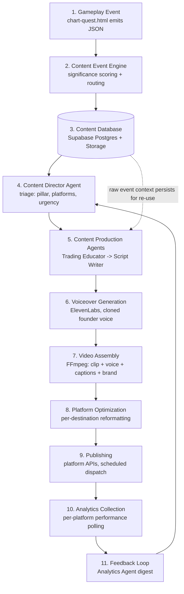

# Master Content Pipeline — Shell Trade

> This is the practical implementation blueprint for turning Shell Trade gameplay into a working, scaled content business: a turtle learning to trade crypto becomes a multi-platform educational media brand, automatically. Every gameplay session that emits a `content_events` row should be able to flow, with no human bottleneck once the pipeline is mature, all the way to a published post on six different surfaces. This document is implementation-ready — it specifies tables, schemas, prompts, file formats, durations, and a build sequence, not just a diagram. It supersedes nothing already written; it is the detailed build manual underneath `automation/architecture.md` (the system-level summary), `content-events/schema.md` (the data contract), `agents/` (the nine agent specs), and `ROADMAP.md` (the company-wide 90-day sequencing). Where this document and those disagree on a detail, the more detailed/specific statement here should be treated as the current decision, and the summary docs updated to match.

---

## Section 1: High-Level System Architecture

### 1.1 The pipeline, end to end



Eleven layers, each with a single job. A layer should never need to know how the layer two steps away works — that's what makes this pipeline debuggable and swappable piece by piece as tools change.

### 1.2 Layer-by-layer

**1. Gameplay Event.** `chart-quest.html` emits one of the 10 structured event types (`content-events/schema.md`) the instant an in-game action completes — no server round trip, no polling. This is the only place game logic and content logic touch; everything downstream works from the event, never from raw gameplay state.

**2. Content Event Engine.** A thin ingestion layer (an n8n webhook, or a lightweight serverless function) that receives the POSTed event, validates it against the schema, computes/confirms `significance_score`, and writes the row. It also runs the auto-clip trigger check (Section 5) in parallel — clip capture and database write are independent paths off the same event, not sequential steps.

**3. Content Database.** The system of record (Section 3). Every later layer reads its inputs from here and writes its outputs back here. No agent ever passes state directly to another agent in memory — everything round-trips through the database, which is what makes the pipeline resumable, auditable, and safe to run with human review gates at any stage without losing work.

**4. Content Director Agent.** Reads new/untriaged events ordered by `significance_score`, decides what's worth producing, assigns a pillar (`marketing/content-pillars.md`) and a target platform set, writes a `content_briefs` row. Full spec: `agents/content-director.md`.

**5. Content Production Agents.** Trading Educator validates the educational substance (`agents/trading-educator.md`), Script Writer turns the approved brief into an actual draft in brand voice (`agents/script-writer.md`). Output: a `content_drafts` row containing a master script plus per-format adaptation notes.

**6. Voiceover Generation.** The Voiceover Agent (Section 4.5) takes the approved script and renders narration in the cloned founder voice via ElevenLabs (Section 6).

**7. Video Assembly.** The Video Producer Agent (Section 4.6) combines the source clip/screenshot, the voiceover track, burned-in captions, and brand elements into platform-correct renders via FFmpeg (Section 7).

**8. Platform Optimization.** The Platform Optimization Agent (Section 4.7) takes the assembled master asset and produces every destination-specific variant — caption length, hashtag set, thread structure, thumbnail, posting-time recommendation — for each platform/format in the brief's target set (Section 8).

**9. Publishing.** The Publishing Agent (Section 4.8) dispatches each finished variant to its destination (platform API or the existing per-platform agents in `agents/`), respects the posting schedule, and writes the `published_posts` row with the live URL.

**10. Analytics Collection.** A scheduled job pulls platform-native performance data on a fixed cadence (Section 10) and writes `performance_metrics` rows keyed to each `published_posts` row.

**11. Feedback Loop.** The Analytics Agent (`agents/analytics-agent.md`) aggregates performance into a recurring "what's working" digest and injects it as context into the next Content Director triage cycle — closing the loop without a human relaying signal by hand (Section 10.3).

---

## Section 2: Gameplay Event Ingestion

The canonical schema lives in `content-events/schema.md` — this section does not redefine it, it specifies how each event type is **triggered** and what it's **for**, framed for the engineers wiring `chart-quest.html`'s emit calls.

| Event type | Fires the instant... | Primary content opportunity |
|---|---|---|
| `trade_win` | a simulated position closes in profit | Trading Education breakdown of the winning setup |
| `trade_loss` | a simulated position closes at a loss | Credibility content — "a good setup can still lose" |
| `lesson_completed` | a curriculum lesson's quiz is passed | Evergreen explainer source material |
| `boss_encounter` | a boss fight begins (first frame of combat) | Cliffhanger / teaser cut |
| `boss_defeated` | a boss fight ends in a win | Highest-signal moment in the schema — Turtle Journey climax |
| `level_up` | XP crosses a level threshold | Progression beat, strongest when `rank_changed: true` |
| `achievement_unlocked` | an achievement condition is met | Lightweight cadence filler |
| `pattern_identified` | the player correctly/incorrectly calls a chart pattern | Quiz-style bite content |
| `risk_management_success` | a stop-loss/sizing rule prevents a larger loss | Flagship "your stop-loss saved you $X" format |
| `risk_management_failure` | a risk rule is violated (no stop, overleveraged) | Cautionary, empathetic — never mocking |

Every event is POSTed as the full envelope (`event_id`, `event_type`, `timestamp`, `player_id`, `session_id`, `faction`, `player_level`, `player_rank`, `payload`, `educational_metadata`, `content_flags`) defined in `content-events/schema.md` — see that file for the full required/optional field breakdown and worked JSON example per type. This document treats that schema as fixed; do not duplicate field lists here that could drift out of sync with it.

**Implementation note for `chart-quest.html`:** wrap every emit call in a fire-and-forget POST (`fetch(..., {keepalive: true})` or equivalent) so a slow/failed network call never blocks gameplay. A dropped event is an acceptable loss; a frozen frame is not.

---

## Section 3: Content Database

### 3.1 Tables and relationships

```
content_events ──< content_briefs ──< content_drafts ──< content_assets ──< platform_variants ──< publishing_queue ──< published_posts ──< performance_metrics
                                                                                                                              ▲
                                                                                                          weekly aggregation │
                                                                                                          feeds Analytics Agent
```

One event can produce zero or one brief (most events are triaged and rejected — that's expected, not a failure mode). One brief produces one draft. One draft produces one or more assets (a clip-based draft might produce a clip asset and a screenshot asset). One asset produces one or more platform variants (the same voiceover+clip becomes a TikTok cut, a Reel cut, and a YouTube Short cut). One variant produces exactly one publishing-queue entry and, once it goes live, exactly one `published_posts` row, which accumulates many `performance_metrics` rows over its lifetime.

### 3.2 Storage approach

Structured data (everything below) lives in Supabase Postgres, in the same project already used for accounts/journal (per `automation/architecture.md` → Database Structure), with RLS enabled and service-role-only access — this pipeline has no end-user-facing surface. Binary media (clips, voiceovers, renders) lives in Supabase Storage buckets, organized to mirror the `content-assets/` naming convention exactly (`{event_type}_{event_id}_{descriptor}.{ext}`) so the bucket and the historical git-committed examples in `content-assets/` stay legible against each other. Every table below stores a `storage_path`/URL pointer, never the binary itself.

### 3.3 Schema (Postgres / Supabase)

```sql
-- 1. Raw events, one row per emitted gameplay event
create table content_events (
  event_id            uuid primary key,
  event_type          text not null check (event_type in (
                         'trade_win','trade_loss','lesson_completed','boss_encounter',
                         'boss_defeated','level_up','achievement_unlocked',
                         'pattern_identified','risk_management_success','risk_management_failure')),
  occurred_at          timestamptz not null,
  player_id            uuid not null,
  session_id           uuid not null,
  faction               text,
  player_level          int,
  player_rank            text,
  payload                jsonb not null,
  educational_metadata    jsonb not null,
  clip_candidate           boolean default false,
  clip_asset_ref            text,
  significance_score        int not null check (significance_score between 0 and 100),
  processed_status            text not null default 'new'
                               check (processed_status in ('new','triaged','rejected','in_production','published')),
  created_at                   timestamptz not null default now()
);
create index on content_events (processed_status, significance_score desc);
create index on content_events (event_type, occurred_at desc);

-- 2. Content Director output
create table content_briefs (
  brief_id        uuid primary key default gen_random_uuid(),
  event_id        uuid not null references content_events(event_id),
  pillar          text not null check (pillar in (
                    'trading_education','turtle_journey','build_in_public',
                    'trading_memes','market_education')),
  platforms       text[] not null,        -- e.g. {'tiktok','x','youtube_shorts'}
  urgency         text not null check (urgency in ('evergreen','timely','urgent')),
  angle           text not null,          -- one-line editorial framing
  status          text not null default 'pending_validation'
                    check (status in ('pending_validation','approved','rejected')),
  created_at      timestamptz not null default now()
);

-- 3. Trading Educator + Script Writer output
create table content_drafts (
  draft_id          uuid primary key default gen_random_uuid(),
  brief_id          uuid not null references content_briefs(brief_id),
  educator_notes    jsonb not null,       -- Trading Educator validation/enrichment
  master_script     text not null,
  teaching_note     text not null,        -- carried forward verbatim through all adaptations
  adaptation_notes  jsonb,                -- per-platform notes from Script Writer
  brand_voice_pass  boolean default false,
  created_at        timestamptz not null default now()
);

-- 4. Physical/binary assets (clips, screenshots, voiceovers, renders)
create table content_assets (
  asset_id        uuid primary key default gen_random_uuid(),
  draft_id        uuid not null references content_drafts(draft_id),
  asset_type      text not null check (asset_type in ('clip','screenshot','voiceover','render')),
  storage_path    text not null,
  duration_seconds numeric,
  aspect_ratio    text,                  -- '9:16' | '16:9' | '4:5' | '1:1'
  created_at      timestamptz not null default now()
);

-- 5. Per-destination finished variants (one asset -> many variants)
create table platform_variants (
  variant_id      uuid primary key default gen_random_uuid(),
  asset_id        uuid not null references content_assets(asset_id),
  destination     text not null check (destination in (
                    'x_post','x_thread','tiktok','instagram_reel','instagram_carousel',
                    'youtube_short','youtube_long','blog_article','newsletter_section','facebook')),
  copy_text       text,                  -- caption/post body/article body as applicable
  render_path     text,                  -- storage path of the final exported file, if video
  hashtags        text[],
  cta             text,
  status          text not null default 'draft' check (status in ('draft','ready','queued','published','rejected')),
  created_at      timestamptz not null default now()
);

-- 6. Scheduling
create table publishing_queue (
  queue_id        uuid primary key default gen_random_uuid(),
  variant_id      uuid not null references platform_variants(variant_id),
  scheduled_for   timestamptz not null,
  attempt_count   int not null default 0,
  last_error      text,
  created_at      timestamptz not null default now()
);

-- 7. Live posts
create table published_posts (
  post_id         uuid primary key default gen_random_uuid(),
  variant_id      uuid not null references platform_variants(variant_id),
  platform        text not null,
  post_url        text not null,
  published_at    timestamptz not null default now()
);

-- 8. Performance over time
create table performance_metrics (
  metric_id       uuid primary key default gen_random_uuid(),
  post_id         uuid not null references published_posts(post_id),
  captured_at     timestamptz not null default now(),
  views           bigint,
  likes           bigint,
  comments        bigint,
  shares          bigint,
  saves           bigint,
  watch_time_seconds numeric,
  completion_rate    numeric,             -- 0.0–1.0
  click_throughs      bigint,
  follower_delta        int,
  raw_payload             jsonb            -- full platform API response, for fields not yet promoted to columns
);
create index on performance_metrics (post_id, captured_at desc);
```

This schema is additive to, not a replacement for, the table list already sketched in `automation/architecture.md` — `platform_variants` and `publishing_queue` are new (needed once a single asset fans out to 7+ destinations, including the two non-social formats added in Section 8) and `performance_snapshots` from the architecture doc is renamed/specified here as `performance_metrics` with explicit columns; reconcile the architecture doc to this version when implementing.

---

## Section 4: AI Agent Pipeline

Eight agents, four of them already fully specified in `agents/` and unchanged here, four newly specified below because they cover pipeline stages (voice, video, cross-platform formatting, dispatch) that weren't yet agent-ized.

### 4.1 Content Director — see `agents/content-director.md`
Triage layer. Reads `content_events`, decides what's worth producing, writes `content_briefs`.

### 4.2 Trading Educator — see `agents/trading-educator.md`
Accuracy layer. Validates the lesson behind a brief before any draft is written.

### 4.3 Script Writer — see `agents/script-writer.md`
Creative layer. Turns an approved, validated brief into `content_drafts.master_script` in brand voice (`marketing/brand-voice.md`).

### 4.4 Analytics Agent — see `agents/analytics-agent.md`
Measurement layer. Closes the loop (Section 10.3) — unchanged from its existing spec, included here because it's the final node before the cycle repeats.

### 4.5 Voiceover Agent (new)

**Purpose:** Render `content_drafts.master_script` into narration audio in Shell's cloned voice, with delivery style matched to the destination format.

**Inputs:** `master_script` text, `teaching_note` (must not be paraphrased away), target delivery style (`punchy` for TikTok/Reels/Shorts, `measured` for YouTube long-form, `none` if a draft is caption-only).

**Outputs:** an audio file written to `content_assets` (`asset_type: voiceover`), plus a timestamped transcript (word-level timing) used downstream for caption generation.

**Prompt/parameter template:**
```
Voice ID: {{shell_voice_id}}
Text: {{master_script}}
Style preset: {{punchy | measured}}
Stability: {{0.35 for punchy, 0.55 for measured}}
Similarity boost: 0.85
Style exaggeration: {{0.4 for punchy, 0.15 for measured}}
Pronunciation overrides: {{pronunciation_dictionary}}
```

**Responsibilities:** maintain the pronunciation dictionary for recurring trading terms (VWAP, ChoCh, ATR, etc. — see Section 6 for the full list and process); flag and regenerate any render whose duration falls outside ±15% of the expected reading-pace estimate for that script length (signals a misread or dropped line); never alter `master_script` wording — if the text reads awkwardly aloud, that's routed back to Script Writer, not silently fixed at the voice layer.

**Success metrics:** zero unflagged mispronunciations of established trading terms; voice consistency (a blind listener cannot distinguish a TikTok-style and YouTube-style render as different speakers, only different pacing); regeneration rate trending down as the pronunciation dictionary matures.

### 4.6 Video Producer Agent (new)

**Purpose:** Assemble a finished, platform-correct render from a clip/screenshot, a voiceover track, and brand elements (Section 7).

**Inputs:** source `content_assets` row (clip or screenshot), voiceover audio + word-level transcript, brand kit (logo, color palette, turtle mascot overlay, font), target aspect ratio and length.

**Outputs:** one or more `content_assets` rows (`asset_type: render`), one per aspect-ratio family needed (a single vertical assembly often serves TikTok/Reels/Shorts identically; YouTube long-form needs its own horizontal assembly).

**Responsibilities:** generate burned-in captions from the voiceover's word-level transcript (Section 7.3); apply the brand-kit overlay consistently (same corner placement, same color treatment, every render); enforce target length bounds at assembly time rather than relying on a later rejection (trim/pad before render, don't render-then-reject); never proceed to render if the voiceover and source clip durations are mismatched beyond a defined tolerance (signals an upstream sync error worth surfacing, not silently papering over).

**Success metrics:** zero renders requiring a manual re-edit for caption sync or brand placement errors; render turnaround time per asset (tracked to catch FFmpeg job queue backlogs early); aspect-ratio/length compliance rate against Section 7's targets.

### 4.7 Platform Optimization Agent (new)

**Purpose:** Take one finished master asset (or, for text-first formats, the master script directly) and produce every destination-specific `platform_variants` row the brief calls for — this is the fan-out step that turns one event into many pieces of content (Section 8).

**Inputs:** `content_assets` render(s), `master_script`, `teaching_note`, `content_briefs.platforms` (the target destination list), `marketing/social-strategy.md` (per-platform format/length/KPI rules), `marketing/brand-voice.md`.

**Outputs:** one `platform_variants` row per destination in the brief, each with destination-correct copy length, hashtag set, thread structure (if X), carousel slide breakdown (if Instagram carousel), thumbnail/title (if YouTube), or article/section structure (if blog/newsletter).

**Prompt template:**
```
You are the Platform Optimization Agent for Shell Trade. You take one approved master
asset and adapt it — never duplicate it verbatim — for each destination below, per
marketing/social-strategy.md's format rules and marketing/brand-voice.md's tone rules.
Shell Trade does not cross-post identical copy across platforms.

Master script: {{master_script}}
Teaching note (must survive every adaptation unchanged in substance): {{teaching_note}}
Render asset(s): {{asset_refs}}
Destinations required: {{platforms}}

For each destination, produce: copy/body text at that platform's native length and
register, a hashtag set (if applicable), a thumbnail/title suggestion (if applicable),
and one CTA appropriate to that platform's audience (per social-strategy.md).
```

**Responsibilities:** this agent owns the "one event, seven pieces of content" transformation (Section 8) — it is the single place fan-out logic lives, so format rules never have to be re-implemented per platform agent; it formalizes the two new non-social destinations (blog article, newsletter section) that don't yet have a dedicated persona-agent in `agents/`, treating them as just two more destinations with their own format rules rather than requiring a ninth/tenth agent before they can ship.

**Success metrics:** no two variants from the same asset share more than a sentence of identical copy (cross-post detection); each variant individually passes a brand-voice spot check; format compliance (length, hashtag count, structure) against `social-strategy.md` per destination.

### 4.8 Publishing Agent (new)

**Purpose:** Dispatch each `ready` `platform_variants` row to its destination at the right time and record the result — the execution layer that the existing per-platform agents (`agents/x-agent.md`, `agents/tiktok-agent.md`, `agents/youtube-agent.md`, `agents/instagram-agent.md`) already describe for their four platforms; this agent is the unifying scheduler that calls into each of those for social platforms, and calls a CMS/ESP API directly for the two new non-social destinations.

**Inputs:** `platform_variants` rows with `status: ready`, the per-platform posting-cadence targets from `social-strategy.md`, the existing publishing-queue state (to avoid double-posting or violating frequency caps).

**Outputs:** `publishing_queue` rows (schedule), `published_posts` rows (once live), updated `platform_variants.status`.

**Responsibilities:** respect each platform's posting-frequency target from `social-strategy.md` (don't queue six TikToks for one day because six are ready); hold a human-approval gate per platform until that platform has the track record `ROADMAP.md` Days 61–75 specifies (two weeks of clean output) before auto-publishing on it; never retry a failed publish blindly — log `last_error`, cap retries, and surface persistent failures rather than silently dropping content.

**Success metrics:** zero accidental duplicate posts; queue-to-live latency; per-platform cadence adherence; gate-removal readiness tracked accurately (this agent is the source of truth for "has this platform earned autonomous publishing yet").

---

## Section 5: Automated Clip Generation

This section gives the concrete parameters for the system already architected in `automation/auto-clipping.md` — that document is the *why* and the *architecture*; this is the *exact numbers* a developer should build against.

| Parameter | Value | Rationale |
|---|---|---|
| Rolling buffer duration | 20 seconds | Long enough to capture pre-roll context on any boss fight or trade resolution without unbounded memory growth |
| Pre-roll window | 5 seconds before trigger | Gives the moment buildup — a boss-defeat clip starting at the kill frame reads as confusing, not satisfying |
| Post-roll window | 3 seconds after trigger | Captures the resolution screen/reward popup without lingering into dead air |
| Extracted clip length (raw) | 8–15 seconds typical | Pre-roll + trigger + post-roll for most event types; some `trade_win`/`boss_defeated` moments run longer if the in-game animation does |
| Encode format | H.264, vertical 1080×1920 (9:16) | Matches game's native portrait lock (`MAX_ASPECT`, per `PROJECT_STATUS.md`) — zero reframing needed downstream |
| Screenshot format | PNG, full native resolution | Down-sample per-destination later; never down-sample at capture |
| Storage path/lifecycle | `clips/{event_type}/{event_id}.mp4`, retained indefinitely at first; revisit retention policy once volume makes storage cost material | Mirrors `content-assets/` naming convention exactly so bucket and git history stay legible against each other |
| Naming convention | `{event_type}_{event_id}_{descriptor}.{ext}` | Unchanged from `content-assets/README.md` — no new convention introduced |
| Upload cadence | Batched at end of session, or every 10 minutes of continuous play, whichever comes first | Never blocks gameplay; a few minutes of latency before a clip reaches the pipeline is fully acceptable |

**Capture pseudocode (client-side, browser-native APIs):**
```js
// Maintained continuously while the game is running
const stream = gameCanvas.captureStream(30); // 30fps
const recorder = new MediaRecorder(stream, { mimeType: 'video/webm;codecs=vp9' });
let rollingChunks = []; // ring buffer, trimmed to ~20s of data on each push

recorder.ondataavailable = (e) => {
  rollingChunks.push({ data: e.data, t: performance.now() });
  rollingChunks = rollingChunks.filter(c => performance.now() - c.t < 20_000);
};

// On qualifying event (content_flags.significance_score above threshold):
function onSignificantEvent(event) {
  const preRoll = rollingChunks.filter(c => c.t >= event.t - 5_000);
  // hold buffer open 3s for post-roll, then finalize:
  setTimeout(() => {
    const clipBlob = new Blob(preRoll.map(c => c.data), { type: 'video/webm' });
    uploadClip(clipBlob, event.event_id); // re-encoded to H.264 1080x1920 server-side or via wasm before upload
  }, 3_000);
}
```

Trigger evaluation reuses `content_flags.significance_score` and the per-event-type default capture policy already tabulated in `automation/auto-clipping.md` ("Event Triggers" section) — that table is not repeated here to avoid drift; treat it as the canonical trigger policy.

---

## Section 6: Voiceover Generation (Cloned Founder Voice)

### 6.1 Process

1. **Record reference audio.** The founder records 3–5 minutes of clean, varied reference audio (a mix of calm explanatory tone and slightly more energetic delivery) in a quiet room with a decent microphone — variety in the sample matters more than length for clone fidelity.
2. **Clone the voice.** Upload the reference audio to ElevenLabs' Professional Voice Clone (higher fidelity than Instant Voice Clone, worth the extra setup time given this voice will be the brand's recurring narrator). This produces a persistent `voice_id`.
3. **Store the credential safely.** `voice_id` and the ElevenLabs API key live in environment/secrets configuration, never committed to the repo — same handling as any other API credential in this project.
4. **Generate per script.** Every approved `content_drafts.master_script` is sent to the ElevenLabs TTS API with the stored `voice_id` and a style preset (Section 4.5) matched to the destination format.
5. **Quality-gate before storage.** Automated checks (duration sanity check, leading/trailing silence trim) run first; a human spot-check samples a percentage of renders (start at 100% until confidence is established, taper down per the same "earn autonomy" logic as publishing gates in Section 9).

### 6.2 Consent and rights

This is the founder's own voice, cloned with the founder's own explicit consent for the founder's own brand — no third-party likeness or consent question applies here. Worth documenting anyway, in writing, once: the specific scope of use (brand narration across the platforms in `marketing/social-strategy.md`), so there's a clear internal record if usage ever expands (e.g., a future co-founder or hired voice talent would need their own equivalent written consent before cloning).

### 6.3 Pronunciation dictionary

Trading terminology mispronounces easily by default TTS phonemization. Maintain an explicit override list, fed into every generation call, expanded any time a new term causes a misread:

| Term | Issue | Override |
|---|---|---|
| VWAP | Often read as separate letters or wrong vowel | "VEE-wap" |
| ChoCh | Looks like a word, isn't | "Change of Character" spoken in full on first use per script, "Cho-Ch" abbreviation only after |
| BOS | Reads as the word "boss" | Spell out "Break of Structure" rather than the acronym in narration (acronym is fine on-screen as text) |
| R:R | Symbol, not word | "risk to reward" |

### 6.4 Quality control gates

- Script is already brand-voice and accuracy validated *before* it reaches this stage (Trading Educator + Script Writer, Section 4) — voiceover generation should never be the first time anyone reads the words critically.
- Duration check: flag any render outside ±15% of expected length for the script's word count.
- Silence check: trim/flag unexpected silence gaps (a common ElevenLabs artifact on punctuation-heavy scripts).
- Human spot-check sampling rate starts at 100%, reduces only after a sustained clean run, mirroring the publishing-autonomy gate logic in Section 9.

---

## Section 7: Video Assembly

### 7.1 Targets by destination

| Destination | Aspect ratio | Resolution | Target length | Notes |
|---|---|---|---|---|
| TikTok | 9:16 | 1080×1920 | 21–34s sweet spot, up to 60s | Hook in first 1–3s, per `agents/tiktok-agent.md` |
| Instagram Reel | 9:16 | 1080×1920 | 21–34s sweet spot, up to 60s | Usually a direct re-export of the TikTok render |
| YouTube Short | 9:16 | 1080×1920 | Under 60s | Same render as TikTok/Reel in most cases |
| YouTube long-form | 16:9 | 1920×1080 | 3–10 minutes | Built from a Turtle Journey episode script, not a single clip |
| Instagram carousel slide | 4:5 | 1080×1350 | N/A (static) | Built from Script Writer's adaptation notes, not a video render |
| Blog/newsletter header image | 1:1 or 16:9 | 1080×1080 / 1920×1080 | N/A (static) | Pulled from the `screenshots/` asset, not a fresh render |

### 7.2 Assembly inputs

Source clip or screenshot (`content_assets`), voiceover track + word-level transcript (Section 6), brand kit (Shell logo mark, faction color accent matching the event's `faction` field, consistent caption font), and the teaching note rendered as a short on-screen text card where the format calls for it (silent-scroll viewers should get the lesson from text alone).

### 7.3 Caption generation

Burned-in captions are generated from the voiceover's word-level timing (ElevenLabs returns timestamps; if a given TTS call doesn't, run a forced-alignment pass against the audio and script before assembly). Style: short phrase chunks (3–6 words), high-contrast text, centered lower-third placement, matching the brand's established font/color from the kit — not a generic auto-caption look. Captions exist for accessibility and sound-off viewing both; TikTok/Reels/Shorts default to autoplay-muted for a large share of viewers, so the caption carries the lesson on its own.

### 7.4 FFmpeg assembly (representative command)

```bash
ffmpeg -i source_clip.mp4 -i voiceover.mp3 \
  -filter_complex "
    [0:v]scale=1080:1920:force_original_aspect_ratio=increase,crop=1080:1920[bg];
    [bg]drawtext=fontfile=brand_font.ttf:textfile=captions.srt:reload=1[capped];
    [capped]overlay=enable='between(t,0,2)':x=20:y=20:logo.png[branded]
  " \
  -map "[branded]" -map 1:a \
  -c:v libx264 -preset medium -crf 20 -c:a aac -shortest \
  exports/tiktok_boss_defeated_evt8841_liquidator-clean-win.mp4
```

(Illustrative — production implementation should use the `subtitles` filter with a generated `.srt` rather than raw `drawtext` for anything beyond a single static caption, and a proper alpha-channel overlay asset for the brand mark. The point captured here is the input/output contract: clip + voiceover + caption file + brand asset in, one platform-correct render out, named per the existing `content-assets/` convention.)

### 7.5 Hooks and CTAs

First 1–3 seconds carry the hook (the moment, not the brand — per `marketing/brand-voice.md`: "This is what happens when you trade without a stop-loss," never "Check out our new boss fight!"). End-card CTA differs by destination: TikTok/Reels/Shorts can only point to a bio link, so the CTA is verbal/textual ("link in bio") rather than a clickable in-video element; YouTube long-form can use an end-screen subscribe prompt and a description link; blog/newsletter CTAs link directly.

---

## Section 8: Platform Content Variations — Worked Example

One event, fanned out by the Platform Optimization Agent (Section 4.7) into seven pieces of content. Source event: `boss_defeated`, Boss 2 "THE LIQUIDATOR," `clean_win: true`, `is_personal_best: true`, `concept_mastered: "Stop-loss discipline, 1-2% risk sizing, risk:reward ratio, leverage danger"` (the exact example event from `content-events/schema.md` §5).

**1. X Post**
> Boss 2 down. First-attempt clean win — zero damage taken.
>
> The Liquidator doesn't test your candle reading. It tests whether you'll actually risk 1-2% and walk away when the stop hits.
>
> That's the whole boss fight. That's the whole job.

**2. X Thread** (Trading Education pillar, opening post + 3 replies)
> 1/ Just one-shot Boss 2, "The Liquidator," in Shell Trade. No damage taken. Here's what the fight is actually testing — because it isn't candle reading.
>
> 2/ The Liquidator punishes exactly three habits: no stop-loss, oversized risk, and reckless leverage. You can read every candle perfectly and still lose the run if you skip these.
>
> 3/ The fix the boss is checking for: risk 1-2% per position, set the stop *before* you enter, and size leverage so a normal pullback can't wipe you. None of this is exciting. It's why most people skip it.
>
> 4/ Shell Trade turns that into a boss fight because "just manage your risk" doesn't stick as advice. Losing simulated HP for skipping it does.

**3. TikTok script** (21–28s vertical, voiceover + captions)
> [Clip: boss-fight clean win, on-screen HP bar never drops]
> VO: "This boss doesn't care if you can read a candlestick."
> [Caption beat: "He cares about ONE thing."]
> VO: "Risk 1-2%. Set your stop before you enter. Don't leverage like it's free money."
> [Caption beat: "Skip any of those — game over."]
> VO: "Zero damage. First try. That's not luck, that's the rule working."
> End card: "Shell Trade — link in bio"

**4. Instagram Reel** — same render as the TikTok cut (Section 7.1 notes this is typically a direct re-export), caption adapted to Instagram's slightly longer-form caption convention per `marketing/social-strategy.md`, native Reels hashtag set rather than TikTok's.

**5. YouTube Short** — same render again, title optimized for YouTube's search-driven discovery rather than a caption: "Why This Boss Fight Is Actually About Risk Management."

**6. Blog Article** (excerpt — full article structure per Platform Optimization Agent's destination rules, Section 4.7)
> **Title:** What Boss 2 ("The Liquidator") Is Actually Teaching You About Risk
>
> Most players assume a boss fight in a trading game is about reading the chart correctly. Boss 2 is the one that proves that assumption wrong. You can identify every setup perfectly and still take heavy damage if you're not sizing risk at 1-2% per trade, setting a stop-loss before you enter, and respecting what leverage actually does to a small drawdown...
> *(continues into a full breakdown of stop-loss discipline, position sizing math, and risk:reward ratio, each tied back to the specific boss mechanic that tests it)*

**7. Newsletter Section**
> **🐢 This week in the game:** A player just one-shot The Liquidator with zero damage taken — first attempt. The boss exists to test exactly one thing: will you actually risk 1-2% per trade and respect your stop? Most new traders blow up not because they can't read a chart, but because they skip this part. If you want the full breakdown, it's in this week's blog post [link].

Same underlying fact set, same teaching note, seven genuinely different pieces of content — none of them a copy-paste of another, each native to its destination's register, per the brand-voice rule against cross-posting identical copy.

---

## Section 9: Automation Stack

| Tool | Responsibility | Reads | Writes | Pipeline stage |
|---|---|---|---|---|
| **chart-quest.html (game client)** | Emits structured events | In-memory gameplay state | POST to ingestion endpoint | 1 |
| **n8n** | Orchestration: webhook intake, conditional routing, scheduling, retries | `content_events` table state, agent outputs | Triggers every downstream node; writes intermediate state via Supabase nodes | 2, 4–11 (the connective tissue, not a stage itself) |
| **Supabase Postgres** | System of record | — | All tables in Section 3 | 3 (and every later stage's persistence layer) |
| **Supabase Storage** | Binary asset storage | — | Clips, screenshots, voiceovers, renders | 2, 6, 7 |
| **Claude** | Content Director, Trading Educator, Script Writer, Platform Optimization, Analytics reasoning/writing calls | Briefs, drafts, brand-voice/pillar docs as context | Brief/draft/variant text into Postgres | 4, 5, 8, 11 |
| **ChatGPT** | Secondary/fallback text generation, used for redundancy or blog/newsletter long-form drafting specifically (a natural place to split load across two models) | Same brief/draft context as Claude calls | Same destinations, flagged by `generated_by` metadata for quality comparison | 5, 8 |
| **ElevenLabs** | Voiceover generation, cloned founder voice | `master_script` text | Audio file + transcript into Storage | 6 |
| **FFmpeg** | Video assembly (clip + voice + captions + brand) | Clip/screenshot + voiceover + caption file + brand assets | Final render into Storage | 7 |
| **Platform publishing APIs** (X, TikTok, YouTube, Instagram) + CMS/ESP APIs (blog, newsletter) | Dispatch | `platform_variants` ready rows | `published_posts` rows, live URLs | 9 |
| **GitHub** | Source of truth for every doc, prompt template, and (as it matures) automation code itself; existing deploy mechanism for the game | This repo | Version history, PR review trail | Cross-cutting, not a numbered stage |

**Concrete data flow for one event**, naming the actual handoff format at each arrow: game POSTs JSON → n8n webhook validates against schema → row written to `content_events` → n8n calls Claude with the Content Director prompt template, JSON brief returned → row written to `content_briefs` → n8n calls Claude with Trading Educator + Script Writer templates chained → row written to `content_drafts` → n8n calls ElevenLabs with `master_script` text, receives audio binary + transcript JSON → both written to Storage + `content_assets` → n8n triggers an FFmpeg worker job referencing the clip path, audio path, and transcript → render binary written to Storage + `content_assets` → n8n calls Claude with the Platform Optimization template once per destination in the brief → `platform_variants` rows written → n8n schedules each into `publishing_queue` → at the scheduled time, n8n calls the relevant platform API (or CMS/ESP API) → `published_posts` row written with the live URL → a separate scheduled n8n workflow polls each platform's analytics API on the cadence in Section 10.1 → `performance_metrics` rows written → a weekly n8n job aggregates these into the Analytics Agent's digest → that digest is injected as context into the next Content Director call, closing the loop.

---

## Section 10: Analytics Feedback Loop

### 10.1 Collection cadence

| Checkpoint | Timing | Purpose |
|---|---|---|
| Quick check | T+1 hour after publish | Catch obvious failures (post didn't actually go live, render broken) early enough to fix same-day |
| Early snapshot | T+24 hours | First real signal — most short-form content's engagement curve is mostly determined by this point |
| Full snapshot | T+7 days | Stabilized numbers; the figure used for baseline comparison and the weekly digest |
| Evergreen recheck | T+30 days (YouTube long-form and blog/newsletter only) | These formats keep earning traffic via search long after short-form content has plateaued — worth a longer-horizon check specifically for them |

### 10.2 Baseline and anomaly mechanism

For each pillar/platform combination, maintain a trailing 4-week rolling average per KPI (the specific metric mix per `social-strategy.md` — e.g., completion rate for TikTok, watch time for YouTube, save rate for Instagram carousels). A given post is flagged as an anomaly when a KPI deviates more than 1.5 standard deviations from that rolling baseline — in either direction. A single anomalous post is noted but does not change strategy; a pattern across 3+ consecutive posts in the same pillar/platform combination is treated as real signal worth acting on. This threshold is intentionally simple (not a sophisticated statistical model) because the volume in early operation is too low to support anything more sensitive without producing false positives.

### 10.3 Closing the loop, concretely

The weekly aggregation job (an n8n scheduled workflow) computes the rolling baselines and anomaly flags above, then calls the Analytics Agent (`agents/analytics-agent.md`) with that data to produce the "what's working" digest specified in that agent's spec. That digest — not a vague summary, but the specific per-pillar/per-platform over/under-performance findings — is appended as a context block to the Content Director's prompt template (`agents/content-director.md`) on its next triage run, automatically, via the n8n workflow rather than a human relaying it. Concretely, this means the Content Director prompt template should always include a `{{recent_performance_digest}}` variable populated from the most recent Analytics Agent output, so triage decisions (which events get produced, which pillar gets more volume) are made with last week's real performance in view, not from a clean slate every cycle.

---

## Section 11: 90-Day Implementation Plan

This is the content-pipeline-specific execution detail nested inside `ROADMAP.md`'s company-wide 90-day plan — same overall sequencing logic (event system before automation, automation before publishing, publishing before optimization), broken into the six build phases below rather than `ROADMAP.md`'s five top-level priorities. Core game development (`ROADMAP.md` Priority 1) continues in parallel throughout, per that document's sequencing principles — nothing below assumes it pauses.

### Phase 1: Content Foundation — Days 1–10
Stand up the Section 3 database schema in Supabase (all eight tables, RLS enabled, service-role-only). Confirm `content-events/schema.md`'s field set against the current Hour 0–6 boss roster. Manually capture 10–15 real clips/screenshots into `content-assets/` as the test corpus every later phase validates against.

### Phase 2: Event Tracking — Days 11–30
Instrument `chart-quest.html` to emit all 10 event types per Section 2, starting with `boss_defeated`, `level_up`, `risk_management_success` (highest signal first). Wire emission into the `content_events` table via the Section 2 ingestion pattern. Validate real gameplay sessions produce schema-valid rows before building anything downstream. Hand-test Content Director and Trading Educator prompt templates against the manual test corpus from Phase 1 (human pasting into Claude, no automation yet).

### Phase 3: Auto Clipping — Days 31–45
Build the Section 5 rolling-buffer capture system client-side, targeting the exact parameters in the Section 5 table (20s buffer, 5s pre-roll, 3s post-roll). Wire it to the same `significance_score`/`content_flags.clip_candidate` trigger the Content Director uses, per `automation/auto-clipping.md`'s "don't invent a second heuristic" principle. Validate against 20+ real qualifying events before treating it as the primary capture path (manual capture remains a fallback during this phase, not removed yet).

### Phase 4: AI Content Generation — Days 46–65
Stand up the full agent chain in n8n: Content Director → Trading Educator → Script Writer → Voiceover Agent (Section 4.5) → Video Producer Agent (Section 4.6) → Platform Optimization Agent (Section 4.7). Integrate ElevenLabs with the cloned founder voice (Section 6) — complete the cloning process and pronunciation dictionary in the first week of this phase, since every later step in the phase depends on it. Build the FFmpeg assembly step (Section 7) as a standalone script first, then wire into n8n. Run the full pipeline end-to-end (event → brief → draft → voiceover → render → platform variants) on 10+ real events with human review at every gate, no auto-publishing yet.

### Phase 5: Publishing Automation — Days 66–80
Stand up the Publishing Agent (Section 4.8). Integrate platform publishing APIs one at a time, lowest-integration-friction first. Keep the human-approval gate per platform until it earns autonomy (two weeks of clean output, per `ROADMAP.md` Days 61–75 logic) — gate removal is per-platform, not global. Stand up the blog/newsletter dispatch path (CMS/ESP API) alongside the social platforms, since Section 8's seven-format fan-out depends on both existing.

### Phase 6: Performance Optimization — Days 81–90
Stand up the Section 10 analytics collection cadence and the weekly aggregation job. Bring the Analytics Agent online against real published-post data accumulated since Phase 5. Wire the Section 10.3 feedback loop so the Content Director's prompt automatically receives the performance digest — verify with a side-by-side comparison of one triage cycle with the digest included versus the prior cycle without it. Close with a full pipeline retrospective: output volume, brand-voice/accuracy adherence, per-platform cadence adherence against `marketing/social-strategy.md` targets, and funnel signal (signups, course-funnel email capture) tied back to content activity — use this to set the next 90-day plan rather than assuming this architecture is final.

---

## Cross-references

- `automation/architecture.md` — system-level architecture summary (this document's higher-level counterpart).
- `automation/auto-clipping.md` — auto-clip system rationale and architecture (Section 5 here gives its concrete parameters).
- `content-events/schema.md` — the canonical event data contract (Section 2 here does not redefine it).
- `agents/` — all nine agent specs; four are extended here (Voiceover, Video Producer, Platform Optimization, Publishing) with full specs since they weren't previously agent-ized.
- `marketing/brand-voice.md`, `marketing/content-pillars.md`, `marketing/social-strategy.md` — the editorial rules every prompt template above must conform to.
- `content-assets/README.md` — the naming convention and folder structure Section 3.2 and Section 5 build on.
- `ROADMAP.md` — the company-wide 90-day plan this document's Section 11 nests inside.
