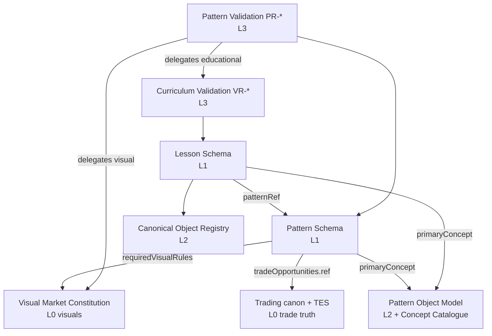
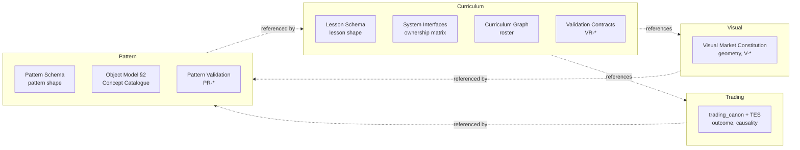

# ChartQuest Architecture Index

**STATUS: RATIFIED · Architecture v1.0 · Ratified 2026-07-15 · GOVERNANCE LAYER**

The operating-system map of the ChartQuest architecture. Every canonical document is listed exactly once, with its single owner, single purpose, and SoT level. Nothing exists without being indexed. Hierarchy and ownership definitions live in the [Manifest](ARCHITECTURE_MANIFEST.md); this is the navigable catalogue and the graphs.

---

## 1. Document catalogue

### Governance layer — `docs/architecture-ratified/`
| Document | Purpose (one) |
|---|---|
| `ARCHITECTURE_README.md` | Onboarding — understand the architecture in ≤30 min |
| `ARCHITECTURE_MANIFEST.md` | Entry point — hierarchy, ownership map, version history |
| `ARCHITECTURE_CONSTITUTION.md` | The twelve immutable laws |
| `ARCHITECTURE_CHANGE_POLICY.md` | The only way to amend the architecture |
| `ARCHITECTURE_INDEX.md` | This catalogue + graphs |

### Level 0 — Domain Constitutions
| Document | Owns | Purpose |
|---|---|---|
| `CHARTQUEST_VISUAL_MARKET_CONSTITUTION.md` (root) | all candle/chart visuals, `V-*` | how every candle looks and reads |
| `docs/canon/trading_canon.md` + `CHARTQUEST_TRADING_EXPERIENCE_SYSTEM_v1.1.md` | trade truth | what a trade means / how it feels |

### System A — Curriculum Engine (`docs/curriculum-engine/`)
| Document | Level | Owns / Purpose |
|---|:--:|---|
| `CHARTQUEST_LESSON_SCHEMA.json` | 1 | Lesson shape (SoT) |
| `CHARTQUEST_CANONICAL_OBJECT_REGISTRY.md` | 2 | object→SoT map + D1–D8 + example lessons |
| `CHARTQUEST_LESSON_OBJECT_MODEL.md` | 2 | Lesson companion (annotates the schema) |
| `CHARTQUEST_CURRICULUM_OBJECT_MODEL.md` | 2 | the whole-game curriculum object |
| `CHARTQUEST_CURRICULUM_ENGINE_SPECIFICATION.md` | 2 | the engine's purpose/responsibilities |
| `CHARTQUEST_SYSTEM_INTERFACES.md` | 2 | the system ownership matrix (SoT) |
| `CHARTQUEST_CURRICULUM_GRAPH.md` | 2 | curriculum graph / Guardian roster (SoT) |
| `CHARTQUEST_DATA_CONTRACTS.md` | 3 | inter-system I/O contracts |
| `CHARTQUEST_VALIDATION_CONTRACTS.md` | 3 | the `VR-*` registry (SoT) |
| `CHARTQUEST_AUTHORING_PIPELINE.md` | 4 | lesson pipeline + state machines |
| `CHARTQUEST_IMPLEMENTATION_GUIDELINES.md` | 4 | how to author a lesson + worked examples |
| `CHARTQUEST_ARCHITECTURAL_DECISION_RECORDS.md` | 5 | curriculum ADRs |
| `CHARTQUEST_ARCHITECTURE_COMPLETION_REPORT.md` | 6 | Phase-1 completion report (supporting) |
| `_REVIEW_FINDINGS_AND_REMEDIATION.md` | 6 | historical review record (superseded) |

### System B — Pattern Operating System (`docs/pattern-library/`)
| Document | Level | Owns / Purpose |
|---|:--:|---|
| `CHARTQUEST_PATTERN_SCHEMA.json` | 1 | Pattern shape (SoT) |
| `CHARTQUEST_PATTERN_OBJECT_MODEL.md` | 2 | ownership audit + Concept Catalogue (SoT) + 5 examples |
| `CHARTQUEST_PATTERN_LIBRARY_SPECIFICATION.md` | 2 | the library as a system |
| `CHARTQUEST_PATTERN_VALIDATION_CONTRACTS.md` | 3 | the `PR-*` registry (SoT) |
| `CHARTQUEST_PATTERN_AUTHORING_GUIDE.md` | 4 | how to author a pattern |
| `CHARTQUEST_PATTERN_DECISION_RECORDS.md` | 5 | pattern ADRs (P1–P8) |

### Level 6 — Supporting
| Document | Purpose |
|---|---|
| `docs/implementation/VISUAL_MARKET_PHASE1_AUDIT.md` | rendering migration contract (`window.CQ`) — a plan, not a frozen standard |
| `docs/canon/*.md` | legacy gameplay/boss/progression/ui canon |

## 2. Dependency graph (who references whom)

## 3. Ownership graph (one owner per fact)

## 4. Reading order

New contributor → `ARCHITECTURE_README.md` → this Index → `ARCHITECTURE_CONSTITUTION.md` → the two Level-1 schemas → the two registries (`CANONICAL_OBJECT_REGISTRY`, `PATTERN_OBJECT_MODEL`) → your task's authoring guide.

## 5. Governance review status

The ten-point audit result and the stability confidence score are recorded at ratification. See the ratification summary; re-run per the [Change Policy](ARCHITECTURE_CHANGE_POLICY.md) step 10 on any amendment.
