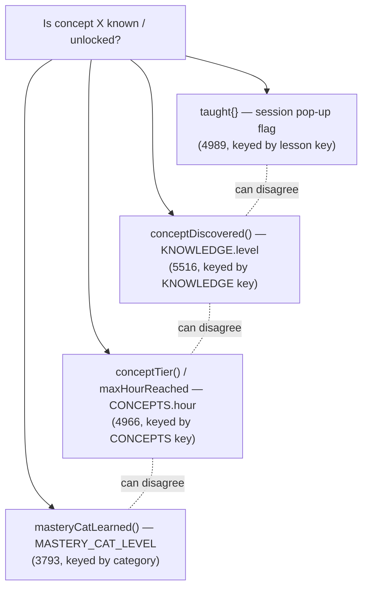

> **STATUS: RATIFIED** — ChartQuest Architecture v1.0 · Ratified 2026-07-15
> **Do not modify directly.** Part of the official ChartQuest ratified architecture. Changes require an ADR, migration notes, approval, and re-ratification — see `docs/architecture-ratified/ARCHITECTURE_CHANGE_POLICY.md`.

# ChartQuest Curriculum Engine — Architectural Decision Records (ADRs)

> **CANONICAL REFERENCE.** The single source of truth for the Lesson object is [`CHARTQUEST_LESSON_SCHEMA.json`](CHARTQUEST_LESSON_SCHEMA.json); for object ownership and the frozen decisions (D1–D8), [`CHARTQUEST_CANONICAL_OBJECT_REGISTRY.md`](CHARTQUEST_CANONICAL_OBJECT_REGISTRY.md). This document *references* those fields and rules — it does not redefine them. Where this document conflicts with the schema or the registry, **they govern.**

**Status: RATIFIED — Phase 1 (analysis + specification only; no code, no gameplay change).**
**Ratified: 2026-07-15**
**Authority tier: Educational layer.** This document governs *how a lesson is defined, sequenced, gated, tested, and reviewed.* On candle/chart **visuals** the [ChartQuest Visual Market Constitution](../../CHARTQUEST_VISUAL_MARKET_CONSTITUTION.md) is supreme; on **trade truth and causality** [`docs/canon/trading_canon.md`](../canon/trading_canon.md) and [`CHARTQUEST_TRADING_EXPERIENCE_SYSTEM_v1.1.md`](../../CHARTQUEST_TRADING_EXPERIENCE_SYSTEM_v1.1.md) are supreme. Where those documents and this one overlap, the boundary in **ADR-007** governs.

---

## How to read this document

Each ADR records **one** irreversible architectural decision, in this fixed shape:

- **Problem** — the failure in today's code, with verified `chart-quest.html` line numbers.
- **Context** — what forces the decision now.
- **Alternatives Considered** — options rejected, and why.
- **Decision** — the ruling. Binding.
- **Tradeoffs** — what we give up.
- **Long-Term Benefits** — how this cuts lesson-build time and raises educational consistency.
- **Future Risks** — what could still go wrong, and the guardrail.
- **Review Date** — when the decision is re-examined.

**The single source of truth** for the Lesson object's shape and every field name cited here is [`CHARTQUEST_LESSON_SCHEMA.json`](CHARTQUEST_LESSON_SCHEMA.json); for object ownership and the frozen decisions D1–D8, [`CHARTQUEST_CANONICAL_OBJECT_REGISTRY.md`](CHARTQUEST_CANONICAL_OBJECT_REGISTRY.md). No ADR may introduce a field or rule that diverges from the schema — *inventing a divergent schema is the exact meta-bug this suite exists to kill.* This document does not re-typeset the schema; it references field names verbatim from the JSON (see [ADR-009](#adr-009--the-object-registry-and-lesson-schema-json-are-the-single-source-of-truth) and [Appendix S](#appendix-s--the-ratified-object-spine)).

All line numbers below are verified reads of `chart-quest.html` (20,320 lines; `index.html` is a byte-mirror; deploys are a manual `cp`; there is **no test harness**).

### Decision index

| ADR | Decision | Kills |
|-----|----------|-------|
| [ADR-001](#adr-001--one-lesson-object-replaces-the-28-parallel-maps) | One canonical **Lesson Object** replaces the ~28 parallel maps | "every lesson is partially invented" |
| [ADR-002](#adr-002--a-single-taught-gate-owned-by-the-curriculum-engine) | A single **`taught()` gate** owned by the Curriculum Engine | 4 disagreeing "is-it-known?" predicates |
| [ADR-003](#adr-003--a-boss-is-the-final-exam-of-taught-concepts-only) | A boss is the **final exam of taught concepts only** | test-the-untaught; concept-blind quantity gate |
| [ADR-004](#adr-004--guardian-is-the-one-authored-placement) | **`guardian` is the one authored placement**; `hour`/`unlockLevel` are aliases (D1) | drift between 6 hour/level maps; "authored vs derived hour" |
| [ADR-005](#adr-005--validation-blocks-ship) | **Validation blocks ship** (`blocksImplementation: true`) | silent-fallback authoring gaps |
| [ADR-006](#adr-006--author-against-the-single-global-engine-reality) | Author against the **single-global-engine** reality (`window.CQ`) | per-path re-invented rendering/data |
| [ADR-007](#adr-007--the-educational-layer-is-bounded-by-the-visual-and-trading-constitutions) | The **educational layer is bounded** by the Visual & Trading constitutions | candles hand-drawn twice; boundary bleed |
| [ADR-008](#adr-008--machine-readable-first-authoring) | **Machine-readable-first** authoring | prose-only invariants no code enforces |
| [ADR-009](#adr-009--the-object-registry-and-lesson-schema-json-are-the-single-source-of-truth) | The **Object Registry + Lesson Schema JSON** are the single source of truth | re-typeset schemas that drift from the JSON |

---

## ADR-001 — One Lesson Object replaces the ~28 parallel maps

### Problem
There is no such thing as "a lesson" in the code. A single concept — for example **BOS** (break of structure) — is authored across **at least nine** disjoint structures, each with its own key namespace and its own copy of the teaching prose:

| Facet | Structure | `chart-quest.html` |
|-------|-----------|--------------------|
| Text card | `LESSONS` | 4515 |
| Quiz | `QUIZ_QUESTIONS` | 4756 |
| Quick-check | `LESSON_RECALL` | 5147 |
| Intermission recap | `IM_LESSONS` | 5729 |
| Animated scene | `SCENES` (LessonChart) | 19163 |
| Tap drill | `CONCEPT_PRACTICE` | 19331 |
| Mini-game | `MG.REG` / `MG_CONCEPTS` | 18713 / 19131 |
| Glossary | `KNOWLEDGE` + `TERMS` | 5452 / 5414 |
| Mastery credit | `LESSON_MASTERY` / `GAME_MASTERY` | 3795 / 3794 |

The "primary concept" of a lesson is **re-derived by six maps** (`CONCEPTS.lesson`, `LESSON_MASTERY`, `GAME_MASTERY`, `LESSON_GAME`, `LESSON_PRACTICE`, `LESSON_TO_CONCEPTS`), the concept→mastery-category relation is encoded **three times over two incompatible taxonomies** (7-bucket `MASTERY_CATS` vs 5-bucket `MG.REG.category` — and they disagree: `support`/`trend` = `Levels` in `MG.REG` but `Trend` in `GAME_MASTERY`), and the same teaching prose is hand-written in **up to six** places. Authoring a new lesson means editing ~9+ unrelated structures with **no schema tying them together**, and the maps already contradict each other (`LESSON_UNLOCK` vs `CURRICULUM` disagree on the hour `leverage_intro`, `risk_reward`, and `trendlines` are taught). This is the concrete mechanism behind "every lesson is partially invented."

### Context
Phase 1 exists to specify a Curriculum Engine that lets a **zero-knowledge author** ship a compliant lesson with no founder clarification. That is impossible while a lesson is an emergent join across 28 tables with no declared owner, completeness rule, or shared id.

### Alternatives Considered
1. **Leave the maps; add a linter that checks they agree.** Rejected: a linter can detect drift but cannot stop authors from re-writing prose six times; the *authoring cost* (the real bottleneck) is untouched, and the five key namespaces still require hand-written bridges (`showConcept` remap at 19497, `_LTITLES` at 19472).
2. **A "primary" map that points into the others.** Rejected: still N sources of truth; the pointer map becomes a 29th thing to keep in sync, and completeness (does every facet exist?) remains unverifiable.
3. **One canonical Lesson Object; every facet is a field or a reference from it.** Chosen.

### Decision
There is exactly **one** canonical **Lesson Object**, keyed by the field **`lessonId`** as defined in [`CHARTQUEST_LESSON_SCHEMA.json`](CHARTQUEST_LESSON_SCHEMA.json). Every facet a lesson needs — teach copy, animated scene, practice drill, recall, quiz, mastery category, placement, `prerequisites`, and its Replay/Notebook/Journal/Analytics footprint — is a **field of, or a typed reference from, that one object** (all field names per [`CHARTQUEST_LESSON_SCHEMA.json`](CHARTQUEST_LESSON_SCHEMA.json)). The ~28 legacy maps become **derived projections** of the Lesson Object roster: they may continue to exist as build outputs, but they are **generated, never hand-authored**. `lessonId` is the single key; the five legacy namespaces (lesson-key, concept-key, scene-key, mini-game-id, practice-key) collapse into it, with any residual mapping declared **once** in the object, never inlined in a function.

The complete field registry is [`CHARTQUEST_LESSON_SCHEMA.json`](CHARTQUEST_LESSON_SCHEMA.json) itself (annotated by `CHARTQUEST_LESSON_OBJECT_MODEL.md`); this ADR names fields, it never re-declares them.

### Tradeoffs
- A one-time migration cost: ~28 structures must be regenerated from the roster rather than edited in place.
- The Lesson Object is large; authors see the whole surface at once (mitigated by the Lesson Composer providing a template and by ADR-008's machine-readable form).
- Derived projections add a build step where before there was none (mitigated by ADR-005 — that build step is where validation runs).

### Long-Term Benefits
- **Lesson-build time collapses from "edit ~9+ tables" to "fill one object."** The dominant authoring cost — re-writing prose across `LESSONS`/`SCENES`/`IM_LESSONS`/`MG_CONCEPTS`/`KNOWLEDGE`/`TERMS` — goes to **one copy** (ADR-007 pins candles to a single Pattern-Library reference).
- **Educational consistency by construction:** a concept literally cannot say two different things, because it is stored once.
- Completeness is checkable (ADR-005): "does this lesson have a scene / practice / recall?" is a field-presence test, not an archaeology dig.

### Future Risks
- **Risk:** authors bypass the object and hand-edit a derived map, re-introducing drift. **Guardrail:** derived maps carry a generated-file header; VR rules (ADR-005) fail the build if a derived map diverges from the roster.
- **Risk:** the object accretes optional fields until "compliant" is meaningless. **Guardrail:** the one-primary-concept invariant (registry **D4**) and the `required` set in [`CHARTQUEST_LESSON_SCHEMA.json`](CHARTQUEST_LESSON_SCHEMA.json) keep the core minimal.

### Review Date
**2027-01-15**, or upon first post-migration lesson authored end-to-end, whichever is sooner.

---

## ADR-002 — A single `taught()` gate, owned by the Curriculum Engine

### Problem
`docs/lesson-teach-order.md` (lines 14, 79) declares a single `taught(conceptKey)` predicate that "the lesson, trade, and boss systems all read." **That function does not exist.** `grep 'taught('` returns zero hits. In code, `taught` is a plain object — `const taught = {}` (4989) — session-only, never persisted, keyed by **lesson** key (not concept key), written in exactly three places (`teach` 5035, `teachForced` 5052, `levelFlowBeat` 5081) and read in only two spots that format hint text (15023–15024) plus one hardcoded trade-setup pick (`taught.bos`, 6811). **No boss round and no practice trade consults it.** Meanwhile there are **four** independent, disagreeing "is-X-known?" predicates over four different structures:

A concept can be "discovered" in the Notebook (level reached) while its lesson card was never opened; the declared cross-system gate is fiction maintained by hand-written audit comments.

### Context
The core design law is `LEARN → PRACTICE → APPLY → TEST` with "never test the untaught." That law is un-encodable while "taught" means four different things read from four structures. ADR-003 (boss = exam of taught concepts) is impossible to enforce without a real, single predicate.

### Alternatives Considered
1. **Pick one of the four existing predicates as canonical.** Rejected: each keys off a different namespace and a different signal (session flag vs level-reached vs mastery-level); none captures "the LEARN beat for this concept was actually delivered."
2. **Keep four predicates, add a reconciliation function.** Rejected: a fifth thing to keep in sync; the ambiguity the author faces ("which do I satisfy?") remains.
3. **One `taught(conceptKey)` predicate, backed by durable per-concept read state, owned by the Curriculum Engine, that lesson/trade/boss all read.** Chosen — and it is exactly what registry **D2** and the ownership matrix (`CHARTQUEST_SYSTEM_INTERFACES.md`) ratify: the Curriculum Engine owns the `taught()` gate.

### Decision
The Curriculum Engine **owns** a single predicate **`taught(conceptKey) → boolean`** (registry **D2**; ownership matrix in `CHARTQUEST_SYSTEM_INTERFACES.md`). Its argument is a lesson's `primaryConcept`, never a `lessonId` (D2). It is keyed by the canonical `conceptKey` (ADR-001), backed by durable read state, and is the **only** authority any system may consult to ask "has this concept been taught?" The lesson pop-up sequencer, every practice trade, and every boss round read `taught()` and nothing else for that question. The four legacy predicates are either deleted or rewritten as thin wrappers over `taught()`; no new "is-it-known?" check may be introduced.

### Tradeoffs
- "Taught" becomes durable state, so the intro's session-only throttle behaviour must be reproduced deliberately rather than falling out of `const taught = {}`.
- A single gate is a single point of failure: if `taught()` is wrong, everything downstream is wrong (mitigated by ADR-005 validating the teach→gate wiring and by ADR-008's machine-readable form making the wiring inspectable).

### Long-Term Benefits
- **The pedagogy law becomes real and uniform** across all ten hours, instead of holding only where a scripted engine happens to run (today only hours 0–3).
- **Authoring cost drops:** an author declares "this lesson teaches concept X" once; gating everywhere follows automatically. No more wiring `taught.bos` by hand at trade-setup sites.
- Consistency: a concept is "known" in exactly one sense, everywhere.

### Future Risks
- **Risk:** a system reads a stale cache of `taught()` state. **Guardrail:** `taught()` reads live engine state; the model doc forbids snapshotting it.
- **Risk:** authors conflate "taught" (LEARN delivered) with "mastered" (score high). **Guardrail:** mastery remains a separate, four-channel score (ADR-007 boundary); `taught()` is binary and read-only to gameplay.

### Review Date
**2027-01-15**, or upon the first boss whose population is gated live by `taught()`.

---

## ADR-003 — A boss is the final exam of taught concepts only

### Problem
The **only** barrier to a Guardian is `tradeGatePassed()` (5020) — a pure **quantity** gate counting trades / wins / correct-reads / notebook-review (read at 6225, 11283, 11818, 11900, 12750). It knows nothing about **which** concepts were taught. A player can reach a boss having dismissed every concept card with the universal ✕. Which concepts a boss *tests* is hand-listed in `BOSS_CAST[k].rounds` as `[mgId, difficulty]` pairs (9650), and "tests only taught concepts" is guaranteed **solely by author discipline and prose audit comments** (`/* MASTERY AUDIT v224 */` at 9663/9672/9681). There is no runtime assertion. Confirmed soft edges already exist: `GAME_MASTERY['predict'] = 'MultiTF'` but `predict` rounds run at Boss 0/1/6 — long before MultiTF is taught (`MASTERY_CAT_LEVEL.MultiTF = 8`), so MultiTF silently accrues score from bosses the player met at hour 0.

### Context
"Boss = final exam; never test the untaught" is a core design law. With ADR-002 supplying a real `taught()`, the law can finally be enforced at the point boss content is assembled.

### Alternatives Considered
1. **Keep hand-curation + audit comments.** Rejected: prose is not enforcement; the `predict`/MultiTF leak proves discipline fails silently.
2. **Gate the boss *encounter* on taught concepts (extend `tradeGatePassed`).** Rejected: gating the encounter does not stop a round from testing an untaught concept; it only delays the same violation.
3. **Derive each boss's exam from the set of concepts taught at or before its hour, and validate that every authored round is `taught()` at that hour.** Chosen.

### Decision
A boss is defined as the **final exam of the concepts taught at or before its hour, and only those.** Every boss round references a `lessonId`'s test binding (ADR-001), and a validation rule (ADR-005) **fails the build** if any round tests a concept for which `taught(conceptKey)` cannot be true by that boss's hour. The Gambler (boss 0, fought in the intro) tests only the intro concepts; Guardian N (hour N) may draw on any concept from hours 1..N cumulatively; the Market Maker (realm 10) may draw on all. The hour↔boss mapping — **hour N → boss N, with the Gambler as boss 0 fought before hour 1** — is declared **once** (owned by `CHARTQUEST_CURRICULUM_GRAPH.md`), replacing the offset implicit across `openBoss` call sites (5953 / 11297 / 16171).

### Tradeoffs
- Boss authoring loses freedom: a designer cannot drop a "fun" round that tests an unseen concept for surprise. (This is the point.)
- The legacy dead `BOSSES[k].rounds` inline-quiz path (10094–10166, never dispatched by the live `#bfBody` handler 10838) must be removed or clearly quarantined so authors don't edit it and see no effect.

### Long-Term Benefits
- **Educational integrity guaranteed by the build, not by vigilance:** a boss physically cannot test the untaught.
- **Authoring cost drops:** the exam roster is *derived* from what the curriculum graph says is taught by that hour — the author confirms, rather than re-lists, concepts.
- Eliminates hidden-score anomalies (the MultiTF-at-hour-0 leak) that corrupt the mastery signal.

### Future Risks
- **Risk:** a concept is taught implicitly by the trade loop (e.g. `exec`/`manage`) with no LEARN card, so `taught()` is false yet the boss "should" test it. **Guardrail:** such implicit skills must be given a real lesson (ADR-001) or be explicitly exempted in the graph doc — no silent exceptions.
- **Risk:** cumulative exams grow unbounded. **Guardrail:** the graph doc caps round counts per boss; validation enforces it.

### Review Date
**2027-02-15**, after the full 0–10 boss roster is re-derived from the graph.

---

## ADR-004 — `guardian` is the one authored placement

### Problem
Lesson→level/hour ordering is encoded **six times** and the copies already disagree:

| Ordering source | `chart-quest.html` |
|-----------------|--------------------|
| `CURRICULUM.focus` | 4851 |
| `LESSON_UNLOCK` | 5401 |
| `KNOWLEDGE.level` | 5452 |
| `CONCEPTS.hour` | 4939 |
| `MASTERY_CAT_LEVEL` | 3792 |
| `LEVEL_FLOW` | 5066 |

`trendlines` is CURRICULUM hour 9 but `LESSON_UNLOCK` = 7; `risk_reward` is CURRICULUM hour 7 but `LESSON_UNLOCK` = 8; `bos` drifts between hour 2 and hour 3. A zero-knowledge author **cannot tell which governs** — the same lesson lives at two different hours depending on which map you read.

### Context
Placement was ambiguous in two ways at once: *which map* governs (six copies), and *whether* the hour is authored or derived. The registry resolves both with **frozen decision D1**: there is one authored placement field, and the alias fields are never separately authored or separately derived.

### Alternatives Considered
1. **Pick one of the six ordering lists as canonical, delete the rest.** Rejected: still leaves three field names (`hour`, `unlockLevel`, level) that can each be edited independently and drift again.
2. **Derive the hour from a curriculum DAG (topological layering of prerequisite edges).** Rejected: D1 explicitly forbids a DAG-derived hour — a derived placement re-opens the "authored vs derived" contradiction (an author edits `guardian`, the layering says something else, and they disagree). `prerequisites` still exist as a validated ordering *constraint* (VR-ORDER), but they do **not** compute placement.
3. **One authored integer placement — `guardian` — with `hour` and `unlockLevel` as aliases equal to it.** Chosen — this is registry **D1**.

### Decision
Per **D1** ([`CHARTQUEST_CANONICAL_OBJECT_REGISTRY.md`](CHARTQUEST_CANONICAL_OBJECT_REGISTRY.md)), **`guardian` (0..10) is the one authored placement field.** `hour` and `unlockLevel` are **aliases equal to `guardian`** — never authored separately, never DAG-derived. The six legacy ordering maps become **projections** of `guardian`. Ordering is still constrained by `prerequisites`: every conceptKey in a lesson's `prerequisites` MUST be taught at a `guardian` ≤ this lesson's `guardian` (validated by `VR-ORDER`; the boss test binding by `VR-TAUGHT-BEFORE-TEST`) — but that is a *check on* an authored number, not a *derivation of* it. `guardian: 0` is The Gambler (intro/teaching boss, D7). Field names and bounds are defined in [`CHARTQUEST_LESSON_SCHEMA.json`](CHARTQUEST_LESSON_SCHEMA.json); the guardian roster and hour↔boss mapping are owned by `CHARTQUEST_CURRICULUM_GRAPH.md`.

### Tradeoffs
- Placement is a hand-authored number, so inserting a lesson between two guardians can mean re-authoring adjacent `guardian` values (the cost of an explicit, unambiguous placement rather than a derived one).
- `prerequisites` and `guardian` can disagree if an author fat-fingers a number; this is caught at build (`VR-ORDER`) rather than silently tolerated.

### Long-Term Benefits
- **One number to read and one to edit:** "where does this lesson sit?" has exactly one answer, everywhere.
- **Ordering can never silently drift**, because five of the six maps are generated from `guardian`, not hand-kept.
- **No authored-vs-derived contradiction:** placement is what the author wrote, and `prerequisites` are validated against it rather than fighting it.

### Future Risks
- **Risk:** an author under-declares `prerequisites`, letting a lesson sit at a `guardian` before a concept it silently assumes. **Guardrail:** `VR-ORDER` cross-checks that every conceptKey a lesson references is taught at a `guardian` ≤ its own.
- **Risk:** two lessons contend for the same guardian slot in an order that matters. **Guardrail:** the graph doc pins a deterministic within-guardian tie-break.

### Review Date
**2027-01-15**, or when the full roster is authored with `guardian` values.

---

## ADR-005 — Validation blocks ship

### Problem
Every consistency invariant today is **default-open**: missing data degrades silently instead of failing loudly.

- `conceptTier()` returns `2` (fully shown) for unknown keys (4966).
- `imLessonMeta` returns a generic card for unknown keys (5765), masking a missing `IM_LESSONS` entry.
- `openIntroLesson`/`showConcept` **no-op** when a scene key is missing from `SCENES` (19465/19498) — a lesson with no animation degrades with no error.
- `openConceptPractice` (19375) and `pumpLessons` (5176) just no-op on a missing target id.
- Nothing checks `LESSON_LIBRARY` keys exist in `LESSONS`/`LESSON_UNLOCK`/`LESSON_MASTERY`; nothing checks `CURRICULUM.focus` agrees with `LESSON_UNLOCK` (they don't); nothing checks the 7-bucket and 5-bucket taxonomies classify a game the same way.

An author can add a lesson to one map, forget four others, and **see no error** — the lesson simply half-exists.

### Context
There is no test harness (a hard constraint). Enforcement must therefore live in the **authoring/build** step that produces the derived maps (ADR-001), and it must be a **hard gate**, because a soft warning in a harness-less project is a warning nobody sees.

### Alternatives Considered
1. **Runtime warnings (console).** Rejected: invisible on a manual-`cp` deploy; players hit the degraded state before anyone notices.
2. **Advisory lint (non-blocking).** Rejected: the current silent fallbacks are already de-facto advisory; drift persists.
3. **Blocking validation: a Lesson Object with a failing rule cannot reach Production.** Chosen — the schema's `validationRules` field carries `VR-*` ids, and `CHARTQUEST_VALIDATION_CONTRACTS.md` marks `VR-OBJECTIVE` as blocking implementation.

### Decision
Validation **blocks ship.** A Lesson Object that fails any rule with `blocksImplementation: true` **cannot transition** `Draft → Production` (ADR-008 state machine). `VR-OBJECTIVE` is the flagship rule: a lesson must state exactly one measurable `learningObjective` for its one `primaryConcept` (registry **D4**, one primary concept per lesson). The full `VR-*` registry is owned by `CHARTQUEST_VALIDATION_CONTRACTS.md`; every rule declares `blocksImplementation` explicitly, and every silent default-open fallback listed above is replaced by a rule that **fails loudly** at build.

### Tradeoffs
- Authoring gains a gate: a half-finished lesson cannot ship, even for a quick test (mitigated: `Draft` lessons are fully previewable; only the `→ Production` transition is gated).
- Someone must maintain the `VR-*` registry as the schema evolves.

### Long-Term Benefits
- **Authoring gaps surface at author-time, not player-time.** The single largest hidden cost — shipping a lesson that half-works and debugging it live on-device — disappears.
- **Consistency is mechanical, not heroic:** the build, not a reviewer's memory, guarantees every facet exists and agrees.
- Turns "did I remember all ~28 maps?" into a pass/fail the author sees in seconds.

### Future Risks
- **Risk:** a rule is too strict and blocks a legitimate lesson shape. **Guardrail:** rules are versioned in the validation doc with a documented waiver path (a waiver is a graph-doc entry, never an inline `// eslint-disable`).
- **Risk:** validation is skipped under deadline. **Guardrail:** the `Draft → Production` transition is the *only* path to a shipped map; there is no manual bypass.

### Review Date
**2027-01-15**, or when the first lesson is blocked by a `VR-*` rule in practice.

---

## ADR-006 — Author against the single-global-engine reality

### Problem
The [Phase-1 rendering audit](../implementation/VISUAL_MARKET_PHASE1_AUDIT.md) established that ChartQuest is **one file** with **one global engine** (`window.CQ`) — not a modular component tree. Yet the educational layer behaves as if each surface owns its own world: **three** replay renderers (`imDrawReplay` 6148, `tradeReplaySVG` 7965, `imDrawSpark` 5980) each re-derive candle geometry from the same `{candles, entryIdx}` shape with **no shared drawing code**; candles for the same concept are **hand-drawn twice** (`SCENES.candles` 19163 and `CONCEPT_PRACTICE.candles` 19331); and key-namespace bridges are inlined ad hoc in functions (19497, 19472). Every path re-invents proportions and data — the same class of bug the Visual Market Constitution killed for candle widths.

### Context
In a single-global-engine file, "one canonical source that every path reads" is not an aspiration — it is the only pattern that is even consistent with how the code is loaded. The educational data must be authored the same way: **one object, read by every surface**, not copied per surface.

### Alternatives Considered
1. **Refactor into modules first, then de-duplicate.** Rejected for Phase 1: out of scope (no code changes), and the single-file reality is a fixed constraint, not a defect to fix here.
2. **Let each surface keep its own copy but sync them with a script.** Rejected: synchronization is the disease (ADR-001).
3. **One Lesson Object, read by every surface through the single global engine; each surface is a *view*, never a *source*.** Chosen.

### Decision
Educational data is authored **once** in the Lesson Object and **read** by every surface (teach card, animated scene, practice drill, replay, notebook, intermission, analytics) through the single global engine. **No surface may store its own copy of teaching prose or candle data.** The three replay renderers consume one shared `{candles, entryIdx}` contract (owned by `CHARTQUEST_DATA_CONTRACTS.md`); the candle set for a concept is authored once as a Pattern-Library reference (ADR-007) and read by both the teach animation and the practice drill.

### Tradeoffs
- Requires discipline that the single-file environment does not enforce syntactically (no module boundary stops a copy). Mitigated by ADR-005 validation detecting duplicated candle/prose data.
- A shared read path means a bug in the read path affects all surfaces at once (the flip side of consistency).

### Long-Term Benefits
- **A concept looks and reads identically in every surface,** for free — the Visual Market Constitution's "one formula, every path" win, applied to educational content.
- **Authoring cost drops:** one candle set, one prose block, consumed everywhere.
- Aligns the educational layer with the audited reality of the codebase, so future engine work has one seam to reason about.

### Future Risks
- **Risk:** a well-meaning author adds a fourth replay renderer with its own geometry. **Guardrail:** the data-contracts doc names the single `{candles, entryIdx}` contract as mandatory; a new renderer must consume it.
- **Risk:** the single global engine makes a "small" educational change ripple widely. **Guardrail:** ADR-007 boundary keeps educational changes out of the Visual/Trading engines.

### Review Date
**2027-03-15**, aligned with any Phase-2 rendering-engine work.

---

## ADR-007 — The educational layer is bounded by the Visual and Trading constitutions

### Problem
The educational layer keeps re-implementing things the Visual and Trading constitutions already own. Candles for the same concept are **hand-drawn twice** (`SCENES.candles`, `CONCEPT_PRACTICE.candles`) — a direct violation of the Visual Market Constitution's single-source intent — and confluence factors map concepts to mastery categories (`CONFLUENCE_CONFIG` 3715) in ways that conflict with the educational maps (e.g. `vwap_reaction`/`support`/`resistance` → `Trend` there, but conceptually Liquidity/Levels/Execution ideas elsewhere). Without a declared boundary, the educational schema and the visual/trading schemas silently overwrite each other's opinions.

### Context
Three authorities coexist. The suite fails its zero-ambiguity test if an author cannot tell **which constitution owns a given field.**

### Alternatives Considered
1. **Let the educational layer own everything it touches (including candles).** Rejected: duplicates and eventually contradicts the Visual Market Constitution — the exact bug.
2. **Let the Visual/Trading constitutions own educational sequencing too.** Rejected: they are explicitly scoped to visuals and trade-truth respectively; sequencing/gating is not theirs.
3. **A hard boundary: the educational layer owns *what/when/whether taught*; it *references* — never redefines — visual and trade truth.** Chosen.

### Decision
The boundary is:

| Concern | Owner | This document's role |
|---------|-------|----------------------|
| Candle geometry, width, colour, contrast, chart type | Visual Market Constitution | Lesson Object **references** a Pattern-Library candle set; never defines OHLC geometry |
| Trade outcome, causality, confluence truth | Trading canon / TES v1.1 | Lesson Object **references** trade truth; never invents an outcome |
| Which concept, in what order, gated how, tested where, reviewed how | **Curriculum Engine (this suite)** | **owns** it |

Concretely: a Lesson Object stores a **`patternRef`** into the Pattern Library (one VMC-governed candle set per concept, shared by teach animation and practice drill — killing the double-hand-drawn-candles bug), and a concept→mastery-category mapping that is **declared once** in the object (ADR-001) rather than re-encoded in `CONFLUENCE_CONFIG`, `GAME_MASTERY`, and `LESSON_MASTERY`. Where the educational layer needs trade truth (e.g. a replay), it reads the trade record; it does not synthesize a divergent one.

### Tradeoffs
- An author must sometimes edit two documents' inputs (a new candle pattern goes to the Pattern Library under VMC; the lesson only references it). This is the cost of a clean boundary.
- The educational layer cannot "fix" a visual or trade-truth issue locally; it must route the change to the owning constitution.

### Long-Term Benefits
- **No field has two owners,** so no author faces "which one wins?" — the zero-ambiguity bar.
- **Candles authored once** (VMC), referenced everywhere (curriculum) — the last hand-drawn-twice duplication dies.
- Each constitution can evolve independently behind a stable reference.

### Future Risks
- **Risk:** the Pattern Library lacks a candle set a lesson needs, tempting an inline redraw. **Guardrail:** ADR-005 flags any inline OHLC data in a Lesson Object; the fix is to add the pattern to the library, not the lesson.
- **Risk:** boundary disputes (is "confluence" educational or trade-truth?). **Guardrail:** this table is the tie-break; disputes are resolved by amending it, not by local duplication.

### Review Date
**2027-01-15**, jointly with the Visual Market Constitution review.

---

## ADR-008 — Machine-readable-first authoring

### Problem
Every important invariant today lives in **prose a human must remember**: the "never test the untaught" law is enforced by `/* MASTERY AUDIT */` comments (9663/9672/9681); the taught-before-tested contract is a design-doc sentence with no code behind it (ADR-002); the "one primary concept" law has no `primary` flag anywhere, and `LESSON_TO_CONCEPTS` already maps `candles_intro → [candle, wick]` and `support_resist → [support, resistance]`, silently contradicting it. Prose invariants cannot be validated (ADR-005), cannot be projected into derived maps (ADR-001), and cannot gate a ship.

### Context
ADR-001, -003, -004, and -005 all require the Lesson Object, the graph, and the rules to be **data a machine can read** — otherwise there is nothing to project, validate, or block on.

### Alternatives Considered
1. **Human-readable-first (markdown lesson specs, code generated by hand from them).** Rejected: the prose→code translation is exactly where "partially invented" enters; nothing is machine-checkable.
2. **Code-first (the `.html` maps *are* the spec).** Rejected: that is today's state — 28 maps, no schema, no validation.
3. **Machine-readable-first: the Lesson Object and the curriculum graph are structured data (the JSON lesson schema + the prerequisite edge set); prose is generated *from* them for humans.** Chosen.

### Decision
The **canonical form of a lesson is structured, machine-readable data** conforming to [`CHARTQUEST_LESSON_SCHEMA.json`](CHARTQUEST_LESSON_SCHEMA.json) (ADR-001, ADR-009); placement is the authored `guardian` field (ADR-004) and the prerequisite edge set is machine-readable in `CHARTQUEST_CURRICULUM_GRAPH.md`. Human-facing artifacts (the teach card, the intermission recap, the glossary entry) are **rendered from** that data, never authored in parallel to it. Every invariant that is a prose comment today (`primary`-concept, taught-before-tested, boss-tests-only-taught) becomes a **field or a validation rule** (ADR-005) — the `primary` concept is an explicit field, not an emergent guess.

### Tradeoffs
- Authors write structured data first, prose second — less immediately "writerly," more form-filling (mitigated by the Lesson Composer generating human previews instantly).
- A schema must be maintained and versioned.

### Long-Term Benefits
- **Invariants become enforceable** (ADR-005) and **projectable** (ADR-001) — the whole rest of this suite depends on it.
- **Authoring is templatable:** the Lesson Composer can pre-fill the object, so a zero-knowledge author starts from a valid skeleton rather than a blank six-map hunt.
- Machine-readable lessons are diffable, reviewable, and greppable — the opposite of today's prose-in-comments enforcement.

### Future Risks
- **Risk:** the structured form drifts from the rendered prose if a surface hand-edits its output. **Guardrail:** rendered surfaces are generated (ADR-006); hand-edits are a VR failure.
- **Risk:** the schema becomes a bureaucratic burden. **Guardrail:** required fields are minimal (ADR-001); optional richness is opt-in.

### Review Date
**2027-01-15**, or after ten lessons are authored machine-readable-first.

---

## ADR-009 — The Object Registry and Lesson Schema JSON are the single source of truth

### Problem
The 5-lens review found **four divergent lesson schemas** across this suite, plus multiple re-typeset "spines" (skeleton JSON objects pasted into individual docs and each claimed to be authoritative). A re-typeset schema is a second source of truth by construction: the moment the real object gains, renames, or re-bounds a field, every hand-copied skeleton silently drifts, and an author cannot tell which copy governs. This ADR suite's own earlier draft carried a 7-key skeleton "SPINE" that it claimed was byte-identical across ten documents — a claim no build enforced.

### Context
A single-file, harness-less game cannot afford N schemas to keep in sync by hand. There must be exactly one machine-readable object definition, and every document must *reference* it rather than restate it.

### Alternatives Considered
1. **Keep a re-typeset skeleton spine in each doc, kept in sync by discipline.** Rejected: this is the exact drift the review found; discipline is not enforcement.
2. **Pick one prose doc as the schema of record.** Rejected: prose is not machine-checkable and cannot validate a lesson at build.
3. **One JSON schema is the object of record; one registry names ownership + the frozen decisions; every other doc references them.** Chosen.

### Decision
[`CHARTQUEST_LESSON_SCHEMA.json`](CHARTQUEST_LESSON_SCHEMA.json) **is** the ratified spine of the Lesson object — the sole definition of its fields, types, bounds, and required set. [`CHARTQUEST_CANONICAL_OBJECT_REGISTRY.md`](CHARTQUEST_CANONICAL_OBJECT_REGISTRY.md) owns object→SoT ownership and the frozen decisions **D1–D8**. Together they **supersede every re-typeset schema**, including any prior "SPINE" in this document. No ADR, model doc, or authoring tool re-declares a lesson field table; each references a field **by name from the JSON**. Worked examples are copied verbatim from the registry's §3 canonical lessons, never invented. On any conflict, the schema and the registry **govern**.

### Tradeoffs
- Readers must open the JSON to see full field definitions rather than reading a skeleton inline (the cost of having exactly one copy).
- The schema must be maintained and versioned in one place (`schemaVersion: "1.0.0"`).

### Long-Term Benefits
- **Drift becomes impossible by construction:** there is one file to change, and a lesson is validated against it at build (ADR-005).
- **Zero ambiguity:** "which schema governs?" has one answer for every author, forever.
- Retires the meta-bug this suite exists to kill — divergent hand-copied schemas.

### Future Risks
- **Risk:** a doc re-pastes a field table "for convenience," re-seeding drift. **Guardrail:** the registry's kill-list and this ADR forbid re-declaration; a field table outside the JSON is a review failure.
- **Risk:** the JSON and a prose annotation disagree. **Guardrail:** the JSON governs; `CHARTQUEST_LESSON_OBJECT_MODEL.md` annotates but adds nothing normative.

### Review Date
**2027-01-15**, jointly with the registry and schema review.

---

## Appendix S — The ratified object spine

**[`CHARTQUEST_LESSON_SCHEMA.json`](CHARTQUEST_LESSON_SCHEMA.json) IS the ratified object spine.** This appendix does not reproduce or re-typeset it — a pasted skeleton would be a second, drift-prone source of truth (ADR-009). To read the field set, required keys, bounds, and the inline frozen-decision annotations, open the JSON. The frozen decisions **D1–D8** and object→SoT ownership are in [`CHARTQUEST_CANONICAL_OBJECT_REGISTRY.md`](CHARTQUEST_CANONICAL_OBJECT_REGISTRY.md); the four canonical worked lessons are in its §3.

Where earlier drafts carried a 7-key skeleton "SPINE" claimed to be byte-identical across ten documents, that claim is **retired**: the schema is the one object of record, and every document below references field names *from it* rather than restating them.

| Concept referenced by these ADRs | Where it is actually defined |
|---|---|
| Lesson fields, types, bounds, required set (`lessonId`, `guardian`, `primaryConcept`, `prerequisites`, …) | [`CHARTQUEST_LESSON_SCHEMA.json`](CHARTQUEST_LESSON_SCHEMA.json) |
| Frozen decisions **D1–D8**; object→SoT ownership | [`CHARTQUEST_CANONICAL_OBJECT_REGISTRY.md`](CHARTQUEST_CANONICAL_OBJECT_REGISTRY.md) |
| `taught()` gate ownership; full ownership matrix | `CHARTQUEST_SYSTEM_INTERFACES.md` |
| Authoring pipeline stages; lesson state machine (`Draft → Production`) | `CHARTQUEST_AUTHORING_PIPELINE.md` |
| The `VR-*` registry (`VR-OBJECTIVE`, `VR-ORDER`, `VR-TAUGHT-BEFORE-TEST`, …) | `CHARTQUEST_VALIDATION_CONTRACTS.md` |
| Guardian roster; hour↔boss mapping; prerequisite edge set | `CHARTQUEST_CURRICULUM_GRAPH.md` |

---

## Appendix D — Document map

| Document | Owns |
|----------|------|
| `CHARTQUEST_CURRICULUM_ENGINE_SPECIFICATION.md` | Top-level engine spec |
| `CHARTQUEST_CURRICULUM_OBJECT_MODEL.md` | The curriculum-level object model |
| `CHARTQUEST_LESSON_OBJECT_MODEL.md` | The complete Lesson Object field registry |
| `CHARTQUEST_SYSTEM_INTERFACES.md` | The full ownership matrix + interfaces (incl. `taught()`) |
| `CHARTQUEST_DATA_CONTRACTS.md` | Wire shapes: `{candles, entryIdx}`, analytics payloads, `patternRef` |
| `CHARTQUEST_AUTHORING_PIPELINE.md` | Pipeline stages beyond `Draft` |
| `CHARTQUEST_CURRICULUM_GRAPH.md` | The DAG json + hour↔boss mapping |
| **`CHARTQUEST_ARCHITECTURAL_DECISION_RECORDS.md`** | **This document — the decisions** |
| `CHARTQUEST_VALIDATION_CONTRACTS.md` | The `VR-*` registry |
| `CHARTQUEST_IMPLEMENTATION_GUIDELINES.md` | How to build against these decisions + worked lessons |

**End of Architectural Decision Records.**
