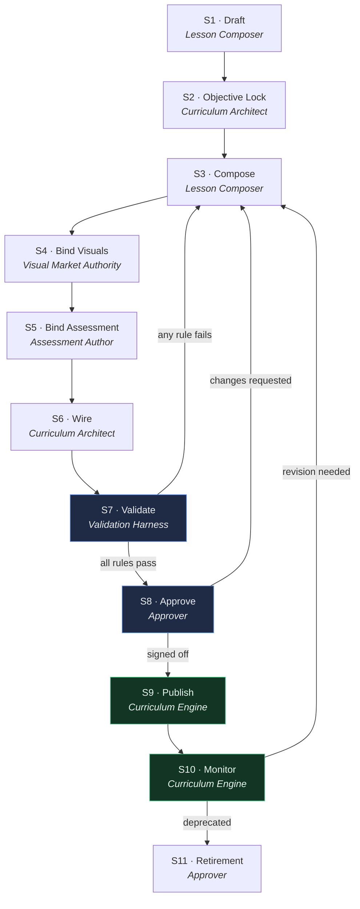
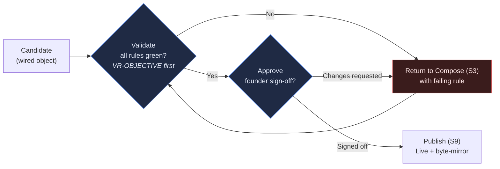
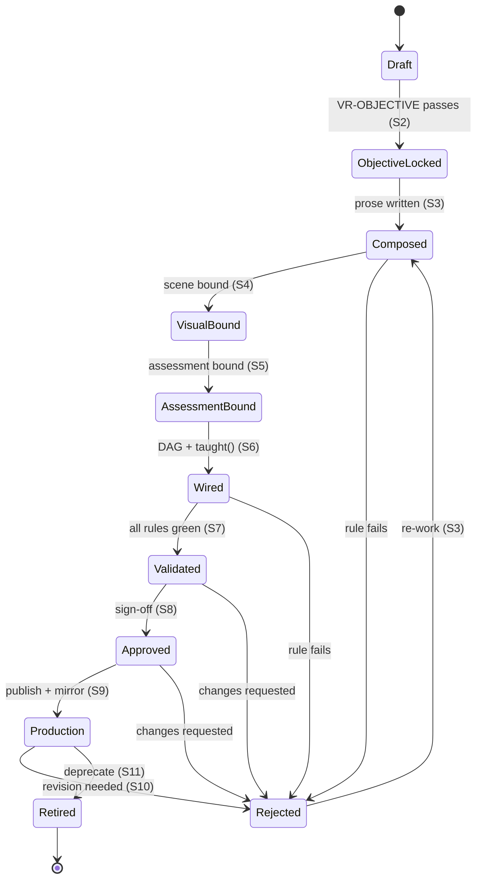

> **STATUS: RATIFIED** — ChartQuest Architecture v1.0 · Ratified 2026-07-15
> **Do not modify directly.** Part of the official ChartQuest ratified architecture. Changes require an ADR, migration notes, approval, and re-ratification — see `docs/architecture-ratified/ARCHITECTURE_CHANGE_POLICY.md`.

# ChartQuest Curriculum Engine — Authoring Pipeline

> **CANONICAL REFERENCE.** The single source of truth for the Lesson object is [`CHARTQUEST_LESSON_SCHEMA.json`](CHARTQUEST_LESSON_SCHEMA.json); for object ownership and the frozen decisions (D1–D8), [`CHARTQUEST_CANONICAL_OBJECT_REGISTRY.md`](CHARTQUEST_CANONICAL_OBJECT_REGISTRY.md). This document *references* those fields and rules — it does not redefine them. Where this document conflicts with the schema or the registry, **they govern.**

**Document:** `CHARTQUEST_AUTHORING_PIPELINE.md`
**Suite:** ChartQuest Curriculum Engine (Phase 1 — analysis + specification only)
**Status:** Ratified. Normative for the pipeline stages and object state machines; references the canonical schema + registry for the Lesson object.
**Date:** 2026-07-15
**Applies to:** every lesson, pattern, boss encounter, replay object, notebook entry, journal entry, and curriculum asset that ships in `chart-quest.html` (source of truth; `index.html` is a byte-mirror).

> **Phase 1 constraint.** This document changes **no** source code and **no** gameplay. It specifies the process and the state law by which future lessons are authored. Implementation is a later phase.

---

## 0. How to read this document

This is the **process constitution** of the Curriculum Engine — the single source of truth for the pipeline **stages** (§3) and the object **state machines** (§6). It defines the *verbs* (how a lesson comes into existence, moves through review, goes live, and is retired). The *nouns* live elsewhere: the Lesson object's shape is owned by [`CHARTQUEST_LESSON_SCHEMA.json`](CHARTQUEST_LESSON_SCHEMA.json), object ownership and the frozen decisions D1–D8 by [`CHARTQUEST_CANONICAL_OBJECT_REGISTRY.md`](CHARTQUEST_CANONICAL_OBJECT_REGISTRY.md).

Wherever this document names a schema field, it uses the **byte-identical field name** from the schema and links it (e.g. `guardian`, `primaryConcept`, `masteryCategory`, `minTrades`). Wherever it names a validation rule it cites the **`VR-*` id** resolved in [`CHARTQUEST_VALIDATION_CONTRACTS.md`](CHARTQUEST_VALIDATION_CONTRACTS.md) (the sole VR registry, D6). It does **not** re-declare a field table, re-list the mastery enum, or restate a VR — inventing a divergent schema, a second taxonomy, or a parallel gate is the exact meta-bug this suite exists to kill (Law 1, §9).

**Cross-references** (all in `docs/curriculum-engine/`):

| Need | Read |
|---|---|
| **The Lesson object — every field (SoT)** | [`CHARTQUEST_LESSON_SCHEMA.json`](CHARTQUEST_LESSON_SCHEMA.json) |
| **Object ownership + frozen decisions D1–D8 (SoT)** | [`CHARTQUEST_CANONICAL_OBJECT_REGISTRY.md`](CHARTQUEST_CANONICAL_OBJECT_REGISTRY.md) |
| The Lesson object, annotated (human companion) | `CHARTQUEST_LESSON_OBJECT_MODEL.md` |
| System boundaries + the `taught()` gate contract | `CHARTQUEST_SYSTEM_INTERFACES.md` |
| Payload / event / replay data contracts | `CHARTQUEST_DATA_CONTRACTS.md` |
| The curriculum dependency graph (DAG) | `CHARTQUEST_CURRICULUM_GRAPH.md` |
| The validators that block a bad lesson (`VR-*`) | `CHARTQUEST_VALIDATION_CONTRACTS.md` |

**External authorities that outrank nothing in this doc but govern their own domains:**

- **Visual Market Constitution** (`CHARTQUEST_VISUAL_MARKET_CONSTITUTION.md`, Appendix A.6 JSON spine) — governs every candle/chart **visual**. All OHLC teaching data is authored **once**, here.
- **Trading Canon** (`docs/canon/trading_canon.md`) + **Trading Experience System v1.1** — govern trade truth and causality.
- **Pattern Library** + **Lesson Composer** — the tooling a human/AI author uses to emit a compliant Lesson object.

---

## 1. The Prime Directive

> ## **No lesson may bypass the pipeline.**

Every curriculum object enters the game through the stages defined in §3, in order, and carries a **state** (§6) that reflects exactly how far it has travelled. There is **no side door**: no lesson may be hand-injected into `LESSONS`, `SCENES`, `CURRICULUM.focus`, `BOSS_CAST.rounds`, or any other structure without first existing as a validated, approved Lesson object with a single canonical `lessonId` (schema: `lessonId`).

This directive is the whole point. Today (§9) a "lesson" is an emergent join across ~20 disjoint maps, each hand-edited, none validated, several already contradicting one another. The pipeline replaces that with **one authored object, one path, one gate**. If a change cannot be expressed as a Lesson object moving through these stages, it is not a lesson change — stop and escalate.

**How this cuts build time and raises consistency (the test every section must pass):** each stage below removes a class of hand-mirrored edits or a class of silent drift that authors currently pay for on every lesson. The savings are stated per stage under *Why this stage exists*.

---

## 2. Roles & Ownership

System ownership is fixed by the ownership matrix in `CHARTQUEST_SYSTEM_INTERFACES.md`: the **Curriculum Engine owns the `taught(conceptKey)` gate** (D2). Everything below expands that single ownership assignment into the full role set the pipeline needs. Each role is the **single owner** of specific stages; a stage with two owners is a defect (see Law 4).

| Role | Owns | Never touches |
|---|---|---|
| **Lesson Composer** | The **Draft** stage. Produces the initial Lesson object. | The `taught()` gate; approval. |
| **Curriculum Architect** | Objective Lock, Wire (graph placement), Curriculum-asset lifecycle. Owns the DAG (`CHARTQUEST_CURRICULUM_GRAPH.md`). | Prose; approval sign-off. |
| **Visual Market Authority** | Bind-Visuals stage. Owns all candle/OHLC/scene data under the Visual Market Constitution. | Objectives; assessment scoring. |
| **Assessment Author** | Bind-Assessment stage. Owns the one canonical `assessment` per lesson. | The teaching prose; the visual scene. |
| **Curriculum Engine** | The **`taught(conceptKey)` gate** (D2), integration, and all runtime state transitions. Owns Validate + Publish + Monitor. | Authoring content; approval judgement. |
| **Validation Harness** | Executes every `VR-*` rule in `CHARTQUEST_VALIDATION_CONTRACTS.md`, starting with **VR-OBJECTIVE** (blocking). Advisory to owners, blocking to the pipeline. | Content; approval. |
| **Approver (Founder / delegate)** | The **Approve** stage sign-off and any **Retire** decision. | Authoring; validation logic. |

> **Note on "owner" vs "author".** *Owner* means: this role's approval is required to leave the stage, and this role is accountable for the invariant the stage protects. Other roles may contribute; only the owner advances the object.

---

## 3. The Authoring Pipeline (stages)

This section is the **single source of truth for the pipeline stages** — the complete, ordered stage list from **Draft … Retirement**, beginning with **Draft** (owned by the Lesson Composer). Each stage exists to enforce one invariant that the Current-State analysis (§9) shows is currently unenforced. Where a stage sets a schema field, it names the byte-identical field from [`CHARTQUEST_LESSON_SCHEMA.json`](CHARTQUEST_LESSON_SCHEMA.json).

Every stage below is specified with the same five fields — **Inputs / Outputs / Owner / Validation / Exit Criteria** — so a zero-knowledge author can execute the pipeline mechanically.

### Authoring-Pipeline diagram

> **Reading the loops.** Validate (S7), Approve (S8), and Monitor (S10) can all send an object **back to Compose (S3)** — never further forward than its current state, never around a stage. There is no arrow that skips Validate or Approve. That absence is the Prime Directive drawn as a graph.

---

### S1 · Draft

*The Lesson object is born. One id, one primary concept, nothing else assumed.*

- **Inputs:** a curriculum need (a gap in the DAG, a playtest finding, a founder request). The `masteryCategory` enum, the placement range of `guardian` (0 = The Gambler … 10 = Market Maker, D1/D7), and the `learn → practice → apply → test` loop as context (all defined in the schema).
- **Outputs:** a Lesson object with a **canonical `lessonId`** (schema: `lessonId`) and a one-line statement of its **single `primaryConcept`** (D4, Law 1). No prose, no scene, no assessment yet — only identity + intent.
- **Owner:** **Lesson Composer.**
- **Validation:** `lessonId` is unique across the corpus and matches the schema pattern (`^[a-z][a-z0-9_]*$`). Exactly **one** `primaryConcept` is named — a short snake_case conceptKey (D3, D4, Law 1).
- **Exit Criteria:** a `lessonId` exists and resolves nowhere else yet; the `primaryConcept` is stated in one sentence a 10-year-old could read (Law 12). State advances `Draft → (proceeds to Objective Lock)`.

> **Why this stage exists / time saved.** Today a lesson has *no* canonical id — it is a string reused across ~20 maps, bridged by ad-hoc remaps (e.g. `{trend:'trendline', mtf:'htf'}`). Minting **one** id up front collapses five overlapping namespaces (lesson-key / concept-key / mini-game-id / scene-key / practice-key) into one, so every later stage references the same handle instead of re-deriving it.

---

### S2 · Objective Lock

*Freeze what the lesson must make the player able to do — before a word of content is written.*

- **Inputs:** the S1 Lesson object; the `masteryCategory` this concept belongs to (exactly one — D5, Law 5), referenced from the Concept Catalogue, not re-owned here; the `guardian` it will be placed/tested against (D1; `hour` and `unlockLevel` are aliases of `guardian`, never separately authored).
- **Outputs:** a locked **`learningObjective`** on the Lesson object, its single `masteryCategory`, and its `guardian` placement claim.
- **Owner:** **Curriculum Architect.**
- **Validation:** **VR-OBJECTIVE** (`CHARTQUEST_VALIDATION_CONTRACTS.md`), which blocks implementation. A lesson with no locked, testable `learningObjective` **cannot proceed to implementation** — Compose (S3) may not begin. The objective must be a single observable player capability ("spot a break of structure," not "understand markets").
- **Exit Criteria:** `learningObjective` is locked, singular, observable, and maps to exactly one `masteryCategory`. VR-OBJECTIVE passes.

> **Why this stage exists / time saved.** VR-OBJECTIVE is the first gate for a reason: an unlocked objective is the root cause of every downstream duplication. When the objective is vague, authors compensate by writing prose five times in five tables hoping one lands. Locking it once means Compose, Bind-Visuals, and Bind-Assessment all target the *same* measurable outcome — no re-invention.

---

### S3 · Compose

*Write the single canonical teaching prose — once.*

- **Inputs:** the locked objective (S2); the Pattern Library; the Lesson Composer tool; the 10-year-old wording rule.
- **Outputs:** the Lesson object's **one** teaching-prose field, `learn.text` (the canonical copy every surface renders — card, intermission recap, notebook, boss-intro blurb, glossary all read *this*, never a private copy).
- **Owner:** **Lesson Composer.**
- **Validation:** `learn.text` states the `primaryConcept` and nothing else (D4, Law 1); passes the 10-year-old readability check (Law 12); contains **no** second copy of teaching text authored elsewhere (Law 6).
- **Exit Criteria:** exactly one `learn.text` exists on the object; no parallel prose exists in any other structure.

> **Why this stage exists / time saved.** The single largest authoring tax today is that a concept's teaching text is hand-authored in **up to six** places (card, scene caption, intermission lead, mini-game blurb, and two glossaries) that must be mirrored by hand and already drift. One canonical prose field, rendered by reference, removes five of six edits per lesson and eliminates the drift class entirely.

---

### S4 · Bind Visuals

*Attach the animated teaching chart — from the one visual authority, never re-drawn.*

- **Inputs:** the composed Lesson object; the **Visual Market Constitution** (Appendix A.6 JSON spine); the `window.CQ` canonical candle engine.
- **Outputs:** the Lesson object's `learn.patternRef` and `learn.lessonChartScene` — **references** to a single canonical scene/OHLC asset that satisfies the Visual Market Constitution's one slot-derived width formula and `{candleTop, c.x, c.w, gap}` seam.
- **Owner:** **Visual Market Authority.**
- **Validation:** the scene resolves (no silent no-op on a missing key — Law 8); OHLC data is authored **once** under the Visual Market Constitution and referenced, never hand-duplicated for practice vs. scene (Law 7); accessibility is never colour-only (Law 11).
- **Exit Criteria:** the lesson's visual is a live reference to a Constitution-compliant asset; no second hand-drawn candle set exists for the same concept.

> **Why this stage exists / time saved.** Today the same concept's candles are hand-drawn **twice** (animated `SCENES` and tap-drill `CONCEPT_PRACTICE`), both violating the Constitution's single-source intent. Binding one referenced asset means a visual is corrected once and every surface updates — and the "new concept with no scene degrades silently" failure mode becomes a hard validation error.

---

### S5 · Bind Assessment

*Attach the one canonical check that proves the objective — no parallel quiz forms.*

- **Inputs:** the locked objective (S2); the Assessment Author tool.
- **Outputs:** a single `assessment` on the Lesson object (`question` + `choices` + `correct`, per schema) whose success condition is exactly the S2 `learningObjective`.
- **Owner:** **Assessment Author.**
- **Validation:** exactly **one** `assessment` per lesson (Law 9 forbids the current 3-way split of quiz vs. recall vs. tap-drill for one concept); it tests the taught concept and nothing untaught (Law 10); any known wrong belief has a `misconceptions[]` entry (else VR-MISCONCEPTION fails); its scored payload contract matches `CHARTQUEST_DATA_CONTRACTS.md` (no hard-coded stub fields that make the milestone unreachable — Law 13).
- **Exit Criteria:** one `assessment` exists, targets the S2 `learningObjective`, and emits a contract-valid result.

> **Why this stage exists / time saved.** Assessment is currently authored up to three times per lesson in incompatible formats with partial, non-matching coverage, and the "completed" analytics payload is hard-coded such that the educational-milestone score is unreachable. One assessment, one contract, means an author writes it once and the funnel actually measures it.

---

### S6 · Wire

*Place the finished lesson into the curriculum graph and bind the `taught()` gate — the only integration path.*

- **Inputs:** the fully composed, visualised, assessed Lesson object; the curriculum DAG (`CHARTQUEST_CURRICULUM_GRAPH.md`).
- **Outputs:** the lesson inserted as a node in the DAG with explicit `prerequisites` edges; its `primaryConcept` registered with the **single `taught(conceptKey)` gate** owned by the Curriculum Engine (D2); its `guardian` placement committed so that `test.guardian >= this.guardian` (D1; `guardian: 0` = The Gambler, per D7 `guardian == test.guardian` is permitted at 0).
- **Owner:** **Curriculum Architect** (graph placement) coordinating with the **Curriculum Engine** (gate registration).
- **Validation:** the DAG remains acyclic; every `prerequisites` conceptKey is `taught(conceptKey)` at a `guardian <= this.guardian` (never test the untaught — Law 10, VR-ORDER); the concept resolves through **one** `taught(conceptKey)` predicate that lesson, trade, and boss systems all read (D2, Law 3); `guardian` ordering is expressed **once** in the DAG, not re-encoded in a parallel unlock map (D1, Law 2).
- **Exit Criteria:** the lesson is a graph node with valid `prerequisites` edges, registered with the one `taught(conceptKey)` gate, and its `test.guardian` tests only concepts taught at or before its `guardian` (VR-TAUGHT-BEFORE-TEST).

> **Why this stage exists / time saved.** Lesson→hour ordering is presently encoded **six** times across independent maps that already disagree, and the documented single `taught(conceptKey)` gate **does not exist** in code — it is an in-memory de-dupe object, so "teach before test" is enforced only by hand-written audit comments. Wiring through one DAG and one gate makes ordering single-sourced and makes "never test the untaught" a checked invariant instead of a prayer.

---

### S7 · Validate

*Run every contract. Nothing advances on a red.*

- **Inputs:** the wired Lesson object; the full rule set in `CHARTQUEST_VALIDATION_CONTRACTS.md`.
- **Outputs:** a pass/fail report per rule; on any failure, the object returns to **Compose (S3)** with the failing rule attached.
- **Owner:** **Validation Harness.**
- **Validation:** all `VR-*` rules, led by the blocking **VR-OBJECTIVE**. A failure here is not advisory — it **blocks**. Representative checks (the full registry is `CHARTQUEST_VALIDATION_CONTRACTS.md`): every referenced scene/assessment/prerequisite resolves; no default-open fallback hides a missing facet (Law 8); one `masteryCategory` (Law 5); one `learn.text` (Law 6); one visual source (Law 7); one `assessment` (Law 9); the `practice.minTrades >= 3` gate holds (VR-GATE); DAG acyclic and teach-before-test holds (Law 10, VR-ORDER / VR-TAUGHT-BEFORE-TEST).
- **Exit Criteria:** **zero** failing rules. Any failure blocks and loops back to S3.

> **Why this stage exists / time saved.** Today there is **no** validation layer: missing facets, disagreeing maps, and unresolved keys all fail silently at runtime (a bare card, a no-op scene, a generic stub). A blocking harness converts hours of on-device playtest archaeology into an instant, named error at author time.

---

### S8 · Approve

*A human signs off that the lesson is pedagogically and canonically correct.*

- **Inputs:** a fully validated (all-green) Lesson object; its objective, prose, visual, assessment, and graph placement.
- **Outputs:** a recorded approval (or a change request that loops to S3).
- **Owner:** **Approver (Founder / delegate).**
- **Validation:** conformance to the design laws (`learn → practice → apply → test`; `practice.minTrades >= 3` per level before the boss, VR-GATE; boss = final exam of `taught()` concepts only); tone/wording; canon alignment (`docs/canon/`).
- **Exit Criteria:** explicit sign-off recorded. Without it, the object cannot be published — this is the Approval-Pipeline gate (§4).

> **Why this stage exists / time saved.** Validation proves the lesson is *consistent*; approval proves it is *good*. Separating them means the harness never has to encode taste, and the Approver never has to hunt for mechanical defects — they arrive pre-verified.

---

### S9 · Publish

*The engine commits the lesson to `chart-quest.html` and mirrors it to `index.html`.*

- **Inputs:** an approved Lesson object.
- **Outputs:** the lesson live in the source of truth (`chart-quest.html`), byte-mirrored to `index.html`, reachable only through the pipeline-registered id and gate.
- **Owner:** **Curriculum Engine.**
- **Validation:** the mirror is byte-identical; no orphan edits to legacy structures outside the object's declared footprint (Law 14 forbids editing dead code paths); the lesson is reachable through its `taught()` registration.
- **Exit Criteria:** lesson is Live; `chart-quest.html` and `index.html` agree byte-for-byte.

> **Why this stage exists / time saved.** Publishing is the one place the ~20-map footprint is committed *from the single object*, so an author never again edits nine disjoint tables by hand — the engine projects the object into whatever runtime structures exist, keeping them in sync by construction.

---

### S10 · Monitor

*Watch the live lesson through analytics; feed revisions back into the pipeline.*

- **Inputs:** the live lesson; the content-event pipeline (funnel + educational events) per `CHARTQUEST_DATA_CONTRACTS.md`.
- **Outputs:** engagement / completion / assessment-pass signals; a revision request (→ S3) or a deprecation decision (→ S11) when warranted.
- **Owner:** **Curriculum Engine.**
- **Validation:** every lesson surface that should emit an event does (no silent, unmeasured surfaces — Law 13); payloads are contract-valid.
- **Exit Criteria:** the lesson is observable in the funnel; any needed change re-enters the pipeline at S3 (never a hot-patch — Prime Directive).

> **Why this stage exists / time saved.** Today a lesson emits at most one event, only from one code path, so most engagement is invisible. Monitoring closes the loop: a lesson that underperforms is revised through the same pipeline, not silently hand-tweaked, preserving every invariant on the way back.

---

### S11 · Retirement

*Remove a lesson deliberately, preserving graph and gate integrity.*

- **Inputs:** a deprecation decision; the lesson's DAG edges and dependants.
- **Outputs:** the lesson removed from the live corpus; its DAG edges rerouted or its dependants re-parented; its `taught()` registration withdrawn; historical analytics preserved.
- **Owner:** **Approver**, executed by the **Curriculum Engine**.
- **Validation:** no downstream lesson is left testing an now-untaught concept (Law 10 still holds after removal); the DAG stays acyclic and connected; `chart-quest.html`/`index.html` stay byte-identical.
- **Exit Criteria:** lesson state is `Retired`; no dangling prerequisite edges; teach-before-test holds for every remaining lesson.

> **Why this stage exists / time saved.** Removal is as dangerous as addition — a deleted prerequisite can silently strand a later boss into testing the untaught. A first-class Retirement stage makes deletion safe and reviewable instead of a grep-and-hope.

---

## 4. The Approval Pipeline

Authoring produces a *candidate*; the Approval Pipeline decides whether it becomes *canon*. It is the S7→S8→S9 spine of the diagram above, drawn as a decision flow. **A candidate that has not cleared both gates cannot be Live** — this is the Prime Directive restated for approvals.

**Two gates, in order, both mandatory:**

1. **Machine gate — Validate.** Every `VR-*` rule in `CHARTQUEST_VALIDATION_CONTRACTS.md` must pass. **VR-OBJECTIVE** runs first and is blocking: no objective, no implementation, full stop. The machine gate is objective and non-negotiable; it never yields to urgency, authority claims, or "just this once."
2. **Human gate — Approve.** A green candidate still needs the Approver's sign-off for pedagogy, tone, and canon fit. The human gate never runs *before* the machine gate — approving an unvalidated candidate is a process violation.

**No bypass.** There is no `BYPASS_GATE`, no "force publish," no manual insertion into a runtime map. If a candidate cannot pass, it is fixed and re-run, or it does not ship.

---

## 5. Forbidden Authoring Practices — Constitutional Laws

The founding law is **one primary concept per lesson** (D4 — the schema requires exactly one `primaryConcept`). The clause below expands it into the **complete numbered set** of forbidden practices. Each law is stated as a prohibition, names the failure it prevents (grounded in §9's Current-State analysis), and is **binding on every stage of the pipeline**. Violating any law is an automatic Validate (S7) failure.

> These are laws, not guidelines. "It's faster," "the old code did it," and "just this one lesson" are not exemptions.

1. **One primary concept per lesson.** (D4) A lesson teaches exactly **one** `primaryConcept`. Multi-concept bundles (the current `candles_intro → [candle, wick]`, `what_is_sl → [sl, tp]`) are forbidden; split them into separate lessons with explicit DAG edges. *Prevents:* the un-encodable "single primary concept" rule that today's maps silently contradict.
2. **No parallel ordering map.** Placement (`guardian`) ordering is expressed **once**, in the curriculum DAG (`CHARTQUEST_CURRICULUM_GRAPH.md`); `hour` and `unlockLevel` are aliases of `guardian`, never separately authored or DAG-derived (D1). Re-encoding order in a second structure (the current six disagreeing maps: `CURRICULUM.focus`, `LESSON_UNLOCK`, `KNOWLEDGE.level`, `CONCEPTS.hour`, `MASTERY_CAT_LEVEL`, `LEVEL_FLOW`) is forbidden. *Prevents:* the `trendlines` hour-7-vs-9 class of drift.
3. **One `taught()` gate.** (D2) There is exactly **one** `taught(conceptKey)` predicate, owned by the Curriculum Engine, that the lesson, trade, and boss systems all read; its argument is a lesson's `primaryConcept`, never a `lessonId`. Adding a second "is it known?" check (the current four: `taught{}`, `conceptDiscovered()`, `conceptTier()`, `masteryCatLearned()`) is forbidden. *Prevents:* a concept being "shown" by one gate and "undiscovered" by another; and the documented-but-nonexistent gate.
4. **One owner per fact.** Every field, gate, and asset has exactly **one** owning role (§2). No two roles may both author the same fact. *Prevents:* the hand-synced, mutually-contradicting maps that define today's engine.
5. **One mastery taxonomy.** (D5) A concept maps to exactly **one** value of the schema's `masteryCategory` enum, owned by the Concept Catalogue and only referenced by a lesson. The parallel 5-bucket mini-game taxonomy and the three concept→category maps (`GAME_MASTERY`, `LESSON_MASTERY`, `CONFLUENCE_CONFIG.mastery`) that already disagree are forbidden. *Prevents:* a lesson's category depending on which subsystem observes it.
6. **One canonical prose.** A concept's teaching text is authored **once** and referenced everywhere. Hand-copying prose into a second surface (card, caption, intermission lead, mini-game blurb, glossary ×2) is forbidden. *Prevents:* the up-to-six-copies drift, the single largest authoring tax.
7. **One visual source.** OHLC/candle teaching data is authored **once** under the Visual Market Constitution and referenced. Hand-drawing a second candle set for the same concept (today's `SCENES` vs. `CONCEPT_PRACTICE` duplication) is forbidden.
8. **No default-open fallback.** A missing scene, assessment, prerequisite, or metadata entry is a **hard error at Validate (S7)**, never a silent no-op or generic stub. Returning "fully shown"/"generic card"/"Structure" for an unknown key is forbidden. *Prevents:* authoring gaps hiding behind default-open behaviour.
9. **One assessment form per lesson.** A lesson carries exactly **one** canonical assessment. The current three parallel forms (`QUIZ_QUESTIONS`, `LESSON_RECALL`, `CONCEPT_PRACTICE`) for one concept are forbidden.
10. **Never test the untaught.** A boss round, practice trade, or assessment may test **only** concepts `taught()` at or before that hour. Boss = final exam of taught concepts only. Authoring a test for an untaught concept is forbidden and blocks at Wire (S6) and Validate (S7). *Prevents:* the hand-audited, unchecked teach-before-test rule.
11. **Never colour-only.** No lesson, scene, or assessment may encode meaning by colour alone; every colour cue has a redundant shape/label/text channel (Accessibility Law). Forbidden regardless of how "obvious" the colour seems.
12. **Ten-year-old wording.** All lesson text and every concept name must be worded for a 10-year-old. Jargon without a plain-language teach is forbidden.
13. **Every surface is measured.** Every lesson surface that is shown to the player emits a contract-valid analytics event [`CHARTQUEST_DATA_CONTRACTS.md`]. Hard-coding stub payload fields that make an educational milestone unreachable (today's `quiz_score:null, attempts:1`) is forbidden. *Prevents:* invisible engagement.
14. **No editing dead paths.** Authors edit only the live object and its declared footprint. Editing a dead/legacy structure (e.g. the unused `BOSSES[level].rounds` inline-quiz object) is forbidden — it looks live, changes nothing, and wastes review. When in doubt, the pipeline projects the object; do not hand-edit runtime maps.
15. **No id reuse across namespaces.** A lesson has **one** canonical `lessonId`, and its concept is **one** short snake_case `primaryConcept` (D3). Bridging five namespaces (lesson-key / concept-key / mini-game-id / scene-key / practice-key) with inline remaps is forbidden; use the one id.
16. **No bypass.** No lesson may enter the game except through the pipeline (§1). There is no side door, no force-publish, no `BYPASS_GATE`. *This is the Prime Directive as a law.*

---

## 6. State Machines

This section is the **single source of truth for the object state machines.** Every curriculum object is, at all times, in exactly **one** state, and moves between states **only** along the explicit transitions below. Any object observed in no listed state, or moved by an unlisted transition, is a defect. The Lesson machine's authoring states are the pipeline-granular expansion of the persisted schema `status` enum (`draft → in_review → validated → production → deprecated → retired`); where a machine state maps to a `status` value it uses that value's meaning.

### 6.1 Lesson

**States** (authoring-granular; `Production` = schema `status: "production"`, the Live/Published state):

`Draft → Objective-Locked → Composed → Visual-Bound → Assessment-Bound → Wired → Validated → Approved → Production → Retired`
(plus the transient `Rejected` re-work state)

| From | Transition | To | Trigger |
|---|---|---|---|
| — | create | **Draft** | Lesson Composer mints `lessonId` (S1) |
| Draft | lock objective | Objective-Locked | VR-OBJECTIVE passes (S2) |
| Objective-Locked | write prose | Composed | canonical prose written (S3) |
| Composed | bind scene | Visual-Bound | Constitution-compliant visual referenced (S4) |
| Visual-Bound | bind check | Assessment-Bound | one assessment attached (S5) |
| Assessment-Bound | wire graph + gate | Wired | DAG node + `taught()` registration (S6) |
| Wired | run rules | **Validated** | all rules green (S7) |
| any of S3–S7 | rule/objective fails | **Rejected** | Validate returns red |
| Rejected | fix | Composed | author re-enters at S3 |
| Validated | sign off | **Approved** | Approver approves (S8) |
| Validated / Approved | changes requested | Rejected | Approver requests changes |
| Approved | publish | **Production** | engine commits + byte-mirrors (S9) |
| Production | revise | Rejected | Monitor flags a needed change (S10) |
| Production | deprecate | **Retired** | Approver retires (S11) |

**Lesson state-machine diagram:**

### 6.2 Pattern

A Pattern is a reusable chart shape (break of structure, order block, liquidity sweep, bull/bear flag, head-and-shoulders) drawn from the Pattern Library and consumed by lessons, scenes, and boss rounds. **States:** `Draft → Constitution-Validated → Published → Referenced → Deprecated`.

| From | Transition | To |
|---|---|---|
| — | author under Visual Market Constitution | Draft |
| Draft | pass Constitution A.6 spine check | Constitution-Validated |
| Constitution-Validated | publish to Pattern Library | Published |
| Published | a lesson/scene/boss references it | Referenced |
| Referenced | last reference removed + Approver retires | Deprecated |

*Law tie-ins:* Patterns are the one visual source (Law 7); a Pattern may not be deprecated while `Referenced` (mirrors Retirement safety).

### 6.3 Trade

A Trade is a runtime instance the player opens/closes; it is not authored but its **lifecycle is a contract** (trade truth governed by Trading Canon). **States:** `Armed → Open → Resolving → Closed → Logged`.

| From | Transition | To |
|---|---|---|
| — | setup gated by `taught()` + `tradeGatePassed` prerequisites | Armed |
| Armed | player enters | Open |
| Open | price reaches SL/TP or manual close | Resolving |
| Resolving | outcome fixed by Trading Canon causality (not RNG) | Closed |
| Closed | fan-out to tradeLog + journal + analytics | Logged |

*Law tie-ins:* a Trade may only be `Armed` for a concept that is `taught()` (Law 10); the `Closed → Logged` fan-out must emit contract-valid events (Law 13).

### 6.4 Replay Object

A Replay is the `{candles, entryIdx}` film synthesised when a Trade closes [`CHARTQUEST_DATA_CONTRACTS.md`]. **States:** `Synthesized → Chain-Fixed → Stored → Rendered → Compacted → Evicted`.

| From | Transition | To |
|---|---|---|
| — | built from `trade.setupSnap` + path at close | Synthesized |
| Synthesized | geometry repaired (no impossible candle) | Chain-Fixed |
| Chain-Fixed | copied to tradeLog (cap) + journal (cap) | Stored |
| Stored | consumed by a canonical renderer | Rendered |
| Stored | down-sampled for analytics with `entryIdx` preserved | Compacted |
| Stored | cap exceeded / level reset | Evicted |

*Law tie-ins:* one replay data shape, one canonical renderer contract (no three re-derived renderers) — enforced at Validate; `entryIdx` must stay in range through Compaction (Law 8: no silent orphaning).

### 6.5 Notebook Entry (Knowledge)

A Notebook/Knowledge entry is a discovered concept card. **States:** `Undiscovered → Discovered → Rendered → Reviewed`.

| From | Transition | To |
|---|---|---|
| — | concept exists, prerequisites unmet | Undiscovered |
| Undiscovered | concept `taught()` (single gate — Law 3) | Discovered |
| Discovered | card rendered with its bound scene (Law 8: must resolve) | Rendered |
| Rendered | player opens/reviews it | Reviewed |

*Law tie-in:* discovery is driven by the **one** `taught()` gate, not a second level-based predicate — this is the specific fix for today's "discovered vs. read are different truths" split.

### 6.6 Journal Entry

Two journal artifact types share one lifecycle contract. **Trade record:** `Created → Persisted → Reviewed → Archived`. **Free-text note:** `Composed → Linked → Persisted`.

| From | Transition | To |
|---|---|---|
| Trade `Closed` | logged as fat trade record | Created |
| Created | written to persistent store (cap) | Persisted |
| Persisted | opened in full-screen review | Reviewed |
| Persisted | evicted past cap | Archived |
| — (note) | player writes free text | Composed |
| Composed | linked to term/lesson/trade by canonical id (Law 15) | Linked |
| Linked | written to store | Persisted |

*Law tie-in:* a note links by the **one** canonical id (Law 15), never a namespace-bridged key.

### 6.7 Boss Encounter

A Boss is a Guardian (realms 0–9) or the Market Maker (realm 10); the encounter is the cumulative final exam. **States:** `Locked → Gated → Summoned → In-Exam → Cleared` (or `Failed → Retry`).

| From | Transition | To |
|---|---|---|
| — | `guardian` realm begins | Locked |
| Locked | `tradeGatePassed` (`practice.minTrades >= 3`/level, wins, reads — VR-GATE) | Gated |
| Gated | player reaches the Guardian portal | Summoned |
| Summoned | rounds run (each round tests a `taught(conceptKey)` concept only — Law 10) | In-Exam |
| In-Exam | all rounds passed | Cleared |
| In-Exam | lives exhausted | Failed |
| Failed | retry | Summoned |

*Law tie-ins:* boss = final exam of **`taught()`** concepts only (Law 10, VR-TAUGHT-BEFORE-TEST); a lesson's boss is `test.guardian`, with `guardian: 0` = The Gambler (D1/D7 — a single authored field, not three implicit maps); a round id must resolve to a real mini-game (Law 8, no `'Structure'` fallback).

### 6.8 Curriculum Asset

A Curriculum Asset is the `guardian`/DAG-node scaffolding a lesson attaches to (`CHARTQUEST_CURRICULUM_GRAPH.md`). **States:** `Proposed → Placed → Edge-Bound → Live → Reflowed → Retired`.

| From | Transition | To |
|---|---|---|
| — | Curriculum Architect proposes an hour/node | Proposed |
| Proposed | node inserted in the DAG | Placed |
| Placed | prerequisite edges committed (acyclic) | Edge-Bound |
| Edge-Bound | lessons wired into it (S6) go Production | Live |
| Live | edges rerouted on a curriculum change | Reflowed |
| Live / Reflowed | node deprecated, dependants re-parented | Retired |

*Law tie-in:* the DAG is the **one** ordering authority (Law 2); a Reflow or Retire must keep it acyclic and preserve teach-before-test for every dependant (Law 10).

---

## 7. State-law invariants (apply to every machine)

1. **Exactly one state.** No object is ever in two states or none.
2. **Only listed transitions.** A transition not in the tables above is forbidden; observing one is a defect to escalate, not to accept.
3. **No forward skips.** An object cannot jump past a stage (e.g. `Draft → Production` directly) — this is the Prime Directive at the state level.
4. **Backward only to re-work.** The only backward edge is `→ Rejected → Composed` (or a machine's explicit revise/reflow edge); there is no "un-publish in place."
5. **Retirement is a state, not a delete.** Retiring preserves history and re-parents dependants; it never silently drops a node (Law 10 must still hold afterward).

---

## 8. Worked example (grounding — informative, not normative)

*To show the pipeline is executable with zero founder clarification, here is a compliant path for a single concept. Field names are byte-identical to [`CHARTQUEST_LESSON_SCHEMA.json`](CHARTQUEST_LESSON_SCHEMA.json); the finished object is the canonical `bos` instance in the registry (`CHARTQUEST_CANONICAL_OBJECT_REGISTRY.md` §3) — do not invent alternate values.*

**Concept:** `primaryConcept: "bos"` — Break of Structure (D4, Law 1).

1. **Draft (S1):** Composer mints `lessonId: "bos"` and states the one concept: "price breaks the last swing high/low." → `Draft`.
2. **Objective Lock (S2):** Architect locks `learningObjective` "the player can point to the candle that breaks structure," `masteryCategory: "Structure"` (D5, Law 5), `guardian: 3`. VR-OBJECTIVE passes. → `Objective-Locked`.
3. **Compose (S3):** one prose field, 10-year-old wording (Law 12): "When price pushes past the last high, the market just *broke structure* — it's telling you who's winning." → `Composed`.
4. **Bind Visuals (S4):** reference the Break-of-Structure Pattern (Law 7) rendered by `window.CQ`; shape+label mark the break candle, not colour alone (Law 11). → `Visual-Bound`.
5. **Bind Assessment (S5):** one tap-drill (Law 9): "tap the candle that broke structure," success = the objective from S2, contract-valid payload (Law 13). → `Assessment-Bound`.
6. **Wire (S6):** insert as a DAG node after its `prerequisites` (`what_is_trend`, `support_resist`); register `primaryConcept: "bos"` with the one `taught(conceptKey)` gate (D2, Law 3); confirm `test.guardian: 3` tests only concepts `taught()` at `guardian <= 3` (Law 10). → `Wired`.
7. **Validate (S7):** all rules green, VR-OBJECTIVE first. → `Validated`.
8. **Approve (S8):** founder signs off. → `Approved`.
9. **Publish (S9):** engine commits to `chart-quest.html`, byte-mirrors `index.html`. → `Production`.
10. **Monitor (S10):** the tap-drill and card emit events; funnel shows completion. Any revision loops to S3 — never a hot-patch (Law 16).

Total structures the author hand-edited: **one** (the Lesson object). The engine projected the rest. That is the whole saving.

---

## 9. Current-State Rationale (why this pipeline is non-negotiable)

*Informative. This section grounds every law and stage in the verified reality of `chart-quest.html` so a zero-knowledge reader understands the pipeline is a fix, not a preference.*

The Curriculum-Engine analysis found that a single "lesson" (e.g. `bos`) is currently authored across **at least nine** disjoint structures — `LESSONS`, `QUIZ_QUESTIONS`, `LESSON_RECALL`, `IM_LESSONS`, `SCENES`, `CONCEPT_PRACTICE`, `MG_CONCEPTS`, `KNOWLEDGE`, `TERMS` — each with its own copy of the teaching prose and its own key namespace, with **no** single lesson object and **no** single `taught()` gate. Specifically:

- **The documented `taught(conceptKey)` gate does not exist in code.** `taught` is an in-memory, session-only de-dupe object; "teach before test" is enforced only by hand-written audit comments. → **Law 3, S6.**
- **Teaching prose is hand-authored in up to six places** that drift. → **Law 6, S3.**
- **Concept→mastery-category is encoded three times over two incompatible taxonomies** (7-bucket vs. 5-bucket) that already disagree. → **Law 5.**
- **Lesson→hour ordering is encoded six times** and already contradicts itself (`trendlines` hour 7 vs. 9). → **Law 2, S6.**
- **OHLC teaching data is hand-drawn twice** for the same concept, violating the Visual Market Constitution's single-source intent. → **Law 7, S4.**
- **Assessment is authored three times** in incompatible formats; the "completed" analytics payload is stubbed so the educational milestone is unreachable. → **Laws 9 & 13, S5.**
- **No validation layer exists;** missing facets, unresolved keys, and disagreeing maps all fail silently at runtime (bare card, no-op scene, generic stub, `'Structure'` fallback). → **Law 8, S7.**
- **Five overlapping namespaces** (lesson-key / concept-key / mini-game-id / scene-key / practice-key) are bridged by scattered inline remaps. → **Law 15, S1.**
- **A boss round bumps mastery twice** and dead legacy structures (`BOSSES[level].rounds`) look live but do nothing. → **Laws 4 & 14.**

The pipeline exists to make each of these a single authored fact, moved through a single validated path, so that **a zero-knowledge author can build a fully-compliant lesson using only this suite + the Visual Market Constitution + the Pattern Library + the Lesson Composer, with no founder clarification.** If any ambiguity remains, the architecture failed — so this document leaves none.

---

## 10. Conformance checklist (author-facing)

A lesson is pipeline-compliant if and only if **all** of the following are true:

- [ ] It has exactly **one** canonical `lessonId` (schema: `lessonId`).
- [ ] It teaches exactly **one** `primaryConcept` (D4, Law 1).
- [ ] Its `learningObjective` is locked and VR-OBJECTIVE passes before any content is written (S2).
- [ ] One `learn.text` (Law 6), one visual source (Law 7), one `assessment` (Law 9), one `masteryCategory` (D5, Law 5).
- [ ] Its `practice.minTrades >= 3` per level before the boss (VR-GATE).
- [ ] It is wired into the DAG and the **one** `taught(conceptKey)` gate (D2, Laws 2 & 3, S6).
- [ ] It tests nothing untaught (Law 10, VR-TAUGHT-BEFORE-TEST) and is never colour-only (Law 11); wording is 10-year-old (Law 12).
- [ ] Every surface emits a contract-valid event (Law 13).
- [ ] It passed Validate (S7) with zero red and received Approver sign-off (S8).
- [ ] It reached `Production` **only** through the pipeline — no bypass (Law 16, Prime Directive).
- [ ] `chart-quest.html` and `index.html` are byte-identical after Publish (S9).

---

---

*Ratified 2026-07-15. This document owns the pipeline stages (§3) and object state machines (§6); the Lesson object and the frozen decisions D1–D8 are owned by the schema and the registry, which govern on any conflict. Per D8, no SemVer envelope or tri-format duplication of the lesson object is kept here.*
