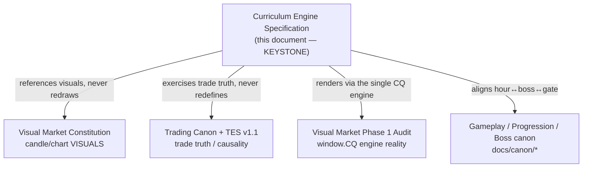
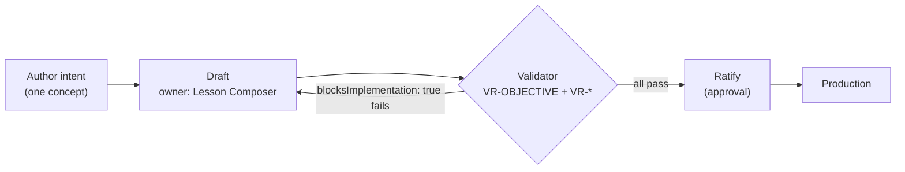
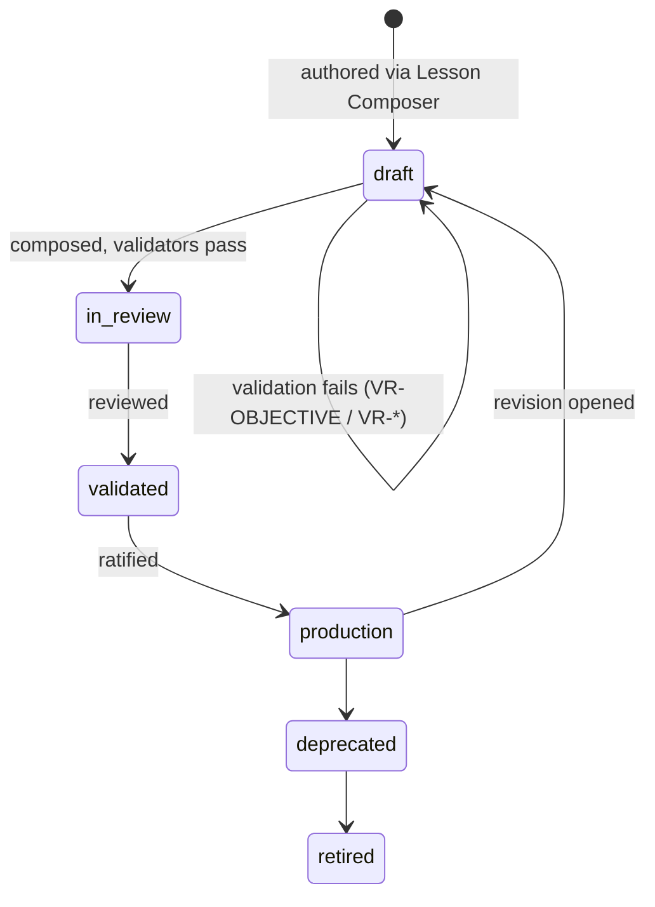
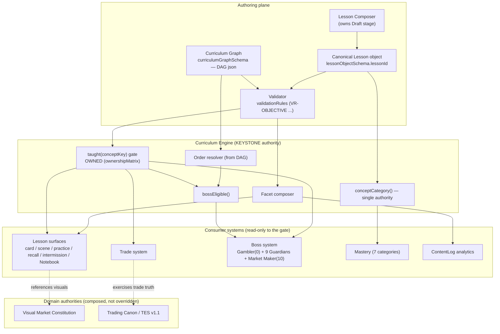
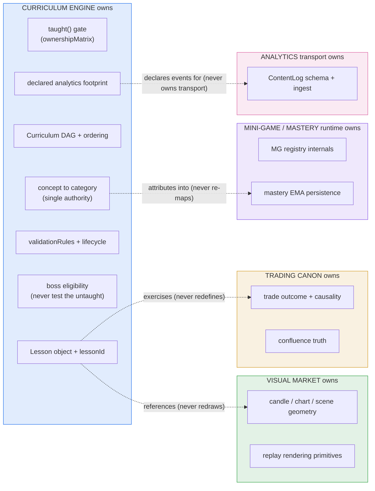

> **STATUS: RATIFIED** — ChartQuest Architecture v1.0 · Ratified 2026-07-15
> **Do not modify directly.** Part of the official ChartQuest ratified architecture. Changes require an ADR, migration notes, approval, and re-ratification — see `docs/architecture-ratified/ARCHITECTURE_CHANGE_POLICY.md`.

# ChartQuest Curriculum Engine — Keystone Specification

> **CANONICAL REFERENCE.** The single source of truth for the Lesson object is [`CHARTQUEST_LESSON_SCHEMA.json`](CHARTQUEST_LESSON_SCHEMA.json); for object ownership and the frozen decisions (D1–D8), [`CHARTQUEST_CANONICAL_OBJECT_REGISTRY.md`](CHARTQUEST_CANONICAL_OBJECT_REGISTRY.md). This document *references* those fields and rules — it does not redefine them. Where this document conflicts with the schema or the registry, **they govern.**

**Document ID:** `CHARTQUEST_CURRICULUM_ENGINE_SPECIFICATION`
**Status:** RATIFIED — Phase 1 (analysis + specification; no code changes)
**Authority tier:** KEYSTONE (highest). This document governs every other Curriculum Engine document.
**Date:** 2026-07-15
**Applies to:** `chart-quest.html` (source of truth) and its byte-mirror `index.html`.
**Spine:** The **Ratified Spine** of this suite is the pair named in the banner above — [`CHARTQUEST_LESSON_SCHEMA.json`](CHARTQUEST_LESSON_SCHEMA.json) (every lesson field) and [`CHARTQUEST_CANONICAL_OBJECT_REGISTRY.md`](CHARTQUEST_CANONICAL_OBJECT_REGISTRY.md) (object ownership + frozen decisions D1–D8). Where this document and any other cite a field, the field name is **byte-identical to the schema**. Divergence from the Spine is the exact meta-bug this suite exists to kill.

---

## 0. Why this exists — reducing implementation time while raising educational quality

> **Read this section first. Every rule below is downstream of this one goal.**

ChartQuest today has **no canonical lesson**. A single teachable idea — say, *Break of Structure* (`bos`) — is hand-authored across **at least nine independent data structures** (`LESSONS`, `QUIZ_QUESTIONS`, `LESSON_RECALL`, `IM_LESSONS`, `SCENES`, `CONCEPT_PRACTICE`, `MG_CONCEPTS` + `MG.REG`, `KNOWLEDGE` + `TERMS`), each with its own copy of the teaching prose and its own key namespace. The "primary concept" of a lesson is re-derived by **six different maps** (`CONCEPTS.lesson`, `LESSON_MASTERY`, `GAME_MASTERY`, `LESSON_GAME`, `LESSON_PRACTICE`, `LESSON_TO_CONCEPTS`). The concept→mastery-category relation is encoded **three times over two incompatible taxonomies** (the 7-bucket `MASTERY_CATS` vs the 5-bucket `MG.REG.category`). Lesson→hour ordering is encoded **six times** (`CURRICULUM.focus`, `LESSON_UNLOCK`, `KNOWLEDGE.level`, `CONCEPTS.hour`, `MASTERY_CAT_LEVEL`, `LEVEL_FLOW`) — and the copies **already disagree** (e.g. `trendlines` is hour 9 in `CURRICULUM`/`KNOWLEDGE` but level 7 in `LESSON_UNLOCK`).

The measurable consequence: **authoring one lesson requires editing ~20 disjoint structures with no schema tying them together, and there is no validator to catch a missed edit.** Every new lesson is *partially invented*, because the author must re-derive from scratch what a lesson even is. Educational consistency degrades silently — a concept can be "shown" by the terminology gate yet "undiscovered" by the Notebook, or "tested" by a boss that the player was never taught.

The Curriculum Engine is the fix. It defines **one canonical Lesson object** (schema: [`CHARTQUEST_LESSON_SCHEMA.json`](CHARTQUEST_LESSON_SCHEMA.json)), keyed by a single `lessonId`, that **owns** every facet of a lesson — copy, animation, practice, assessment, ordering, mastery attribution, analytics footprint — and **one `taught()` gate** that the lesson, trade, and boss systems all read.

This cuts future build time and raises quality along five concrete axes:

| Lever | Today (scattered) | With the Curriculum Engine |
|---|---|---|
| **Author surface** | ~20 files edited per lesson, by hand, in no declared order | One `Lesson` object authored once, composed by the Lesson Composer |
| **Consistency** | 6 ordering maps, 3 concept→category maps — already drifted, undetectable | One `curriculumGraphSchema` DAG; ordering derived, not copied |
| **"Never test the untaught"** | Enforced only by human audit comments in `BOSS_CAST` | Enforced by the `taught()` gate + `VR-*` validators that **block** on failure |
| **Silent failure** | Missing facets no-op (blank card, generic stub) | `validationRules` fail the build/author, surfacing the gap |
| **Onboarding a new author (human or AI)** | Requires founder tribal knowledge | Requires only this doc suite + the Visual Market Constitution, Pattern Library, and Lesson Composer |

**Success criterion (Spine-bound):** a zero-knowledge AI can author a fully-compliant lesson using only these ten documents plus the Visual Market Constitution, the Pattern Library, and the Lesson Composer — with **no founder clarification**. If ambiguity remains, the architecture has failed.

---

## 1. Authority statement

The Curriculum Engine is the **highest authority** governing:

- **lesson creation** — what a lesson is, and how one comes into existence;
- **sequencing** — the order concepts are taught, practiced, and tested;
- **ownership** — which system owns which field (per the Spine `ownershipMatrix`);
- **validation** — the rules that a lesson and the curriculum graph must satisfy;
- **progression** — how a player advances hour→hour and reaches each Guardian;
- **dependencies** — which concepts must be taught before others (the DAG);
- **authoring** — the pipeline stages a lesson passes through;
- **composition** — how a lesson's many facets are assembled from one object;
- **approval** — who ratifies a lesson and the curriculum;
- **lifecycle** — the states a lesson moves through from `Draft` to `Production`.

**Any implementation that conflicts with this specification is WRONG** and must be reconciled to it — not the reverse. This includes existing code in `chart-quest.html`: the scattered maps documented throughout this suite describe the **current (non-compliant) state**, not the target. Where current code contradicts the Spine, the code is the defect.

This document does **not** override the domain constitutions it depends on. It composes with them (see §7, Dependencies). In particular it never redefines candle/chart visuals (owned by the **Visual Market Constitution**) or trade truth/causality (owned by the **Trading Canon** / **Trading Experience System v1.1**).

---

## 2. Purpose

To replace ~20 overlapping, hand-synchronized lesson/concept/mastery structures with **one canonical, validated, single-source Lesson object and one curriculum dependency graph**, such that:

1. every teachable concept is defined **exactly once**;
2. every ordering, mastery, and gating relation is **derived** from that single definition, never re-copied;
3. the core design loop **LEARN → PRACTICE → APPLY → TEST** is **programmatically enforced**, not maintained by hand-authored audit comments;
4. authoring a lesson is a **composition** task (fill one object) rather than an **invention** task (reconcile twenty).

---

## 3. Responsibilities

The Curriculum Engine **owns and is responsible for**:

| # | Responsibility | Detail |
|---|---|---|
| R1 | **Canonical Lesson object** | Enforce the schema — [`CHARTQUEST_LESSON_SCHEMA.json`](CHARTQUEST_LESSON_SCHEMA.json), the sole SoT for lesson shape. One object per lesson, keyed by `lessonId`. (`CHARTQUEST_LESSON_OBJECT_MODEL.md` is its non-normative human companion.) |
| R2 | **The `taught()` gate** | Own the single `taught(conceptKey)` predicate that lesson, trade, and boss systems all read. Per the Spine `ownershipMatrix`, the Curriculum Engine **owns** the `taught() gate`. |
| R3 | **Curriculum graph** | Own the `curriculumGraphSchema` (Spine: `format: "DAG json"`) — the dependency DAG that establishes teach-order. See `CHARTQUEST_CURRICULUM_GRAPH.md`. |
| R4 | **Sequencing** | Own the single sequencing model for all hours (0–10). Replace the three unrelated engines (`introFlow`, `LEVEL_FLOW`, `teach()`-throttle) with one derived-from-graph order. |
| R5 | **Validation** | Own the `validationRules` (Spine) and the completeness/consistency checks. A rule with `blocksImplementation: true` **halts authoring/build**. See `CHARTQUEST_VALIDATION_CONTRACTS.md`. |
| R6 | **Progression** | Own hour→Guardian mapping, the quantity gate contract, and the hour↔boss index rule. |
| R7 | **Mastery attribution** | Own the single concept→mastery-category authority (collapsing the four drifted maps into one). |
| R8 | **Lifecycle & approval** | Own the `Lesson` state machine and the approval process. States are the schema `status` enum (`draft → in_review → validated → production`, plus `deprecated`/`retired`); the machine itself is specified in `CHARTQUEST_AUTHORING_PIPELINE.md`. |
| R9 | **Analytics footprint** | Own the declaration of which analytics events a lesson emits (today emergent; must become declared). |

The Curriculum Engine is **not** responsible for: rendering candles (Visual Market Constitution), trade outcome causality (Trading Canon), the mini-game engine internals (`MG` registry), or the analytics transport (`ContentLog` / `ingest` edge fn). It **declares contracts** those systems must honor; it does not implement them.

---

## 4. Ownership

Ownership is governed by the Spine `ownershipMatrix`. The keystone row is:

| system | owns |
|---|---|
| **Curriculum Engine** | **`taught() gate`** |

This single row is load-bearing. The current codebase has **no** `taught()` function — `taught` is a plain session-only object (`const taught = {}`, `chart-quest.html:4989`) used as a pop-up de-dupe flag, keyed by *lesson* key, read in only a handful of hint-text and trade-setup spots. **No boss or practice trade consults it.** The design docs (`docs/lesson-teach-order.md`) assert a `taught(conceptKey)` function that "the lesson, trade, and boss systems all read"; that function **does not exist**. The Spine assigns its ownership to the Curriculum Engine. Making that ownership real is the engine's defining act.

The full field-by-field ownership table (which system owns each Spine schema field, and the boundaries between them) is specified in `CHARTQUEST_SYSTEM_INTERFACES.md` and visualized in §12 (Ownership-Boundaries diagram) below. The object-level ownership of the Lesson and Concept types is specified in `CHARTQUEST_CURRICULUM_OBJECT_MODEL.md` and `CHARTQUEST_LESSON_OBJECT_MODEL.md`.

**Ownership law:** a field has exactly one owner. Any structure that re-encodes an owned field (a second copy of ordering, a third concept→category map) is a **derivation**, not an owner, and must be computed from the owner — never hand-maintained. This law is what kills the drift bug (§0).

---

## 5. Inputs

The Curriculum Engine consumes:

| Input | Source | Role |
|---|---|---|
| **Lesson objects** | Authored via the Lesson Composer, validated against `lessonObjectSchema` | The primary input — the canonical definition of each lesson. |
| **Concept catalogue** | The canonical concept registry (`CHARTQUEST_CURRICULUM_OBJECT_MODEL.md`) | One concept-key namespace replacing the two disjoint registries (`CONCEPTS` 13 keys vs `KNOWLEDGE` 25 keys). |
| **Curriculum graph** | `curriculumGraphSchema` DAG (`CHARTQUEST_CURRICULUM_GRAPH.md`) | Declares concept prerequisites → derives teach-order. |
| **Visual assets** | Visual Market Constitution + Pattern Library | Candle/scene geometry a lesson references (never re-drawn per lesson). |
| **Trade truth** | Trading Canon / TES v1.1 | The causal model a PRACTICE/APPLY/TEST beat exercises. |
| **Progression policy** | This spec §9 (Lifecycle) + progression canon | Hour ladder, quantity gate thresholds, hour↔boss rule. |

Runtime inputs (player state) consumed to evaluate gates: `session.level`, `maxHourReached`, the quantity-gate counters, and the persisted `lessonProgress` read-set. These are read-only to the engine's *authoring* surface and are the substrate of the `taught()` gate at runtime.

---

## 6. Outputs

The Curriculum Engine produces:

| Output | Consumer | Replaces (current scattered form) |
|---|---|---|
| **Composed lesson facets** | Card renderer, LessonChart, practice drills, intermission, Notebook | Hand-copied prose across `LESSONS`/`SCENES`/`IM_LESSONS`/`MG_CONCEPTS`/`KNOWLEDGE`/`TERMS` |
| **`taught(conceptKey)` verdict** | Lesson, trade, and boss systems | The fictional gate the docs assumed |
| **Derived ordering** | Curriculum schedule, Journal unlock, terminology tier | The six drifted ordering maps |
| **Derived concept→category** | Mastery attribution (all four channels) | `GAME_MASTERY` / `LESSON_MASTERY` / `CONFLUENCE_CONFIG.mastery` / `MASTERY_CAT_LEVEL` |
| **Boss exam eligibility** | Boss population (`BOSS_CAST`) | Human audit comments (`/* MASTERY AUDIT */`) |
| **Declared analytics events** | `ContentLog` emit sites | The single hard-coded `lesson_completed` emit |
| **Validation report** | Author / build gate | Nothing (silent failure today) |

Every output is **derived from the single Lesson object + the graph**, so no two outputs can disagree. That non-disagreement is the quality guarantee.

---

## 7. Dependencies

The Curriculum Engine **depends on** (composes with, never overrides) these authorities:

- **Visual Market Constitution** — owns all candle/chart/replay/scene visuals. A lesson *references* a scene; it never encodes candle geometry. (Today `SCENES.candles` and `CONCEPT_PRACTICE.candles` hand-draw the same concept twice — a Visual Market Constitution violation the Lesson object eliminates.)
- **Trading Canon + Trading Experience System v1.1** — own trade outcome and causality. A lesson's APPLY/TEST beats exercise this truth; they do not define it.
- **Visual Market Phase 1 Audit** — the single-file `window.CQ` candle engine reality that all rendering flows through.
- **Gameplay / Progression / Boss canon** — the hour ladder, quantity gate, and Guardian roster this engine must remain consistent with. Where canon docs carry stale line numbers or the "one category per boss" oversimplification, **this spec governs** and the canon is corrected to it.

On a conflict between this keystone and a dependency **within the Curriculum Engine's own domain** (lesson definition, sequencing, gating, ownership), this keystone wins. On a conflict **within a dependency's domain** (candle geometry, trade causality), the dependency wins.

---

## 8. Public Interfaces

Public interfaces are the contracts other systems call. They are specified in full in `CHARTQUEST_SYSTEM_INTERFACES.md` and their payloads in `CHARTQUEST_DATA_CONTRACTS.md`. The keystone declares their existence and their invariants:

| Interface | Signature (conceptual) | Invariant |
|---|---|---|
| **`taught(conceptKey)`** | `(conceptKey) → boolean` | The **single** teach-gate. Lesson, trade, and boss systems MUST read this and no other. Owned by the Curriculum Engine (Spine `ownershipMatrix`). |
| **`lessonFacet(lessonId, facet)`** | `(lessonId, facet) → composed content` | Returns a facet (card, scene, practice, recall, intermission, glossary) composed from the one Lesson object. No facet re-authors prose. |
| **`conceptCategory(conceptKey)`** | `(conceptKey) → masteryCategory` | The **single** concept→category authority over the 7 `MASTERY_CATS`. All four current maps become derivations of this. |
| **`bossEligible(conceptKey, hour)`** | `(conceptKey, hour) → boolean` | True only if the concept was taught at or before `hour`. Enforces "never test the untaught" for boss population. |
| **`curriculumOrder()`** | `() → ordered concept/lesson sequence` | Derived from the DAG. The single source of hour/level ordering. |
| **`lessonAnalyticsEvents(lessonId)`** | `(lessonId) → event declarations` | The declared analytics footprint of a lesson. |

The 7 mastery categories are the schema `masteryCategory` enum (see [`CHARTQUEST_LESSON_SCHEMA.json`](CHARTQUEST_LESSON_SCHEMA.json)); this document references that enum, not a local copy. The `guardian` roster is fixed by the schema `guardian` field and D7: **`0` = The Gambler (intro/teaching boss), `1–9` = the nine Guardians, `10` = the Market Maker (finale)**.

---

## 9. Internal Interfaces

Internal interfaces are between the engine's own modules; they are not called by other systems. Detailed in `CHARTQUEST_SYSTEM_INTERFACES.md` (§ Internal) and `CHARTQUEST_AUTHORING_PIPELINE.md`.

| Internal module | Interface | Purpose |
|---|---|---|
| **Lesson Composer** | `compose(Lesson) → facets` | Assembles all lesson facets from the single object (the anti-invention core). Owner of the `Draft` pipeline stage (Spine). |
| **Graph resolver** | `resolve(graph) → order + prereqs` | Turns the DAG into teach-order and prerequisite checks. |
| **Gate evaluator** | `evaluate(conceptKey, playerState) → taught?` | Backs the public `taught()` interface at runtime. |
| **Validator** | `validate(Lesson, graph) → report` | Runs `validationRules`; a `blocksImplementation` failure halts. |
| **Mastery attributor** | `attribute(event) → (category, channel)` | Single point mapping any mastery-bearing event to the one category authority (kills the mg/boss double-count and the four-map drift). |

---

## 10. Validation Rules

The engine enforces the `validationRules` (a lesson's `validationRules` array carries the `VR-*` ids that must pass). Rules carry a `blocksImplementation` flag; a `true` value means the rule **halts authoring/build** — the lesson cannot ship. Every rule is defined once in `CHARTQUEST_VALIDATION_CONTRACTS.md` (the sole VR registry, D6); this document cites ids and never restates a rule's meaning. The load-bearing one is **`VR-OBJECTIVE`** (enforces D4, exactly one `primaryConcept`).

The engine additionally requires the completeness and consistency checks the current code lacks entirely (all currently fail *silently*): every `lessonId` resolves across all required facets; ordering is derived (never two disagreeing copies); every boss round concept satisfies `bossEligible`; concept→category is single-sourced; every referenced scene exists in the Visual Market engine. These resolve to concrete `VR-*` ids in `CHARTQUEST_VALIDATION_CONTRACTS.md`. **Default-open behavior is forbidden**: an unknown/unresolved key must fail validation, not silently render a generic card or "fully shown" tier.

---

## 11. Versioning

- **The schema is the version anchor.** [`CHARTQUEST_LESSON_SCHEMA.json`](CHARTQUEST_LESSON_SCHEMA.json) pins `schemaVersion` (const `1.0.0`); a lesson declares the same value. A change to a field name, shape, ownership row, or law is a schema/registry revision and requires re-ratification (§13). Per D8, the lesson exists once as JSON — no SemVer envelopes, content-hashing, or JSON+YAML+MD duplication.
- **Documents are versioned against the schema.** A document may not introduce a field the schema lacks, nor rename one. Cross-document field names are **byte-identical**.
- **Lessons move by lifecycle `status`, not ad-hoc numbers.** A lesson's `lessonId` is stable across revisions; content changes move it through the `status` state machine (§13).
- **Architectural changes are recorded** as append-only entries in `CHARTQUEST_ARCHITECTURAL_DECISION_RECORDS.md`; superseding a decision adds a new ADR referencing the old.

---

## 12. Approval Process

The authoring pipeline stages are Spine-governed. The first stage is:

| name (Spine) | owner (Spine) |
|---|---|
| **`Draft`** | **`Lesson Composer`** |

Approval flow (full stage list and gates in `CHARTQUEST_AUTHORING_PIPELINE.md`):

Rules:

1. A lesson enters at **`Draft`**, owned by the **Lesson Composer** (Spine).
2. It cannot advance while any `validationRules` entry with `blocksImplementation: true` fails — notably **`VR-OBJECTIVE`**.
3. Ratification is a human/founder or delegated-authority approval gate; only a ratified, fully-validated lesson may reach **`Production`**.
4. A Spine revision itself requires re-ratification of the affected documents before dependent lessons may ship.
5. **Approval is per-lesson and per-Spine-version.** Approval of one lesson never generalizes to another; approval against an old Spine is void after a Spine revision.

---

## 13. Lifecycle

A lesson's lifecycle runs through the schema `status` enum (see [`CHARTQUEST_LESSON_SCHEMA.json`](CHARTQUEST_LESSON_SCHEMA.json)); the state machine itself is specified in `CHARTQUEST_AUTHORING_PIPELINE.md`:

- **`draft`** — the lesson exists as a single object being composed. It may be incomplete or failing validation. Owned by the Lesson Composer. Not player-visible.
- **`production`** — the lesson has passed all `validationRules` and been ratified. It is composed into every facet and is player-visible. It is the only state in which a lesson gates trades and bosses via `taught()`.

The intermediate `in_review`/`validated` states and the terminal `deprecated`/`retired` states carry their schema meanings. A return to `draft` opens a revision, which re-validates. There is no partial-production state — a lesson is either pre-`production` or a fully-composed production lesson. This eliminates the current reality where a lesson is a fuzzy join that is "sort of" defined across twenty maps.

---

## 14. Failure States

The engine's failure states are **explicit and blocking**, replacing today's silent degradation. A failure state is any condition under which a lesson MUST NOT reach `Production`:

| Failure state | Trigger | Current (bad) behavior it replaces |
|---|---|---|
| **Objective failure** | `VR-OBJECTIVE` fails (zero or multiple primary concepts) | Multi-concept lessons (`candles_intro → [candle,wick]`) shipped with no primary flag |
| **Facet-incompleteness failure** | A required facet is missing for a `lessonId` | Blank card / no-op `openIntroLesson` / bare stub |
| **Ordering-conflict failure** | Two ordering sources disagree | `LESSON_UNLOCK` vs `CURRICULUM` drift, undetected |
| **Untaught-test failure** | A boss round tests a concept not `taught()` by that hour | Enforced only by prose audit comments |
| **Category-ambiguity failure** | A concept maps to more than one mastery category | Four maps disagreeing (`confluence` → `TradeMgmt` vs many) |
| **Dangling-reference failure** | A referenced scene / mini-game / practice key does not exist | Silent no-op / `conceptTier` default-open to "fully shown" |
| **Double-attribution failure** | One event credits two mastery channels | The confirmed mg+boss double-count (one boss action drives ~60% of the score) |

**Law:** a failure state is loud. The engine must surface it (block the author/build), never absorb it with a default. Default-open behavior is itself a failure.

---

## 15. Success States

A lesson is in a success state when **all** hold:

1. It is a **single Lesson object** with exactly one primary concept (`VR-OBJECTIVE` passes).
2. Every facet is **composed**, not hand-copied — one source of prose, one source of geometry (referenced from the Visual Market engine).
3. Its ordering is **derived** from the curriculum DAG; no second copy exists.
4. Its mastery attribution resolves to **one** category via `conceptCategory()`.
5. `taught(conceptKey)` is honored **identically** by lesson, trade, and boss systems.
6. No boss tests it before it is taught (`bossEligible` holds for every exam that includes it).
7. Its analytics events are **declared**, not emergent.
8. It has passed all `validationRules` and been ratified to **`Production`**.

The system-level success state: a zero-knowledge author produces a compliant lesson from the doc suite alone, with **no drift introduced** and **no founder clarification required**. That is the whole point of §0.

---

## 16. Future Extension Rules

To extend the Curriculum Engine without reintroducing the scatter it exists to kill:

1. **Extend the object, not the map count.** A new lesson facet is a new field on the single Lesson object, added to the `lessonObjectSchema` via a Spine revision — never a new parallel map keyed by a fresh namespace.
2. **Derive, never copy.** Any new relation (a new ordering view, a new category rollup) is *computed* from the single object + graph. Hand-maintaining a second copy is prohibited by the Ownership law (§4).
3. **One key namespace.** New concepts join the single concept-key namespace. Introducing a fifth key space (lesson-key vs concept-key vs mg-id vs scene-key vs practice-key) is prohibited; bridges must be declared in one mapping table, never inlined in functions.
4. **New gate ⇒ back it with `taught()`.** Any new "is it known/unlocked?" check must read the single `taught()` gate. Adding a fifth independent predicate is prohibited.
5. **Spine-first.** No document may introduce a field the Spine lacks. Extension is: revise the Spine → re-ratify affected docs → then author. Never the reverse.
6. **Every extension answers §0.** A proposed extension must state how it *reduces* future authoring time or *raises* educational consistency. If it does neither, it is scatter and is rejected.
7. **Record the decision.** Every non-trivial extension is an ADR in `CHARTQUEST_ARCHITECTURAL_DECISION_RECORDS.md`.

---

## 17. System Architecture

---

## 18. Ownership Boundaries

**Boundary law:** a solid box is the *sole owner* of its fields. A dashed arrow is a *reference* — the Curriculum Engine points at owned geometry, trade truth, mastery storage, and analytics transport, but never re-encodes them. Every current violation (twice-drawn candles, four category maps, hand-audited boss eligibility, emergent analytics) is an ownership-boundary breach this diagram forbids.

---

## 19. Document Suite — cross-links

This keystone governs and is elaborated by the other nine documents. All ten bind to the same Ratified Spine.

| Document | Governs |
|---|---|
| [`CHARTQUEST_LESSON_SCHEMA.json`](CHARTQUEST_LESSON_SCHEMA.json) | **SoT** — the canonical Lesson object shape; every field lives here and nowhere else. |
| [`CHARTQUEST_CANONICAL_OBJECT_REGISTRY.md`](CHARTQUEST_CANONICAL_OBJECT_REGISTRY.md) | **SoT** — object → owner map, frozen decisions D1–D8, canonical example lessons. |
| `CHARTQUEST_CURRICULUM_ENGINE_SPECIFICATION.md` | **(this)** Keystone: authority, ownership, interfaces, lifecycle, validation, extension. |
| `CHARTQUEST_CURRICULUM_OBJECT_MODEL.md` | The curriculum-level object model: concept registry, the single concept-key namespace, the graph's node/edge types. |
| `CHARTQUEST_LESSON_OBJECT_MODEL.md` | Non-normative human companion to the schema — annotates each facet field and the one-primary-concept law; adds nothing the schema does not own. |
| `CHARTQUEST_SYSTEM_INTERFACES.md` | Public + internal interface signatures and the field-by-field `ownershipMatrix`. |
| `CHARTQUEST_DATA_CONTRACTS.md` | Payload shapes for every interface and analytics event; replay/notebook/journal contracts. |
| `CHARTQUEST_AUTHORING_PIPELINE.md` | The full pipeline stages (from `Draft`/Lesson Composer onward), gates, and approval flow. |
| `CHARTQUEST_CURRICULUM_GRAPH.md` | The `curriculumGraphSchema` DAG: prerequisites, teach-order derivation, hour↔boss mapping. |
| `CHARTQUEST_ARCHITECTURAL_DECISION_RECORDS.md` | Append-only ADRs recording every architectural decision and supersession. |
| `CHARTQUEST_VALIDATION_CONTRACTS.md` | The full `validationRules` catalogue (VR-OBJECTIVE and all VR-*), each with its `blocksImplementation` disposition. |
| `CHARTQUEST_IMPLEMENTATION_GUIDELINES.md` | How to migrate the ~20 scattered structures to the single object without changing gameplay in Phase 1. |

---

## 20. Ratification

This document is the **KEYSTONE** of the ChartQuest Curriculum Engine. It binds to the Ratified Spine. Every field it names is byte-identical to the Spine. Every conflicting implementation in `chart-quest.html` / `index.html` is, by definition, the defect to be reconciled — not this specification.

*Phase 1 deliverable — specification only. No source code or gameplay is modified.*
