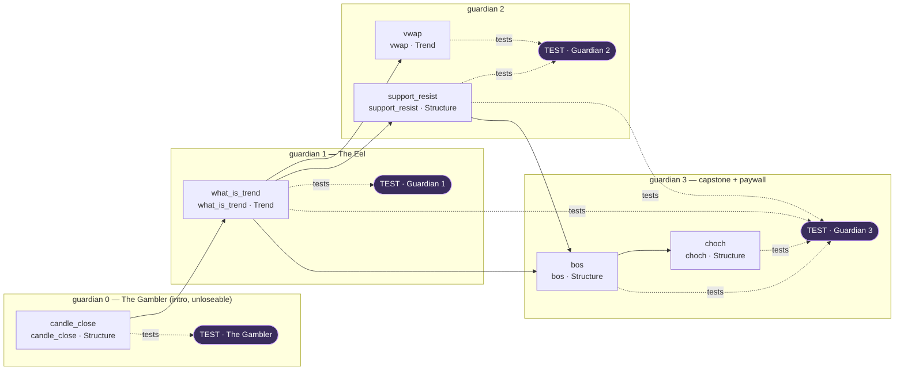

> **STATUS: RATIFIED** — ChartQuest Architecture v1.0 · Ratified 2026-07-15
> **Do not modify directly.** Part of the official ChartQuest ratified architecture. Changes require an ADR, migration notes, approval, and re-ratification — see `docs/architecture-ratified/ARCHITECTURE_CHANGE_POLICY.md`.

# ChartQuest Curriculum Graph

> **CANONICAL REFERENCE.** The single source of truth for the Lesson object is [`CHARTQUEST_LESSON_SCHEMA.json`](CHARTQUEST_LESSON_SCHEMA.json); for object ownership and the frozen decisions (D1–D8), [`CHARTQUEST_CANONICAL_OBJECT_REGISTRY.md`](CHARTQUEST_CANONICAL_OBJECT_REGISTRY.md). This document *references* those fields and rules — it does not redefine them. Where this document conflicts with the schema or the registry, **they govern.**

> **Document class:** Canonical Curriculum-Engine specification (Phase 1 — analysis + specification only; NO source or gameplay changes)
> **Path:** `docs/curriculum-engine/CHARTQUEST_CURRICULUM_GRAPH.md`
> **Date:** 2026-07-15
> **Owns (per Registry §1):** the **teach-order / dependency layer** — one roster table, one edge set. It is the machine-readable form of the `taught()` gate.
> **References (never re-declares):** the Lesson object ([`CHARTQUEST_LESSON_SCHEMA.json`](CHARTQUEST_LESSON_SCHEMA.json)), the frozen decisions D1–D8 and the four canonical example lessons ([`CHARTQUEST_CANONICAL_OBJECT_REGISTRY.md`](CHARTQUEST_CANONICAL_OBJECT_REGISTRY.md) §2–§3), the VR ids (`CHARTQUEST_VALIDATION_CONTRACTS.md`), and candle/chart geometry (`CHARTQUEST_VISUAL_MARKET_CONSTITUTION.md`).

---

## 0. Why this document exists (and how it cuts lesson-build time)

Today a "lesson" in `chart-quest.html` is not one object — it is an emergent join across **~28 parallel maps** (`LESSONS` 4515, `CURRICULUM` 4851, `CONCEPTS` 4939, `KNOWLEDGE` 5452, `SCENES` 19163, `CONCEPT_PRACTICE` 19331, `LESSON_MASTERY` 3795, `BOSS_CAST` 9650, and ~18 more). Ordering was encoded **6 times** (`CURRICULUM.focus`, `LESSON_UNLOCK`, `KNOWLEDGE.level`, `CONCEPTS.hour`, `MASTERY_CAT_LEVEL`, `LEVEL_FLOW`) and those copies **already disagreed**. There was **no single `taught(conceptKey)` gate** (`const taught = {}` @4989 is a session-only pop-up de-dupe flag). This is the exact meta-bug — *"every lesson is partially invented"* — the canonical registry + schema exist to kill.

**The Curriculum Graph is the fix at the ordering/dependency layer.** It represents the *whole game* as one machine-readable **Directed Acyclic Graph (DAG)** where:

- Every **node is one concept**, identified by its `primaryConcept` `conceptKey` (D3) and referencing the lesson that teaches it by `lessonId`. The node does **not** restate lesson fields — the full object lives once, in [`CHARTQUEST_LESSON_SCHEMA.json`](CHARTQUEST_LESSON_SCHEMA.json).
- Every **edge** is a declared knowledge dependency drawn from the lesson's own `prerequisites` / `unlocks` / `reinforces` fields (byte-identical to the schema).
- The graph is the **single source of truth for teach-order**, replacing all 6 drifting copies.
- The graph is **executable**: the `taught()` gate is "is every `prerequisites` concept of this node already taught?" (see §6).

**How this cuts build time:** to add a lesson an author authors **one Lesson object** (schema-validated) and its placement. The graph tells the author — deterministically — *what must already be taught*, *what this lesson unlocks*, and *which Guardian tests it*. The validator (`CHARTQUEST_VALIDATION_CONTRACTS.md`) proves the graph is a legal DAG before any implementation proceeds.

---

## 1. Grounding vocabulary (zero-knowledge reader onboarding)

A future AI/dev with **no** prior ChartQuest knowledge must be able to read this cold.

### 1.1 The 7 mastery categories

Every concept rolls up to exactly **one** of the seven `masteryCategory` values. The **enum is owned by the schema** (`masteryCategory`, mirrored from code `MASTERY_CATS`); a lesson only *references* it, and concept→category ownership belongs to the Concept Catalogue (D5). The seven, in canonical order, are: `Trend`, `Structure`, `Liquidity`, `OrderBlocks`, `RiskMgmt`, `TradeMgmt`, `MultiTF` (see [`CHARTQUEST_LESSON_SCHEMA.json`](CHARTQUEST_LESSON_SCHEMA.json) → `properties.masteryCategory.enum`).

> **Taxonomy law:** those 7 are the only legal categories. The 5-bucket `MG.REG.category` (line 18713) is a mini-game UI grouping, **not** a curriculum taxonomy, and is out of scope for graph edges. A node whose `masteryCategory` is off-enum fails `SCHEMA-VALID` (`CHARTQUEST_VALIDATION_CONTRACTS.md`).

### 1.2 The roster: `guardian` 0..10 (D1, D7)

Placement is a single authored field: **`guardian` (0..10)** — see [`CHARTQUEST_LESSON_SCHEMA.json`](CHARTQUEST_LESSON_SCHEMA.json) → `properties.guardian`. Per **D1**, `hour` and `unlockLevel` are **aliases equal to `guardian`**, never separately authored or DAG-derived; this document therefore uses **`guardian` only** and never a divergent `hour`. Per **D7**, `guardian: 0` is **The Gambler**, the intro/teaching boss, and `guardian == test.guardian` is permitted at 0.

| `guardian` | Guardian | First-taught category focus |
|:---:|---|---|
| 0 | **The Gambler** (intro, unloseable teaching boss — luck vs. skill) | `Structure` (wait for the close) |
| 1 | The Eel | `Structure` / `Trend` |
| 2 | *(realm 2 Guardian)* | `Trend` (incl. `vwap`) |
| 3 | *(realm 3 Guardian)* — **capstone + paywall** | `Structure` (`bos` / `choch`) |
| 4 | Order-Block Golem | `OrderBlocks`, `Liquidity` |
| 5 | *(realm 5 Guardian)* | `RiskMgmt` (incl. `risk_reward`) |
| 6 | The Oracle | `MultiTF` |
| 7 | *(realm 7 Guardian)* | `TradeMgmt` |
| 8 | *(realm 8 Guardian)* | `MultiTF` |
| 9 | *(realm 9 Guardian)* | pattern synthesis |
| 10 | **The Market Maker** | full synthesis (final) |

> **One index law (D1):** because `hour == guardian`, there is no separate 0-vs-1 offset to reconcile. A Guardian is a **TEST node** whose incoming `tests` edges are exactly the concepts it is allowed to examine (a concept is legal iff it is `taught()` at a `guardian ≤` this one — see `test.guardian` in the schema).

### 1.3 The core loop and the teach gate

Every concept flows through **LEARN → PRACTICE → APPLY → TEST** — the four **beats of a single Lesson object** (`learn`, `practice`, `apply`, `test` in [`CHARTQUEST_LESSON_SCHEMA.json`](CHARTQUEST_LESSON_SCHEMA.json)), **not** four separate nodes. One lesson = one concept (D4) carried through all four beats. Two load-bearing rules:

- **One primary concept per lesson (D4).** A node declares exactly one `primaryConcept`. This repairs the current defect where `support_resist` teaches both support and resistance with no primary flag.
- **The gate is `taught(conceptKey)` (D2),** read by lesson/trade/boss alike; its argument is a lesson's `primaryConcept`, **never a `lessonId`**. The graph **is** that check (§6).

---

## 2. What a node is (a concept, not a re-declared lesson)

**A graph node is a concept.** It is identified by its `primaryConcept` (a short snake_case `conceptKey`, D3) and points to the lesson that teaches it by `lessonId`. The node does **not** re-declare the lesson's fields — for the shape of a lesson, its beats, its assessment, its misconceptions, and every other field, see [`CHARTQUEST_LESSON_SCHEMA.json`](CHARTQUEST_LESSON_SCHEMA.json). The four canonical example lessons (including `bos`, `choch`, `vwap`) are frozen in [`CHARTQUEST_CANONICAL_OBJECT_REGISTRY.md`](CHARTQUEST_CANONICAL_OBJECT_REGISTRY.md) §3 and are the **only** legal worked values.

The graph therefore consumes **only** the lesson fields that express topology — all byte-identical to the schema:

| Field (from [`CHARTQUEST_LESSON_SCHEMA.json`](CHARTQUEST_LESSON_SCHEMA.json)) | Role in the graph |
|---|---|
| `lessonId` | Node id — the lesson that teaches this concept. |
| `primaryConcept` | The **one** concept the node represents; the key `taught()` gates on (D2, D4). |
| `masteryCategory` | Referenced (not owned — D5) for readability; authoritative in the concept catalogue. |
| `guardian` | The single authored placement (D1). `hour`/`unlockLevel` are aliases; never separately authored. |
| `prerequisites` | In-edges — concepts that must be `taught()` at a `guardian ≤` this one (VR-ORDER / VR-TAUGHT-BEFORE-TEST). |
| `unlocks` | Out-edges — concepts this lesson makes available downstream. |
| `reinforces` | Backward, spaced-repetition edges — already-taught concepts this lesson practices again (does not re-teach). |
| `test.guardian` | The Guardian that examines this concept (the `tests` edge target). |
| `validationRules` | VR **ids** only; they resolve in `CHARTQUEST_VALIDATION_CONTRACTS.md` (D6). Not listed here. |

> There is **no** separate graph field set (`incomingKnowledge`, `outgoingKnowledge`, `unlockedConcepts`, `consumedConcepts`, `testedBy`, per-node `role`, etc.). Those were a fifth divergent lesson schema; they are removed. The DAG is expressed entirely through the lesson's own `prerequisites` / `unlocks` / `reinforces` / `test.guardian` fields.

---

## 3. Edge schema

An edge is a directed dependency `from → to`. The `prerequisites` subgraph must be **acyclic**: a cycle would admit no legal teaching order and the validator halts (`VR-DAG`).

| Edge type | Direction | Semantics | Source field |
|---|---|---|---|
| `requires` | `prereqConcept → lesson` | `lesson` may not run until `prereqConcept` is `taught()`. | `prerequisites` |
| `unlocks` | `lesson → concept` | completing `lesson` makes `concept` discoverable downstream. | `unlocks` |
| `reinforces` | `laterLesson → earlierConcept` | `laterLesson` re-surfaces `earlierConcept` (spaced repetition; does NOT re-teach). | `reinforces` |
| `tests` | `guardian → concept` | the Guardian examines `concept`; legal only if `concept` is `taught()` at a `guardian ≤` this Guardian. | `test.guardian` |

> Only `requires` edges participate in the acyclicity check. `reinforces` and `tests` edges point *backward in time by construction* and are validated for *temporal legality* (`VR-TAUGHT-BEFORE-TEST`), not for cycles.

**Edge legality (full assertions in `CHARTQUEST_VALIDATION_CONTRACTS.md`):** (1) no forward `requires` — `A → B` needs `guardian(A) ≤ guardian(B)`; (2) no untaught `tests` — every `tests` target is taught at `guardian ≤` the boss's; (3) one teacher per concept (D4); (4) no orphan lessons (reachable from the intro root).

---

## 4. Worked slice — The Gambler (guardian 0) through Guardian 3

This slice is regenerated **verbatim from [`CHARTQUEST_CANONICAL_OBJECT_REGISTRY.md`](CHARTQUEST_CANONICAL_OBJECT_REGISTRY.md) §3** for every concept §3 pins: `vwap` at **guardian 2**, `bos` and `choch` at **guardian 3**, each `test.guardian` equal to its `guardian`. `guardian: 0` is The Gambler (D7). Concepts not pinned by §3 (`candle_close`, `what_is_trend`, `support_resist`) use their live snake_case keys and are placed so every `prerequisites` edge lands at a `guardian ≤` the consumer.

### 4.1 The nodes (guardian 0–3)

| `lessonId` | `primaryConcept` | `masteryCategory` | `guardian` | `prerequisites` | `unlocks` | `reinforces` | `test.guardian` |
|---|---|---|:---:|---|---|---|:---:|
| `candle_close` | `candle_close` | `Structure` | 0 | `[]` | `[]` | `[]` | 0 |
| `what_is_trend` | `what_is_trend` | `Trend` | 1 | `[candle_close]` | `[]` | `[]` | 1 |
| `support_resist` | `support_resist` | `Structure` | 2 | `[what_is_trend]` | `[]` | `[]` | 2 |
| `vwap` | `vwap` | `Trend` | 2 | `[what_is_trend]` | `[vwap_trade]` | `[what_is_trend]` | 2 |
| `bos` | `bos` | `Structure` | 3 | `[what_is_trend, support_resist]` | `[choch]` | `[candle_close]` | 3 |
| `choch` | `choch` | `Structure` | 3 | `[bos]` | `[]` | `[bos]` | 3 |

> The `vwap`, `bos`, and `choch` rows are the §3 frozen values verbatim (`guardian`, `masteryCategory`, `prerequisites`, `unlocks`, `reinforces`, `test.guardian`). For the full lesson bodies — beats, assessment, misconceptions — read those objects in [`CHARTQUEST_CANONICAL_OBJECT_REGISTRY.md`](CHARTQUEST_CANONICAL_OBJECT_REGISTRY.md) §3; they are **not** restated here.

### 4.2 Mermaid diagram



Solid arrows are *"must be taught before"* (the `prerequisites` DAG). Dotted `tests` arrows are *"this Guardian may examine this concept"*: Guardian 3 legally re-tests `what_is_trend` (guardian 1) and `support_resist` (guardian 2) because both are taught at a `guardian ≤ 3`. No dotted arrow points to a concept taught **after** the Guardian; that would fail `VR-TAUGHT-BEFORE-TEST`.

### 4.3 Machine-readable JSON

The executable form. A validator loads this, checks the `prerequisites` subgraph is a legal DAG and every `tests` edge is temporally legal, and only then may implementation proceed. Every node references its lesson by `lessonId`; full lesson bodies live in [`CHARTQUEST_LESSON_SCHEMA.json`](CHARTQUEST_LESSON_SCHEMA.json) / [`CHARTQUEST_CANONICAL_OBJECT_REGISTRY.md`](CHARTQUEST_CANONICAL_OBJECT_REGISTRY.md) §3. Field names are byte-identical to the schema.

```json
{
  "$schema": "chartquest.curriculum.graph/v1",
  "format": "DAG json",
  "note": "Nodes are concepts; every field is referenced from CHARTQUEST_LESSON_SCHEMA.json. hour == guardian (D1); guardian 0 = The Gambler (D7).",
  "masteryCategories": "see CHARTQUEST_LESSON_SCHEMA.json -> properties.masteryCategory.enum",
  "guardians": [
    { "guardian": 0, "name": "The Gambler", "unloseable": true },
    { "guardian": 1, "name": "The Eel" },
    { "guardian": 2, "name": "Realm 2 Guardian" },
    { "guardian": 3, "name": "Realm 3 Guardian", "capstone": true, "paywall": true }
  ],
  "nodes": [
    {
      "lessonId": "candle_close", "primaryConcept": "candle_close", "masteryCategory": "Structure",
      "guardian": 0, "prerequisites": [], "unlocks": [], "reinforces": [], "test": { "guardian": 0 }
    },
    {
      "lessonId": "what_is_trend", "primaryConcept": "what_is_trend", "masteryCategory": "Trend",
      "guardian": 1, "prerequisites": ["candle_close"], "unlocks": [], "reinforces": [], "test": { "guardian": 1 }
    },
    {
      "lessonId": "support_resist", "primaryConcept": "support_resist", "masteryCategory": "Structure",
      "guardian": 2, "prerequisites": ["what_is_trend"], "unlocks": [], "reinforces": [], "test": { "guardian": 2 }
    },
    {
      "lessonId": "vwap", "primaryConcept": "vwap", "masteryCategory": "Trend",
      "guardian": 2, "prerequisites": ["what_is_trend"], "unlocks": ["vwap_trade"], "reinforces": ["what_is_trend"], "test": { "guardian": 2 }
    },
    {
      "lessonId": "bos", "primaryConcept": "bos", "masteryCategory": "Structure",
      "guardian": 3, "prerequisites": ["what_is_trend", "support_resist"], "unlocks": ["choch"], "reinforces": ["candle_close"], "test": { "guardian": 3 }
    },
    {
      "lessonId": "choch", "primaryConcept": "choch", "masteryCategory": "Structure",
      "guardian": 3, "prerequisites": ["bos"], "unlocks": [], "reinforces": ["bos"], "test": { "guardian": 3 }
    }
  ],
  "edges": [
    { "type": "requires", "from": "candle_close", "to": "what_is_trend" },
    { "type": "requires", "from": "what_is_trend", "to": "support_resist" },
    { "type": "requires", "from": "what_is_trend", "to": "vwap" },
    { "type": "requires", "from": "what_is_trend", "to": "bos" },
    { "type": "requires", "from": "support_resist", "to": "bos" },
    { "type": "requires", "from": "bos", "to": "choch" },
    { "type": "tests", "from": "candle_close", "to": 0 },
    { "type": "tests", "from": "what_is_trend", "to": 1 },
    { "type": "tests", "from": "support_resist", "to": 2 },
    { "type": "tests", "from": "vwap", "to": 2 },
    { "type": "tests", "from": "bos", "to": 3 },
    { "type": "tests", "from": "choch", "to": 3 },
    { "type": "tests", "from": "what_is_trend", "to": 3 },
    { "type": "tests", "from": "support_resist", "to": 3 }
  ]
}
```

---

## 5. How the graph replaces the drifting maps (traceability)

One authored Lesson object subsumes the many hand-synced structures, so authoring becomes a single declaration.

| Legacy structure (current-state, with line) | Replaced by | Consistency now guaranteed by |
|---|---|---|
| `CURRICULUM.focus` (4851), `LESSON_UNLOCK` (5401), `KNOWLEDGE.level` (5452), `CONCEPTS.hour` (4939), `MASTERY_CAT_LEVEL` (3792) | `guardian` (single authored placement; `hour`/`unlockLevel` are aliases — D1) | `VR-ORDER` |
| `GAME_MASTERY` (3794), `LESSON_MASTERY` (3795), `CONFLUENCE_CONFIG.mastery` (3718) | `masteryCategory` (one of 7, owned by the concept catalogue — D5) | `SCHEMA-VALID` |
| `LESSON_TO_CONCEPTS` (5504), `CONCEPTS.lesson` (4939) | `primaryConcept` / `unlocks` | `VR-SINGLE-PRIMARY` |
| `LESSON_PRACTICE` (5059), `LEVEL_FLOW.practice` (5066) | `practice` beat + `reinforces` edges | (see `CHARTQUEST_VALIDATION_CONTRACTS.md`) |
| `BOSS_CAST.rounds` (9650) taught↔tested prose audit | `tests` edges + `test.guardian` | `VR-TAUGHT-BEFORE-TEST` |
| `taught` (4989), `conceptDiscovered` (5516), `conceptTier` (4966) — rival "is it known" checks | one `taught(conceptKey)` predicate (§6) | (see `CHARTQUEST_VALIDATION_CONTRACTS.md`) |

---

## 6. The `taught()` gate as a graph query

The gate the design docs claim exists but the code lacks, defined precisely as a graph predicate. It gates on `primaryConcept`, never a `lessonId` (D2). This is the single check lesson/trade/boss all read.

```
taught(conceptKey) :=
    ∃ lesson L in graph  such that
        L.primaryConcept == conceptKey
        ∧ completed(L.learn)                 // player finished L's LEARN beat
```

Derived gates, all over the same graph (so they can never disagree again):

- **May this lesson's PRACTICE/APPLY beat run?** `∀ c ∈ L.prerequisites : taught(c)`.
- **May a Guardian examine concept c (a `tests` edge)?** `taught(c) ∧ guardian(teacherOf(c)) ≤ this Guardian` — *"never test the untaught"* made executable (`test.guardian` legality).
- **May the player summon Guardian G?** its `tests` edges are all satisfied **and** the ≥3-trades-before-boss quantity gate is met (design law; `practice.minTrades ≥ 3`).

> Because every "is it known / unlocked / tested-legally" question is now one query over one declared graph — with every field owned by [`CHARTQUEST_LESSON_SCHEMA.json`](CHARTQUEST_LESSON_SCHEMA.json) — an author who adds a lesson cannot silently create a contradiction. The validator recomputes all answers and halts on any illegal edge *before* a line of `chart-quest.html` is touched.

---

## 7. Authoring checklist (what a zero-knowledge author does)

To add a lesson, author **one Lesson object** (validated against [`CHARTQUEST_LESSON_SCHEMA.json`](CHARTQUEST_LESSON_SCHEMA.json)) and let the graph derive the rest:

1. Choose a unique `lessonId`.
2. Pick the **one** `primaryConcept` (D4 — never two), a short snake_case key (D3).
3. Pick its `masteryCategory` from the 7-value enum (never the 5-bucket mini-game taxonomy).
4. Set `guardian` (the single authored placement — D1; `hour`/`unlockLevel` follow automatically).
5. List `prerequisites` — the validator rejects any concept not `taught()` at a `guardian ≤` this one.
6. Declare `unlocks` / `reinforces`.
7. Set `test.guardian` to the Guardian that examines it (the `tests` edge).
8. List the `validationRules` **ids** (they resolve in `CHARTQUEST_VALIDATION_CONTRACTS.md` — D6).
9. Run the **Validation Pipeline** (`CHARTQUEST_VALIDATION_CONTRACTS.md`). If any blocking rule fails, **implementation stops** — fix the lesson object, not the code.

At no point does the author hand-edit `LESSONS`, `CURRICULUM`, `LESSON_UNLOCK`, `KNOWLEDGE`, `GAME_MASTERY`, or the other ~20 maps. That reduction is the build-time win; the DAG legality check is the rise in educational consistency.
