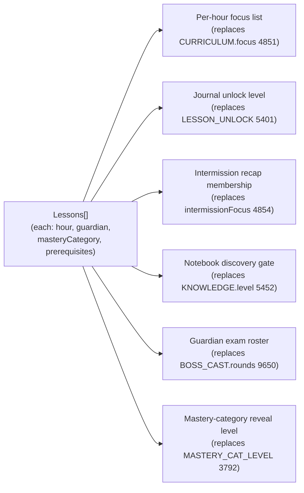
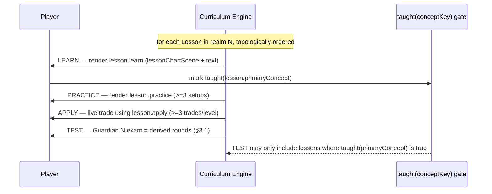
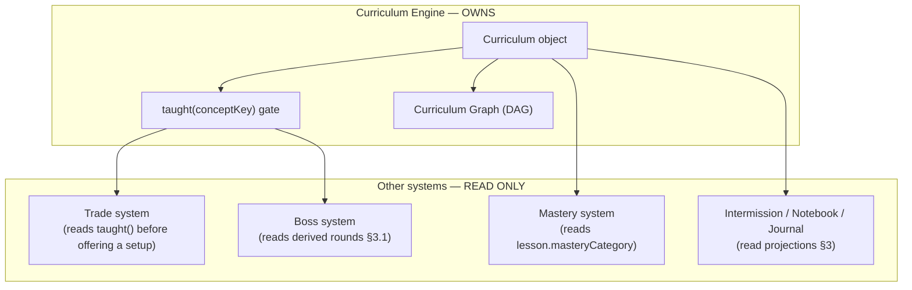
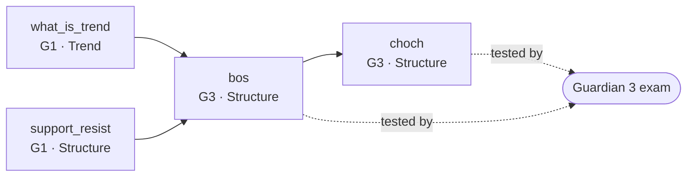
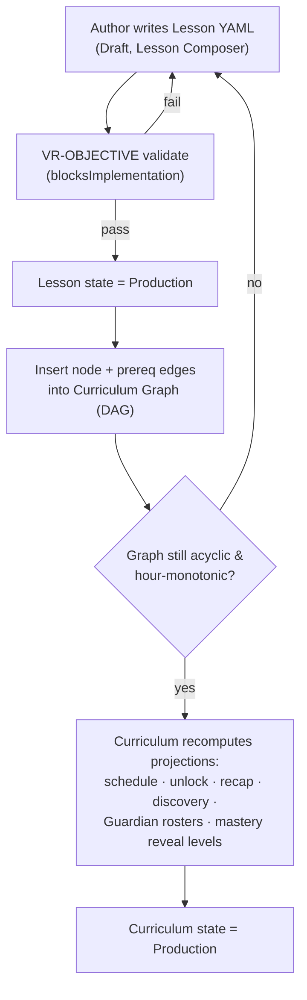

> **STATUS: RATIFIED** — ChartQuest Architecture v1.0 · Ratified 2026-07-15
> **Do not modify directly.** Part of the official ChartQuest ratified architecture. Changes require an ADR, migration notes, approval, and re-ratification — see `docs/architecture-ratified/ARCHITECTURE_CHANGE_POLICY.md`.

# ChartQuest Curriculum Engine — Curriculum Object Model

> **CANONICAL REFERENCE.** The single source of truth for the Lesson object is [`CHARTQUEST_LESSON_SCHEMA.json`](CHARTQUEST_LESSON_SCHEMA.json); for object ownership and the frozen decisions (D1–D8), [`CHARTQUEST_CANONICAL_OBJECT_REGISTRY.md`](CHARTQUEST_CANONICAL_OBJECT_REGISTRY.md). This document *references* those fields and rules — it does not redefine them. Where this document conflicts with the schema or the registry, **they govern.**

> **Document class:** Ratified object-model specification (Curriculum Engine Phase 1)
> **Status:** Canonical. Defines the whole-game `Curriculum` object that contains and orders every `Lesson`.
> **Date:** 2026-07-15
> **Applies to:** `chart-quest.html` (source of truth) and `index.html` (byte-mirror).
> **Read first:** the **Lesson schema** ([`CHARTQUEST_LESSON_SCHEMA.json`](CHARTQUEST_LESSON_SCHEMA.json), the SoT for lesson shape) and its human companion *ChartQuest Lesson Object Model* (`CHARTQUEST_LESSON_OBJECT_MODEL.md`). This document composes the `Lesson` object those define; it never re-declares a lesson field.
> **Roster / ordering SoT:** the Guardian roster and the one edge set live in [`CHARTQUEST_CURRICULUM_GRAPH.md`](CHARTQUEST_CURRICULUM_GRAPH.md). This document references node/edge ids from there; it does not maintain a parallel roster.
> **Governing authorities (obey, do not restate):** the Registry and Lesson schema (field names, frozen decisions D1–D8); `CHARTQUEST_CURRICULUM_GRAPH.md` (roster + edges); `CHARTQUEST_VALIDATION_CONTRACTS.md` (the sole `VR-*` registry); Visual Market Constitution (candle/chart visuals); Trading Experience System v1.1 + `docs/canon/trading_canon.md` (trade truth).
>
> **Phase 1 constraint:** No source-code or gameplay changes. Specification only.

---

## 0. The one-sentence law of this document

> **There is exactly one `Curriculum` object for the whole game.** It contains every `Lesson`, assigns each to one of the **10 Guardians + the Market Maker**, files each under one of the **7 mastery categories**, and orders them into a single directed acyclic **Curriculum Graph**. Ordering, gating, and boss-exam membership are *derived from* this object — never hand-maintained in a parallel table.

If the *Lesson Object Model* answers *"what is one lesson?"*, this document answers *"what is the whole course, and how do lessons compose into it?"*

---

## 1. Why this object exists

The current codebase expresses "the whole course" **six times over**, in structures that already disagree:

| "What the course is / what a level teaches" | Structure | Line |
|---|---|---|
| Ordered 10-hour syllabus | `CURRICULUM` (`focus[]` / `intermissionFocus[]`) | 4851 |
| Concept→hour/boss table | `CONCEPTS` | 4939 |
| Lesson→unlock level | `LESSON_UNLOCK` | 5401 |
| Concept→discovery level | `KNOWLEDGE.level` | 5452 |
| Category→unlock level | `MASTERY_CAT_LEVEL` | 3792 |
| L2/L3 in-level beat order | `LEVEL_FLOW` | 5066 |

These have **drifted**: `trendlines` is hour 9 in `CURRICULUM`/`KNOWLEDGE` but level 7 in `LESSON_UNLOCK`; `leverage_intro` and `risk_reward` are hour-7 focus but `LESSON_UNLOCK` 8. A zero-knowledge author *cannot tell which governs* — the exact failure this object removes. Worse, sequencing is implemented by **three unrelated engines** (`teach()` + `CURRICULUM.focus` throttle for most hours, `LEVEL_FLOW` + `levelFlowBeat()` for hours 2–3, the `introFlow` phase machine for hour 0), with **hours 4–10 having no scripted LEARN→PRACTICE engine at all** — so the pedagogy is not uniform across the ladder.

The `Curriculum` object replaces all six with **one ordered graph** from which every schedule, unlock, recap-membership, and boss roster is *computed*.

---

## 2. The `Curriculum` object — structure

The `Curriculum` is a container plus a graph. Its normative shape:

| Field | Type | Req? | Meaning | Replaces |
|---|---|---|---|---|
| `curriculumId` | `string` | required | canonical id of the whole course | *new — the course had no id* |
| `masteryCategories` | `enum[7]` | required | the 7 skill buckets (fixed) | `MASTERY_CATS` 3788 |
| `guardians` | `Guardian[11]` | required | realms 0–9 + Market Maker (realm 10) | `BOSS_CAST` 9650, `BOSSES` 9319 |
| `lessons` | `Lesson[]` | required | every lesson, keyed by `lessonId` | `LESSONS`+`LESSON_LIBRARY`+… |
| `graph` | `CurriculumGraph` | required | the DAG of lesson dependencies (§5) | `LEVEL_FLOW`, `CURRICULUM` ordering |
| `state` | `enum` | required | `Draft` \| `Production` (Spine `stateMachines`) | *new — was implicit* |

### 2.1 The 7 mastery categories (fixed vocabulary)

The 7 categories are the `masteryCategory` enum in [`CHARTQUEST_LESSON_SCHEMA.json`](CHARTQUEST_LESSON_SCHEMA.json) (`Trend`, `Structure`, `Liquidity`, `OrderBlocks`, `RiskMgmt`, `TradeMgmt`, `MultiTF`) — referenced here, owned there. Concept-to-category assignment is owned by the Concept Catalogue (D5). This is the **single** taxonomy; the parallel 5-bucket `MG.REG.category` (Structure/Levels/Risk/Execution/Patterns, 18713) is abolished.

### 2.2 The Guardian roster (course spine) — referenced, not restated

**The Guardian roster is owned by [`CHARTQUEST_CURRICULUM_GRAPH.md`](CHARTQUEST_CURRICULUM_GRAPH.md)** (Registry §1: "Curriculum Graph / Guardian roster"). That document holds the one roster table (realm → name → mastery focus) and the one edge set. This object does **not** copy it; it only states how the `Curriculum` *uses* it.

What this object relies on from the roster SoT:

- Placement is a single `guardian` integer, **0..10** (schema `guardian`, frozen decision **D1**). Per **D7**, `guardian: 0` = **The Gambler**, the intro/teaching boss (fought before hour 1); `1..9` = the Guardians; `10` = the Market Maker (finale).
- Per **D1**, `hour` and `unlockLevel` are **aliases equal to `guardian`** — never authored or derived separately. There is no independent "hour N ↔ Guardian N" mapping to maintain here; the coordinate is `guardian` and everything else reads it.

A `Guardian` sub-object references the roster row and derives its exam:

```json
{ "realm": 3, "name": "…", "weak": ["Structure", "Trend"], "rounds": "<derived>" }
```

`weak[]` comes from the roster SoT. `rounds` is **derived, not authored** (§4): the set of `Lesson.test` entries whose `test.guardian` equals this realm.

---

## 3. How the `Curriculum` contains and orders lessons

A `Lesson` (see [`CHARTQUEST_LESSON_SCHEMA.json`](CHARTQUEST_LESSON_SCHEMA.json)) carries the placement fields the `Curriculum` reads — referenced by name, defined in the schema:

- `guardian` (0–10) — the **one authored** placement coordinate (D1); which realm's exam tests it. `hour` and `unlockLevel` are aliases equal to it and are never stored separately (D1), so this single coordinate replaces the six drifting maps of §1.
- `prerequisites` — the incoming `conceptKey`s that build the graph edges (§5).

From `guardian` + `prerequisites`, the `Curriculum` **computes** every view the old structures hand-maintained:



**Rule:** these are **projections**. An author never edits `CURRICULUM.focus` and `LESSON_UNLOCK` separately; both are read off `lesson.guardian`. Drift becomes impossible because there is one source coordinate.

### 3.1 Deriving a Guardian's exam (never test the untaught)

A Guardian's exam is computed, not hand-listed. It reads the lesson's `test` object (schema `test`: `bossRoundId`, `mgId`, `guardian`):

```
rounds(guardian G) = [ lesson.test
                       for lesson in curriculum.lessons
                       if lesson.test.guardian == G
                       and lesson.status == 'production'
                       and lesson.guardian <= G ]
```

This makes **"never test the untaught"** structural: a boss round can only reference a `Lesson` that exists and is taught at or before that realm (enforced by `VR-TAUGHT-BEFORE-TEST`, resolved in [`CHARTQUEST_VALIDATION_CONTRACTS.md`](CHARTQUEST_VALIDATION_CONTRACTS.md)). It replaces the hand-curated `BOSS_CAST.rounds` and its prose audit comments (`/* MASTERY AUDIT v224 */`, 9663/9672/9681) with a computed, validated roster.

### 3.2 The LEARN→PRACTICE→APPLY→TEST loop, uniform across all hours

The design core loop is **LEARN → PRACTICE → APPLY → TEST**. Today only hours 0–3 have a scripted engine; hours 4–10 fall back to bare text cards. The `Curriculum` object makes the loop **uniform** by generating each hour's beat sequence from the graph:



- The gate argument is a lesson's `primaryConcept` (a `conceptKey`), **never a `lessonId`** (frozen decision **D2**).
- The **≥3 trades per level before boss** gate (schema `practice.minTrades` ≥ 3) and the "never test the untaught" law are read off the single `taught(conceptKey)` gate the Curriculum Engine owns.
- Because every realm derives its beats from the same graph, guardians 4–10 gain the same LEARN→PRACTICE structure guardians 0–3 have today — the pedagogy stops being non-uniform.

---

## 4. Ownership: what the Curriculum Engine owns

Per the Spine `ownershipMatrix`, the **Curriculum Engine owns the `taught()` gate.** In the object model that means:

- The `Curriculum` object is the **sole owner** of lesson ordering, guardian assignment, unlock levels, recap membership, discovery gates, and boss rosters — all *derived* from `Lesson` placement fields.
- The single `taught(conceptKey)` predicate (D2) — read by the lesson, trade, and boss systems alike — replaces the four independent unlock predicates in current code (`taught[]` 4989, `conceptDiscovered()` 5516, `conceptTier()` 4966, `masteryCatLearned()` 3793). Concept identity itself (`conceptKey → masteryCategory`) is owned by the Concept Catalogue, **not** here (D5); the `Curriculum` only references keys.

**Ownership boundary diagram:**



---

## 5. The Curriculum Graph

The graph format is **`DAG json`** — a directed **acyclic** graph serialized as JSON. Nodes are `Lesson`s (by `lessonId`); edges are `prerequisites` (`conceptKey`s). The one authoritative node/edge set lives in the roster SoT [`CHARTQUEST_CURRICULUM_GRAPH.md`](CHARTQUEST_CURRICULUM_GRAPH.md); the snippets below are illustrative and copy their values from Registry §3.

### 5.1 Graph rules

- **Nodes:** one per `Lesson`. Node payload is the `lessonId` plus its placement fields (`guardian`, `masteryCategory`). Per **D1**, `guardian` is the sole coordinate — there is no separate `hour` axis.
- **Edges:** `A → B` means "A is a prerequisite of B" (B lists A's `conceptKey` in `prerequisites`). An edge may only point **backward in placement** (`guardian(A) ≤ guardian(B)`) — a lesson cannot depend on one taught later (`VR-ORDER`).
- **Acyclic:** cycles are forbidden (DAG). The validator rejects any cycle.
- **Topological order = teach order.** The per-realm LEARN sequence (§3.2) is a topological sort of the subgraph for that realm.

### 5.2 Graph JSON (illustrative — values per Registry §3)

```json
{
  "format": "DAG json",
  "nodes": [
    { "lessonId": "what_is_trend",  "guardian": 1, "masteryCategory": "Trend" },
    { "lessonId": "support_resist", "guardian": 1, "masteryCategory": "Structure" },
    { "lessonId": "bos",            "guardian": 3, "masteryCategory": "Structure" },
    { "lessonId": "choch",          "guardian": 3, "masteryCategory": "Structure" }
  ],
  "edges": [
    { "from": "what_is_trend",  "to": "bos" },
    { "from": "support_resist", "to": "bos" },
    { "from": "bos",            "to": "choch" }
  ]
}
```

(`bos` prerequisites `[what_is_trend, support_resist]`, `choch` prerequisites `[bos]`, both `guardian: 3` — copied verbatim from Registry §3.)

### 5.3 Graph shape (illustrative subgraph)



The graph is the **whole-game curriculum object's backbone**: every schedule and exam roster is a query over it.

---

## 6. The Lesson Lifecycle state machine

The authoritative lesson `status` enum is the schema's — `draft`, `in_review`, `validated`, `production`, `deprecated`, `retired` (see [`CHARTQUEST_LESSON_SCHEMA.json`](CHARTQUEST_LESSON_SCHEMA.json) `status`); the transitions between them are owned by [`CHARTQUEST_AUTHORING_PIPELINE.md`](CHARTQUEST_AUTHORING_PIPELINE.md), not restated here. For the `Curriculum`'s purpose only **one distinction matters**: a lesson is either eligible for the derived projections (`status: production`) or not. The diagram below is that projection-eligibility view — `draft` stands for any pre-`production` state. A lesson is promoted to `production` only after validation (`VR-OBJECTIVE`, resolved in [`CHARTQUEST_VALIDATION_CONTRACTS.md`](CHARTQUEST_VALIDATION_CONTRACTS.md)).

```mermaid
stateDiagram-v2
    [*] --> Draft: Lesson Composer authors YAML<br/>(authoringPipelineStages[0])
    Draft --> Draft: edit fields / fix VR-OBJECTIVE blockers
    Draft --> Production: VR-OBJECTIVE passes<br/>(all references resolve,<br/>one primary concept,<br/>hour/guardian consistent,<br/>never-test-the-untaught holds)
    Production --> Draft: reopened for revision<br/>(demoted; exam roster excludes it)
    Production --> [*]: retired from curriculum
    note right of Draft
      state: "Draft"
      Not eligible to gate a Guardian.
      Excluded from derived exam rosters (§3.1).
    end note
    note right of Production
      state: "Production"
      Eligible: appears in schedule,
      unlock, recap, discovery, and
      boss-roster projections (§3).
    end note
```



**Transition guard:** `Draft → Production` is gated by `VR-OBJECTIVE` (Spine `validationRules`, `blocksImplementation: true`). A lesson that fails validation **cannot** be promoted — the transition is blocked, not warned. This is the state-machine expression of the completeness contract in Lesson Object Model §6.

---

## 7. The Curriculum lifecycle (whole-course assembly)



Adding a lesson is a **local** act — write one object, validate, insert into the graph — and every downstream schedule/exam updates automatically. Contrast the current "edit ~9+ disjoint maps, keep six ordering tables in manual sync, hope nothing drifted" workflow.

---

## 8. Worked composition example — Guardian 3

The two canonical Structure lessons `bos` and `choch` (full objects: **Registry §3**, the only version of reality) compose into Guardian 3's realm and exam purely by their placement fields. The relevant fields, copied verbatim from Registry §3:

```
bos   : guardian 3, masteryCategory Structure, prerequisites [what_is_trend, support_resist],
        test { bossRoundId "bos",   mgId "bos",   guardian 3 }, status production
choch : guardian 3, masteryCategory Structure, prerequisites [bos],
        test { bossRoundId "choch", mgId "choch", guardian 3 }, status production
```

**Derived automatically:**
- **Guardian-3 LEARN order** = topological sort → `bos` then `choch` (choch prerequisites bos).
- **Guardian 3 exam roster** (§3.1) = `[bos.test, choch.test]` (both `test.guardian == 3`).
- **Journal unlock / Notebook discovery** for both = level 3 (from `guardian`; `unlockLevel` is its alias, D1).
- **Intermission recap membership** for realm 3 = `{bos, choch}` (from `guardian`).
- **Mastery credit** = both credit `Structure` (from `masteryCategory`, referenced from the Concept Catalogue, D5).

No `CURRICULUM.focus`, `LESSON_UNLOCK`, `KNOWLEDGE.level`, `IM_LESSONS`, `BOSS_CAST.rounds`, or `LEVEL_FLOW` edit is required or permitted — they are outputs, not inputs.

---

## 9. What this object supersedes (traceability)

| Structure | Line | Superseded by |
|---|---|---|
| `CURRICULUM` (`focus`/`intermissionFocus`/ordering) | 4851 | `lessons[].guardian` + Curriculum Graph |
| `CONCEPTS` (hour/boss table) | 4939 | `lessons[].guardian` |
| `LESSON_UNLOCK` | 5401 | `lessons[].guardian` (`unlockLevel` alias, D1) |
| `KNOWLEDGE.level` | 5452 | `lessons[].guardian` |
| `MASTERY_CAT_LEVEL` | 3792 | derived from `guardian` of category's first lesson |
| `LEVEL_FLOW` | 5066 | topological order of the Graph subgraph per realm |
| `BOSS_CAST` / `BOSSES` / `BOSS_GAMES` rosters | 9650 / 9319 / 9633 | derived Guardian rosters (§3.1); roster SoT `CHARTQUEST_CURRICULUM_GRAPH.md` |
| `MG.REG.category` (5-bucket) | 18713 | `masteryCategory` (the 7-enum, schema) |
| four "is it known?" predicates | 4989/5516/4966/3793 | single `taught(conceptKey)` gate (D2) |

---

## 10. How this cuts build time and raises consistency

- **Build time:** the six drifting ordering tables and three separate sequencing engines collapse to one graph query. Scheduling a new realm, or fixing Guardian 4's pedagogy, is now a defined pattern (insert nodes, set `guardian`/`prerequisites`), not an undocumented choice between `LEVEL_FLOW`, `introFlow`, and bare `teach()`.
- **Educational consistency:** because ordering, unlock, recap, discovery, and boss membership are all projections of one `guardian` + `prerequisites` pair (D1: `hour`/`unlockLevel` are aliases of `guardian`), they **cannot drift** — the `trendlines`/`leverage_intro`/`risk_reward` disagreements are structurally impossible. The LEARN→PRACTICE→APPLY→TEST loop and the "never test the untaught" and "≥3 trades before boss" laws are enforced uniformly across all realms by the single `taught(conceptKey)` gate (D2) the Curriculum Engine owns.

**The single question this object answers:** *"For the whole game, where is the one place the course's shape and order live?"* — the **`Curriculum` object and its Graph.**
