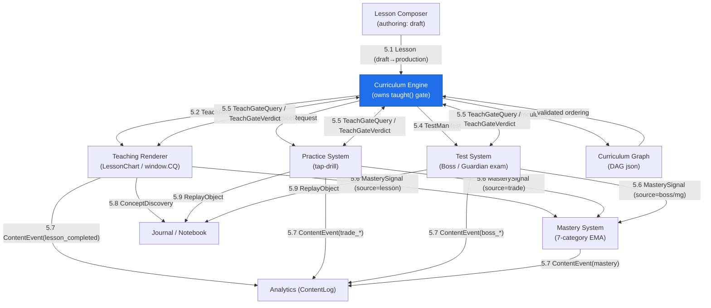
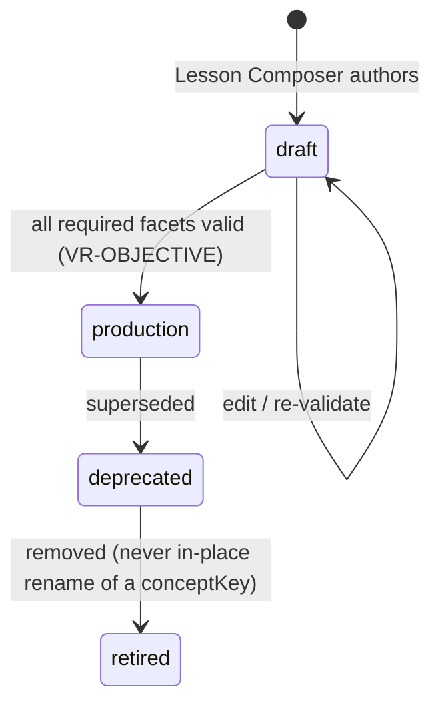

> **STATUS: RATIFIED** — ChartQuest Architecture v1.0 · Ratified 2026-07-15
> **Do not modify directly.** Part of the official ChartQuest ratified architecture. Changes require an ADR, migration notes, approval, and re-ratification — see `docs/architecture-ratified/ARCHITECTURE_CHANGE_POLICY.md`.

# ChartQuest Curriculum Engine — Data Contracts

> **CANONICAL REFERENCE.** The single source of truth for the Lesson object is [`CHARTQUEST_LESSON_SCHEMA.json`](CHARTQUEST_LESSON_SCHEMA.json); for object ownership and the frozen decisions (D1–D8), [`CHARTQUEST_CANONICAL_OBJECT_REGISTRY.md`](CHARTQUEST_CANONICAL_OBJECT_REGISTRY.md). This document *references* those fields and rules — it does not redefine them. Where this document conflicts with the schema or the registry, **they govern.**

> **Document class:** Canonical / ratified specification
> **Suite:** ChartQuest Curriculum Engine (Phase 1 — specification only)
> **Path:** `docs/curriculum-engine/CHARTQUEST_DATA_CONTRACTS.md`
> **Date:** 2026-07-15
> **Status:** AUTHORITATIVE for every system-to-system data exchange in the Curriculum Engine.
> **Phase-1 constraint:** This document changes **no** source code and **no** gameplay. It specifies the target-state contracts that a future implementation and a zero-knowledge lesson-author must obey.

---

## 0. Purpose, in one paragraph

Today a "lesson" in `chart-quest.html` is an emergent join across ~28 disjoint tables (`LESSONS` 4515, `SCENES` 19163, `IM_LESSONS` 5729, `CONCEPT_PRACTICE` 19331, `KNOWLEDGE` 5452, `CONCEPTS` 4939, `LESSON_MASTERY` 3795, `GAME_MASTERY` 3794, `MG.REG` 18713, …). No object owns a lesson end-to-end; every system re-derives the lesson's identity, prose, category, and ordering from a *different* key namespace, and the maps already disagree with each other (`LESSON_UNLOCK` vs `CURRICULUM` on `trendlines`; `GAME_MASTERY` vs `MG.REG.category` on `support`/`trend`). **This document kills that class of bug by declaring exactly one wire format for every exchange between systems, with byte-identical field names and machine-checkable payloads.** When two systems disagree it is now a contract violation caught by [Validation Contracts](./CHARTQUEST_VALIDATION_CONTRACTS.md), not a silent divergence discovered on a player's device.

**The Lesson object is not defined here.** It is defined once, in [`CHARTQUEST_LESSON_SCHEMA.json`](CHARTQUEST_LESSON_SCHEMA.json) (`$id: https://chartquest.dev/schema/lesson/1.0.0`). Every contract below is a **pure projection** of that one object into the teaching, practice, apply, test, mastery, journal, and analytics systems. There is no second place to author a lesson, no second field table, no second concept→category opinion, no second ordering table. This document specifies only the **inter-system I/O envelopes** that carry projected lesson fields across a boundary — it carries lesson field *names* verbatim from the schema and never re-declares them.

---

## 1. Authority & citation chain

This document is subordinate to the two canonical artifacts named in the banner. Every field it carries is a field of [`CHARTQUEST_LESSON_SCHEMA.json`](CHARTQUEST_LESSON_SCHEMA.json), cited by name. Inventing a divergent schema is the **exact meta-bug this suite exists to eliminate** — so nothing here is invented; it is derived.

| Canonical artifact | Role in this document |
|---|---|
| [`CHARTQUEST_LESSON_SCHEMA.json`](CHARTQUEST_LESSON_SCHEMA.json) | The one Lesson object. Every contract payload below carries a subset of its fields, spelled byte-identically. This document never re-declares a lesson field. |
| [`CHARTQUEST_CANONICAL_OBJECT_REGISTRY.md`](CHARTQUEST_CANONICAL_OBJECT_REGISTRY.md) | Object ownership + Frozen Decisions **D1–D8**. The registry's §3 holds the **only** canonical example lessons; every example below is copied from there. |

**Frozen Decisions this document obeys (see registry §2):**

- **D1** — `guardian` (0..10) is the **one authored placement**. `hour` and `unlockLevel` are aliases equal to `guardian`; contracts carry `guardian`, never a separately-authored `hour`/`boss`.
- **D2** — the gate is `taught(conceptKey)`, argument is a lesson's `primaryConcept`, never a `lessonId` (§5.5).
- **D3** — every `conceptKey`/`primaryConcept` is a **short snake_case** key matching live code (`bos`, `choch`, `vwap`, `risk_reward`, `what_is_sl`, `support_resist`, …). No invented long forms.
- **D4** — a lesson teaches exactly **one** `primaryConcept`.
- **D5** — concept identity and `concept → masteryCategory` are owned by the Concept Catalogue (Pattern Library); a contract only **references** a `conceptKey`.
- **D6** — `validationRules` are `VR-*` ids resolving in [`CHARTQUEST_VALIDATION_CONTRACTS.md`](./CHARTQUEST_VALIDATION_CONTRACTS.md), the sole registry.
- **D8** — **no** SemVer envelopes, content-hashing, or tri-format (JSON+YAML+MD) duplication of the lesson object. This is a single-file, harness-less game; ceremony that does not accelerate shipping is removed.

**Sibling documents referenced (do not duplicate their content here):**

- [`CHARTQUEST_SYSTEM_INTERFACES.md`](./CHARTQUEST_SYSTEM_INTERFACES.md) — the *behavioral* interface (function signatures, call order). This document is the *data* half of the same boundaries.
- [`CHARTQUEST_VALIDATION_CONTRACTS.md`](./CHARTQUEST_VALIDATION_CONTRACTS.md) — the sole `VR-*` registry (D6); the executable rules that enforce the validation cited by every contract here.
- [`CHARTQUEST_CURRICULUM_GRAPH.md`](./CHARTQUEST_CURRICULUM_GRAPH.md) — the ordering DAG whose node/edge contract is specified in §5.10.
- [`CHARTQUEST_VISUAL_MARKET_CONSTITUTION.md`](../../CHARTQUEST_VISUAL_MARKET_CONSTITUTION.md) — governs all candle/chart **visuals**; the `CandleArray` payload in §5.2/§5.3/§5.9 is **its** shape, not a new one.
- [`docs/canon/trading_canon.md`](../canon/trading_canon.md) — governs trade **truth**; the `apply` beat and `ReplayObject` carry trade causality defined there.

> **Naming law (global):** A lesson field appears **byte-identical** to [`CHARTQUEST_LESSON_SCHEMA.json`](CHARTQUEST_LESSON_SCHEMA.json) in every contract that carries it. `masteryCategory` is never also spelled `mastery`, `cat`, or `category`. `primaryConcept` is never also `concept` mismatched from a lesson's own key, `conceptKey`, or `lesson`. Divergence is a `VR-NAMING` violation.

---

## 2. The five namespaces, unified (the root cause, named)

Every current-state bug traces to five overlapping-but-nonidentical string namespaces bridged by ad-hoc inline remaps (`showConcept`'s `{trend:'trendline', mtf:'htf'}` at 19497; `_LTITLES` at 19472). The contracts below **collapse them to one** canonical id space and make every cross-namespace hop an explicit, validated field — never an inline literal.

| Legacy namespace | Example keys (current) | Legacy home | Replaced by canonical field |
|---|---|---|---|
| lesson key | `bos`, `candles_intro`, `what_is_sl` | `LESSONS` 4515 | `lessonId` |
| concept id | `sr`, `patterns`, `risk` | `CONCEPTS` 4939 | `primaryConcept` (a short snake_case `conceptKey`, D3) |
| knowledge key | `support`, `resistance`, `rr` | `KNOWLEDGE` 5452 | `conceptKey` (same space; §5.8) |
| mini-game id | `bos`, `choch`, `exec` | `MG.REG` 18713 | `test.mgId` |
| scene key | `uptrend`, `wait_close` | `SCENES` 19163 | `learn.lessonChartScene` |
| practice key | `greenred`, `brokencandle` | `CONCEPT_PRACTICE` 19331 | `practice.setups[]` |

**Contract rule NS-1:** A `conceptKey` is the single canonical identity of a concept (D3, D5). Lesson keys, mini-game ids, scene ids, and setup ids are **local artifact ids** that each resolve to their owning `conceptKey` — for a single-concept lesson (D4) that key is the lesson's own `primaryConcept`. There is no implicit bridge; a hop with no resolvable `conceptKey` is a `VR-NAMING` violation. Concept identity is owned by the Concept Catalogue (Pattern Library, D5), **not** re-declared here.

---

## 3. The root object every contract projects from

Every contract in §5 is a **projection** of one Lesson object. That object is defined once, canonically, in [`CHARTQUEST_LESSON_SCHEMA.json`](CHARTQUEST_LESSON_SCHEMA.json) — this document does **not** reproduce, re-summarize, or re-shape it (D8). To see the fields, read the schema. The fields a contract carries across a boundary are named where that contract needs them, spelled byte-identically to the schema.

The canonical worked instances are the four lessons in [`CHARTQUEST_CANONICAL_OBJECT_REGISTRY.md`](CHARTQUEST_CANONICAL_OBJECT_REGISTRY.md) §3 (`bos`, `choch`, `risk_reward`, `vwap`). **Every example in this document copies those values verbatim; no alternate lesson data is invented here.**

**Cardinality law (D4):** `primaryConcept` is a **scalar `conceptKey`, never an array**. A lesson that needs to teach two concepts is two lessons. `reinforces` exists only so downstream systems can *reference* an already-taught concept without re-teaching it — it can never be the `primaryConcept` of the current lesson's test.

---

## 4. Global contract rules (apply to every exchange in §5)

### 4.1 Envelope — every wire message shares one header

Every object that crosses a system boundary is wrapped in the **standard envelope** so a consumer never guesses the shape. Per D8 there is **no** SemVer/content-hash ceremony: the envelope is a plain routing header.

```json
{
  "contract": "TeachRequest",
  "producedBy": "Curriculum Engine",
  "lessonId": "bos",
  "payload": { }
}
```

| Envelope field | Type | Required | Rule |
|---|---|---|---|
| `contract` | string | ✔ | The contract name from §5 (e.g. `"TeachRequest"`). Names are `PascalCase`. |
| `producedBy` | string | ✔ | The producing system (see the ownership matrix in `CHARTQUEST_SYSTEM_INTERFACES.md`). |
| `lessonId` | string | ✔ | The lesson's `lessonId` — the join key back to the Lesson object. |
| `payload` | object | ✔ | The contract-specific body defined in §5. |

### 4.2 Required vs. Optional — the universal rule

- **Required** fields: absence is a **hard** validation failure. The message MUST NOT cross the boundary.
- **Optional** fields: absence is legal **only** if the [Validation Contracts](./CHARTQUEST_VALIDATION_CONTRACTS.md) completeness rule for that lesson's `masteryCategory`/`guardian` does not require it. **Optional never means "silently default-open."** The current codebase's default-open behaviors (`conceptTier()` returns `2` for unknown keys 4966; `imLessonMeta` returns a generic card 5765) are **banned**: a missing required facet MUST raise, never fall back.
- Optional fields, when present, MUST still validate against the schema. A malformed optional value is a hard failure, not a soft one.

### 4.3 Naming Conventions (normative, global)

| Rule | Statement |
|---|---|
| `NAME-1` | Lesson field identifiers are spelled **byte-identically to [`CHARTQUEST_LESSON_SCHEMA.json`](CHARTQUEST_LESSON_SCHEMA.json)**. Contract/type names are `PascalCase`. Enum member values are the exact canonical strings (e.g. `"Structure"`, `"production"`) — never re-cased. |
| `NAME-2` | A concept is identified **only** by its `conceptKey` — a **short snake_case** key matching live code (D3): `bos`, `choch`, `vwap`, `risk_reward`, `what_is_sl`, `support_resist`. **No long forms** (`break_of_structure`, `BOS`) in any contract. |
| `NAME-3` | The 7 mastery categories are the **closed enum** owned by the schema's `masteryCategory` (mirror of code `MASTERY_CATS`): `Trend`, `Structure`, `Liquidity`, `OrderBlocks`, `RiskMgmt`, `TradeMgmt`, `MultiTF`. The legacy 5-bucket `MG.REG.category` taxonomy (18713) is **abolished** and MUST NOT appear in any contract. |
| `NAME-4` | A field carrying a lesson value uses the schema's spelling verbatim. Re-spelling (`mastery` for `masteryCategory`, `hour`/`boss` for `guardian`) is a `VR-NAMING` violation (D1). |
| `NAME-5` | Local artifact ids (`lessonChartScene`, `setups[]`, `mgId`) resolve to the lesson's `primaryConcept` (single-concept lesson, D4); a contract never carries a divergent concept for them. |

### 4.4 Placement is `guardian`, not `hour`/`boss` (D1)

Every contract that carries placement carries `guardian` (0..10), the one authored field. `guardian: 0` = **The Gambler** (intro/teaching boss, D7); `1..9` = Guardians; `10` = Market Maker. `hour` and `unlockLevel` are aliases equal to `guardian` and are never serialized as separate authored fields. This kills the current-state `bos` hour-2-vs-3, `risk_reward` 5-vs-7, `vwap` 2-vs-8 drift — the frozen values are the registry §3 lessons.

### 4.5 Serialization Rules (minimal, global)

Determinism is useful so two producers of the "same" object emit comparable bytes. Per D8 there is **no content-hash identity requirement**; these are hygiene rules only.

| Rule | Statement |
|---|---|
| `SER-1` | Encoding is UTF-8, no BOM. |
| `SER-2` | Numbers are finite. No `NaN`, `Infinity`, `-0`. Integers have no decimal point; floats use `.` and a leading digit (`0.5`, never `.5`). |
| `SER-3` | Arrays preserve authored order and are meaningful (e.g. `test.rounds`/`setups` play in array order). |
| `SER-4` | `null` is only legal where a field's schema explicitly allows it. A required field is never `null`. (Bans the current `quiz_score:null` contradiction at 5383.) |

---

## 5. The contracts (one per system-to-system exchange)

The Curriculum Engine sits at the center. The exchanges below are every boundary crossing named in the current-state analysis, each now a single typed contract that carries a projection of the one Lesson object ([`CHARTQUEST_LESSON_SCHEMA.json`](CHARTQUEST_LESSON_SCHEMA.json)). Each contract specifies: **Producer/Consumer**, **Payload** (with lesson-field provenance), **Required/Optional Fields**, and **Validation Rules**.

### 5.0 Data-flow overview



Every arrow is exactly one contract. There are **no** un-typed hops (the current-state inline remaps at 19497/19472 become a resolvable `conceptKey`, §2 NS-1).

---

### 5.1 `Lesson` — Lesson Composer → Curriculum Engine

The origin contract. The Lesson Composer authors one Lesson object (schema `status: "draft"`); the Curriculum Engine ingests it and, on passing validation, promotes it to `status: "production"`. **The object's shape is [`CHARTQUEST_LESSON_SCHEMA.json`](CHARTQUEST_LESSON_SCHEMA.json) — this contract adds no fields.**

- **Producer:** Lesson Composer.
- **Consumer:** Curriculum Engine.
- **Input Objects:** none (authoring origin).
- **Output Objects:** one Lesson object (schema), enveloped (§4.1).

**Fields:** the schema's own `required` list governs (`lessonId`, `schemaVersion`, `status`, `owner`, `primaryConcept`, `title`, `learningObjective`, `masteryCategory`, `guardian`, `difficultyTier`, `prerequisites`, `learn`, `practice`, `apply`, `test`, `assessment`) plus its optional fields. This document does not restate them.

**Validation Rules (this contract):** resolved in [`CHARTQUEST_VALIDATION_CONTRACTS.md`](./CHARTQUEST_VALIDATION_CONTRACTS.md) (D6). The load-bearing ones a lesson carries in its `validationRules` array:

- `VR-SINGLE-PRIMARY` — `primaryConcept` is present and scalar (D4).
- `VR-OBJECTIVE` — a real `learningObjective` exists; promotion `draft → production` is legal only when all required facets validate.
- `VR-ORDER` — every `conceptKey` in `prerequisites` is taught at a `guardian ≤ this.guardian`.
- `VR-TAUGHT-BEFORE-TEST` — `test.guardian ≥ this.guardian` and `≥` every prerequisite's guardian. Never test the untaught. (`test.guardian == guardian` is permitted at `guardian: 0`, D7.)

> **Why this cuts build time:** the author touches **one** object. The 9+ disjoint edits the current codebase demands (LESSONS + CURRICULUM.focus + SCENE + CONCEPTS + KNOWLEDGE + TERMS + LESSON_UNLOCK + LESSON_MASTERY + BOSS_CAST + …) are replaced by projections the engine derives. Forgetting a facet is impossible: it is a required field of the schema.

---

### 5.2 `TeachRequest` — Curriculum Engine → Teaching Renderer

Projects `learn` + `title` into a render request for the LessonChart / `window.CQ` engine. Replaces the current triple-authored teaching prose (`LESSONS[key][1]`, `SCENES[key].caption`, `MG_CONCEPTS[id]`) with **one** caption sourced from `learn.text`.

- **Producer:** Curriculum Engine. **Consumer:** Teaching Renderer.
- **Input Objects:** Lesson object. **Output Objects:** `TeachRequest` (enveloped).

**Payload** (projecting the registry §3 `bos` lesson):

```json
{
  "lessonChartScene": "bos",
  "concept": "bos",
  "caption": "When price CLOSES past the last high, the trend keeps going. That break is a Break of Structure.",
  "patternRef": "pat_bos_up",
  "candles": [ { "o": 100, "h": 104, "l": 99, "c": 103 } ],
  "annotations": [ { "type": "bos", "atIndex": 4 } ]
}
```

| | Fields |
|---|---|
| **Required** | `lessonChartScene` (= `learn.lessonChartScene`), `concept` (= `primaryConcept`), `caption` (= `learn.text`, byte-identical) |
| **Optional** | `patternRef` (= `learn.patternRef`), `candles` (`CandleArray`), `annotations` |

**Validation Rules:**

| Rule | Statement |
|---|---|
| `TR-1` | `caption` **equals** the source lesson's `learn.text` byte-for-byte. The renderer never carries independent prose (kills the multi-authored-prose bug). |
| `TR-2` | If `candles` is present, it conforms to the **Visual Market Constitution** `CandleArray` shape (`{o,h,l,c}` + optional `sweep/bos/choch/ob/vwap` flags). This document does **not** redefine candle geometry — it defers to that authority. |
| `TR-3` | `lessonChartScene` resolves to a registered scene (code `SCENES`). A missing scene is a hard failure, **not** the current silent no-op (`openIntroLesson` 19465). |
| `TR-4` | `concept` equals the lesson's `primaryConcept` (single identity, D4/NS-1). |

---

### 5.3 `PracticeRequest` — Curriculum Engine → Practice System

Projects `practice`. Replaces the three parallel drill maps (`LESSON_PRACTICE` 5059, `LESSON_GAME` 5133, `LEVEL_FLOW.practice` 5066) with one. Enforces the design law of `minTrades ≥ 3` per level before the boss.

- **Producer:** Curriculum Engine. **Consumer:** Practice System.
- **Input Objects:** Lesson object. **Output Objects:** `PracticeRequest`.

**Payload** (projecting the registry §3 `bos` lesson):

```json
{
  "concept": "bos",
  "minTrades": 3,
  "setups": ["bos_long_1", "bos_long_2", "bos_cont"]
}
```

| | Fields |
|---|---|
| **Required** | `concept` (= `primaryConcept`), `minTrades` (= `practice.minTrades`), `setups` (= `practice.setups`) |
| **Optional** | `candles` (`CandleArray`, shared with the `TeachRequest`) |

**Validation Rules:**

| Rule | Statement |
|---|---|
| `PC-1` | Each id in `setups` resolves to a registered drill. Missing = hard failure (not the current `openConceptPractice` no-op 19375). |
| `PC-2` | `minTrades ≥ 3` (design law; `VR-GATE`). |
| `PC-3` | `candles`, if present, is the **Visual Market Constitution** `CandleArray` — the *same* array the `TeachRequest` used, **not** a second hand-drawn set. Kills the twice-hand-drawn-candles bug (SCENES vs CONCEPT_PRACTICE). |
| `PC-4` | `concept` equals the lesson's `primaryConcept`. |

---

### 5.4 `TestManifest` — Curriculum Engine → Test System (Boss / Guardian)

Projects `test` into the Guardian exam. The boss is the **final exam of taught concepts only** (design law `gate`). Replaces the hand-authored `BOSS_CAST.rounds` (9650) whose taught↔tested link is prose-only audit comments.

- **Producer:** Curriculum Engine. **Consumer:** Test System.
- **Input Objects:** all Lesson objects with `test.guardian = N`. **Output Objects:** one `TestManifest` per Guardian.

**Payload** (projecting the registry §3 `bos` lesson; `guardian: 3`):

```json
{
  "guardian": 3,
  "rounds": [
    { "bossRoundId": "bos", "mgId": "bos", "concept": "bos", "masteryCategory": "Structure" }
  ]
}
```

| | Fields |
|---|---|
| **Required** | `guardian`, `rounds` (≥1), each round's `bossRoundId` (= `test.bossRoundId`), `mgId` (= `test.mgId`), `concept` (= `primaryConcept`), `masteryCategory` |
| **Optional** | `weaknessCategories` (`masteryCategory[]` — the boss's double-damage vulnerabilities) |

**Validation Rules:**

| Rule | Statement |
|---|---|
| `TM-1` | **Every** round's `concept` was TAUGHT by a lesson with `guardian ≤ N` (never test the untaught). Enforced by the [teach-gate](#55-teachgatequery--teachgateverdict--the-single-taught-gate), not by audit comments (`VR-TAUGHT-BEFORE-TEST`). |
| `TM-2` | Each round's `masteryCategory` is **derived** from its concept's lesson `masteryCategory` — never independently authored (D5). Eliminates the `GAME_MASTERY` vs `MG.REG.category` disagreement. |
| `TM-3` | `guardian = 0` is **The Gambler** (intro/teaching boss, D7); `guardian = 10` is the **Market Maker**. Placement is `guardian` only (D1), declared once, not implied across `openBoss` call sites. |
| `TM-4` | `mgId` resolves to a registered mini-game (code `MG.REG`). Missing = hard failure. |

---

### 5.5 `TeachGateQuery` / `TeachGateVerdict` — the single `taught()` gate

**The keystone contract.** The Curriculum Engine owns the `taught()` gate (D2). Today `taught` is a session-only plain object (`const taught = {}` 4989) keyed by *lesson* key, read in two hint-text spots — **the doc-claimed `taught(conceptKey)` function does not exist.** This contract makes it real and the *only* "is X known?" authority, replacing the four current predicates (`taught[]`, `conceptDiscovered()`, `conceptTier()`, `masteryCatLearned()`).

The gate's argument is a `conceptKey` (a lesson's `primaryConcept`), **never a `lessonId`** (D2).

- **Producer of query:** any of Teaching Renderer / Practice / Test. **Owner/Consumer:** Curriculum Engine (sole authority).

**Query payload:**

```json
{ "concept": "bos", "asOfGuardian": 3, "purpose": "test" }
```

**Verdict payload:**

```json
{ "concept": "bos", "taught": true, "taughtByLessonId": "bos", "taughtAtGuardian": 3 }
```

| | Query fields | Verdict fields |
|---|---|---|
| **Required** | `concept` (a `conceptKey`), `purpose` (`"teach"`\|`"practice"`\|`"test"`) | `concept`, `taught` (bool), `taughtByLessonId` (or `null`), `taughtAtGuardian` (or `null`) |
| **Optional** | `asOfGuardian` (defaults to session guardian) | — |

**Validation Rules:**

| Rule | Statement |
|---|---|
| `TG-1` | `taught == true` **iff** a `production` lesson exists whose `primaryConcept == concept` and `guardian ≤ asOfGuardian`. Deterministic; no session flags, no level-derived heuristics. |
| `TG-2` | For `purpose:"test"`, a `false` verdict on any planned round MUST block boss population (`TM-1`). The Test System cannot override the verdict. |
| `TG-3` | The verdict is a pure function of the ratified curriculum + `asOfGuardian` — **identical** across the lesson, practice, and test systems (the "all three read one gate" law). |
| `TG-4` | `taughtByLessonId == null` **iff** `taught == false`. No partial verdicts. |

> This contract is the mechanical fix for the headline current-state finding (the fictional gate). Every "is it known?" question in the engine is this one query, keyed on a `conceptKey`; disagreement is now impossible.

---

### 5.6 `MasterySignal` — teaching/practice/test → Mastery System

One typed signal for all four EMA channels. Replaces the four hand-synced concept→category maps (`GAME_MASTERY`, `LESSON_MASTERY`, `CONFLUENCE_CONFIG.factors[].mastery`, `MASTERY_CAT_LEVEL`) — the category is now **always** read from the concept's lesson `masteryCategory`, never re-authored per subsystem (D5).

- **Producers:** Teaching Renderer (`source:"lesson"`), Practice (`source:"trade"`), Test (`source:"boss"` and `source:"mg"`).
- **Consumer:** Mastery System.

**Payload** (projecting the registry §3 `bos` lesson):

```json
{
  "concept": "bos",
  "masteryCategory": "Structure",
  "source": "boss",
  "signal": 90,
  "weight": 0.25
}
```

| | Fields |
|---|---|
| **Required** | `concept` (a `conceptKey`), `masteryCategory`, `source` (`"mg"`\|`"boss"`\|`"trade"`\|`"lesson"`), `signal` (0..100) |
| **Optional** | `weight` (defaults to `SOURCE_WEIGHT[source]`: mg .35 / boss .25 / trade .25 / lesson .15) |

**Validation Rules:**

| Rule | Statement |
|---|---|
| `MS-1` | `masteryCategory` **equals** the lesson `masteryCategory` for `concept`. A producer MUST NOT supply an independent category (D5). |
| `MS-2` | A single gameplay event emits **at most one** signal per `(concept, source)` pair. Structurally forbids the confirmed current double-count (a boss round bumping both `boss` @10081 **and** `mg` @19669). A boss round emits `source:"boss"` **only**. |
| `MS-3` | `signal` ∈ [0,100]; `weight` ∈ (0,1]. |

---

### 5.7 `ContentEvent` — runtime → Analytics (ContentLog)

The analytics wire object. Today each `emit()` payload shape is authored inline at ~11 call sites and only implicitly validated by `score()`/`detectSpecial()`/`angle()` (silent malformed briefs on a renamed field). This contract makes the payload schema explicit and enforced.

- **Producers:** all runtime systems. **Consumer:** ContentLog → `ingest` edge function → Supabase.

| | Fields |
|---|---|
| **Required** | `eventType` (closed enum: `page_load`, `session_start`, `reached_first_trade`, `lesson_completed`, `trade_win`, `trade_loss`, `risk_management_success`, `boss_win`, `mastery_update`), `timestamp`, `lessonId`-or-`null`, `payload` |
| **Optional** | `educationalMetadata`, `contentFlags` |

**Validation Rules:**

| Rule | Statement |
|---|---|
| `CE-1` | For each `eventType`, the required `payload` fields are declared **once** and are the *same* fields `score()`/`angle()` read. Producer and consumer share one contract (kills the duplicated inline/reader contract). |
| `CE-2` | `lesson_completed` MUST carry a real `quiz_score` when the lesson's `assessment` exists; the current hard-coded `quiz_score:null, attempts:1` (5383) is a `SER-4`/`CE-1` violation. |
| `CE-3` | A missing/renamed required payload field is a hard failure at emit time, not a silent malformed brief downstream. |
| `CE-4` | Never place player PII in `payload`; analytics context is snapshot ids only (privacy law). |

---

### 5.8 `ConceptDiscovery` — Teaching Renderer → Journal / Notebook

Fires the "NEW KNOWLEDGE DISCOVERED" record. Replaces the level-gated discovery (`conceptDiscovered() = maxHourReached ≥ concept.level` 5516) — which diverges from *read* status — with a discovery keyed to actual teaching.

- **Producer:** Teaching Renderer (on lesson taught). **Consumer:** Journal / Notebook.

**Payload** (projecting the registry §3 `bos` lesson):

```json
{ "concept": "bos", "term": "Break of Structure", "definition": "When price CLOSES past the last high, the trend keeps going. That break is a Break of Structure.", "sourceLessonId": "bos" }
```

| | Fields |
|---|---|
| **Required** | `concept` (a `conceptKey`), `term` (= `title`), `definition` (= `learn.text`), `sourceLessonId` |
| **Optional** | `lessonChartScene` (= `learn.lessonChartScene`, for the notebook's animated card — replaces `KNOW_SCENE` 8282) |

**Validation Rules:**

| Rule | Statement |
|---|---|
| `CD-1` | `term`/`definition` are byte-identical projections of the lesson's `title`/`learn.text`. The notebook holds **no** independent glossary prose (kills `TERMS` vs `KNOWLEDGE` dual defs). |
| `CD-2` | Discovery is emitted **iff** the concept was actually taught (a `TeachRequest` completed), reconciling the current read/discovered split. |
| `CD-3` | `sourceLessonId`'s `primaryConcept == concept`. |

---

### 5.9 `ReplayObject` — trade close → Journal + Analytics

The trade "film". Unifies the current two near-duplicate snapshots (`replay.candles` 12051 vs `candleSnap` 12037) into **one** canonical shape consumed by all three renderers and the analytics compactor. Carries the trade causality of the lesson's `apply` beat (regime → evidence → honest outcome).

- **Producer:** Trade-close handler. **Consumers:** Journal (persistent), Intermission (session), Analytics (`compactFilm`).

**Payload:**

```json
{ "candles": [ { "o": 100, "h": 104, "l": 99, "c": 103 } ], "entryIdx": 12, "regime": "uptrend", "result": "win", "grade": "A", "dir": "long" }
```

| | Fields |
|---|---|
| **Required** | `candles` (`CandleArray`, Visual Market Constitution), `entryIdx`, `result` (`"win"`\|`"loss"`\|`"scratch"`, = lesson `apply.honestOutcome`), `dir` (`"long"`\|`"short"`) |
| **Optional** | `regime` (= `apply.regime`), `grade`, `rr`, `conceptsUsed` (`conceptKey[]`), `conceptsMissing` (`conceptKey[]`) |

**Validation Rules:**

| Rule | Statement |
|---|---|
| `RP-1` | `candles` conforms to the **Visual Market Constitution** and to `trading_canon.md` causality (no impossible print; `_chainFix` invariant is a validation, not a runtime patch). |
| `RP-2` | `0 ≤ entryIdx < candles.length`, preserved under analytics truncation (`compactFilm` MUST NOT orphan the entry marker). |
| `RP-3` | `conceptsUsed`/`conceptsMissing` contain only short snake_case `conceptKey`s (D3; not confluence label strings — kills `REASON_CONCEPT` 5507 label-bridge). |
| `RP-4` | `result` equals the lesson's authored `apply.honestOutcome` — the replay never re-decides a pre-authored honest outcome (Trading canon). |

---

### 5.10 `CurriculumGraph` — Curriculum Engine ↔ ordering authority

The single ordering contract. Replaces the six drifting ordering tables (`CURRICULUM.focus`, `LESSON_UNLOCK`, `KNOWLEDGE.level`, `CONCEPTS.hour`, `MASTERY_CAT_LEVEL`, `LEVEL_FLOW`). Full semantics live in [Curriculum Graph](./CHARTQUEST_CURRICULUM_GRAPH.md); the **wire contract** is here. Placement is `guardian` only (D1); the graph carries no `hour`/`boss` opinion.

**Payload** (projecting the registry §3 `bos` lesson):

```json
{
  "nodes": [ { "concept": "bos", "lessonId": "bos", "guardian": 3, "masteryCategory": "Structure" } ],
  "edges": [ { "from": "support_resist", "to": "bos", "type": "prerequisite" } ]
}
```

| | Fields |
|---|---|
| **Required** | `nodes` (each: `concept`, `lessonId`, `guardian`, `masteryCategory`), `edges` (each: `from`, `to`, `type`) |
| **Optional** | node `reinforces` (`conceptKey[]`); edge `type ∈ {"prerequisite","reinforces"}` |

**Validation Rules:**

| Rule | Statement |
|---|---|
| `CG-1` | The graph is a **DAG** — acyclic. A cycle is a hard failure. |
| `CG-2` | Every node's `(guardian, masteryCategory)` is **derived** from its lesson — the graph never carries an independent ordering opinion (D1/D5). Makes the current `trendlines` hour-7-vs-9 drift impossible. |
| `CG-3` | For every `prerequisite` edge `from→to`, `guardian(from) ≤ guardian(to)` (design law `gate`). |
| `CG-4` | Exactly one node per `conceptKey` (no dual registries). |

---

## 6. Consuming these contracts (zero-knowledge author / machine reader)

These rules let a **zero-knowledge AI/dev author a fully compliant lesson from these docs alone** (the suite's success criterion), and govern how a machine consumer reads a wire message. Per D8 there is **no** schema-index tri-format ceremony here: the one machine-authoritative schema is [`CHARTQUEST_LESSON_SCHEMA.json`](CHARTQUEST_LESSON_SCHEMA.json).

| Rule | Statement |
|---|---|
| `FA-1` | **Self-describing envelope.** Every message carries `contract`, `producedBy`, `lessonId` (§4.1). A consumer dispatches on `contract` — it never guesses the shape. |
| `FA-2` | **Schema-first.** The Lesson object's machine-authoritative definition is [`CHARTQUEST_LESSON_SCHEMA.json`](CHARTQUEST_LESSON_SCHEMA.json) (`$id: https://chartquest.dev/schema/lesson/1.0.0`). Every contract field traces to a field of that schema. There is no second schema to reconcile (D8). |
| `FA-3` | **One id, one prose, one category.** A concept resolves along exactly one path: `conceptKey → Lesson object`. If two objects claim one `conceptKey`, that is a `CG-4` violation to report — never a merge to guess (D5). |
| `FA-4` | **No silent defaults.** A consumer that cannot resolve a required reference (scene, mini-game, setup, concept) MUST surface a `VR-OBJECTIVE` failure and halt — never fall back to a generic card or tier-2 default (the banned current-state behaviors at 4966 / 5765). |
| `FA-5` | **Traceability.** Every field a future AI emits must be a field of [`CHARTQUEST_LESSON_SCHEMA.json`](CHARTQUEST_LESSON_SCHEMA.json) or a projection named in §5. If it cannot cite the source, the field is non-canonical and MUST NOT be added — that is precisely the meta-bug this suite exists to kill. |
| `FA-6` | **One placement axis.** `guardian` is the only authored placement (D1). A consumer never reads or writes a separate `hour`/`boss`/`unlockLevel`; those are aliases equal to `guardian`. |

---

## 7. Lesson lifecycle & state

Each Lesson object carries `status` from the schema's `status` enum (`draft`, `in_review`, `validated`, `production`, `deprecated`, `retired`); every contract projected from it inherits that state.



- A contract projected from a non-`production` lesson MUST NOT be consumed by a live-player system. Only `production` contracts reach gameplay.
- Promotion is gated by the [Validation Contracts](./CHARTQUEST_VALIDATION_CONTRACTS.md); an invalid object cannot be promoted, and therefore cannot be projected onto any boundary.

---

## 8. Worked example — one concept, every contract (no ambiguity remaining)

To prove a zero-knowledge author needs no clarification, here is the single concept `bos` — the [`CHARTQUEST_CANONICAL_OBJECT_REGISTRY.md`](CHARTQUEST_CANONICAL_OBJECT_REGISTRY.md) §3 `bos` lesson, `guardian: 3` — flowing through every contract, each a pure projection of that one Lesson object.

| Contract | Projection of the Lesson object | Result |
|---|---|---|
| §5.1 `Lesson` | (the object itself) | Promoted `draft → production` after `VR-*` pass. |
| §5.2 `TeachRequest` | `learn.lessonChartScene` + `learn.text` | Renders scene `bos`, caption = `learn.text` (byte-identical, `TR-1`). |
| §5.3 `PracticeRequest` | `practice.setups` + `practice.minTrades` | Tap-drill on `["bos_long_1","bos_long_2","bos_cont"]`, ≥3 (`PC-2`). |
| §5.4 `TestManifest` (guardian 3) | `test` | One round `bos`, category `Structure` derived (`TM-2`), taught-gated (`TM-1`). |
| §5.5 `TeachGateVerdict` | `primaryConcept` + `guardian` | `{taught:true, taughtByLessonId:"bos", taughtAtGuardian:3}` — read identically by all three systems (`TG-3`). |
| §5.6 `MasterySignal` | `masteryCategory` | Boss round emits `source:"boss"` **only** (`MS-2`) → `Structure`. |
| §5.7 `ContentEvent` | `lessonId` + real `assessment` | `lesson_completed` with a non-null `quiz_score` (`CE-2`). |
| §5.8 `ConceptDiscovery` | `title` + `learn.text` | Notebook card from single prose source (`CD-1`), on actual teach (`CD-2`). |
| §5.9 `ReplayObject` | `apply.honestOutcome` + `conceptsUsed:["bos"]` | Honest authored outcome (`RP-4`), canonical short `conceptKey` (`RP-3`). |
| §5.10 `CurriculumGraph` | node `(guardian:3, Structure)` + edge `support_resist → bos` | Ordering derived, acyclic (`CG-1..CG-3`). |

Every downstream artifact is the same concept, same id, same prose, same category, same `guardian` — because there is exactly one source (the schema) and exactly one legal projection per boundary. **That is the whole point.**

---

## 9. Change log

| Version | Date | Change |
|---|---|---|
| 1.0.0 | 2026-07-15 | Initial ratified data-contracts specification. Phase 1 — specification only; no source/gameplay change. |
| 1.1.0 | 2026-07-15 | Reconciled to the ratified SoT. Deleted the second `LessonObject` JSON Schema and the JSON+YAML+Markdown tri-format duplication of the lesson object; the object now lives once in `CHARTQUEST_LESSON_SCHEMA.json` (D8). Cut SemVer-envelope and content-hash ceremony (D8). Placement is `guardian` only, not `hour`/`boss` (D1). conceptKeys are short snake_case (D3). Examples regenerated from Registry §3. |

*End of `CHARTQUEST_DATA_CONTRACTS.md`.*
