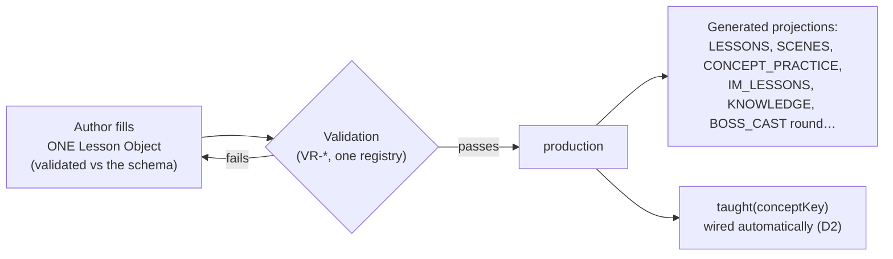
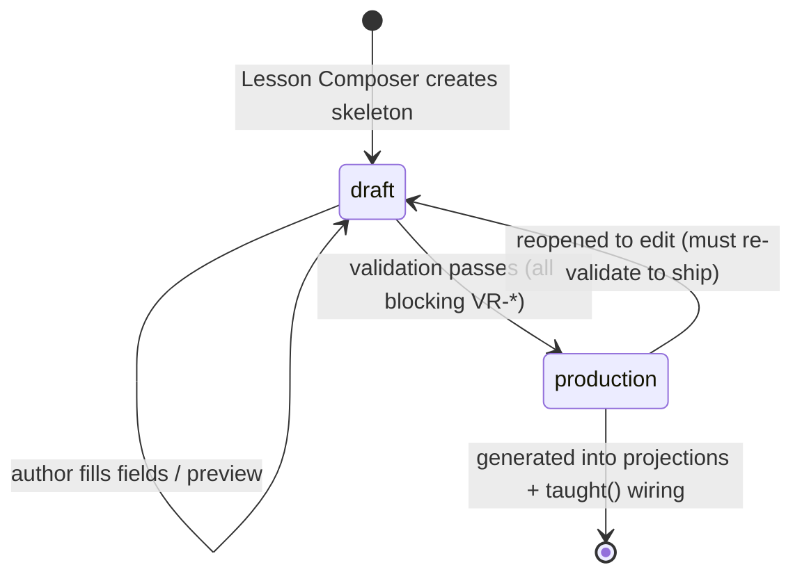

> **STATUS: RATIFIED** — ChartQuest Architecture v1.0 · Ratified 2026-07-15
> **Do not modify directly.** Part of the official ChartQuest ratified architecture. Changes require an ADR, migration notes, approval, and re-ratification — see `docs/architecture-ratified/ARCHITECTURE_CHANGE_POLICY.md`.

# ChartQuest Curriculum Engine — Implementation Guidelines

> **CANONICAL REFERENCE.** The single source of truth for the Lesson object is [`CHARTQUEST_LESSON_SCHEMA.json`](CHARTQUEST_LESSON_SCHEMA.json); for object ownership and the frozen decisions (D1–D8), [`CHARTQUEST_CANONICAL_OBJECT_REGISTRY.md`](CHARTQUEST_CANONICAL_OBJECT_REGISTRY.md). This document *references* those fields and rules — it does not redefine them. Where this document conflicts with the schema or the registry, **they govern.**

**Status: RATIFIED — Phase 1 (specification only; no code, no gameplay change).**
**Ratified: 2026-07-15**
**Audience: a future AI or developer with *zero* prior ChartQuest knowledge.**

This document tells you **how to author a compliant lesson**. It writes **no gameplay** and changes **no source**: it walks you through the pipeline you move a lesson through, the validation it must survive, and it proves the architecture is complete with **three fully-worked lessons** copied verbatim from the Registry (`bos`, `risk_reward`, `vwap`). It does **not** restate the lesson shape — the [schema](CHARTQUEST_LESSON_SCHEMA.json) owns that.

> **Success bar:** a zero-knowledge author can ship a fully-compliant lesson using **only** these docs + the [Visual Market Constitution](../../CHARTQUEST_VISUAL_MARKET_CONSTITUTION.md) + the Pattern Library + the Lesson Composer, with **no founder clarification.** If any decision still requires a human to ask "which map governs?", the architecture has failed. It has not — the [Registry](CHARTQUEST_CANONICAL_OBJECT_REGISTRY.md) names the one owner of every object.

---

## Table of contents

1. [The one rule that replaces the old workflow](#1-the-one-rule-that-replaces-the-old-workflow)
2. [The Lesson Object](#2-the-lesson-object)
3. [The authoring pipeline & state machine](#3-the-authoring-pipeline--state-machine)
4. [What each field must reference (and never redefine)](#4-what-each-field-must-reference-and-never-redefine)
5. [Validation you must survive before ship](#5-validation-you-must-survive-before-ship)
6. [Worked Lesson A — `bos` (Structure)](#6-worked-lesson-a--bos-structure)
7. [Worked Lesson B — `risk_reward` (RiskMgmt)](#7-worked-lesson-b--risk_reward-riskmgmt)
8. [Worked Lesson C — `vwap` (Trend)](#8-worked-lesson-c--vwap-trend)
9. [Authoring checklist](#9-authoring-checklist)

---

## 1. The one rule that replaces the old workflow

**Old workflow (do not do this):** to add a lesson you edited ~9+ disjoint maps — `LESSONS` (4515), `SCENES` (19163), `CONCEPT_PRACTICE` (19331), `QUIZ_QUESTIONS` (4756), `LESSON_RECALL` (5147), `IM_LESSONS` (5729), `LESSON_GAME` (5133), `LESSON_UNLOCK` (5401), `KNOWLEDGE` (5452), plus a `CURRICULUM.focus` (4851) entry and a `BOSS_CAST` round (9650) — with no schema tying them together and no error if you forgot one.

**New workflow (do this):** you author **one Lesson Object** — a single JSON instance validated against [`CHARTQUEST_LESSON_SCHEMA.json`](CHARTQUEST_LESSON_SCHEMA.json). The legacy maps are **generated** from the roster of Lesson Objects; you never hand-edit them. You never write a "taught" flag by hand (the Curriculum Engine owns `taught(conceptKey)` — D2); you never renumber hours (`guardian` is the one authored placement — D1); you never draw candles inside a lesson (you reference a Pattern-Library `patternRef`); and you cannot ship a half-finished lesson (validation blocks the ship transition — §5).



---

## 2. The Lesson Object

The Lesson Object is one JSON instance whose shape is **owned entirely** by [`CHARTQUEST_LESSON_SCHEMA.json`](CHARTQUEST_LESSON_SCHEMA.json). **This document does not reproduce the field table** — doing so would recreate the exact drift the [Registry](CHARTQUEST_CANONICAL_OBJECT_REGISTRY.md) exists to kill. Open the schema for the authoritative `required` set, types, and per-field descriptions.

A few field laws are worth surfacing here so you author correctly (all sourced from the schema `$comment` and the Registry's frozen decisions):

- **One placement field.** `guardian` (0–10) is the **single authored** placement (D1). It is not computed from a dependency graph and not renumbered by hand. `hour` and `unlockLevel` are **aliases equal to `guardian`** — never stored or authored separately.
- **One concept.** A lesson teaches **exactly one** `primaryConcept` (D4), and it is a **short snake_case `conceptKey`** matching live code (D3) — e.g. `bos`, `choch`, `vwap`, `risk_reward`, `what_is_sl`. Never invent a long form.
- **Concept category is referenced, not owned.** `masteryCategory` is one of the 7 enum values, referenced from the Concept Catalogue (D5); the lesson does not own the concept→category mapping.
- **No inline geometry.** `learn.patternRef` is a **reference** into the Pattern Library, governed by the [Visual Market Constitution](../../CHARTQUEST_VISUAL_MARKET_CONSTITUTION.md). A lesson that inlines OHLC fails validation.
- **The four beats are first-class.** `learn` / `practice` / `apply` / `test` map to LEARN → PRACTICE → APPLY → TEST. `apply.honestOutcome` is pre-authored (never coin-flip) per [`trading_canon.md`](../canon/trading_canon.md) + [TES v1.1](../../CHARTQUEST_TRADING_EXPERIENCE_SYSTEM_v1.1.md).

For the exact field names, types, and which are required, **read the schema.** Every field name used in the worked lessons below is byte-identical to it.

---

## 3. The authoring pipeline & state machine

The lesson lifecycle uses the `status` enum from the schema (`draft`, `in_review`, `validated`, `production`, `deprecated`, `retired`); the stages that move a lesson between those states are owned by [`CHARTQUEST_AUTHORING_PIPELINE.md`](CHARTQUEST_AUTHORING_PIPELINE.md). Reference stage/state names there — do not invent new ones.



- **`draft`** is fully previewable: you can render the teach card, animation, and practice drill locally to feel the lesson. Nothing about `draft` is wired into the live gate or a boss.
- Reaching **`production`** is the **only** path to a shipped, generated projection, and it is **gated by validation** (§5). There is no manual bypass; a lesson that fails a blocking rule cannot ship.
- Intermediate stages (`in_review`, `validated`, localization, etc.) live inside the pipeline doc; they do not add lifecycle states beyond the schema's `status` enum.

---

## 4. What each field must reference (and never redefine)

**Reference; never redefine** — this is the [Registry](CHARTQUEST_CANONICAL_OBJECT_REGISTRY.md) §4 boundary made operational.

| If you need… | You reference… | You must NOT… |
|--------------|----------------|---------------|
| Candle geometry / width / colour / chart type | a `learn.patternRef` into the Pattern Library, governed by the [Visual Market Constitution](../../CHARTQUEST_VISUAL_MARKET_CONSTITUTION.md) | hand-draw OHLC inside the lesson |
| A trade outcome or confluence truth in a replay | the trade record / [`trading_canon.md`](../canon/trading_canon.md) + [TES v1.1](../../CHARTQUEST_TRADING_EXPERIENCE_SYSTEM_v1.1.md) | synthesize a divergent outcome |
| "Has concept X been taught?" | `taught(conceptKey)` (Curriculum Engine, D2) | add a new "is-it-known?" predicate |
| Where a lesson sits in the ladder | the authored `guardian` field (D1) | hand-number an `hour`, or derive placement from the DAG |
| A `masteryCategory` for a concept | the Concept Catalogue (Pattern Library, D5) | re-own the concept→category mapping in the lesson |
| The `{candles, entryIdx}` shape for a replay | the one contract in [`CHARTQUEST_DATA_CONTRACTS.md`](CHARTQUEST_DATA_CONTRACTS.md) | write a fourth replay renderer with its own geometry |
| A validation rule | a `VR-*` id resolved in [`CHARTQUEST_VALIDATION_CONTRACTS.md`](CHARTQUEST_VALIDATION_CONTRACTS.md) (D6) | list rules locally |

---

## 5. Validation you must survive before ship

[`CHARTQUEST_VALIDATION_CONTRACTS.md`](CHARTQUEST_VALIDATION_CONTRACTS.md) is the **sole** `VR-*` registry (D6). This section does not restate the rules — it names the ones a lesson must pass and links their owner. Each rule's `blocksImplementation` status and failure message live in that file; cite rules by id only.

| Rule id | Checks (see the registry for the full contract) |
|---------|--------------------------------------------------|
| [`SCHEMA-VALID`](CHARTQUEST_VALIDATION_CONTRACTS.md) | Byte-identical schema field names & types; validates against the JSON schema. |
| [`VR-OBJECTIVE`](CHARTQUEST_VALIDATION_CONTRACTS.md) | Exactly one stated `primaryConcept` + a measurable `learningObjective`. |
| [`VR-SINGLE-PRIMARY`](CHARTQUEST_VALIDATION_CONTRACTS.md) | One teacher per concept (the "one primary concept" law). |
| [`SCHEMA-VALID`](CHARTQUEST_VALIDATION_CONTRACTS.md) | `masteryCategory` is one of the 7. |
| [`VR-REFS`](CHARTQUEST_VALIDATION_CONTRACTS.md) | `learn.lessonChartScene` resolves to a real, Constitution-compliant scene. |
| [`VR-GATE`](CHARTQUEST_VALIDATION_CONTRACTS.md) | `practice.setups` resolve and practice no untaught concept. |
| [`VR-DAG`](CHARTQUEST_VALIDATION_CONTRACTS.md) | `prerequisites` introduce no cycle. |
| [`VR-TAUGHT-BEFORE-TEST`](CHARTQUEST_VALIDATION_CONTRACTS.md) | The boss tests only concepts taught at or before its `guardian`. |
| [`VR-GATE`](CHARTQUEST_VALIDATION_CONTRACTS.md) | `taught()` is satisfiable and `practice.minTrades` ≥ 3 before the boss. |
| [`VR-ORDER`](CHARTQUEST_VALIDATION_CONTRACTS.md) | Legacy projections match the authored `guardian` (its `hour`/`unlockLevel` aliases). |
| [`VR-REACHABILITY`](CHARTQUEST_VALIDATION_CONTRACTS.md) | No orphan nodes; every lesson is reachable. |

**If any blocking rule fails, the lesson stays `draft`.** That is the whole point: gaps surface at author-time, not player-time.

---

## 6. Worked Lesson A — `bos` (Structure)

> **Proof goal:** a Structure lesson, mid-curriculum, authored at `guardian: 3`, instantiating every field. This is the **canonical `bos` object copied verbatim** from [`CHARTQUEST_CANONICAL_OBJECT_REGISTRY.md`](CHARTQUEST_CANONICAL_OBJECT_REGISTRY.md) §3 — it is the only version of reality; do not invent alternate values.

### 6.1 Composer inputs
The Lesson Composer pre-fills a `draft` skeleton; the author supplies: primary concept (`bos`), category (`Structure`), the authored placement (`guardian: 3`), the plain-language idea, the prerequisite conceptKeys, and a `learn.patternRef` to an existing break-of-structure candle set in the Pattern Library.

### 6.2 The Lesson Object (verbatim, Registry §3)

```json
{
  "lessonId": "bos", "schemaVersion": "1.0.0", "status": "production", "owner": "curriculum",
  "primaryConcept": "bos", "title": "Break of Structure", "masteryCategory": "Structure", "guardian": 3, "difficultyTier": 3,
  "learningObjective": "Spot when a price break means the trend keeps going.",
  "prerequisites": ["what_is_trend", "support_resist"], "unlocks": ["choch"], "reinforces": ["candle_close"],
  "learn": { "patternRef": "pat_bos_up", "lessonChartScene": "bos", "text": "When price CLOSES past the last high, the trend keeps going. That break is a Break of Structure." },
  "practice": { "minTrades": 3, "setups": ["bos_long_1", "bos_long_2", "bos_cont"] },
  "apply": { "tradeScenarioRef": "scn_bos_uptrend", "regime": "uptrend", "evidence": ["higher high broke", "strong close"], "honestOutcome": "win" },
  "test": { "bossRoundId": "bos", "mgId": "bos", "guardian": 3 },
  "assessment": { "question": "Price just CLOSED above the last high. What is that?", "choices": ["A Break of Structure — the trend keeps going", "A reversal — the trend flips"], "correct": 0, "why": "A close beyond the last high means buyers won, so the trend continues." },
  "misconceptions": [ { "belief": "A wick past the high counts as a break", "distractor": "It broke as soon as the wick poked through", "whyWrong": "Only the CLOSE counts — a wick that closes back is a fake-out.", "remediationConceptKey": "candle_close" } ],
  "beat": { "hook": "The Guardian dares you: is this the real break, or a trap?", "stakes": "Call it wrong and the trend fools you.", "payoff": "You read the close and rode the trend." },
  "validationRules": ["VR-OBJECTIVE", "VR-SINGLE-PRIMARY", "VR-ORDER", "VR-TAUGHT-BEFORE-TEST"]
}
```

### 6.3 Placement is authored (D1)
`guardian: 3` **is** the placement. `hour` and `unlockLevel` equal 3 as aliases; they are never authored or stored separately. Nothing computes hour 3 from the dependency graph — the author wrote `guardian: 3`, and `prerequisites` (`what_is_trend`, `support_resist`) exist only to prove those concepts are taught at a `guardian` ≤ 3.

### 6.4 Pipeline pass
`draft` (Composer skeleton) → author fills fields → local preview of the `bos` animation + `practice.setups` drill → validation → `production`.

### 6.5 Validation pass

| Rule | Result | Why |
|------|:---:|-----|
| [`SCHEMA-VALID`](CHARTQUEST_VALIDATION_CONTRACTS.md) | PASS | all schema fields present and typed |
| [`VR-OBJECTIVE`](CHARTQUEST_VALIDATION_CONTRACTS.md) | PASS | one `primaryConcept` (`bos`), one measurable `learningObjective` |
| [`VR-SINGLE-PRIMARY`](CHARTQUEST_VALIDATION_CONTRACTS.md) | PASS | only this node teaches `bos` |
| [`SCHEMA-VALID`](CHARTQUEST_VALIDATION_CONTRACTS.md) | PASS | `Structure` ∈ the 7 |
| [`VR-REFS`](CHARTQUEST_VALIDATION_CONTRACTS.md) | PASS | `learn.lessonChartScene: "bos"` resolves |
| [`VR-GATE`](CHARTQUEST_VALIDATION_CONTRACTS.md) | PASS | `practice.setups` resolve; no untaught concept |
| [`VR-DAG`](CHARTQUEST_VALIDATION_CONTRACTS.md) | PASS | `what_is_trend`/`support_resist` precede; no cycle |
| [`VR-TAUGHT-BEFORE-TEST`](CHARTQUEST_VALIDATION_CONTRACTS.md) | PASS | `test.guardian: 3`; `bos` + prerequisites all taught ≤ 3 |
| [`VR-GATE`](CHARTQUEST_VALIDATION_CONTRACTS.md) | PASS | `practice.minTrades: 3`; `taught()` satisfiable |

### 6.6 `taught()` and the boss (D2)
On completion `taught("bos")` becomes true (durable). Guardian 3's `bos` round (`test.bossRoundId`) is **allowed** because `VR-TAUGHT-BEFORE-TEST` proved `bos` is taught at `guardian` 3. No boss below `guardian` 3 may include the `bos` round.

---

## 7. Worked Lesson B — `risk_reward` (RiskMgmt)

> **Proof goal:** a Risk-Management lesson whose APPLY beat binds to an authored trade scenario. This is the **canonical `risk_reward` object copied verbatim** from the [Registry](CHARTQUEST_CANONICAL_OBJECT_REGISTRY.md) §3.

### 7.1 Composer inputs
Primary concept `risk_reward`; category `RiskMgmt`; authored placement `guardian: 5`; prerequisite `what_is_sl`; a `learn.patternRef` to a risk:reward setup pattern; `test.mgId: "rr"` (the real risk:reward drill).

### 7.2 The Lesson Object (verbatim, Registry §3)

```json
{
  "lessonId": "risk_reward", "schemaVersion": "1.0.0", "status": "production", "owner": "curriculum",
  "primaryConcept": "risk_reward", "title": "Risk : Reward", "masteryCategory": "RiskMgmt", "guardian": 5, "difficultyTier": 3,
  "learningObjective": "Only take trades that can win more than they risk.",
  "prerequisites": ["what_is_sl"], "unlocks": [], "reinforces": ["what_is_sl"],
  "learn": { "patternRef": "pat_rr_2to1", "lessonChartScene": "risk_reward", "text": "If you can win $2 while risking $1, that's a 2:1 trade. Take those." },
  "practice": { "minTrades": 3, "setups": ["rr_2to1", "rr_3to1", "rr_bad"] },
  "apply": { "tradeScenarioRef": "scn_rr_setup", "regime": "range_breakout", "evidence": ["stop is close", "target is far"], "honestOutcome": "win" },
  "test": { "bossRoundId": "rr", "mgId": "rr", "guardian": 5 },
  "assessment": { "question": "You risk $1 to make $2. What is the reward-to-risk?", "choices": ["2 to 1 — a good trade", "1 to 2 — a bad trade"], "correct": 0, "why": "Reward ($2) over risk ($1) is 2:1 — the kind of trade to take." }
}
```

### 7.3 Placement is authored (D1)
`guardian: 5` is the authored placement — there is no `CURRICULUM`-vs-`LESSON_UNLOCK` disagreement to resolve because there is one authored number, not two derived ones. `hour`/`unlockLevel` alias to 5. `prerequisites: ["what_is_sl"]` only proves stop-loss is taught at a `guardian` ≤ 5.

### 7.4 Pipeline pass
`draft` → author fills fields → preview the R:R animation + `practice.setups` drill → validation → `production`.

### 7.5 Validation pass

| Rule | Result | Why |
|------|:---:|-----|
| [`SCHEMA-VALID`](CHARTQUEST_VALIDATION_CONTRACTS.md) | PASS | all schema fields present and typed |
| [`VR-OBJECTIVE`](CHARTQUEST_VALIDATION_CONTRACTS.md) | PASS | one concept (`risk_reward`), one measurable `learningObjective` |
| [`VR-SINGLE-PRIMARY`](CHARTQUEST_VALIDATION_CONTRACTS.md) | PASS | only this node teaches `risk_reward` |
| [`SCHEMA-VALID`](CHARTQUEST_VALIDATION_CONTRACTS.md) | PASS | `RiskMgmt` ∈ the 7 |
| [`VR-REFS`](CHARTQUEST_VALIDATION_CONTRACTS.md) | PASS | `learn.lessonChartScene: "risk_reward"` resolves |
| [`VR-GATE`](CHARTQUEST_VALIDATION_CONTRACTS.md) | PASS | `practice.setups` resolve |
| [`VR-DAG`](CHARTQUEST_VALIDATION_CONTRACTS.md) | PASS | `what_is_sl` precedes; no cycle |
| [`VR-TAUGHT-BEFORE-TEST`](CHARTQUEST_VALIDATION_CONTRACTS.md) | PASS | `test.guardian: 5`; `what_is_sl` taught ≤ 5 |
| [`VR-GATE`](CHARTQUEST_VALIDATION_CONTRACTS.md) | PASS | `practice.minTrades: 3`; `taught()` satisfiable |

### 7.6 The APPLY beat and `taught()`
`risk_reward` is *felt* on a trade: `apply` binds it to the authored scenario `scn_rr_setup` (`regime: "range_breakout"`, `evidence`, `honestOutcome: "win"`) per the Trading canon — never a coin-flip. `taught("risk_reward")` gates any R:R practice trade and the Guardian-5 `rr` round; `VR-TAUGHT-BEFORE-TEST` also confirms the `what_is_sl` prerequisite is taught before that boss.

---

## 8. Worked Lesson C — `vwap` (Trend)

> **Proof goal:** a Trend lesson placed **earlier** than the two above, proving `guardian` is authored independently of concept "depth". This is the **canonical `vwap` object copied verbatim** from the [Registry](CHARTQUEST_CANONICAL_OBJECT_REGISTRY.md) §3.

### 8.1 Composer inputs
Primary concept `vwap`; category `Trend` (referenced from the Concept Catalogue, D5); authored placement `guardian: 2`; prerequisite `what_is_trend`; a `learn.patternRef` to a VWAP pattern; `test.mgId: "vwap"`.

### 8.2 The Lesson Object (verbatim, Registry §3)

```json
{
  "lessonId": "vwap", "schemaVersion": "1.0.0", "status": "production", "owner": "curriculum",
  "primaryConcept": "vwap", "title": "VWAP", "masteryCategory": "Trend", "guardian": 2, "difficultyTier": 2,
  "learningObjective": "Use the VWAP line as the day's fair-price magnet.",
  "prerequisites": ["what_is_trend"], "unlocks": ["vwap_trade"], "reinforces": ["what_is_trend"],
  "learn": { "patternRef": "pat_vwap", "lessonChartScene": "vwap", "text": "VWAP is the day's average price. Price likes to come back to it." },
  "practice": { "minTrades": 3, "setups": ["vwap_bounce", "vwap_reject", "vwap_ride"] },
  "apply": { "tradeScenarioRef": "scn_vwap_bounce", "regime": "trend_day", "evidence": ["price above VWAP", "pullback to line"], "honestOutcome": "win" },
  "test": { "bossRoundId": "vwap", "mgId": "vwap", "guardian": 2 },
  "assessment": { "question": "Price pulls back to the VWAP line in an uptrend. What often happens?", "choices": ["It bounces — VWAP acts as support", "It ignores VWAP completely"], "correct": 0, "why": "VWAP is the fair-price magnet; in an uptrend it often supports price." }
}
```

### 8.3 Placement is authored (D1)
`vwap` is authored at `guardian: 2` — the value the author wrote, not one a DAG computed from `what_is_trend`. This is the drift the [Registry](CHARTQUEST_CANONICAL_OBJECT_REGISTRY.md) killed (`vwap` at hour 2 vs 8): there is now exactly one number. `hour`/`unlockLevel` alias to 2; `prerequisites: ["what_is_trend"]` only asserts that trend is taught at a `guardian` ≤ 2.

### 8.4 Pipeline pass
`draft` → author fills fields → preview the VWAP animation + `practice.setups` drill → validation → `production`.

### 8.5 Validation pass

| Rule | Result | Why |
|------|:---:|-----|
| [`SCHEMA-VALID`](CHARTQUEST_VALIDATION_CONTRACTS.md) | PASS | all schema fields present and typed |
| [`VR-OBJECTIVE`](CHARTQUEST_VALIDATION_CONTRACTS.md) | PASS | one concept (`vwap`), one measurable `learningObjective` |
| [`VR-SINGLE-PRIMARY`](CHARTQUEST_VALIDATION_CONTRACTS.md) | PASS | only this node teaches `vwap` |
| [`SCHEMA-VALID`](CHARTQUEST_VALIDATION_CONTRACTS.md) | PASS | `Trend` ∈ the 7, referenced from the catalogue |
| [`VR-REFS`](CHARTQUEST_VALIDATION_CONTRACTS.md) | PASS | `learn.lessonChartScene: "vwap"` resolves |
| [`VR-GATE`](CHARTQUEST_VALIDATION_CONTRACTS.md) | PASS | `practice.setups` resolve |
| [`VR-DAG`](CHARTQUEST_VALIDATION_CONTRACTS.md) | PASS | `what_is_trend` precedes; no cycle |
| [`VR-TAUGHT-BEFORE-TEST`](CHARTQUEST_VALIDATION_CONTRACTS.md) | PASS | `test.guardian: 2`; `what_is_trend` taught ≤ 2 |
| [`VR-GATE`](CHARTQUEST_VALIDATION_CONTRACTS.md) | PASS | `practice.minTrades: 3`; `taught()` satisfiable |

### 8.6 Why these three prove the architecture is complete
A zero-knowledge author, given only these guidelines + the schema + the Visual Market Constitution + the Pattern Library + the Composer, produced lessons that each:
1. teach exactly one `primaryConcept` (`VR-OBJECTIVE` / `VR-SINGLE-PRIMARY`);
2. reference a `masteryCategory` from the catalogue rather than re-owning it (D5);
3. carry an **authored** `guardian` — no hour typed, no six-map renumber, no DAG derivation (D1);
4. share one `learn.patternRef` candle set with practice — no hand-drawn duplication;
5. are tested only where `taught()` proves the concept was learned (`VR-TAUGHT-BEFORE-TEST`, D2);
6. bind APPLY to an authored, honest trade scenario — never a coin-flip.

No step required a founder to answer "which map governs?" — the [Registry](CHARTQUEST_CANONICAL_OBJECT_REGISTRY.md) and [schema](CHARTQUEST_LESSON_SCHEMA.json) govern.

---

## 9. Authoring checklist

Copy this per lesson. Every box maps to a rule owned by [`CHARTQUEST_VALIDATION_CONTRACTS.md`](CHARTQUEST_VALIDATION_CONTRACTS.md).

- [ ] Lesson validates against [`CHARTQUEST_LESSON_SCHEMA.json`](CHARTQUEST_LESSON_SCHEMA.json) — `SCHEMA-VALID`
- [ ] Exactly **one** `primaryConcept` (short snake_case) and one measurable `learningObjective` — `VR-OBJECTIVE` / `VR-SINGLE-PRIMARY`
- [ ] `masteryCategory` is one of the 7, referenced from the catalogue — `SCHEMA-VALID`
- [ ] `guardian` is **authored** (0–10); you typed **no** `hour`/`unlockLevel` separately — D1 / `VR-ORDER`
- [ ] `prerequisites` list every taught concept the lesson leans on; no cycle — `VR-DAG`
- [ ] `learn.patternRef` resolves in the Pattern Library; there is **no inline OHLC** — Visual Market Constitution
- [ ] `learn.lessonChartScene` resolves to a real animation — `VR-REFS`
- [ ] `practice.setups` resolve and `practice.minTrades` ≥ 3 — `VR-REFS` / `VR-GATE`
- [ ] `apply` binds an authored `tradeScenarioRef` with an honest `honestOutcome` — Trading canon
- [ ] `test.guardian` ≥ this lesson's `guardian` and ≥ every prerequisite's — `VR-TAUGHT-BEFORE-TEST`
- [ ] Every player-facing string passes the 10-year-old wording bar
- [ ] `status: "production"` set **only after** validation passes

**End of Implementation Guidelines.**
