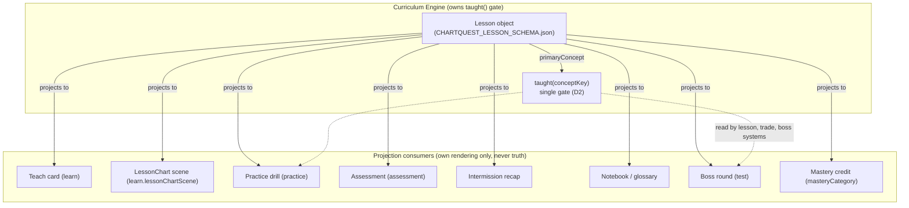

> **STATUS: RATIFIED** — ChartQuest Architecture v1.0 · Ratified 2026-07-15
> **Do not modify directly.** Part of the official ChartQuest ratified architecture. Changes require an ADR, migration notes, approval, and re-ratification — see `docs/architecture-ratified/ARCHITECTURE_CHANGE_POLICY.md`.

# ChartQuest Curriculum Engine — Lesson Object Model

> **CANONICAL REFERENCE.** The single source of truth for the Lesson object is [`CHARTQUEST_LESSON_SCHEMA.json`](CHARTQUEST_LESSON_SCHEMA.json); for object ownership and the frozen decisions (D1–D8), [`CHARTQUEST_CANONICAL_OBJECT_REGISTRY.md`](CHARTQUEST_CANONICAL_OBJECT_REGISTRY.md). This document *references* those fields and rules — it does not redefine them. Where this document conflicts with the schema or the registry, **they govern.**

> **Document class:** Human companion to the Lesson schema (Curriculum Engine Phase 1).
> **Role:** Annotate and explain [`CHARTQUEST_LESSON_SCHEMA.json`](CHARTQUEST_LESSON_SCHEMA.json). It adds **nothing normative** the JSON lacks. Every field, type, enum, and required-ness lives in the schema; this document only explains *why* the object exists and *what duplication it kills*.
> **Date:** 2026-07-15
> **Applies to:** `chart-quest.html` (source of truth) and `index.html` (byte-mirror).
> **Phase 1 constraint:** This document changes **no source code and no gameplay.** It is a specification of the object that future code will converge on.

---

## 0. The one-sentence law of this document

> **Nothing outside the schema may define lesson structure.** A "lesson" is exactly one Lesson object conforming to [`CHARTQUEST_LESSON_SCHEMA.json`](CHARTQUEST_LESSON_SCHEMA.json). Every teaching card, animation, drill, quiz, glossary entry, intermission recap, mastery credit, and boss round that concerns a concept is a **projection of a single Lesson object**, never an independent structure with its own copy of the truth.

If you are a future AI or developer authoring a lesson, you author **one object** validated against the schema. You do not edit twenty maps. That is the entire purpose of this model.

---

## 1. Why this object exists (the meta-bug it kills)

The current codebase has **no Lesson object.** A single lesson — take `bos` (Break of Structure) — is hand-authored across **at least nine independent structures**, each with its own key namespace and its own copy of the teaching prose:

| Facet of the `bos` lesson | Where it lives today | Line |
|---|---|---|
| Text card copy | `LESSONS['bos']` | 4515 |
| Quiz | `QUIZ_QUESTIONS['bos']` | 4756 |
| Quick-check recall | `LESSON_RECALL['bos']` | 5147 |
| Intermission recap | `IM_LESSONS['bos']` | 5729 |
| Animated teaching scene | `SCENES['bos']` | 19163 |
| Tap-the-candle drill | `CONCEPT_PRACTICE['bos']` | 19331 |
| Mini-game drill | `MG.REG['bos']` + `LESSON_GAME['bos']` | 18713 / 5133 |
| Glossary definitions | `KNOWLEDGE['bos']` + `TERMS['bos']` | 5452 / 5414 |
| Mastery category | `LESSON_MASTERY['bos']` **and** `GAME_MASTERY['bos']` **and** `CONFLUENCE_CONFIG` | 3795 / 3794 / 3715 |

The **primary concept** of a lesson is re-derived by **six different maps** (`CONCEPTS.lesson`, `LESSON_MASTERY`, `GAME_MASTERY`, `LESSON_GAME`, `LESSON_PRACTICE`, `LESSON_TO_CONCEPTS`). The **concept→mastery-category** relation is encoded **three times over two incompatible taxonomies** (the 7-bucket `MASTERY_CATS` versus the 5-bucket `MG.REG.category`). The **teach gate** the design docs promise — a single `taught(conceptKey)` predicate all systems read — **does not exist in code**: `taught` is a plain session object (`const taught = {}`, line 4989), and `grep 'taught('` returns zero hits.

The consequence, in the founder's words, is that *"every lesson is partially invented."* Authoring a new lesson means editing ~9+ disjoint structures with **no schema tying them together**, and the maps already silently disagree with each other (e.g. `LESSON_UNLOCK` says `trendlines` unlocks at level 7 while `CURRICULUM`/`KNOWLEDGE` say hour 9).

The Lesson object is the fix: **one authored object, many generated projections, one validator that refuses to ship an incomplete lesson.**

---

## 2. Position in the Curriculum Engine ownership matrix

Per `CHARTQUEST_SYSTEM_INTERFACES.md`, the **Curriculum Engine owns the `taught()` gate.** Per **D2** ([registry](CHARTQUEST_CANONICAL_OBJECT_REGISTRY.md)), that gate is **`taught(conceptKey)`** — its argument is a lesson's `primaryConcept`, never a `lessonId`. The Lesson object is the Curriculum Engine's first-class data type. The ownership boundary is:

**Rule:** projection consumers **read** a Lesson; they never **hold** a divergent copy of its truth. The `taught(conceptKey)` gate is read by the lesson, trade, and boss systems alike. This replaces the four independent "is it known?" predicates in the current code (`taught[]` session flag 4989, `conceptDiscovered()` 5516, `conceptTier()` 4966, `masteryCatLearned()` 3793) with **one** gate reading **one** object.

---

## 3. The fields — described by the schema, not here

**This document does not carry a field table.** Every field of the Lesson object — its name, type, enum, required-ness, and inline description — is defined once in [`CHARTQUEST_LESSON_SCHEMA.json`](CHARTQUEST_LESSON_SCHEMA.json). Field names used anywhere in this document are **byte-identical** to that schema. To read the shape of a lesson, read the JSON.

What this section adds is *orientation* — how the schema's fields group, and how each group retires a pile of divergent code. **None of the notes below override the schema; where they seem to, the schema governs.**

### 3.1 Identity & placement

- **`lessonId`** — the unique lesson id (snake_case). A separate identifier from `primaryConcept`; for single-concept lessons it commonly equals it (D2/D4 keep the *gate* on `primaryConcept`, not `lessonId`).
- **`primaryConcept`** — the **one** conceptKey this lesson teaches (**D4**: exactly one). This is the key `taught()` gates on (**D2**). It is a short snake_case key matching live code (**D3**: `bos`, `choch`, `vwap`, `risk_reward`, `what_is_sl`, …) — never a long form.
- **`masteryCategory`** — one of the seven live categories (schema enum, mirrors code `MASTERY_CATS`). **Referenced** from the Concept Catalogue, never re-owned by the lesson (**D5**).
- **`guardian`** — the **single authored placement** (**D1**): `0` = The Gambler (intro/teaching boss, **D7**), `1..9` = Guardians, `10` = Market Maker. **There is no authored `hour`.** `hour` and `unlockLevel` are aliases *equal to* `guardian`, never stored or authored separately (**D1**). This kills the "authored vs derived hour" contradiction and the `bos` hour-2-vs-3 drift.
- **`prerequisites` / `unlocks` / `reinforces`** — the conceptKey graph edges. Prerequisites must be taught at a `guardian <= this.guardian` (VR-ORDER).

### 3.2 The four teaching beats (LEARN → PRACTICE → APPLY → TEST)

- **`learn`** — the TEACH beat: an animated LessonChart (`patternRef`, `lessonChartScene`, `text`). The visual is governed by `CHARTQUEST_VISUAL_MARKET_CONSTITUTION.md`; the lesson only references a scene, it never holds candle OHLC.
- **`practice`** — the PRACTICE beat: `minTrades` (≥3, design law) and authored `setups`.
- **`apply`** — the APPLY beat: binds the concept to an authored trade scenario (`regime → evidence → honestOutcome`) per `CHARTQUEST_TRADING_EXPERIENCE_SYSTEM_v1.1.md`. **First-class, not optional** — this is the trading-feel fulcrum. `honestOutcome` is pre-authored (`win`/`loss`/`scratch`), never coin-flip.
- **`test`** — the TEST beat: a boss mini-game round (`bossRoundId`, `mgId`, `guardian`). The boss is the final exam, never first contact; its `guardian` must satisfy VR-TAUGHT-BEFORE-TEST.

### 3.3 Assessment, misconceptions, and narrative

- **`assessment`** — the checkable question (`question`, `choices`, `correct`, `why`). One canonical assessment shape; a lesson needing multiple questions carries them under this one field, not two competing structures.
- **`misconceptions`** — named wrong beliefs the concept triggers, each with its `distractor`, `whyWrong`, and `remediationConceptKey`. A known misconception with no entry here FAILS VR-MISCONCEPTION. Distractors carry rationale + remediation so misconceptions are handled, not ignored.
- **`beat`** — the emotional/narrative beat (`hook`, `stakes`, `payoff`, optional `guardianVoice`, `tensionArc`). First-class because trade-FEEL is the retention fulcrum (beta audits).

### 3.4 Composition, projections, lifecycle, validation

The schema also carries optional composition fields (`requiredPatterns`, `requiredCandleVocabulary`, `requiredTerrain`), projection components (`replay`, `notebook`, `journal`, `analyticsEvents`), lifecycle metadata (`status`, `owner`, `approvalStatus`, `schemaVersion`, `uuid`), and **`validationRules`** — an array of **VR ids** that resolve in `CHARTQUEST_VALIDATION_CONTRACTS.md`, the sole VR registry (**D6**). This document never lists or defines VRs; cite them by id.

> **"Optional" means the schema permits absence — not that the author may skip it silently.** Silent-absence is the exact failure the audit found (`openIntroLesson` no-ops on a missing scene, `imLessonMeta` falls back to a generic card). The validator (VR registry) converts silent absence into a **blocking** authoring error per `masteryCategory`/`guardian`.

---

## 4. The canonical worked examples live in the registry

**This document does not carry its own example lesson.** The **only** version of reality is the set of four canonical example lessons in `CHARTQUEST_CANONICAL_OBJECT_REGISTRY.md` §3 (`bos`, `choch`, `risk_reward`, `vwap`) — regenerated from the schema. Any doc that shows a worked example copies those verbatim; it never invents alternate values (per registry §4).

Note in particular what those canonical values fix versus this document's earlier drafts: `bos` is placed at **`guardian: 3`** (not hour/guardian 2), its `primaryConcept` is the short key **`bos`** (not `break_of_structure`), and it carries **`apply`**, **`assessment`**, **`misconceptions`**, and **`beat`** — the beats this model earlier lacked. Read the registry for the exact JSON.

---

## 5. Validation

The completeness contract is **not** redefined here. A lesson is valid only when it passes the **VR ids** carried in its `validationRules` — resolved in `CHARTQUEST_VALIDATION_CONTRACTS.md` (the sole registry, **D6**). The core rules a lesson typically carries (see the canonical `bos` example): `VR-OBJECTIVE`, `VR-SINGLE-PRIMARY`, `VR-ORDER`, `VR-TAUGHT-BEFORE-TEST`, plus `VR-GATE` (≥3 trades/level) and `VR-MISCONCEPTION` where applicable.

Because these are `blocksImplementation` rules, a red result is a build/authoring stop, not a warning. **This is the single validation layer the current codebase entirely lacks** (the audit lists "No schema/validator ties the parallel maps together"). For the exact predicates, read the VR registry — do not restate them here.

---

## 6. What each field replaces (duplication kill-list)

Each row is a duplicated responsibility from the audit, and the **single schema field** that now owns it. (Field names are byte-identical to [`CHARTQUEST_LESSON_SCHEMA.json`](CHARTQUEST_LESSON_SCHEMA.json).)

| Duplicated responsibility (audit) | Copies today | Now owned by (schema field) |
|---|---|---|
| **Teaching prose** authored 4–6× | `LESSONS`, `SCENES.caption`, `IM_LESSONS.lead`, `MG_CONCEPTS`, `KNOWLEDGE.def`, `TERMS.def` | `learn.text` |
| **Concept→mastery category** ×3 over 2 taxonomies | `LESSON_MASTERY`, `GAME_MASTERY`, `CONFLUENCE_CONFIG.mastery`, `MG.REG.category` | `masteryCategory` (referenced from Concept Catalogue, D5) |
| **Lesson→hour/level ordering** ×6 | `CURRICULUM.focus`, `LESSON_UNLOCK`, `KNOWLEDGE.level`, `CONCEPTS.hour`, `MASTERY_CAT_LEVEL`, `LEVEL_FLOW` | `guardian` (the sole placement; `hour`/`unlockLevel` are aliases, D1) |
| **Lesson→concept** ×3 at different granularity | `CONCEPTS.lesson`, `LESSON_TO_CONCEPTS`, `LESSON_MASTERY` | `primaryConcept` (exactly one, D4) |
| **Lesson→practice/drill** ×3 to different engines | `LESSON_PRACTICE`, `LESSON_GAME`, `LEVEL_FLOW.practice` | `practice` (+ `test.mgId`) |
| **Assessment** ×3 | `QUIZ_QUESTIONS`, `LESSON_RECALL`, `CONCEPT_PRACTICE` | `assessment` (+ `practice`) |
| **Candle/OHLC teaching data** ×2 | `SCENES.candles`, `CONCEPT_PRACTICE.candles` | `learn.lessonChartScene` → Visual Market Constitution |
| **"Is it known/unlocked?"** predicate ×4 | `taught[]`, `conceptDiscovered()`, `conceptTier()`, `masteryCatLearned()` | `taught(conceptKey)` gate (Curriculum Engine owns; §2, D2) |
| **Per-level one-liner** ×3 | `PERSIST_LESSON`, `CURRICULUM.tip`, `levelConceptName()` | derived projection of `learn.text` |

All other structures become **read-only projections generated from the Lesson.**

---

## 7. Lifecycle placement (authoring pipeline entry)

The Lesson object enters the world through the authoring pipeline, whose stages and state machine are owned by `CHARTQUEST_AUTHORING_PIPELINE.md` (do not restate them here). This model establishes only that:

- A lesson's `status` moves through the schema's lifecycle enum (`draft → in_review → validated → production → deprecated → retired`).
- A lesson is promoted to `status: production` only after its `validationRules` pass (§5).
- Only `production` lessons are eligible to gate a Guardian.

For stage owners and transition rules, read the Authoring Pipeline document.

---

## 8. Structures this object supersedes (traceability index)

Every structure below is **demoted to a generated projection of the Lesson object.** None may hold a divergent copy of lesson truth after Phase 2. Line numbers are verified reads of `chart-quest.html` (20,320 lines; `index.html` is a byte-mirror). Field names in the right column are byte-identical to the schema.

| Structure | Line | Superseded by field(s) |
|---|---|---|
| `MASTERY_CATS` / `MASTERY_LABEL` | 3788 / 3789 | `masteryCategory` enum |
| `MASTERY_CAT_LEVEL` | 3792 | `guardian` (placement; `hour` alias) |
| `GAME_MASTERY` | 3794 | `masteryCategory` |
| `LESSON_MASTERY` | 3795 | `masteryCategory` |
| `CONFLUENCE_CONFIG.factors[].mastery` | 3715 | `masteryCategory` |
| `REASON_CONCEPT` | 5507 | `primaryConcept` (no label bridge needed) |
| `LESSONS` | 4515 | `title` + `learn.text` + `learn.lessonChartScene` |
| `QUIZ_QUESTIONS` | 4756 | `assessment` |
| `CURRICULUM.focus` / `.intermissionFocus` | 4851 | `guardian` (membership derived) |
| `CONCEPTS` | 4939 | `primaryConcept` + `guardian` |
| `conceptTier` / `maxHourReached` | 4966 | progression gate over the Lesson |
| `taught` (object) | 4989 | `taught(conceptKey)` gate (function, D2) |
| `LESSON_PRACTICE` | 5059 | `practice` |
| `LEVEL_FLOW` | 5066 | ordered projection of Lessons by `guardian` + `prerequisites` |
| `LESSON_GAME` | 5133 | `test.mgId` |
| `LESSON_RECALL` | 5147 | `assessment` |
| `LESSON_UNLOCK` | 5401 | `guardian` (`unlockLevel` alias) |
| `TERMS` / `TERM_BY_KEY` | 5414 | `learn.text` |
| `KNOWLEDGE` / `KNOWLEDGE_BY_KEY` | 5452 | `primaryConcept` + `learn.text` + `guardian` |
| `LESSON_TO_CONCEPTS` | 5504 | `primaryConcept` (+ `prerequisites`) |
| `LESSON_LIBRARY` | 5540 | the set of `production` Lessons |
| `IM_LESSONS` | 5729 | `title` + `learn.text` + `learn.lessonChartScene` (intermission projection) |
| `PERSIST_LESSON` | 15004 | projection of `learn.text` |
| `MG_CONCEPTS` | 19131 | `learn.text` (mini-game projection) |
| `MG.REG` (`category`) | 18713 | `masteryCategory` (5-bucket taxonomy deleted) |
| `SCENES` (LessonChart) | 19163 | `learn.lessonChartScene` → Visual Market Constitution |
| `CONCEPT_PRACTICE` | 19331 | `practice` (+ `learn.lessonChartScene`) |
| `taught`/`lessonProgress` split | 4989 | one gate over one object |

---

## 9. How this cuts build time and raises consistency

- **Build time:** authoring a lesson goes from *"edit ~9+ disjoint maps and hope you didn't miss one"* to *"write one object; the validator tells you what's missing before you can ship."* The reverse-lookup fragility (`pumpLessons` identifies a card by array identity at 5173), the ad-hoc namespace bridges (19497, 19472), and the manual cross-map sync all disappear.
- **Educational consistency:** the one-primary-concept law (**D4**) is now *encodable* and *checked*. "Never test the untaught" becomes a validation rule (VR-TAUGHT-BEFORE-TEST), not a hand-written audit comment. Teaching prose has exactly one source (`learn.text`), so the plain wording, the animation caption, the intermission recap, and the glossary can no longer drift apart. One `masteryCategory` value means a concept credits the same skill whether it's observed as a lesson read, a mini-game, a graded trade, or a boss round.

**The single question every field answers:** *"Where is the one place this truth lives?"* — and the answer is always **the Lesson object, as defined by [`CHARTQUEST_LESSON_SCHEMA.json`](CHARTQUEST_LESSON_SCHEMA.json).**
