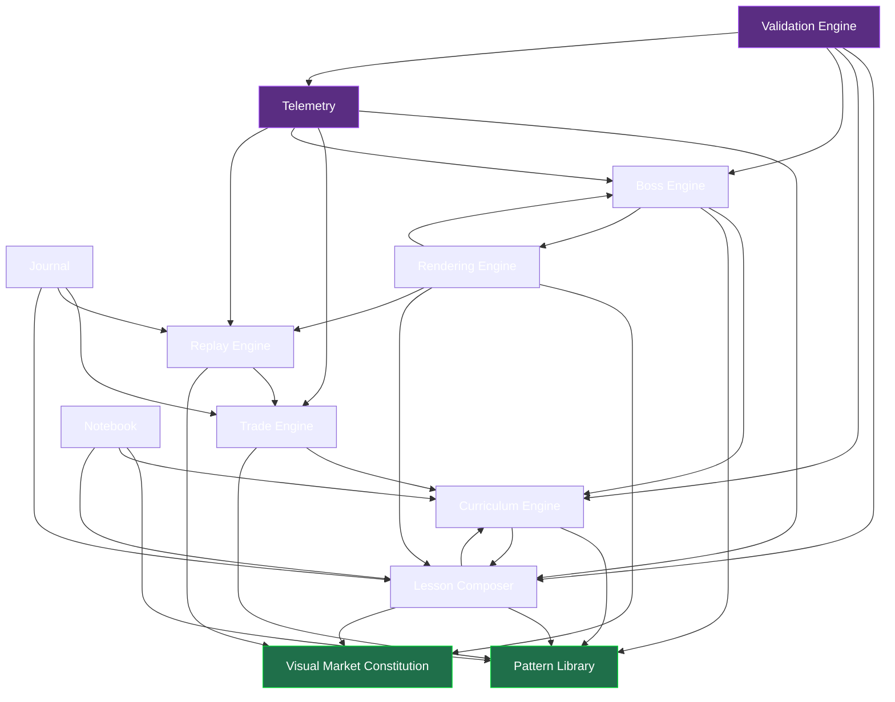

> **STATUS: RATIFIED** — ChartQuest Architecture v1.0 · Ratified 2026-07-15
> **Do not modify directly.** Part of the official ChartQuest ratified architecture. Changes require an ADR, migration notes, approval, and re-ratification — see `docs/architecture-ratified/ARCHITECTURE_CHANGE_POLICY.md`.

# ChartQuest System Interfaces

> **CANONICAL REFERENCE.** The single source of truth for the Lesson object is [`CHARTQUEST_LESSON_SCHEMA.json`](CHARTQUEST_LESSON_SCHEMA.json); for object ownership and the frozen decisions (D1–D8), [`CHARTQUEST_CANONICAL_OBJECT_REGISTRY.md`](CHARTQUEST_CANONICAL_OBJECT_REGISTRY.md). This document *references* those fields and rules — it does not redefine them. Where this document conflicts with the schema or the registry, **they govern.**

**Curriculum Engine — Phase 1 · System-Boundary Specification**
**Document:** `CHARTQUEST_SYSTEM_INTERFACES.md`
**Status:** Ratified target-state (Phase 1 = analysis + specification only; NO code, NO gameplay change)
**Date:** 2026-07-15
**Authority chain:** [`CHARTQUEST_LESSON_SCHEMA.json`](CHARTQUEST_LESSON_SCHEMA.json) + [`CHARTQUEST_CANONICAL_OBJECT_REGISTRY.md`](CHARTQUEST_CANONICAL_OBJECT_REGISTRY.md) (govern the Lesson object + object ownership) → **this document** (the sole owner of the twelve-system `ownershipMatrix`, per Registry §1) → the sibling Curriculum-Engine docs.

---

## 0. How to read this document (zero-knowledge onboarding)

You are an AI or engineer with **no prior ChartQuest knowledge**. This document answers exactly one question:

> "When I author or change a lesson, **which system owns which decision**, what data crosses each boundary, and where does today's code violate those boundaries?"

The canonical Lesson object lives in [`CHARTQUEST_LESSON_SCHEMA.json`](CHARTQUEST_LESSON_SCHEMA.json) (with its Frozen Decisions D1–D8 catalogued in [`CHARTQUEST_CANONICAL_OBJECT_REGISTRY.md`](CHARTQUEST_CANONICAL_OBJECT_REGISTRY.md)); this document does **not** re-declare it. What this document *does* own — per Registry §1 — is the twelve-system `ownershipMatrix`: which system owns which decision, what crosses each boundary, and where today's code violates it. **Field names in this document are byte-identical to the schema** (`lessonId`, `primaryConcept`, `masteryCategory`, `guardian`, …); the knowledge gate is `taught(conceptKey)` (D2); a lesson teaches exactly one `primaryConcept` (D4). Where a concrete field is named, it comes from the schema — this document never invents a divergent schema, because a divergent schema is the exact meta-bug this entire suite exists to kill.

**The bug this document ends.** Today a "lesson" does not exist as an object. It is an emergent join across ~28 parallel maps in `chart-quest.html` (`LESSONS` @4515, `SCENES` @19163, `IM_LESSONS` @5729, `CONCEPT_PRACTICE` @19331, `KNOWLEDGE` @5452, `CONCEPTS` @4939, `LESSON_MASTERY` @3795, `GAME_MASTERY` @3794, `BOSS_CAST` @9650, and ~19 more). Each map has its own key namespace, its own copy of the teaching prose, and its own idea of which hour teaches what. **Authoring one lesson requires editing 9+ disjoint structures with nothing tying them together, and the maps already disagree with each other.** The cure is a clean **ownership partition**: every decision has exactly one owning system, every other system *consumes* that decision through a declared interface, and a Validation Engine mechanically proves the maps agree. This document is that partition.

**How this cuts lesson-build time.** When ownership is unambiguous, authoring a lesson is *fill one object, run the validator, ship*. There is no "which of six maps is authoritative?" lookup, no hand-mirroring prose into five tables, no silent drift. Educational consistency rises because the taught-before-tested law becomes a machine-checked invariant instead of a prose audit comment.

---

## 1. The twelve systems at a glance

This document's `ownershipMatrix` (its SoT, per Registry §1) partitions all curriculum responsibility across twelve systems. Every row below expands the ownership assignment into the six-facet interface contract used throughout this document.

| # | System | One-line mandate |
|---|--------|-----------------|
| 1 | **Curriculum Engine** | Owns the `taught(conceptKey)` gate (D2) and the ordering DAG; decides *what is known and when*. |
| 2 | **Pattern Library** | Owns the canonical catalogue of tradeable market patterns/concepts and their stable ids. |
| 3 | **Lesson Composer** | Owns lesson *authoring* — the `Draft` stage and assembly of the single lesson object (shape governed by [`CHARTQUEST_LESSON_SCHEMA.json`](CHARTQUEST_LESSON_SCHEMA.json)). |
| 4 | **Visual Market Constitution** | Owns candle/chart geometry — the one slot-derived width formula (external authority: `CHARTQUEST_VISUAL_MARKET_CONSTITUTION.md`). |
| 5 | **Trade Engine** | Owns live trade truth/causality (external authority: `trading_canon.md` + `..._TRADING_EXPERIENCE_SYSTEM_v1.1.md`). |
| 6 | **Replay Engine** | Owns the replay artifact `{candles, entryIdx}` produced from a closed trade. |
| 7 | **Notebook** | Owns concept *discovery* state (the Knowledge collection). |
| 8 | **Journal** | Owns the durable player-authored + trade-record log. |
| 9 | **Boss Engine** | Owns the boss *exam* (round playlists) and boss outcome. |
| 10 | **Telemetry** | Owns the analytics event schema and emission pipeline. |
| 11 | **Validation Engine** | Owns the `validationRules` and blocks non-compliant lessons from reaching `Production`. |
| 12 | **Rendering Engine** | Owns pixels — draws whatever data other systems hand it; owns no curriculum meaning. |

---

## 2. The six-facet interface contract

Every system in §4 is specified with the same six facets. Precise definitions:

- **Consumes** — data/objects this system reads across a boundary. It may read these but **must not mutate or re-author** them.
- **Produces** — the authoritative output this system, and only this system, writes.
- **Depends On** — the systems whose *Produces* this system requires to function (a runtime edge in the dependency graph, §5).
- **Validates** — the invariants this system is responsible for asserting at its boundary (the local half of the Validation Engine's global contract).
- **Owns** — the decisions for which this system is the single source of truth. **No two systems share an Owns cell** (proven in §3).
- **Never Owns** — decisions this system is explicitly forbidden from making, naming the system that *does* own them. This facet is what makes the partition enforceable: a violation is "system X wrote a field in another system's Owns column."

---

## 3. Ownership matrix — the zero-overlap proof

The table below is the **normative partition**. Read it as: *for any curriculum decision, exactly one cell in the "Owns" column contains it.* The "Never Owns → owner" column makes the complement explicit. The proof of zero overlap is structural: each **Owns token** appears in exactly one row (left column), and every other row that touches it lists it under **Never Owns** pointing back at that one owner.

| System | Owns (single source of truth) | Never Owns → (real owner) |
|--------|-------------------------------|---------------------------|
| **Curriculum Engine** | `taught(conceptKey)` gate · ordering DAG (`curriculumGraphSchema`: `DAG json`) · the `guardian`-based sequence (`hour`/`unlockLevel` are aliases of `guardian`, D1) | teaching prose → *Lesson Composer* · concept identity + `concept → masteryCategory` → *Pattern Library* (D5) · exam rounds → *Boss Engine* · pixels → *Rendering Engine* |
| **Pattern Library** | canonical `conceptKey`/pattern catalogue · stable pattern ids · **`concept → masteryCategory` assignment** (D5; mirrored in the schema `masteryCategory` enum) | ordering/when-taught → *Curriculum Engine* · prose → *Lesson Composer* · geometry → *Visual Market Constitution* |
| **Lesson Composer** | the lesson object ([`CHARTQUEST_LESSON_SCHEMA.json`](CHARTQUEST_LESSON_SCHEMA.json); `lessonId`, `required`) · teaching prose · the `Draft` stage · assessment binding | concept identity + `concept → masteryCategory` → *Pattern Library* (the lesson only *references* a `conceptKey`; its `masteryCategory` field is a reference, D5) · sequence → *Curriculum Engine* · promotion to `Production` → *Validation Engine* |
| **Visual Market Constitution** | candle geometry (slot-derived width) · OHLC-to-pixel mapping seam `{candleTop, c.x, c.w, gap}` | *what* concept a chart teaches → *Lesson Composer* · *when* shown → *Curriculum Engine* · the draw call → *Rendering Engine* |
| **Trade Engine** | live trade truth · confluence grade · trade causality/outcome | replay artifact → *Replay Engine* · mastery *category* of a concept → *Pattern Library* · analytics event → *Telemetry* |
| **Replay Engine** | replay artifact `{candles, entryIdx}` · replay chain-repair (`_chainFix`) | trade truth → *Trade Engine* · how it is drawn → *Rendering Engine* · durable storage of it → *Journal* |
| **Notebook** | concept **discovery** state (is a concept revealed to the player) | concept identity → *Pattern Library* · read/completed truth → *Lesson Composer*/*Curriculum Engine* · prose → *Lesson Composer* |
| **Journal** | durable trade-record log · player free-text notes + their link refs | replay geometry → *Replay Engine* · discovery → *Notebook* · analytics → *Telemetry* |
| **Boss Engine** | boss exam round playlists · boss outcome/reward · boss weakness set | which concepts *may* be tested → *Curriculum Engine* (`taught()`) · mini-game visuals → *Rendering Engine* · mastery blend → *Pattern Library* |
| **Telemetry** | analytics event schema · event emission + durable queue · event scoring | the facts inside a payload (owned by the emitting system) · replay geometry → *Replay Engine* |
| **Validation Engine** | the `validationRules` · `blocksImplementation` gate · `Draft → Production` promotion | the data it checks (owned by each producing system) · authoring → *Lesson Composer* |
| **Rendering Engine** | pixels · draw primitives · animation timing | every unit of *meaning* it draws (owned by the data's producing system) |

**Overlap audit.** Scan the "Owns" column top to bottom. Each token — `taught()` gate, pattern catalogue, lesson object, candle geometry, trade truth, replay artifact, discovery state, journal log, boss exam, analytics schema, validation rules, pixels — appears **once**. No token recurs. Therefore the partition has **zero ownership overlap**. Every duplication documented in the current-state analysis (prose in 6 places, concept→category in 4 places, ordering in 6 places) is, under this partition, a single owner with many *read-only consumers*.

---

## 4. Per-system interface specifications

### 4.1 Curriculum Engine

The `ownershipMatrix` (§3) states plainly: **the Curriculum Engine owns the `taught(conceptKey)` gate** (D2). This is the keystone. Today that gate is fictional — `docs/lesson-teach-order.md` (:14, :79) declares a single `taught(conceptKey)` predicate that lesson, trade, and boss systems all read, but in code `taught` is a plain session-only object (`const taught = {}`, chart-quest.html:4989); `grep 'taught('` returns **zero hits**. The Curriculum Engine's mandate is to make that function real and singular.

| Facet | Contract |
|-------|----------|
| **Consumes** | `conceptKey` roster + `concept → masteryCategory` (Pattern Library, D5); the completed lesson object's `lessonId` and its `primaryConcept` (Lesson Composer); boss-cleared and mastery signals (Boss Engine, Trade Engine) as gate inputs. |
| **Produces** | `taught(conceptKey) → bool` (the one gate; the argument is a lesson's `primaryConcept`, never a `lessonId`, D2) · the ordering DAG (`curriculumGraphSchema`: `DAG json`) · the `guardian`-based sequence (`hour`/`unlockLevel` are aliases of `guardian`, D1). |
| **Depends On** | Pattern Library (concept identity), Lesson Composer (lesson existence). |
| **Validates** | Every DAG node's `prerequisites` precede it (acyclic); every boss round's concept is `taught(conceptKey)` at or before that `guardian`; one guardian teaches a coherent focus set. |
| **Owns** | `taught(conceptKey)` · the ordering DAG/sequence. |
| **Never Owns** | prose (Lesson Composer) · concept identity + `concept → masteryCategory` (Pattern Library, D5) · exam content (Boss Engine) · pixels (Rendering Engine). |

**Today's violation → target.** Ordering is duplicated **6×** across `CURRICULUM.focus` (@4851), `LESSON_UNLOCK` (@5401), `KNOWLEDGE.level` (@5452), `CONCEPTS.hour` (@4939), `MASTERY_CAT_LEVEL` (@3792), and `LEVEL_FLOW` (@5066) — and they already disagree (`leverage_intro`/`risk_reward` are CURRICULUM hour 7 but `LESSON_UNLOCK`=8; `trendlines` is CURRICULUM hour 9 but `LESSON_UNLOCK`=7). **Target:** ordering exists once, in the Curriculum Engine's DAG; the other five maps become derived read-only views or are deleted. The four independent "is it known?" predicates (`taught[]` @4989, `conceptDiscovered()` @5516, `conceptTier()` @4966, `masteryCatLearned()` @3793) collapse into the single `taught()` gate that everyone reads.

---

### 4.2 Pattern Library

The Pattern Library owns *concept identity*. Today there is no canonical concept id: two disjoint registries coexist — `CONCEPTS` (@4939, 13 keys like `sr`/`patterns`/`risk`) and `KNOWLEDGE` (@5452, 25 keys like `support`/`resistance`/`sl`/`rr`) — with different granularity and **no shared key namespace**. Every consumer bridges them with ad-hoc inline remaps (`showConcept` `{trend:'trendline', mtf:'htf'}` @19497; `_LTITLES` @19472).

| Facet | Contract |
|-------|----------|
| **Consumes** | nothing curriculum-side; it is a leaf authority for concept identity. |
| **Produces** | canonical `conceptKey` per market pattern · the 7 mastery categories (the schema `masteryCategory` enum: `Trend, Structure, Liquidity, OrderBlocks, RiskMgmt, TradeMgmt, MultiTF`) · each concept's `concept → masteryCategory` assignment (D5). |
| **Depends On** | none (root of the identity graph). |
| **Validates** | every `conceptKey` is unique; every concept maps to exactly one of the 7 `masteryCategory` values. |
| **Owns** | the concept/pattern catalogue · stable `conceptKey`s · the `concept → masteryCategory` map (D5; a lesson's `masteryCategory` field merely *references* this — see D5, and Registry §1). |
| **Never Owns** | when a concept is taught (Curriculum Engine) · its prose (Lesson Composer) · its candle geometry (Visual Market Constitution). |

**Today's violation → target.** Concept→mastery-category is encoded **3× over 2 incompatible taxonomies**: the 7-bucket set via `LESSON_MASTERY` (@3795), `GAME_MASTERY` (@3794), and `CONFLUENCE_CONFIG.factors[].mastery` (@3718); versus the 5-bucket `MG.REG.category` (@18713, `Structure/Levels/Risk/Execution/Patterns`). They disagree (`support`/`trend` = `Levels` in MG.REG but `Trend` in GAME_MASTERY). **Target:** one 7-category taxonomy, one concept→category map, owned here; every other map reads it. The five overlapping namespaces (lesson key, concept key, mini-game id, scene key, practice key) resolve to the single `conceptKey` this library issues.

---

### 4.3 Lesson Composer

The Lesson Composer owns the **`Draft` stage** and produces the one canonical **lesson object** — whose shape is governed entirely by [`CHARTQUEST_LESSON_SCHEMA.json`](CHARTQUEST_LESSON_SCHEMA.json) (keyed by `lessonId`; this document does not re-declare its fields). This is the single artifact that ends "every lesson is partially invented."

| Facet | Contract |
|-------|----------|
| **Consumes** | `conceptKey` + `concept → masteryCategory` (Pattern Library, D5) · sequence position (Curriculum Engine) · candle-geometry rules (Visual Market Constitution) for any embedded chart. |
| **Produces** | the lesson object (`lessonId`, its `primaryConcept`, teaching prose, assessment binding, scene binding — see the schema) — the union of what today is scattered across `LESSONS`, `SCENES.caption`, `IM_LESSONS.lead`, `MG_CONCEPTS`, `KNOWLEDGE.def`, `TERMS.def`. |
| **Depends On** | Pattern Library, Curriculum Engine, Visual Market Constitution. |
| **Validates** | `lessonId` present + unique; exactly one `primaryConcept` (D4; the schema's `primaryConcept` is a single string); prose targets only concepts the author has bound. |
| **Owns** | the lesson object · all teaching prose · the `Draft` stage. |
| **Never Owns** | concept identity + `concept → masteryCategory` (Pattern Library, D5 — the lesson's `masteryCategory` field only *references* the catalogue) · when it is taught (Curriculum Engine) · promotion to `Production` (Validation Engine). |

**Today's violation → target.** A single concept's teaching prose is hand-authored in **up to 6 structures** (`LESSONS[key][1]`, `SCENES[key].caption`, `IM_LESSONS[key].lead`, `MG_CONCEPTS[id]`, `KNOWLEDGE.def`, `TERMS.def`) with no single source; edits must be mirrored by hand. The "one primary concept" law is *unencodable* today — `LESSON_TO_CONCEPTS` maps `candles_intro → [candle, wick]`, `support_resist → [support, resistance]` (multiple concepts, no primary flag). **Target:** prose lives once in the lesson object; the six render surfaces *consume* it. The lesson object carries a single `primaryConcept` (D4), making that law a field-level check the Validation Engine enforces.

---

### 4.4 Visual Market Constitution

An **external ratified authority** (`CHARTQUEST_VISUAL_MARKET_CONSTITUTION.md`, Appendix A.6 JSON spine; `docs/implementation/VISUAL_MARKET_PHASE1_AUDIT.md` for the single-file `window.CQ` engine reality). It owns the *one* slot-derived candle-width formula and the frozen seam `{candleTop, c.x, c.w, gap}`. It is included here so the Curriculum Engine never re-invents candle proportions.

| Facet | Contract |
|-------|----------|
| **Consumes** | OHLC arrays handed to it by lesson scenes, practice drills, replays, and boss rounds. |
| **Produces** | candle geometry: slot→pixel mapping, width, gap, wick placement. |
| **Depends On** | none (geometry root). |
| **Validates** | every candle-drawing path derives width from the single slot formula; no path invents its own proportions. |
| **Owns** | candle/chart geometry. |
| **Never Owns** | *which* concept a chart teaches (Lesson Composer) · *when* it appears (Curriculum Engine) · the actual draw call (Rendering Engine). |

**Today's violation → target.** OHLC teaching data is hand-drawn **twice** for the same concepts — `SCENES.candles` (@19163) and `CONCEPT_PRACTICE.candles` (@19331) both independently define `momentum`/`pullback`/`confirmation`/`bos`/`choch`/`support` candle sets, violating the Constitution's single-source intent. **Target:** OHLC for a concept is authored once (in the lesson object, under the Composer), and every visual surface renders it through the one Constitution geometry seam.

---

### 4.5 Trade Engine

Owns live trade truth and causality (external authority: `trading_canon.md` + `CHARTQUEST_TRADING_EXPERIENCE_SYSTEM_v1.1.md`). The Curriculum Engine consumes trade *outcomes* as `taught()`-gate inputs but never dictates trade truth.

| Facet | Contract |
|-------|----------|
| **Consumes** | which concepts are `taught()` (to gate which trade-reasons/setups may surface); confluence factor definitions. |
| **Produces** | a closed-trade fact (dir/result/delta, entry/sl/tp, confluence grade, conceptsUsed/Missing) · the confluence grade. |
| **Depends On** | Curriculum Engine (`taught()` gate), Pattern Library (concept→category for grading). |
| **Validates** | a trade never names an unlearned concept in its reasons (`REASON_CONCEPT` @5507 gate, target-owned by `taught()`). |
| **Owns** | trade truth · confluence grade · trade causality. |
| **Never Owns** | the replay artifact (Replay Engine) · a concept's mastery category (Pattern Library) · the analytics event (Telemetry). |

**Today's violation → target.** `REASON_CONCEPT` (@5507) re-maps confluence *label strings* back to concept keys, duplicating `CONFLUENCE_CONFIG.factors[].label` verbatim — a rename in one silently breaks the other. `CONFLUENCE_CONFIG` is a *fourth* concept→category opinion (`vwap_reaction`/`support`/`resistance` → `Trend`, disagreeing with elsewhere). **Target:** grading reads the single Pattern-Library category map; reason-gating reads the single `taught()` gate; no label-string bridge survives.

---

### 4.6 Replay Engine

Owns the replay artifact — the one data shape `{candles, entryIdx}` synthesized at trade close and consumed by every replay renderer. Today three renderers (`imDrawReplay` @6148, `tradeReplaySVG` @7965, `imDrawSpark` @5980) each re-derive geometry from this shape with no shared draw code, and a near-duplicate `candleSnap` is built by a second path.

| Facet | Contract |
|-------|----------|
| **Consumes** | a closed-trade fact (Trade Engine); candle geometry rules (Visual Market Constitution). |
| **Produces** | the canonical replay object `{candles, entryIdx}` (`_chainFix`ed so no impossible candle prints). |
| **Depends On** | Trade Engine, Visual Market Constitution. |
| **Validates** | `entryIdx` is in range of `candles`; chain-repair holds (`open === prev.high`); no degenerate/empty replay is emitted. |
| **Owns** | the replay artifact + its chain-repair. |
| **Never Owns** | trade truth (Trade Engine) · how it is drawn (Rendering Engine) · its durable storage (Journal) · its analytics down-sample (Telemetry). |

**Today's violation → target.** Two overlapping snapshots (`replay.candles` vs `candleSnap`) are built by two code paths with different field sets and different index conventions (`entryIdx` vs `snapEntryIdx`); renderers disagree on which to read. **Target:** one replay object, one owner, one validated `entryIdx`; Journal stores it, Rendering draws it, Telemetry compacts it — none re-derive it.

---

### 4.7 Notebook

Owns concept **discovery** state — whether a concept has been revealed to the player. Today discovery is level-gated (`conceptDiscovered = maxHourReached >= concept.level`, @5516), which is a *different truth* from lesson-read (`lessonProgress` via `markLessonRead` @5363): a concept shows as "discovered" merely by reaching the level, even if its card was never opened.

| Facet | Contract |
|-------|----------|
| **Consumes** | `conceptKey` roster (Pattern Library); `taught()` signal (Curriculum Engine) as the discovery trigger; lesson prose (Lesson Composer) for the card body. |
| **Produces** | per-player discovery state (which concepts are revealed). |
| **Depends On** | Pattern Library, Curriculum Engine, Lesson Composer. |
| **Validates** | a concept is discovered only via a defined trigger (target: `taught()` becoming true), not by an independent level check. |
| **Owns** | discovery state. |
| **Never Owns** | concept identity (Pattern Library) · read/completed truth (Curriculum Engine/Lesson Composer) · prose (Lesson Composer) · the scene binding (Lesson Composer). |

**Today's violation → target.** The concept→animated-scene binding is hand-maintained **twice** (`KNOW_SCENE` @8282, `IM_DIAGRAM_SCENE` @5996) in two key namespaces, both targeting `LessonChart.SCENES`, neither next to the lesson. **Target:** the scene binding lives once on the lesson object (Composer); the Notebook consumes it. Discovery is a single derived function of `taught()`, so "discovered" and "taught" can no longer disagree.

---

### 4.8 Journal

Owns the durable log — both the persistent trade-record log (`journal[]` @5310, cap 150) and player free-text notes (`journalNotes[]` @5546) with their `linkType`/`linkRef`. A lesson never creates a journal entry; only trades and the player do.

| Facet | Contract |
|-------|----------|
| **Consumes** | closed-trade facts (Trade Engine) + their replay artifact (Replay Engine); `lessonId`/term refs a note links to (Lesson Composer). |
| **Produces** | durable trade records; player notes with resolved link labels. |
| **Depends On** | Trade Engine, Replay Engine, Lesson Composer (for link resolution). |
| **Validates** | every stored trade record carries a valid (in-range) replay; every note `linkRef` resolves to a real `lessonId`/term/trade. |
| **Owns** | the durable trade + note log. |
| **Never Owns** | replay geometry (Replay Engine) · discovery (Notebook) · analytics emission (Telemetry). |

**Today's violation → target.** The trade record is copied verbatim into two stores (`session.tradeLog` cap 10 + persistent `journal` cap 150) and re-reaches into raw replay fields; nothing asserts the stored replay is non-degenerate. **Target:** Journal stores a *reference* to the Replay Engine's validated artifact; note link-resolution goes through the single `lessonId` namespace instead of `LESSONS[linkRef]` string lookups.

---

### 4.9 Boss Engine

Owns the boss **exam** — the round playlists (`BOSS_CAST[k].rounds` @9650 → `BOSS_GAMES` → `bfState.rounds`), boss outcome/reward, and the boss weakness set. Crucially, it does **not** own *which concepts may be tested* — that is the Curriculum Engine's `taught()` gate.

| Facet | Contract |
|-------|----------|
| **Consumes** | `taught()` gate (Curriculum Engine) to legally populate rounds; mini-game ids (Pattern Library/registry); mastery signals for weakness damage. |
| **Produces** | boss exam round playlists · boss outcome/reward · weakness set. |
| **Depends On** | Curriculum Engine (`taught()`), Pattern Library (concept ids), Rendering Engine (draws rounds). |
| **Validates** | every round's concept is `taught()` at or before this boss's hour (the "never test the untaught" law, machine-checked). |
| **Owns** | boss exam content + outcome. |
| **Never Owns** | which concepts *may* be tested (Curriculum Engine) · mini-game visuals (Rendering Engine) · mastery blend weights (Pattern Library). |

**Today's violation → target.** "Tests only taught concepts" is guaranteed *solely by author discipline + audit comments* (`/* MASTERY AUDIT v224 */` @9663). There is **no runtime assertion**. A confirmed double-count exists: every boss round bumps *both* the `boss` channel (`onRoundDone` @10081) and the `mg` channel (`MG_run` wrapper @19669) for the same event, so one boss action drives ~60% of the mastery score. Dead legacy `BOSSES[level].rounds` (@10094-10166) still parses like a live exam. **Target:** boss round legality is a Validation-Engine assertion over `taught()`; the `mg` bump is skipped inside boss context; the dead quiz path is deleted.

---

### 4.10 Telemetry

Owns the analytics event schema and pipeline (`window.ContentLog`, Block-4 @19910-20158) — the localStorage ring buffer + durable Supabase queue via the `ingest` edge fn. It owns the *envelope*; each emitting system owns the *facts* inside its payload.

| Facet | Contract |
|-------|----------|
| **Consumes** | facts from every producing system (lesson_completed from Lesson-read path, trade_win/loss from Trade Engine, boss outcome from Boss Engine) + the Replay Engine artifact to compact. |
| **Produces** | scored content events (`event_id`, `event_type`, payload, `educational_metadata`, `content_flags`) + the durable queue. |
| **Depends On** | every producing system (as event sources); Replay Engine (for `compactFilm`). |
| **Validates** | each event type's payload carries the fields its scorer (`score()` @19956, `detectSpecial()` @19986) reads; the compacted replay keeps `entryIdx` in-window. |
| **Owns** | the analytics event schema + emission + scoring. |
| **Never Owns** | the facts inside a payload (the emitting system owns those) · replay geometry (Replay Engine). |

**Today's violation → target.** Each event's payload shape is authored **inline at ~5 emit sites** and only implicitly validated by the readers (`score`/`detectSpecial`/`ContentDirector.angle`) reading named fields (`p.boss_name`, `p.setup_type`, `p.pnl_shells`); a renamed field fails silently. The `lesson_completed` payload hard-codes `quiz_score:null, attempts:1` (@5383) even though `score()` rewards `quiz_score>=100 && attempts===1` — the two halves of the contract silently contradict, making the Educational-Milestone path unreachable. **Target:** one declared payload schema per event type, checked by the Validation Engine; emitter and scorer read the same schema.

---

### 4.11 Validation Engine

Owns the `validationRules` gate and the `blocksImplementation` decision. The `VR-*` rule *definitions* themselves live in the sole VR registry, `CHARTQUEST_VALIDATION_CONTRACTS.md` (D6) — this engine *runs* them. It turns every "no check exists today" finding into a machine-enforced invariant and drives the `Lesson` `Draft → Production` transition (the lesson `status` enum in [`CHARTQUEST_LESSON_SCHEMA.json`](CHARTQUEST_LESSON_SCHEMA.json)).

| Facet | Contract |
|-------|----------|
| **Consumes** | the lesson object (Lesson Composer); the ordering DAG (Curriculum Engine); every cross-map reference. |
| **Produces** | pass/fail verdicts per rule; the `Draft → Production` promotion (or block). |
| **Depends On** | every producing system (it validates their outputs). |
| **Validates** | the full `validationRules` set — e.g. `VR-OBJECTIVE` (`blocksImplementation: true`): a lesson with no clear primary objective/concept cannot be promoted. |
| **Owns** | the validation rules + the promotion gate. |
| **Never Owns** | the data it checks (each producing system owns that) · authoring (Lesson Composer). |

**Today's violation → target.** There is **no validation layer at all** (and, per constraints, no test harness). Missing facets fail silently: `conceptTier()` returns `2` (fully shown) for unknown keys; `imLessonMeta` returns a generic card for unknown keys — both **default-open** behaviors that *hide* authoring gaps. `LESSON_UNLOCK` can disagree with `CURRICULUM` with nothing flagging it. **Target:** every "no check exists" item in the current-state analysis becomes a named rule here; `blocksImplementation: true` rules stop a non-compliant lesson from reaching `Production`; default-open masking is replaced by fail-loud validation.

---

### 4.12 Rendering Engine

Owns **pixels** and nothing else. It draws whatever data other systems hand it — lesson scenes, practice candles, replays, boss rounds — and owns no curriculum meaning whatsoever. It is listed last because it is the purest consumer: every unit of *meaning* it draws is owned upstream.

| Facet | Contract |
|-------|----------|
| **Consumes** | candle geometry (Visual Market Constitution); lesson scenes (Lesson Composer); replay artifacts (Replay Engine); boss round specs (Boss Engine). |
| **Produces** | rendered frames / draw calls only. |
| **Depends On** | Visual Market Constitution, Lesson Composer, Replay Engine, Boss Engine. |
| **Validates** | it renders only through the single geometry seam; it invents no data (a missing scene is surfaced as an error upstream, not silently substituted). |
| **Owns** | pixels · draw primitives · animation timing. |
| **Never Owns** | any meaning it draws (owned by the data's producing system). |

**Today's violation → target.** `openIntroLesson` (@19465) and `showConcept` (@19498) **silently no-op / fall back to text** when a scene key is missing — a rendering-layer decision that masks a Composer authoring gap. **Target:** Rendering never decides meaning; a missing scene is a Validation-Engine failure that blocks `Production`, not a silent visual downgrade.

---

## 5. Dependency graph

The runtime dependency edges (A → B means "A depends on B's Produces"). This graph is a **DAG** by construction — matching `curriculumGraphSchema`'s `DAG json` — which is why the Validation Engine can topologically check it. The Pattern Library and Visual Market Constitution are roots (no dependencies); the Validation Engine and Telemetry are sinks (they observe everything, feed back into nothing at runtime).

**Reading the graph for lesson-build time.** To author a lesson you touch only the two roots' outputs (a `conceptKey` from Pattern Library, geometry rules from the Visual Market Constitution) plus a sequence position from the Curriculum Engine — all *reads*. You *write* exactly one thing: the lesson object, in the Lesson Composer. Everything downstream (Notebook discovery, Journal links, Boss legality, Rendering, Telemetry) consumes that object; you never edit them. The Validation Engine then walks this DAG and blocks promotion if any consumer's invariant is unmet. That is the entire authoring surface — one object, one validator — versus today's 9-to-20-map edit.

---

## 6. Boundary-violation ledger (current code → target)

A consolidated index of where `chart-quest.html` crosses the boundaries this document draws. Each row is a concrete, cited overlap and the single-owner target that resolves it.

| # | Violated boundary | Current code (cited) | Target |
|---|-------------------|----------------------|--------|
| V1 | Curriculum Engine owns ordering | ordering in 6 maps: `CURRICULUM.focus` @4851, `LESSON_UNLOCK` @5401, `KNOWLEDGE.level` @5452, `CONCEPTS.hour` @4939, `MASTERY_CAT_LEVEL` @3792, `LEVEL_FLOW` @5066 — already disagree | one DAG; others derived/deleted |
| V2 | Curriculum Engine owns `taught()` | `taught` is a session object @4989, not a function; `grep 'taught('` = 0 hits; 4 rival "is-known" predicates | one `taught(conceptKey)` all systems read |
| V3 | Pattern Library owns concept identity | two registries `CONCEPTS` (13 keys) @4939 vs `KNOWLEDGE` (25 keys) @5452; 5 bridged namespaces | one `conceptKey` namespace |
| V4 | Pattern Library owns concept→category | 3× over 2 taxonomies: `LESSON_MASTERY`/`GAME_MASTERY`/`CONFLUENCE_CONFIG.mastery` (7-bucket) vs `MG.REG.category` (5-bucket) @18713 — disagree | one 7-category map |
| V5 | Lesson Composer owns prose | same prose in ≤6 structures (`LESSONS`, `SCENES.caption`, `IM_LESSONS.lead`, `MG_CONCEPTS`, `KNOWLEDGE.def`, `TERMS.def`) | prose once on the lesson object |
| V6 | Lesson Composer owns "one primary concept" | unencodable: `LESSON_TO_CONCEPTS` maps lessons to multiple concepts, no primary flag | single `primaryConcept` field (D4) |
| V7 | Visual Market Constitution owns geometry | OHLC hand-drawn twice: `SCENES.candles` @19163 + `CONCEPT_PRACTICE.candles` @19331 | OHLC authored once, one geometry seam |
| V8 | Replay Engine owns the replay artifact | two snapshots `replay` vs `candleSnap` @12037-12051, different fields/index conventions | one validated `{candles, entryIdx}` |
| V9 | Notebook owns discovery (not identity) | scene binding hand-maintained twice: `KNOW_SCENE` @8282 + `IM_DIAGRAM_SCENE` @5996; discovery (level) ≠ read (`lessonProgress`) | binding on lesson object; discovery derived from `taught()` |
| V10 | Boss Engine may not test the untaught | enforced only by audit comments @9663; no runtime check; `mg`/`boss` mastery double-count @19669+@10081 | Validation rule over `taught()`; guard the double-bump |
| V11 | Telemetry owns the envelope, not the facts | payloads authored inline at ~5 sites; `lesson_completed` hard-codes `quiz_score:null,attempts:1` @5383 vs scorer needs `>=100` @19975 | one payload schema per event type, validated |
| V12 | Validation Engine owns the checks | no validation layer; `conceptTier()`→2 and `imLessonMeta` generic-card default-open masking | fail-loud rules; `blocksImplementation` gate |
| V13 | Rendering Engine owns pixels, not meaning | `openIntroLesson`/`showConcept` silently no-op on missing scene @19465/@19498 | missing scene = Validation failure, not silent downgrade |

---

## 7. Traceability to the canon

Every claim in this document is anchored to the two canonical artifacts — [`CHARTQUEST_LESSON_SCHEMA.json`](CHARTQUEST_LESSON_SCHEMA.json) and [`CHARTQUEST_CANONICAL_OBJECT_REGISTRY.md`](CHARTQUEST_CANONICAL_OBJECT_REGISTRY.md):

- **`ownershipMatrix`** → §3 (the twelve-row partition) and every §4 *Owns* facet. Per Registry §1, **this document is the SoT for that matrix**; the Curriculum Engine's ownership of the `taught(conceptKey)` gate (D2) is honored verbatim in §4.1.
- **the Lesson object** (`lessonId`, `primaryConcept`, `masteryCategory`, `guardian`, …) → defined in [`CHARTQUEST_LESSON_SCHEMA.json`](CHARTQUEST_LESSON_SCHEMA.json); §4.3 references it as the Lesson Composer's sole *Produces* and never re-declares its fields.
- **`concept → masteryCategory` ownership** (D5) → Pattern Library (§4.2); a lesson's `masteryCategory` field is a reference, not an owned fact.
- **the `Draft → Production` promotion** → §4.11; the Validation Engine drives this transition.
- **`validationRules`** (e.g. `VR-OBJECTIVE`, `blocksImplementation: true`) → §4.11 and ledger V12; the sole VR registry is `CHARTQUEST_VALIDATION_CONTRACTS.md` (D6), not this document.
- **`curriculumGraphSchema`** (`DAG json`) → §4.1 *Produces* and the §5 dependency graph (itself a DAG).
- **one `primaryConcept` per lesson** (D4) → §4.3 *Validates* and ledger V6.

No field name in this document diverges from the schema. This is the whole point: **one id, one owner per decision, one validator.** A future author needs no founder clarification because there is exactly one place to write, one place to read, and one gate (`taught(conceptKey)`) that decides whether the lesson is done.

---

*End of `CHARTQUEST_SYSTEM_INTERFACES.md` — Curriculum Engine Phase 1. Specification only; no source or gameplay was modified.*
