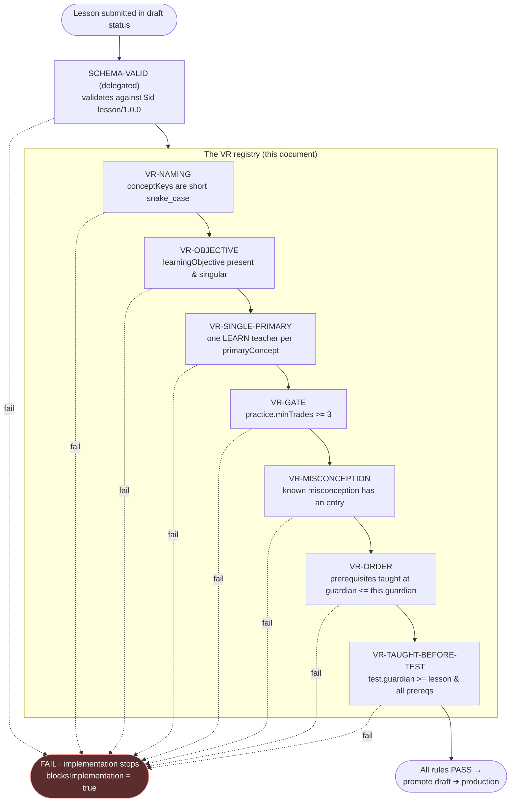

> **STATUS: RATIFIED** — ChartQuest Architecture v1.0 · Ratified 2026-07-15
> **Do not modify directly.** Part of the official ChartQuest ratified architecture. Changes require an ADR, migration notes, approval, and re-ratification — see `docs/architecture-ratified/ARCHITECTURE_CHANGE_POLICY.md`.

# ChartQuest Validation Contracts

> **CANONICAL REFERENCE.** The single source of truth for the Lesson object is [`CHARTQUEST_LESSON_SCHEMA.json`](CHARTQUEST_LESSON_SCHEMA.json); for object ownership and the frozen decisions (D1–D8), [`CHARTQUEST_CANONICAL_OBJECT_REGISTRY.md`](CHARTQUEST_CANONICAL_OBJECT_REGISTRY.md). This document *references* those fields and rules — it does not redefine them. Where this document conflicts with the schema or the registry, **they govern.**

> **Document class:** Canonical Curriculum-Engine specification (Phase 1 — analysis + specification only; NO source or gameplay changes)
> **Path:** `docs/curriculum-engine/CHARTQUEST_VALIDATION_CONTRACTS.md`
> **Date:** 2026-07-15
> **Role (Registry §1):** This is the **sole `VR-*` registry** (D6). It owns the identity and pass/FAIL predicate of every validation rule. Every other document — and the Lesson object's own `validationRules` array — cites these `VR-*` ids **by link**; none lists rules locally.

---

## 0. The one rule that governs every other rule

**If any validation fails, implementation stops.**

Every rule here carries `blocksImplementation: true`. A validation contract is not advisory: a Lesson that fails any contract is **not authored**. It does not advance to the `production` status (see the `status` enum in the schema and the lesson state machine in `CHARTQUEST_AUTHORING_PIPELINE.md`), it emits no code, and no author may "wire it up anyway."

This inverts today's **default-open** failure modes (`conceptTier()` returns "fully shown" for unknown keys; `imLessonMeta` returns a generic card for missing data; `openConceptPractice` no-ops on a missing target). The validation engine is **default-closed**: an unmet contract is a hard stop, not a silent fallback.

---

## 1. The validation engine is deterministic

Every rule is a **pure predicate** over (a) the Lesson object under authorship, validated against [`CHARTQUEST_LESSON_SCHEMA.json`](CHARTQUEST_LESSON_SCHEMA.json), and (b) the curriculum graph in `CHARTQUEST_CURRICULUM_GRAPH.md`. Same input → same verdict, every time. No rule consults runtime state, randomness, network, or human judgment.

Each rule is stated as:

- **`id`** — the canonical `VR-*` id (the same id a lesson lists in its `validationRules`).
- **Assertion** — the exact boolean that must hold, expressed over **byte-identical schema field names**.
- **PASS / FAIL** — what each verdict means.
- **`blocksImplementation`** — always `true`.
- **Failure message** — the deterministic diagnostic the author reads.

---

## 2. Shape validation is delegated, not redefined

**This document defines NO lesson schema.** A lesson's *shape* — required fields, types, enums, `additionalProperties: false` — is owned entirely by [`CHARTQUEST_LESSON_SCHEMA.json`](CHARTQUEST_LESSON_SCHEMA.json) (`$id: https://chartquest.dev/schema/lesson/1.0.0`).

Stage 0 of the pipeline is therefore a single delegated step:

> **`SCHEMA-VALID` (delegated):** the Lesson object validates against `$id: https://chartquest.dev/schema/lesson/1.0.0`. Run any draft-2020-12 validator against that `$id`. If it fails, stop — the field is missing, mistyped, unknown (`additionalProperties: false`), a bad enum, or a `conceptKey` that violates the schema's `^[a-z][a-z0-9_]*$` pattern. There is no second field table to consult.

The `VR-*` contracts below assume `SCHEMA-VALID` has already passed. They add the **whole-lesson and whole-graph reasoning that JSON Schema cannot express**: single-teacher-per-concept, temporal teach-order, the ≥3-trade gate, misconception coverage, and naming consistency.

The pipeline is **fail-fast**: cheap per-lesson checks (naming, objective) run before whole-graph checks (order, teach-before-test), and the pipeline halts at the first failing stage.

---

## 3. The contracts

Field references below are byte-identical to [`CHARTQUEST_LESSON_SCHEMA.json`](CHARTQUEST_LESSON_SCHEMA.json). Where a contract references a *placement*, it uses `guardian` — the one authored placement field (D1); `hour` and `unlockLevel` are aliases equal to `guardian` and are never separately consulted.

### `VR-NAMING`
- **Assertion:** every concept key a lesson carries — `primaryConcept`, and each entry of `prerequisites`, `unlocks`, `reinforces`, and `misconceptions[].remediationConceptKey` — is a **short snake_case** key matching the schema pattern `^[a-z][a-z0-9_]*$` and resolves in the Concept Catalogue (owned by the Pattern Library, D5). No invented long forms (D3).
- **PASS:** every key is a known short snake_case `conceptKey`.
- **FAIL:** a key uses camelCase, a long-form phrase, or does not resolve in the catalogue.
- **`blocksImplementation`:** `true`.
- **Failure message:** `VR-NAMING: lesson '<lessonId>' — key '<value>' is not a short snake_case conceptKey resolving in the Concept Catalogue (D3).`

### `VR-OBJECTIVE`
- **Assertion:** the lesson states a non-empty `learningObjective` and **exactly one** `primaryConcept` (D4). The objective is worded for a 10-year-old (one sentence: what the player can DO).
- **PASS:** one primary concept, objective present and singular.
- **FAIL:** empty `learningObjective`; a `primaryConcept` that is empty or would encode more than one concept.
- **`blocksImplementation`:** `true`.
- **Failure message:** `VR-OBJECTIVE: lesson '<lessonId>' — must state exactly ONE primaryConcept and a non-empty learningObjective.`

### `VR-SINGLE-PRIMARY`
- **Assertion:** across the **whole graph**, for each `conceptKey` there is **at most one** lesson whose `primaryConcept == conceptKey`. No concept has two teachers.
- **PASS:** a bijection between taught concepts and their single teaching lesson.
- **FAIL:** two lessons both claim the same `primaryConcept` (e.g. a legacy `support_resist` node teaching both `support` and `resistance`).
- **`blocksImplementation`:** `true`.
- **Failure message:** `VR-SINGLE-PRIMARY: concept '<conceptKey>' is primary-taught by multiple lessons: [<lessonId>, <lessonId>]. Exactly one is permitted (D4).`

### `VR-GATE`
- **Assertion (data, not prose):** `practice.minTrades >= 3`. The schema already floors this field at 3; `VR-GATE` is the whole-lesson restatement that the ≥3-trades-per-level design law is satisfied before the boss `test` beat is reachable.
- **PASS:** `practice.minTrades >= 3`.
- **FAIL:** `practice.minTrades < 3`, or a `test` beat reachable without a satisfied `practice` beat.
- **`blocksImplementation`:** `true`.
- **Failure message:** `VR-GATE: lesson '<lessonId>' — practice.minTrades=<n> < 3. A level needs >=3 trades before its boss.`

### `VR-MISCONCEPTION`
- **Assertion:** if the primary concept has a known common misconception, the lesson carries a matching entry in `misconceptions[]` — each with `belief` and `whyWrong` (schema-required) and, where a wrong answer catches it, a `distractor` and a `remediationConceptKey`. A lesson with a known misconception and no entry FAILS.
- **PASS:** every known misconception for the concept is covered.
- **FAIL:** a known misconception has no `misconceptions[]` entry, or an entry omits its `whyWrong` remediation.
- **`blocksImplementation`:** `true`.
- **Failure message:** `VR-MISCONCEPTION: lesson '<lessonId>' — concept '<primaryConcept>' has a known misconception with no misconceptions[] entry.`

### `VR-ORDER`
- **Assertion:** every entry of `prerequisites` is the `primaryConcept` of some lesson taught at `guardian <= this.guardian`. No prerequisite points forward in time (no forward dependency). This is the rule the schema names on the `prerequisites` field.
- **PASS:** every prerequisite is taught at or before this lesson's `guardian`.
- **FAIL:** a prerequisite concept is taught at a later `guardian`, or is never taught.
- **`blocksImplementation`:** `true`.
- **Failure message:** `VR-ORDER: lesson '<lessonId>' (guardian <g>) — prerequisite '<conceptKey>' is taught at guardian <g'> > <g> (or never). Never require the untaught.`

### `VR-TAUGHT-BEFORE-TEST`
- **Assertion:** `test.guardian >= this lesson's guardian` **and** `test.guardian >= guardian` of every prerequisite's teaching lesson. A Guardian may only examine concepts taught at or before its own `guardian`. This is the rule the schema names on `test.guardian`.
- **PASS:** the testing Guardian is at or after this lesson and all its prerequisites. (`test.guardian == this.guardian` is permitted, including at `guardian: 0` — The Gambler, D7.)
- **FAIL:** the boss round tests a concept — this lesson's or a prerequisite's — that is taught at a later `guardian`.
- **`blocksImplementation`:** `true`.
- **Failure message:** `VR-TAUGHT-BEFORE-TEST: lesson '<lessonId>' — test.guardian=<gT> but concept '<conceptKey>' is taught at guardian <gC> > <gT>. Never test the untaught.`

### `VR-DAG`
- **Assertion:** the `prerequisites` graph over all lessons is acyclic — a legal teaching order exists.
- **PASS:** no cycle.
- **FAIL:** any `prerequisites` cycle (A requires B … requires A).
- **`blocksImplementation`:** `true`.
- **Failure message:** `VR-DAG: prerequisites cycle detected: <a> -> <b> -> ... -> <a>. No legal teaching order exists.`

### `VR-REACHABILITY`
- **Assertion:** every concept in the catalogue is taught by exactly one lesson, is reachable from an entry concept (no orphan nodes), and is eventually tested by some Guardian.
- **PASS:** no orphan or untested concept.
- **FAIL:** a concept has no teaching lesson, is unreachable, or is never tested.
- **`blocksImplementation`:** `true`.
- **Failure message:** `VR-REACHABILITY: concept '<conceptKey>' is orphaned/untested.`

### `VR-REFS`
- **Assertion:** every asset id a lesson references — `learn.patternRef`, `learn.lessonChartScene`, `apply.tradeScenarioRef`, `test.mgId`, `practice.setups[]`, `misconceptions[].remediationConceptKey` — resolves to a real, existing asset.
- **PASS:** all references resolve.
- **FAIL:** any dangling reference.
- **`blocksImplementation`:** `true`.
- **Failure message:** `VR-REFS: lesson '<lessonId>' references missing asset '<ref>'.`

---

## 4. Contract summary (the author's one-screen reference)

| `id` | Scope | Enforces | Reads (schema field) | Blocks impl. |
|---|:---:|---|---|:---:|
| `SCHEMA-VALID` | lesson | shape/types/enums/`additionalProperties:false` | delegated to `$id lesson/1.0.0` | ✅ |
| `VR-NAMING` | lesson | conceptKeys are short snake_case (D3) | `primaryConcept`, `prerequisites`, `unlocks`, `reinforces`, `misconceptions[].remediationConceptKey` | ✅ |
| `VR-OBJECTIVE` | lesson | exactly one primary concept + objective (D4) | `primaryConcept`, `learningObjective` | ✅ |
| `VR-SINGLE-PRIMARY` | graph | one teacher per concept (D4) | `primaryConcept` | ✅ |
| `VR-GATE` | lesson | ≥3 trades before the boss | `practice.minTrades` | ✅ |
| `VR-MISCONCEPTION` | lesson | known misconceptions are covered | `misconceptions[]` | ✅ |
| `VR-ORDER` | graph | prerequisites taught at `guardian <= this.guardian` | `prerequisites`, `guardian` | ✅ |
| `VR-TAUGHT-BEFORE-TEST` | graph | boss tests only taught concepts | `test.guardian`, `guardian`, `prerequisites` | ✅ |
| `VR-DAG` | graph | prerequisites graph is acyclic | `prerequisites` | ✅ |
| `VR-REACHABILITY` | graph | no orphan / untested concepts | `primaryConcept`, `prerequisites`, `test` | ✅ |
| `VR-REFS` | lesson | all referenced asset ids resolve | `learn`, `apply`, `test.mgId`, `practice.setups`, `misconceptions[]` | ✅ |

> **Closing invariant.** Every `VR-*` blocks implementation. A Lesson reaches `production` status only when `SCHEMA-VALID` and every applicable `VR-*` pass. The lesson lists the `VR-*` ids it must satisfy in its `validationRules` array (see the `bos` example in `CHARTQUEST_CANONICAL_OBJECT_REGISTRY.md` §3: `["VR-OBJECTIVE","VR-SINGLE-PRIMARY","VR-ORDER","VR-TAUGHT-BEFORE-TEST"]`); those ids resolve here and nowhere else (D6).
