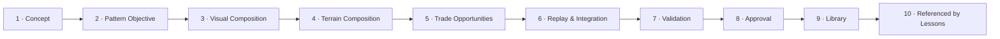

> **STATUS: RATIFIED** — ChartQuest Architecture v1.0 · Ratified 2026-07-15
> **Do not modify directly.** Part of the official ChartQuest ratified architecture. Changes require an ADR, migration notes, approval, and re-ratification — see `docs/architecture-ratified/ARCHITECTURE_CHANGE_POLICY.md`.

# ChartQuest Pattern Authoring Guide

> **CANONICAL REFERENCE.** The single source of truth for the Pattern object is [`CHARTQUEST_PATTERN_SCHEMA.json`](CHARTQUEST_PATTERN_SCHEMA.json); ownership & examples live in [`CHARTQUEST_PATTERN_OBJECT_MODEL.md`](CHARTQUEST_PATTERN_OBJECT_MODEL.md). This document references them; it does not redefine them. Where it conflicts, they govern.

**Status: CANONICAL companion, v1.0.0, aligned to schema 1.0.0 (ratified 2026-07-15).** This is the **production workflow** for the Pattern Operating System (Phase 2A). It tells an author — human or AI — exactly how to take a pattern from an idea to a library entry a lesson can reference. It **extends** the ratified architecture and duplicates none of it: geometry belongs to the [Visual Market Constitution](../../CHARTQUEST_VISUAL_MARKET_CONSTITUTION.md), trade truth to [`trading_canon.md`](../canon/trading_canon.md), lesson sequencing to the [Curriculum Engine](../curriculum-engine/). This guide never restates a pixel rule, a trade outcome, or a `VR-*` definition — it points to the authority that owns each.

---

## 0. How to use this guide (read this first)

Building a pattern is not creative free-drawing. It is **filling one schema by analogy to a proven example, then delegating every hard rule to the system that owns it.** Three laws hold across every stage below:

1. **Fill the schema — nothing more, nothing less.** The [Pattern schema](CHARTQUEST_PATTERN_SCHEMA.json) `required[]` array is the contract. A field that is absent is a `SCHEMA-VALID` failure; a field this guide does not mention is not yours to invent (`additionalProperties: false`).
2. **Copy the nearest of the five gold-standard patterns.** The Object Model [§5](CHARTQUEST_PATTERN_OBJECT_MODEL.md) ships five reference implementations — `impulse-bull`, `pullback-bull`, `breakout-bos`, `range-sr`, `reversal-choch`. Start from the one whose `marketStructure` matches yours and mutate its values. Never start from a blank object.
3. **Reference — never invent — geometry, concepts, or outcomes.** Candle pixels come from the Constitution's Standards Table (Appendix A). Concept identity comes from the [Concept Catalogue](CHARTQUEST_PATTERN_OBJECT_MODEL.md#2-the-concept-catalogue-pattern-os-owns-this). Whether a trade wins comes from `trading_canon.md`. A pattern that mints its own number, its own concept, or its own outcome is rejected — that duplication is the exact root bug this system exists to end.

The ten pipeline stages are ordered. Each has **Inputs → Outputs → Owner → Exit criteria**, names the **schema fields it fills**, and names the **authority to consult**. Do not skip forward: a later stage's exit criteria assume the earlier fields are already filled and frozen.

### The pipeline at a glance

The lifecycle `status` field advances in lock-step with the pipeline. The mapping is exact and is owned by the state machine in Object Model [§4](CHARTQUEST_PATTERN_OBJECT_MODEL.md#4-pattern-lifecycle-state-machine):

| Pipeline stage | `status` on completion |
|---|---|
| 1–6 authoring | `draft` |
| 7 Validation (delegated checks PASS) | `in_review` → `validated` |
| 8 Approval (Human Playtest Gate + sign-off) | `approved` |
| 9 Library (shipped, referenced) | `production` |
| Later supersession | `deprecated` → `retired` |

---

## Stage 1 — Concept

Pick the **one** thing this pattern teaches. This is the anchor everything else hangs from.

- **Inputs:** a teaching need (from a lesson gap or curriculum plan); the [Concept Catalogue](CHARTQUEST_PATTERN_OBJECT_MODEL.md#2-the-concept-catalogue-pattern-os-owns-this).
- **Outputs:** a chosen `primaryConcept` conceptKey and any `supportingConcepts`; the candle vocabulary the reader must already own.
- **Owner:** Pattern OS (the Concept Catalogue is owned here — Frozen Decision **P3**).
- **Authority to consult:** the **Concept Catalogue** ([Object Model §2](CHARTQUEST_PATTERN_OBJECT_MODEL.md#2-the-concept-catalogue-pattern-os-owns-this)) — the sole map of `conceptKey → { masteryCategory, guardian }`.
- **Schema fields filled:** `primaryConcept`, `supportingConcepts`, `requiredCandleVocabulary`.

**Rules.** A pattern anchors **exactly one** `primaryConcept` (**P4**). The value is a short snake_case conceptKey that already resolves in the Catalogue (`bos`, `choch`, `support_resist`, `pullback`, `momentum`, …) — you do **not** coin a new key here, and `masteryCategory` is **derived** from the Catalogue, never stored on the pattern (**P3**). `supportingConcepts` may name secondary keys, but only concepts that are taught *earlier* — the Curriculum teach-order DAG (`VR-ORDER`) will later reject a support concept that isn't yet taught.

**Exit criteria:** `primaryConcept` resolves to a live Catalogue key; every `supportingConcepts` key resolves and is plausibly taught before this pattern's guardian; `requiredCandleVocabulary` lists only terms a prior lesson establishes.

---

## Stage 2 — Pattern Objective

Turn the concept into the pattern's identity: what it *is*, how hard it is, what the player should feel, and the misconception it must defuse.

- **Inputs:** the Stage-1 concept; the ten-year-old wording rule; the nearest gold-standard example.
- **Outputs:** a titled, tiered, emotionally-scoped pattern stub in `draft`.
- **Owner:** Pattern OS (patterns own market structure, educational intent, emotional beat, concept identity — **P5**).
- **Authority to consult:** [Object Model §3 field groups](CHARTQUEST_PATTERN_OBJECT_MODEL.md#3-field-groups-the-schema-explained) for grouping; the Constitution's **Purpose / Difficulty** acceptance criteria ([Pattern Library Specification](../../CHARTQUEST_VISUAL_MARKET_CONSTITUTION.md#pattern-library-specification)) for the wording bar.
- **Schema fields filled:** identity & lifecycle — `patternId`, `uuid`, `version`, `schemaVersion` (`"1.0.0"`), `status` (`"draft"`), `owner`, `lastReviewed`; educational — `educationalPurpose`, `difficultyTier`; market taxonomy — `marketStructure`, `patternFamily`, `patternCategory`; pedagogy — `requiredEmotionalBeat`, `expectedPlayerObservation`, `expectedBeginnerMistake`, `teachingNotes`.

**Rules.** `patternId` is a stable kebab-case id and is the id a `Lesson.patternRef` will later point to (**P8**) — choose it once and never reuse it. `educationalPurpose` is one sentence of ten-year-old wording that names the **same** concept as `primaryConcept`; a pattern with two "main points" is split into two patterns. `difficultyTier` (1–5) expresses hardness through chart type, density, rhythm, and exaggeration-gain — **never** by dropping below the Constitution's readability floor. `marketStructure` is one of the eight structural shapes (`impulse`, `pullback`, `breakout`, `range`, `reversal`, `consolidation`, `continuation`, `sweep`); `patternFamily` is the indexing taxonomy (`momentum`, `continuation`, `breakout`, `range`, `reversal`, `liquidity`). `requiredEmotionalBeat` carries the pattern-owned `hook`/`stakes`/`payoff` (**P5** — a lesson may frame the beat but the beat originates here). `expectedBeginnerMistake` is load-bearing: it feeds the lesson's misconception handling.

**Exit criteria:** every required identity/educational/pedagogy field is present and non-empty; `educationalPurpose` names exactly the `primaryConcept`; `difficultyTier` ∈ [1,5]; wording passes the ten-year-old bar.

---

## Stage 3 — Visual Composition

Declare **how this instance renders** and how exaggerated it is — then hand every pixel to the Constitution.

- **Inputs:** the Stage-2 stub; the target teaching context (illustration vs terrain vs exam).
- **Outputs:** the chart type(s) and the exaggeration-gain position, as a **reference** to the Constitution.
- **Owner:** Pattern OS declares *which* rules apply; the **Visual Market Constitution owns the rules themselves** (**P2**).
- **Authority to consult:** the [Visual Market Constitution — Standards Table (Appendix A)](../../CHARTQUEST_VISUAL_MARKET_CONSTITUTION.md#appendix-a--standards-table-single-source-of-truth) and the ten constraints in [Pattern Library Standards](../../CHARTQUEST_VISUAL_MARKET_CONSTITUTION.md#pattern-library-standards).
- **Schema fields filled:** `chartTypes`, `requiredVisualRules` (`authority`, `chartType`, `exaggerationGain`, and later `playtestRecordRef`).

**Rules.** `requiredVisualRules.authority` is the **fixed constant** `CHARTQUEST_VISUAL_MARKET_CONSTITUTION.md#appendix-a-standards-table` — the pattern points at the geometry authority and **restates none of it** (**P2**). `chartType` (A illustration / B terrain / C exam) selects the BW band, density, and readability floor; each rendered instance is exactly one type and is validated as that type, though a pattern may *transition* A→B→C across a level (`chartTypes` may list more than one). `exaggerationGain` is a position on the Constitution's ramp: `1.0` for a Type-A illustration, `0.0` for a realistic Type-C exam. Body width, corner radius (`0`), colour, sheen, separator, floors — none of these appear on the pattern object; the validator reads them from the Standards Table at Stage 7.

**Exit criteria:** `chartTypes` non-empty and each ∈ {A,B,C}; `requiredVisualRules.authority` is the exact constant; `chartType` matches the primary rendered instance; `exaggerationGain` ∈ [0,1] and consistent with the chart type (Type A high, Type C low).

---

## Stage 4 — Terrain Composition

Author the candles-as-road: how many candles, what rhythm, what verticality. Declare **intent**; the numeric floors stay in the Constitution.

- **Inputs:** the Stage-3 chart type; the traversal/rhythm laws.
- **Outputs:** the traversal geometry the pattern owns.
- **Owner:** Pattern OS (traversal geometry is pattern-owned — **P5**); the numeric floors are owned by the Constitution.
- **Authority to consult:** the Constitution's **Terrain quality** and **Traversal quality** acceptance criteria ([Pattern Library Specification](../../CHARTQUEST_VISUAL_MARKET_CONSTITUTION.md#pattern-library-specification)) and constraint **7** of [Pattern Library Standards](../../CHARTQUEST_VISUAL_MARKET_CONSTITUTION.md#pattern-library-standards).
- **Schema fields filled:** `requiredTerrainCharacteristics` (`targetVisibleCount`, `rhythmProfile`, `verticalityIntent`).

**Rules.** `targetVisibleCount` is the authored on-screen candle count; combined with the Constitution's pinned slot rule it **fully determines** `bodyW` — which is the whole point of the auditable geometry (you record the count; the engine derives the width). `rhythmProfile` and `verticalityIntent` are human summaries of the walk ("one long impulse run then a rest step"). You do **not** write jump distances, step heights, or CV numbers onto the pattern — those thresholds (near-equal limits, the dead-band rule, net verticality, max gap, jump cadence, etc.) live in the Constitution and are checked by `PR-TRAVERSAL` at Stage 7. Do-not-resurrect: no pattern reintroduces the deleted Guardian-Trial traversal gauntlet — the boss is a knowledge exam.

**Exit criteria:** `targetVisibleCount` set to an integer the chart type's density band allows; `rhythmProfile` and `verticalityIntent` describe a walk that plausibly satisfies the Constitution's traversal floors (verified for real at Stage 7).

---

## Stage 5 — Trade Opportunities

Place the decisive setup: **where** the decision candle sits and **how clearly** it reads. Say nothing about whether it wins.

- **Inputs:** the Stage-2 concept and beat; the Stage-4 terrain.
- **Outputs:** one or more trade-opportunity placements, each pointing at the trade-truth owner.
- **Owner:** Pattern OS owns *placement* (visual); **`trading_canon.md` + TES own outcome, probability, causality** (**P6**).
- **Authority to consult:** the Constitution's **Trade opportunities** field and **Trade Standards** ([Pattern Library Specification](../../CHARTQUEST_VISUAL_MARKET_CONSTITUTION.md#pattern-library-specification)) for the visual layer; [`docs/canon/trading_canon.md`](../canon/trading_canon.md) + [`CHARTQUEST_TRADING_EXPERIENCE_SYSTEM_v1.1.md`](../../CHARTQUEST_TRADING_EXPERIENCE_SYSTEM_v1.1.md) for truth.
- **Schema fields filled:** `tradeOpportunities[]` (`decisiveCandle`, `direction`, `readsAs`, `tradeTruthRef`); `allowedTradeTypes` / `forbiddenTradeTypes`.

**Rules.** Each opportunity records `decisiveCandle` (which candle is the decision point), `direction` (`long`/`short`/`none`), and `readsAs` (the visual evidence a ten-year-old reads — "full body closes past the prior high"). `tradeTruthRef` is a **pointer** to the `trading_canon`/TES scenario that owns the outcome — **never an outcome value** (**P6**). Placement must let the level reach **≥ 3 trades before its boss** — the counting law, machine-enforced downstream by `VR-GATE` (Curriculum) / the Constitution's V-47. The decisive candle must meet its type floor and be unambiguously directional (never in the 2–4px doji band unless the taught concept *is* a doji). A trade outcome must never be encoded as a visual win-knob.

**Exit criteria:** at least one `tradeOpportunity` with all three required subfields; every `tradeTruthRef` resolves to a real `trading_canon`/TES scenario and encodes **no** outcome locally; placement supports the ≥3-trades-before-boss law; `allowedTradeTypes` matches the directions actually placed.

---

## Stage 6 — Replay & Integration

Declare **suitability** for the downstream surfaces — replay, notebook, journal, analytics — and the lesson **compatibility** envelope. Compatibility, not coupling.

- **Inputs:** the finished authoring fields from Stages 1–5.
- **Outputs:** the integration flags and the allowed/forbidden lesson envelope.
- **Owner:** Pattern OS declares *suitability*; **Lessons own the actual replay sequence, notebook, and journal content** (**P5**).
- **Authority to consult:** [Object Model §3 Integration group](CHARTQUEST_PATTERN_OBJECT_MODEL.md#3-field-groups-the-schema-explained); the Curriculum Lesson object for how a lesson consumes these.
- **Schema fields filled:** `replayCompatibility`, `notebookCompatibility`, `journalCompatibility`, `analyticsEvents`, `allowedLessons`, `forbiddenLessons`.

**Rules.** These are booleans and lists of **permission**, not behaviour: `replayCompatibility: true` means the pattern *may* be shown in a post-trade replay — the replay **sequence** is still owned by the Lesson (**P5**). `allowedLessons`/`forbiddenLessons` express lesson **compatibility** only (`['any']` is allowed); the lesson decides actual usage (**P8**). A Type-C exam-only pattern, for instance, is `forbiddenLessons`-listed against a first LEARN. `analyticsEvents` names the content-event strings a rendered instance emits (Block-4 event engine).

**Exit criteria:** compatibility flags set deliberately (not defaulted blindly); `forbiddenLessons` covers any context the pattern must never serve; the pattern is a complete `draft` with every `required[]` field present — i.e. `SCHEMA-VALID` is now achievable.

---

## Stage 7 — Validation

Run the delegated checks. The pattern proves it is structurally sound, visually legal, and curriculum-compatible — by **reusing** the three validator suites, redefining none.

- **Inputs:** the complete `draft`; the three validator registries.
- **Outputs:** a `validationRules[]` list that PASSes; `dependencies[]`; `status` advanced `draft → in_review → validated`.
- **Owner:** validation **delegates** (**P7**): visual → Constitution `V-*`; educational/sequence → Curriculum `VR-*`; pattern-structural → this suite's `PR-*`.
- **Authority to consult:**
  - `PR-*` (pattern-structural) resolve in **`CHARTQUEST_PATTERN_VALIDATION_CONTRACTS.md`** — e.g. `PR-ONE-CONCEPT`, `PR-VISUAL`, `PR-TRAVERSAL`, `PR-TRADE-PLACEMENT`, `PR-DAG`.
  - `VR-*` (educational/sequence) resolve in the Curriculum's [`CHARTQUEST_VALIDATION_CONTRACTS.md`](../curriculum-engine/CHARTQUEST_VALIDATION_CONTRACTS.md) — e.g. `VR-ORDER` (prerequisites taught at `guardian ≤ this.guardian`), `VR-GATE` (≥3 trades before the boss), `VR-REFS` (referenced assets resolve). **These are never re-defined on the pattern side** — the pattern's `validationRules[]` merely *lists the ids it must satisfy*, exactly as a Lesson lists its own.
  - `V-*` (chart validators) resolve in the [Visual Market Constitution](../../CHARTQUEST_VISUAL_MARKET_CONSTITUTION.md) validator table.
- **Schema fields filled:** `validationRules[]`, `dependencies[]` (and `breakingChanges`/`migrationNotes` if superseding).

**Rules.** `validationRules[]` ids match `^(PR|VR|V)-[A-Z0-9-]+$` and **resolve elsewhere** — no rule text lives on the pattern. `dependencies[]` names prerequisite `patternId`s (a `breakout` depends on a `range` existing) and must form a DAG (`PR-DAG`). A pattern reaches `validated` only when **every applicable** `PR-*` + delegated `V-*`/`VR-*` PASS; that is the `in_review → validated` guard in Object Model §4.

**Exit criteria:** every id in `validationRules[]` PASSes against its owning registry; `dependencies[]` is acyclic; `status = "validated"`.

---

## Stage 8 — Approval

A human signs off after the pattern **survives real ten-year-olds**. This gate cannot be automated away.

- **Inputs:** the `validated` pattern; a Human Playtest Gate result.
- **Outputs:** `status → approved`; `requiredVisualRules.playtestRecordRef` filled; `owner`/`lastReviewed` current.
- **Owner:** the pattern `owner` (sign-off) + the Human Playtest Gate.
- **Authority to consult:** the Object Model §4 `validated → approved` guard; the Constitution's **Human Playtest Gate** (QA Checklist) — the **≥5-child, ≥90%, ≥1-CVD** comprehension bar.
- **Schema fields filled:** `status` (`"approved"`), `requiredVisualRules.playtestRecordRef`, `lastReviewed`.

**Rules.** `approved` requires a Human Playtest Gate on file (≥5 children, ≥90% label-hidden comprehension, ≥1 colour-vision-deficient tester) **plus** owner sign-off. `playtestRecordRef` links that result and is **required to ship**. No amount of passing validators substitutes for the playtest — comprehension is *measured*, not asserted.

**Exit criteria:** Playtest Gate result linked and meets the bar; owner sign-off recorded; `status = "approved"`. Only now may a production lesson reference the pattern.

---

## Stage 9 — Library

The approved pattern is shipped and indexed. It becomes a first-class, reusable building block.

- **Inputs:** the `approved` pattern.
- **Outputs:** a `production` library entry, indexed by `patternFamily`/`primaryConcept`.
- **Owner:** the Pattern Library.
- **Authority to consult:** the Object Model §4 `approved → production` guard.
- **Schema fields filled:** `status` (`"production"`).

**Rules.** The `approved → production` transition fires when the pattern is referenced by **≥1 production Lesson** and shipped. Library indexing uses `patternFamily` and `primaryConcept` so a future author can find "the nearest example" fast — which is how this system cuts build time (Object Model §6).

**Exit criteria:** `status = "production"`; entry discoverable by concept and family; no geometry, concept, or outcome was minted anywhere in the object.

---

## Stage 10 — Referenced by Lessons

A Lesson wires the pattern into a learning flow. The link is one-directional and by-id.

- **Inputs:** the `production` pattern; a Lesson being authored (Curriculum Engine).
- **Outputs:** a `Lesson.learn.patternRef` / `Lesson.requiredPatterns[]` pointing at this `patternId`.
- **Owner:** the **Curriculum Engine / Lesson** (lessons own learning sequence, flow, notebook, replay sequence, trade scripting — **P5**).
- **Authority to consult:** the [Curriculum Engine](../curriculum-engine/); `VR-REFS` in the [Curriculum validation contracts](../curriculum-engine/CHARTQUEST_VALIDATION_CONTRACTS.md).
- **Schema fields touched:** none on the pattern — the link lives on the **Lesson** side (**P8**).

**Rules.** The Lesson→Pattern link is `Lesson.learn.patternRef` / `Lesson.requiredPatterns[] → Pattern.patternId` (**P8**). A pattern declares lesson **compatibility** (`allowedLessons`/`forbiddenLessons`) but **never hard-couples** to a concrete `lessonId`. A Lesson referencing a **non-approved** pattern fails Curriculum `VR-REFS` — the ship gate is enforced from the Curriculum side, not by hope.

**Exit criteria:** a production Lesson references the `patternId`; `VR-REFS` PASSes on the Lesson; the pattern's `allowedLessons` envelope permits that lesson.

---

## 11. Worked example — `breakout-bos` through the whole pipeline

The following walks **one** of the five gold-standard patterns — `breakout-bos` — end to end. Every value is quoted **verbatim** from the [Object Model §5](CHARTQUEST_PATTERN_OBJECT_MODEL.md#5-the-five-gold-standard-reference-patterns) reference implementation; nothing here is invented. Build pattern #200 by doing exactly this, starting from whichever of the five sits closest to your `marketStructure`.

**Stage 1 — Concept.** Anchor the one concept: `"primaryConcept": "bos"`, with `"supportingConcepts": ["support_resist", "momentum"]` and `"requiredCandleVocabulary": ["body", "close", "wick"]`. All three keys resolve in the Concept Catalogue; `bos` sits in `masteryCategory: "Structure"`, `guardian: 3` (derived from the Catalogue, not stored here). The support concepts `support_resist` (Trend, guardian 2) and `momentum` (Structure, guardian 3) are taught at or before guardian 3, satisfying `VR-ORDER` in advance.

**Stage 2 — Pattern Objective.** Identity and pedagogy:
- `"patternId": "breakout-bos"`, `"schemaVersion": "1.0.0"`, `"status": "approved"` (shown at its shipped state; it began life as `draft`), `"owner": "pattern-library"`.
- `"educationalPurpose": "Watch price CLOSE past the last high — that break means the trend keeps going."` — one sentence, ten-year-old wording, naming exactly `bos`.
- `"difficultyTier": 3`, `"marketStructure": "breakout"`, `"patternFamily": "breakout"`.
- `"requiredEmotionalBeat": { "hook": "The ceiling has held twice… will it break?", "stakes": "Guess the break wrong and the trap gets you.", "payoff": "A strong close broke it — you called the Break of Structure." }`.
- `"expectedPlayerObservation": "A candle closes clearly above the level that rejected price twice."`
- `"expectedBeginnerMistake": "Counting a wick that pokes above (but closes back) as the break."` — this feeds the lesson's misconception handling.

**Stage 3 — Visual Composition.** `"chartTypes": ["A", "B"]` (it transitions from illustration to terrain across the level), and the reference to the Constitution: `"requiredVisualRules": { "authority": "CHARTQUEST_VISUAL_MARKET_CONSTITUTION.md#appendix-a-standards-table", "chartType": "A", "exaggerationGain": 1.0 }`. Note the exaggeration is at the ramp's high end (`1.0`) because the primary rendered instance is a Type-A illustration. **No pixel value appears** — the authority constant carries them all.

**Stage 4 — Terrain Composition.** `"requiredTerrainCharacteristics": { "targetVisibleCount": 10, "rhythmProfile": "a ceiling tested twice, then one decisive break-and-go", "verticalityIntent": "flat-ish then a step up through the level" }`. The count `10` plus the Constitution's slot rule fully determines `bodyW`; the rhythm and verticality are prose intent — the traversal floors are checked by `PR-TRAVERSAL`, not written here.

**Stage 5 — Trade Opportunities.** `"allowedTradeTypes": ["long"]`, `"forbiddenLessons": []`, and:
`"tradeOpportunities": [ { "decisiveCandle": "the breakout close", "direction": "long", "readsAs": "full body closes past the prior high", "tradeTruthRef": "trading_canon:bos_long" } ]`. The `tradeTruthRef` **points** at `trading_canon:bos_long` and encodes no outcome locally (**P6**). `"allowedLessons": ["bos"]`.

**Stage 6 — Replay & Integration.** `"replayCompatibility": true`, `"notebookCompatibility": true`, `"journalCompatibility": true`; lesson envelope `"allowedLessons": ["bos"]`, `"forbiddenLessons": []`. The pattern is now a complete `draft` — `SCHEMA-VALID` achievable.

**Stage 7 — Validation.** `"validationRules": ["PR-ONE-CONCEPT", "PR-VISUAL", "PR-TRAVERSAL", "PR-TRADE-PLACEMENT", "PR-DAG", "VR-ORDER"]` and `"dependencies": ["range-sr"]`. Every id resolves in its owning registry (the `PR-*` in the pattern validation contracts, `VR-ORDER` in the Curriculum). `breakout-bos` depends on `range-sr` — you cannot break a level you have not first established as a range — and that dependency is acyclic (`PR-DAG`). When all six PASS, `status` advances `draft → in_review → validated`.

**Stage 8 — Approval.** With a Human Playtest Gate result (≥5 children, ≥90% comprehension, ≥1 CVD tester) linked via `requiredVisualRules.playtestRecordRef` and owner sign-off, `status → "approved"` — the state the §5 record is shown in.

**Stage 9 — Library.** Referenced by ≥1 production Lesson and shipped, `status → "production"`; indexed under `patternFamily: "breakout"`, `primaryConcept: "bos"`.

**Stage 10 — Referenced by Lessons.** The `bos` Lesson wires it in via `Lesson.learn.patternRef → "breakout-bos"`. Because the pattern is `approved`+, the Lesson's `VR-REFS` PASSes. The pattern never named the `lessonId` itself — compatibility (`allowedLessons: ["bos"]`), not coupling.

---

## 12. Author checklist

Tick every line before you call a pattern done. A single unticked line is a rejection.

**Concept & objective**
- [ ] `primaryConcept` is **one** conceptKey that resolves in the Concept Catalogue; `masteryCategory` is **not** stored on the pattern.
- [ ] `supportingConcepts` all resolve and are taught before this pattern's guardian.
- [ ] `educationalPurpose` is one ten-year-old sentence naming exactly `primaryConcept`.
- [ ] `difficultyTier` ∈ [1,5], expressed via type/density/rhythm/exaggeration — never by lowering a readability floor.
- [ ] `requiredEmotionalBeat` has `hook` + `stakes` + `payoff`; `expectedBeginnerMistake` names a real wrong read.

**Visual & terrain (referenced, not restated)**
- [ ] `requiredVisualRules.authority` is the exact Constitution constant; `chartType` and `exaggerationGain` are consistent (A high / C low).
- [ ] **No pixel, width, radius, or colour literal** appears anywhere on the object.
- [ ] `requiredTerrainCharacteristics.targetVisibleCount` fits the chart type's density band; rhythm/verticality are prose intent only.
- [ ] No resurrection of the Guardian-Trial traversal gauntlet.

**Trade opportunities (placement, not truth)**
- [ ] Each `tradeOpportunity` has `decisiveCandle` + `direction` + `readsAs`.
- [ ] Every `tradeTruthRef` **points** at a real `trading_canon`/TES scenario and encodes **no outcome**.
- [ ] Placement supports **≥3 trades before the boss**; decisive candle meets its type floor and is unambiguously directional.

**Integration, validation, approval**
- [ ] Compatibility flags (`replay`/`notebook`/`journal`, `allowed`/`forbiddenLessons`) set deliberately; **no** hard-coded `lessonId`.
- [ ] `validationRules[]` lists only `PR-*`/`VR-*`/`V-*` ids that resolve **elsewhere**; `dependencies[]` is acyclic.
- [ ] Every applicable validator PASSes → `status: "validated"`.
- [ ] Human Playtest Gate (≥5 / ≥90% / ≥1 CVD) linked via `playtestRecordRef` + owner sign-off → `status: "approved"`.
- [ ] Referenced by a production Lesson → `status: "production"`; the Lesson's `VR-REFS` PASSes.

---

## 13. The three disciplines, restated

Everything above reduces to three habits. When in doubt, obey these:

1. **Fill the schema.** The [Pattern schema](CHARTQUEST_PATTERN_SCHEMA.json) is the contract. Present, typed, and within enum — no more, no less. `additionalProperties: false` means an invented field is a hard reject.
2. **Copy the nearest of the five.** Start from `impulse-bull`, `pullback-bull`, `breakout-bos`, `range-sr`, or `reversal-choch` — whichever shares your `marketStructure` — and mutate. Never start blank; never invent an alternate example.
3. **Reference — never invent.** Geometry → the Visual Market Constitution. Concept identity → the Concept Catalogue. Trade outcome → `trading_canon.md`. Lesson sequence → the Curriculum Engine. A pattern that mints its own number, concept, or outcome is the root bug this Operating System exists to kill.
