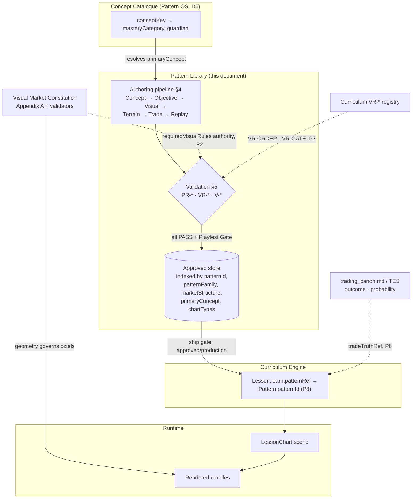

> **STATUS: RATIFIED** — ChartQuest Architecture v1.0 · Ratified 2026-07-15
> **Do not modify directly.** Part of the official ChartQuest ratified architecture. Changes require an ADR, migration notes, approval, and re-ratification — see `docs/architecture-ratified/ARCHITECTURE_CHANGE_POLICY.md`.

# ChartQuest Pattern Library Specification

> **CANONICAL REFERENCE.** The single source of truth for the Pattern object is [`CHARTQUEST_PATTERN_SCHEMA.json`](CHARTQUEST_PATTERN_SCHEMA.json); ownership & examples live in [`CHARTQUEST_PATTERN_OBJECT_MODEL.md`](CHARTQUEST_PATTERN_OBJECT_MODEL.md). This document references them; it does not redefine them. Where it conflicts, they govern.

**Status: CANONICAL, v1.0.0, ratified 2026-07-15.** No game code was changed. This is Phase 2A of the ChartQuest architecture: the Pattern Operating System. This document specifies the **library as a system** — how the canonical store of first-class Pattern objects is organized, indexed, versioned, queried, authored, validated, and consumed by lessons. It **extends** the ratified architecture and duplicates none of it.

**Read order for a new author.** (1) [`CHARTQUEST_PATTERN_SCHEMA.json`](CHARTQUEST_PATTERN_SCHEMA.json) — the object shape. (2) [`CHARTQUEST_PATTERN_OBJECT_MODEL.md`](CHARTQUEST_PATTERN_OBJECT_MODEL.md) — the ownership map, Concept Catalogue, and five gold-standard examples. (3) This document — the library system. (4) [`CHARTQUEST_VISUAL_MARKET_CONSTITUTION.md`](../../CHARTQUEST_VISUAL_MARKET_CONSTITUTION.md) §Pattern Library Standards + §Pattern Library Specification + Appendix A — the visual authority.

---

## 1. What the library is

The **Pattern Library** is the canonical store of first-class `Pattern` objects. A pattern is a reusable, authored candle sequence that does three jobs at once — teaches ONE named concept, functions as walkable terrain, and hosts a trade setup — as defined by the [schema](CHARTQUEST_PATTERN_SCHEMA.json) and the Constitution's [Pattern Library Standards](../../CHARTQUEST_VISUAL_MARKET_CONSTITUTION.md#pattern-library-standards).

The library exists to end one specific, expensive bug: **"every new lesson invents new candle proportions."** Levels 1–3 were slow because nine-plus independent draw paths each minted their own geometry, every lesson re-derived pixels, every concept was re-categorized, and every lesson pre-supposed its own scene. The library removes all four costs at once — geometry is consumed from the Constitution, concept identity is resolved in the [Concept Catalogue](CHARTQUEST_PATTERN_OBJECT_MODEL.md#2-the-concept-catalogue-pattern-os-owns-this), and lessons reference patterns instead of embedding them.

**The library is a store, not an engine.** It holds records. It renders nothing itself, decides no trade outcome, and sequences no lesson. Rendering is governed by the Constitution; trade truth by the Trading canon; sequencing by the Curriculum Engine. The library's authority begins and ends at the Pattern object.

**Membership rule.** A record is *in the library* only when its `status` is `approved` or `production` (schema `status` enum; lifecycle in [Object Model §4](CHARTQUEST_PATTERN_OBJECT_MODEL.md#4-pattern-lifecycle-state-machine)). Records in `draft`, `in_review`, or `validated` are *candidates*, not library entries; `deprecated`/`retired` records remain stored for audit and migration but may not be newly referenced. Only an `approved`/`production` pattern may be named by a production `Lesson.patternRef` (the **ship gate**, Object Model §4).

## 2. Ownership boundaries (reproduced from the Object Model §1)

The following is [`CHARTQUEST_PATTERN_OBJECT_MODEL.md`](CHARTQUEST_PATTERN_OBJECT_MODEL.md) §1, reproduced as a reference so this document stands alone. **The Object Model governs; this is a copy for convenience, not a second definition.**

A pattern sits at the junction of four ratified systems. It **owns** its slice and **references** the rest; there is no duplicated ownership, schema, or validation.

| System (SoT) | What it owns | The Pattern's relationship |
|---|---|---|
| **Pattern OS** (this suite) | market structure, visual educational intent, trade-opportunity *placement*, traversal geometry, emotional beat, **concept identity** | owns — the Pattern object |
| **Visual Market Constitution** (`CHARTQUEST_VISUAL_MARKET_CONSTITUTION.md`) | all candle geometry, readability floors, chart types A/B/C, the visual-clarity validator table | **references** via `requiredVisualRules`; validation *delegates* to its chart validators (never restated) |
| **Curriculum Engine** (`docs/curriculum-engine/`) | lesson sequencing, the `taught()` gate, `VR-*` rules, the Lesson object | Lessons **reference** a pattern via `Lesson.learn.patternRef` / `requiredPatterns[]`; pattern validation *reuses* `VR-*` |
| **Trading canon / TES** | trade truth: outcome, probability, causality | **references** via `tradeOpportunities[].tradeTruthRef`; a pattern encodes *where/how-clear*, never an outcome |

**Ownership law (no overlap).** Patterns own: market structure · visual educational intent · trade opportunities (placement) · traversal geometry · emotional beat · concept identity. Lessons own: learning sequence · lesson flow · notebook · replay sequence · trade scripting. A field appears in exactly one of these lists. This is Frozen Decision **P5** (schema `$comment`).

**Concept identity lives here.** Curriculum decision **D5** assigned concept identity and `concept → masteryCategory` to the Pattern Library; the map is materialized in [Object Model §2](CHARTQUEST_PATTERN_OBJECT_MODEL.md#2-the-concept-catalogue-pattern-os-owns-this). `masteryCategory` is **derived** from the catalogue, never stored on a pattern (**P3**). A pattern anchors exactly ONE `primaryConcept` (**P4**).

## 3. Storage, indexing, versioning, and query

### 3.1 Storage model

Each pattern is a single record conforming to [`CHARTQUEST_PATTERN_SCHEMA.json`](CHARTQUEST_PATTERN_SCHEMA.json) (`additionalProperties: false` — no field exists that the schema does not name). The record carries two identifiers with distinct jobs:

- **`patternId`** — the stable kebab-case public key (`^[a-z][a-z0-9-]*$`). This is the id a `Lesson.patternRef` points to (**P8**). It is human-readable and used in every cross-reference.
- **`uuid`** — the stable machine id, assigned once at `draft` and **never reused** (schema). Survives a `patternId` rename; the durable primary key for tooling.

`version` is the content version (e.g. `"1.0"`) — deliberately simple, **no SemVer ceremony** (Curriculum decision **D8**, schema). `schemaVersion` is the object-shape version, pinned to `"1.0.0"` by the schema `const`.

### 3.2 The indexes

The library is queryable along five first-class axes. Every axis maps directly to a schema field — the library invents no index the object does not already carry.

| Index | Schema field | Domain | Query intent |
|---|---|---|---|
| **By id** | `patternId` | kebab-case string | resolve a `Lesson.patternRef`; the primary lookup |
| **By family** | `patternFamily` | `momentum · continuation · breakout · range · reversal · liquidity` | taxonomy grouping for lesson selection |
| **By structure** | `marketStructure` | `impulse · pullback · breakout · range · reversal · consolidation · continuation · sweep` | "what is the market DOING" |
| **By concept** | `primaryConcept` (+ `supportingConcepts`) | conceptKey resolving in the Concept Catalogue | "which pattern teaches `bos`" |
| **By chart type** | `chartTypes[]` | `A · B · C` | "give me a Type-A illustration of a pullback" |

Secondary filters the store also supports, all schema-backed: `difficultyTier` (1–5), `status` (membership), `patternCategory` (finer sub-taxonomy), `allowedTradeTypes`/`allowedLessons` (compatibility), and `dependencies` (prerequisite `patternId`s, a DAG per **PR-DAG**).

**Derived index (not stored).** `masteryCategory` and `guardian` are looked up *through* `primaryConcept` via the [Concept Catalogue](CHARTQUEST_PATTERN_OBJECT_MODEL.md#2-the-concept-catalogue-pattern-os-owns-this) at query time. They are never columns on the pattern (**P3**); a query like "all `Structure`-category patterns" resolves `primaryConcept → masteryCategory` through the catalogue.

### 3.3 Versioning and lifecycle

A pattern moves through the state machine in [Object Model §4](CHARTQUEST_PATTERN_OBJECT_MODEL.md#4-pattern-lifecycle-state-machine): `draft → in_review → validated → approved → production → deprecated → retired`. Each transition has a guard (schema-valid; all validators PASS; Human Playtest Gate on file; referenced by a production lesson; superseded; unreferenced). The library does not re-specify these guards — it enforces them.

When a pattern must change materially, the author sets `breakingChanges[]` and `migrationNotes`, moves the old record to `deprecated`, and publishes a successor. `retirementRules` govern final removal from active reference. Because `uuid` never changes and `version` is a plain string, history is auditable without SemVer overhead (**D8**).

## 4. The authoring pipeline at a glance

Every pattern is built by the same linear pipeline. A future author copies the closest of the [five gold-standard patterns](CHARTQUEST_PATTERN_OBJECT_MODEL.md#5-the-five-gold-standard-reference-patterns), then walks these stages. Each stage names the system that owns it — the author fills the Pattern object and **references** the rest.

| # | Stage | What the author produces | Owner / authority |
|---|---|---|---|
| 1 | **Concept** | pick ONE `primaryConcept` (+ `supportingConcepts`) | Concept Catalogue (Object Model §2); one primary, **P4** |
| 2 | **Pattern Objective** | `educationalPurpose`, `difficultyTier`, `expectedPlayerObservation`, `expectedBeginnerMistake` | Pattern OS (this suite); 10-year-old wording |
| 3 | **Visual Composition** | `marketStructure`, `patternFamily`, `chartTypes[]`, `requiredVisualRules{}` | Constitution — geometry referenced via `requiredVisualRules.authority`, **P2** |
| 4 | **Terrain Composition** | `requiredTerrainCharacteristics{}` (visible count, rhythm, verticality) | Pattern OS owns intent; numeric floors live in the Constitution (Traversal quality) |
| 5 | **Trade Opportunities** | `tradeOpportunities[]` — *where* the decisive candle sits, *how clearly* it reads | Placement is Pattern OS (**P6**); outcome is `trading_canon.md` via `tradeTruthRef` |
| 6 | **Replay** | `replayCompatibility`, `notebookCompatibility`, `journalCompatibility` — *suitability only* | Pattern declares suitability; the **sequence** is owned by the Lesson (**P5**) |
| 7 | **Validation** | `validationRules[]` — the `PR-*`/`VR-*`/`V-*` ids that must PASS | delegated (**P7**); see §5 |
| 8 | **Approval** | Human Playtest Gate result + owner sign-off → `status: approved` | Constitution Human Playtest Gate; Object Model §4 |
| 9 | **Library** | the `approved` record enters the store, indexed per §3 | Pattern Library (this document) |
| 10 | **Referenced by Lessons** | a `Lesson.learn.patternRef` names its `patternId` | Curriculum Engine (**P8**); see §6 |

**The emotional beat** (`requiredEmotionalBeat{hook,stakes,payoff}`) is authored alongside stage 2 and travels with the pattern — a Lesson may *frame* it but the beat originates with the pattern (**P5**).

**The pipeline invariant.** No stage re-invents a value another system owns. Geometry is never restated (the Constitution owns pixels); the concept category is never re-assigned (the catalogue owns it); no concrete lesson is pre-supposed (patterns declare *compatibility*, not coupling, **P8**). These are exactly the four costs that made Levels 1–3 slow ([Object Model §6](CHARTQUEST_PATTERN_OBJECT_MODEL.md#6-how-this-cuts-build-time)).

## 5. Validation — delegated, never re-defined

A pattern's `validationRules[]` lists the ids that must PASS before it enters the library (**P7**). Validation is a three-way delegation — the library re-defines nothing:

- **`V-*` — visual.** Delegated to the [Visual Market Constitution](../../CHARTQUEST_VISUAL_MARKET_CONSTITUTION.md#appendix-a--standards-table-single-source-of-truth) chart validators. `requiredVisualRules.authority` pins the Standards Table; a pattern never restates a pixel rule (**P2**). All body-width, floor, doji-band, separator, and rhythm thresholds are read from Appendix A verbatim.
- **`VR-*` — educational / sequence.** Reused from the Curriculum registry, [`docs/curriculum-engine/CHARTQUEST_VALIDATION_CONTRACTS.md`](../curriculum-engine/CHARTQUEST_VALIDATION_CONTRACTS.md) — the sole VR registry (Curriculum decision **D6**). A pattern **cites** these by id and never redefines them:
  - **`VR-ORDER`** — a pattern's `supportingConcepts` / `requiredCandleVocabulary` may be assumed only if taught at a `guardian ≤` the referencing lesson's; enforces "never require the untaught."
  - **`VR-GATE`** — `tradeOpportunities[]` placement must let a level reach **≥ 3 trades before its boss** (the ≥3-trades-per-level design law).
  - **`VR-REFS`** — the reciprocal check on the lesson side: a `Lesson.patternRef` must resolve to an `approved`/`production` pattern (the ship gate).
- **`PR-*` — pattern-structural.** Owned by this suite's `CHARTQUEST_PATTERN_VALIDATION_CONTRACTS.md` (the sibling contracts document, **P7**). These check what only the Pattern OS can check: `PR-ONE-CONCEPT` (exactly one `primaryConcept`, **P4**), `PR-VISUAL` (a `requiredVisualRules` block is present and its chart type is validated), `PR-TRAVERSAL` (terrain is walkable per the Constitution's floors), `PR-TRADE-PLACEMENT` (decisive candle reads at its type floor), and `PR-DAG` (`dependencies[]` form an acyclic graph).

The `validationRules` field pattern (`^(PR|VR|V)-[A-Z0-9-]+$`) is enforced by the schema. A pattern reaches `validated` only when every applicable rule across all three registries PASSes ([Object Model §4](CHARTQUEST_PATTERN_OBJECT_MODEL.md#4-pattern-lifecycle-state-machine)).

## 6. How a Lesson references a pattern (P8)

A lesson never embeds candle OHLC and never re-derives geometry. It **points** at a library pattern:

- **`Lesson.learn.patternRef → Pattern.patternId`** — the TEACH beat names exactly one pattern; the visual is governed by the Constitution ([Lesson Object Model §98](../curriculum-engine/CHARTQUEST_LESSON_OBJECT_MODEL.md)). The lesson references a *scene*, never OHLC.
- **`Lesson.requiredPatterns[] → Pattern.patternId[]`** — additional patterns the lesson composes across its PRACTICE / APPLY / TEST stages.

The coupling is **one-directional and compatibility-based** (**P8**). A pattern declares `allowedLessons` / `forbiddenLessons` (compatibility *only* — the lesson decides actual usage) but never hard-couples to a concrete `lessonId`. This lets one pattern serve many lessons and lets a lesson swap patterns without a schema change.

**The ship gate closes the loop.** A production lesson may reference a pattern only if that pattern is `approved`/`production`; a lesson pointing at a non-approved pattern fails Curriculum **`VR-REFS`** ([Object Model §4](CHARTQUEST_PATTERN_OBJECT_MODEL.md#4-pattern-lifecycle-state-machine)).

## 7. Relationship to the Visual Market Constitution's Pattern Library Specification

Two documents carry the words "Pattern Library Specification." They do **not** overlap — they govern different layers, by design:

| This document (`CHARTQUEST_PATTERN_LIBRARY_SPECIFICATION.md`) | The Constitution's §Pattern Library Specification |
|---|---|
| Governs the **Pattern object + the library system** | Governs the **visual authoring template + pixel acceptance** |
| storage, indexing, versioning, query, lifecycle, the authoring pipeline, lesson-reference contract | the header block, the nine authored fields, the Visual-clarity threshold table, forbidden-uses baseline |
| references the Constitution for all geometry | is the geometry — the ten constraints, the readability floors, the Standards Table |

**The division of labor.** When an author asks *"what fields does a pattern have and how is it stored, versioned, and referenced?"* — this document answers. When they ask *"how wide is the body, which floor applies, does this pass the doji band?"* — the [Constitution's Pattern Library Specification](../../CHARTQUEST_VISUAL_MARKET_CONSTITUTION.md#pattern-library-specification) and [Standards Table](../../CHARTQUEST_VISUAL_MARKET_CONSTITUTION.md#appendix-a--standards-table-single-source-of-truth) answer. The schema's `requiredVisualRules.authority` field is the machine-readable pointer between the two (**P2**). Where geometry is concerned, **the Constitution governs**; this document never restates a pixel.

## 8. Pattern → Lesson → Render data flow

**Reading the flow.** Concept identity flows from the catalogue into authoring. The authored pattern passes three-way validation — visual delegated to the Constitution, educational to the Curriculum `VR-*`, structural to `PR-*` — and, once the Human Playtest Gate is on file, enters the indexed store. A lesson pulls a pattern by `patternId` through the ship gate; trade outcome is resolved through `tradeTruthRef`, never stored on the pattern. At render time the Constitution governs every pixel; the pattern supplied only *what* to draw and *where the decisive candle sits*, never *how wide*.

## 9. Success test

> **A future AI, given only the [schema](CHARTQUEST_PATTERN_SCHEMA.json), this library specification, the [Visual Market Constitution](../../CHARTQUEST_VISUAL_MARKET_CONSTITUTION.md), and the [five gold-standard patterns](CHARTQUEST_PATTERN_OBJECT_MODEL.md#5-the-five-gold-standard-reference-patterns), can author hundreds of compliant patterns with zero ambiguity — inventing no geometry, re-categorizing no concept, re-defining no validation rule, and pre-supposing no lesson.**

The four ambiguities that made Levels 1–3 slow are each closed by a named authority: **geometry** by the Constitution (referenced via `requiredVisualRules`, **P2**); **concept category** by the Concept Catalogue (**P3**, **D5**); **validation** by the three delegated registries (**P7**); **lesson coupling** by compatibility-only references (**P8**). An author fills one schema, copies the nearest example, and runs the validators. Nothing is left to taste.
