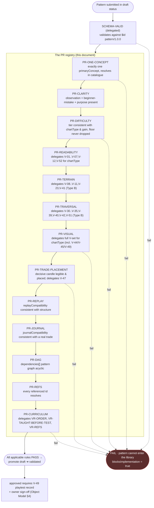

> **STATUS: RATIFIED** — ChartQuest Architecture v1.0 · Ratified 2026-07-15
> **Do not modify directly.** Part of the official ChartQuest ratified architecture. Changes require an ADR, migration notes, approval, and re-ratification — see `docs/architecture-ratified/ARCHITECTURE_CHANGE_POLICY.md`.

# ChartQuest Pattern Validation Contracts

> **CANONICAL REFERENCE.** The single source of truth for the Pattern object is [`CHARTQUEST_PATTERN_SCHEMA.json`](CHARTQUEST_PATTERN_SCHEMA.json); ownership & examples live in [`CHARTQUEST_PATTERN_OBJECT_MODEL.md`](CHARTQUEST_PATTERN_OBJECT_MODEL.md). This document references them; it does not redefine them. Where it conflicts, they govern.

> **Document class:** Canonical Pattern-OS specification (Phase 2A — analysis + specification only; NO source or gameplay changes).
> **Path:** `docs/pattern-library/CHARTQUEST_PATTERN_VALIDATION_CONTRACTS.md`
> **Date:** 2026-07-16 · **Schema:** pattern `1.0.0`
> **Role (Schema Frozen Decision P7):** This is the **sole `PR-*` registry**. It owns the identity and pass/FAIL predicate of every *pattern-structural* validation rule. Visual rules (`V-*`) resolve in the Visual Market Constitution; curriculum rules (`VR-*`) resolve in the Curriculum Engine. A pattern's `validationRules` array cites these `PR-*` ids **by link**; no other document lists them locally.

---

## 0. The one rule that governs every other rule

**A pattern failing any rule cannot enter the library.**

Every contract here carries `blocksImplementation: true`. Validation is not advisory. A pattern that fails any applicable `PR-*` — or any `V-*`/`VR-*` a `PR-*` delegates to — does **not** advance past `in_review`, is never promoted to `validated`/`approved`, and may not be named by a production `Lesson.learn.patternRef` or `Lesson.requiredPatterns[]` (Object Model §4 ship gate). There is no "wire it up anyway."

The engine is **default-closed**, inheriting the Curriculum Engine's inversion of the old default-open failure modes: an unmet contract is a hard stop, never a silent fallback. A missing `tradeTruthRef`, an unresolved `dependencies` id, or a second declared concept is a FAIL, not a warning.

---

## 1. The validation engine is deterministic

Every rule is a **pure predicate** over (a) the Pattern object under authorship, validated against [`CHARTQUEST_PATTERN_SCHEMA.json`](CHARTQUEST_PATTERN_SCHEMA.json), (b) the rendered candle instance(s) for each declared `chartTypes` entry, and (c) the pattern dependency graph over `dependencies[]`. Same input → same verdict, every time. No rule consults runtime randomness, network, or human judgment — the one human-in-the-loop gate (the Human Playtest Gate) is delegated to the Constitution's `V-49` and recorded, not re-adjudicated here.

Each rule is stated as:

- **`id`** — the canonical `PR-*` id (the same id a pattern lists in its `validationRules`).
- **Assertion** — the exact boolean that must hold, expressed over **byte-identical schema field names**.
- **Delegates to** — the `V-*` / `VR-*` ids this rule *runs but does not restate* (where applicable).
- **PASS / FAIL** — what each verdict means.
- **`blocksImplementation`** — always `true`.
- **Failure message** — the deterministic diagnostic the author reads.

---

## 2. Delegation, not duplication — the two firewalls

This document defines **no candle geometry** and **no lesson-sequencing rule**. Two firewalls are absolute:

**Firewall 1 — Visual (Schema P2).** Every pixel threshold, readability floor, chart-type band, rhythm limit, and composition ratio is owned by the **Visual Market Constitution** and enforced by its `V-01…V-52` validators ([Automated Validation Rules](../../CHARTQUEST_VISUAL_MARKET_CONSTITUTION.md#automated-validation-rules) / [Appendix A](../../CHARTQUEST_VISUAL_MARKET_CONSTITUTION.md#appendix-a--standards-table-single-source-of-truth)). `PR-VISUAL`, `PR-READABILITY`, `PR-TERRAIN`, and `PR-TRAVERSAL` **select and run** the relevant `V-*` subset for the pattern's declared `requiredVisualRules.chartType` and assert it PASSes. They quote **no** number. If the Constitution changes a floor, these `PR-*` inherit it with zero edits here.

**Firewall 2 — Curriculum (Schema P7).** Teach-order, prerequisite acyclicity over *concepts*, and asset-reference resolution for *lessons* are owned by the **Curriculum Engine** and enforced by its `VR-*` registry ([`CHARTQUEST_VALIDATION_CONTRACTS.md`](../curriculum-engine/CHARTQUEST_VALIDATION_CONTRACTS.md)). `PR-CURRICULUM` **runs** `VR-ORDER`, `VR-TAUGHT-BEFORE-TEST`, and `VR-REFS` against the concept context a pattern will enter; it never re-defines them.

> A `PR-*` rule owns exactly what the Pattern object owns (Object Model §1): market structure, visual educational *intent*, trade-opportunity *placement*, traversal *geometry intent*, emotional beat, and **concept identity**. Everything else it *delegates*.

---

## 3. The validation pipeline



The pipeline is **fail-fast**: cheap per-object checks (concept, clarity, difficulty) run before the expensive per-render `V-*` delegations, which run before the whole-graph `PR-DAG` / `PR-CURRICULUM` checks. It halts at the first failing stage. `SCHEMA-VALID` is the delegated Stage 0 — the Pattern object validates against `$id: https://chartquest.dev/schema/pattern/1.0.0`; any draft-2020-12 validator run against that `$id` catches a missing field, a bad enum, an unknown key (`additionalProperties: false`), or a `conceptKey` violating `^[a-z][a-z0-9_]*$`. There is no second field table to consult.

---

## 4. The 11 checks → the contracts

The brief's eleven acceptance checks map onto the `PR-*` registry with no gaps and no overlap:

| # | Brief check | Contract | Delegates to |
|---|---|---|---|
| 1 | Visual Constitution compliance | `PR-VISUAL` | full `V-*` set for `chartType` |
| 2 | Educational clarity | `PR-CLARITY` | — |
| 3 | One primary concept | `PR-ONE-CONCEPT` | Concept Catalogue (Object Model §2) |
| 4 | Difficulty consistency | `PR-DIFFICULTY` | `V-03`, difficulty ramp table |
| 5 | Traversal quality | `PR-TRAVERSAL` | `V-30`–`V-35`, `V-39`, `V-40`, `V-42`, `V-51` |
| 6 | Minimum readability | `PR-READABILITY` | `V-01`–`V-07`, `V-12`, `V-52` |
| 7 | Minimum terrain quality | `PR-TERRAIN` | `V-08`–`V-11`, `V-23`, `V-41` |
| 8 | Trade suitability | `PR-TRADE-PLACEMENT` | `V-47` |
| 9 | Replay suitability | `PR-REPLAY` | — |
| 10 | Journal suitability | `PR-JOURNAL` | — |
| 11 | Curriculum compatibility | `PR-CURRICULUM` (+`PR-DAG`, `PR-REFS`) | `VR-ORDER`, `VR-TAUGHT-BEFORE-TEST`, `VR-REFS` |

---

## 5. The contracts

Field references below are byte-identical to [`CHARTQUEST_PATTERN_SCHEMA.json`](CHARTQUEST_PATTERN_SCHEMA.json). "The rendered instance" means each concrete chart the pattern produces for an entry of `chartTypes[]`; a pattern declaring `["A","B"]` is validated **once per type** by every visual rule, each against that type's floor.

### `PR-ONE-CONCEPT`
> **Check 3 — one primary concept.**
- **Assertion:** `primaryConcept` is present, is a single short snake_case key matching `^[a-z][a-z0-9_]*$`, and resolves in the **Concept Catalogue** (Object Model §2, Schema P3). It does **not** also appear in `supportingConcepts` (a concept cannot be both anchor and support). No second concept is smuggled into `educationalPurpose` — the purpose names the same one concept (Schema P4).
- **PASS:** exactly one catalogue-resolving `primaryConcept`, disjoint from `supportingConcepts`, echoed by `educationalPurpose`.
- **FAIL:** `primaryConcept` empty, unresolved in the catalogue, duplicated into `supportingConcepts`, or an `educationalPurpose` that encodes a second "main point."
- **`blocksImplementation`:** `true`.
- **Failure message:** `PR-ONE-CONCEPT: pattern '<patternId>' — must anchor exactly ONE catalogue concept; got primaryConcept='<value>' (P4).`

### `PR-CLARITY`
> **Check 2 — educational clarity.**
- **Assertion:** all four pedagogy fields are present and non-empty — `educationalPurpose`, `expectedPlayerObservation`, `expectedBeginnerMistake`, and `requiredEmotionalBeat{hook,stakes,payoff}` — and each is worded for a 10-year-old (single sentence, no jargon beyond `requiredCandleVocabulary`). `expectedPlayerObservation` describes an *understand-by-looking* read; `expectedBeginnerMistake` names a concrete wrong read (the material `Lesson.misconceptions` will consume, Schema line 65).
- **PASS:** purpose, observation, mistake, and the hook/stakes/payoff beat are all present and single-concept, child-worded.
- **FAIL:** any of the four empty; an observation that is not visually checkable; a beginner mistake that is vacuous ("gets it wrong").
- **`blocksImplementation`:** `true`.
- **Failure message:** `PR-CLARITY: pattern '<patternId>' — missing/weak educational field '<field>'; needs a child-worded, look-and-see statement.`

### `PR-DIFFICULTY`
> **Check 4 — difficulty consistency.**
- **Assertion:** `difficultyTier` (1–5) is consistent with the pattern's declared render controls: `requiredVisualRules.chartType` and `exaggerationGain` sit on the Constitution's [difficulty ramp](../../CHARTQUEST_VISUAL_MARKET_CONSTITUTION.md#difficulty-standards) — higher `difficultyTier` corresponds to a lower `exaggerationGain` and/or a later type (A→B→C), never to a body below the readability floor. Concretely: a Type-A instance carries `exaggerationGain` near `1.0`; a Type-C instance carries `exaggerationGain` at/near `0`; and `difficultyTier` is monotonic with `(typeRank, 1 − exaggerationGain)`. Difficulty is **never** expressed by dropping below a floor — that violation surfaces in `PR-READABILITY`, and `PR-DIFFICULTY` asserts the *declared* tier does not require it.
- **Delegates to:** `V-03` (Type-A min body) as the floor witness; the Difficulty Standards ramp table for type/gain monotonicity.
- **PASS:** `difficultyTier` is order-consistent with `chartType` and `exaggerationGain`, and no floor is implied to move.
- **FAIL:** a Tier-1 pattern declaring Type C at `exaggerationGain 0`; a Tier-5 pattern at Type A `gain 1.0`; any tier whose only means of "harder" is smaller-than-floor bodies.
- **`blocksImplementation`:** `true`.
- **Failure message:** `PR-DIFFICULTY: pattern '<patternId>' — difficultyTier=<n> inconsistent with chartType=<t>/exaggerationGain=<g>; difficulty may never lower a readability floor (Difficulty Standards).`

### `PR-READABILITY`
> **Check 6 — minimum readability.**
- **Assertion:** for **each** entry of `chartTypes[]`, the rendered instance PASSes the Constitution's per-candle readability validators **for that type**, on desktop and on the smallest 360px phone. This rule owns nothing numeric — it selects the readability subset and asserts a green result.
- **Delegates to:** `V-01` (directional readability), `V-02` (hard floor), `V-03` (Type-A educational floor), `V-04`/`V-05` (doji band reserved), `V-06` (floored body reads small), `V-07` (gameplay median-clarity, Type B), `V-12` (body width in clamp), `V-52` (greyscale separability). Thresholds live only there.
- **PASS:** every delegated readability `V-*` returns pass for every declared type at both viewports.
- **FAIL:** any delegated readability `V-*` FAILs for any declared type/viewport.
- **`blocksImplementation`:** `true`.
- **Failure message:** `PR-READABILITY: pattern '<patternId>' type '<t>' — Visual Constitution readability check <V-id> FAILED at <viewport>. Fix per the Standards Table; this doc restates no pixel.`

### `PR-TERRAIN`
> **Check 7 — minimum terrain quality.** (Applies to any pattern with a Type-B instance; a non-B pattern PASSes vacuously.)
- **Assertion:** the Type-B rendered instance is a continuous, textured, jumpable *road* — bodies sharp with hair-overlap bleed and a continuous gameplay gap, with authored variety, per the Constitution's terrain validators. Pattern intent for this is authored in `requiredTerrainCharacteristics{targetVisibleCount, rhythmProfile, verticalityIntent}`; this rule asserts the render honours it and clears the terrain floor.
- **Delegates to:** `V-08`/`V-09` (max flat run count/px), `V-10` (max identical / no A-B-A-B), `V-11` (near-equal definition), `V-23` (gameplay gap continuous = 0), `V-41` (height texture + mandatory jitter).
- **PASS:** all delegated terrain `V-*` pass and `requiredTerrainCharacteristics.targetVisibleCount` yields a body width inside the type band (via the Constitution's slot rule — not restated here).
- **FAIL:** any delegated terrain `V-*` FAILs; a `targetVisibleCount` that drives bodies below the band; a zero-jitter metronome road.
- **`blocksImplementation`:** `true`.
- **Failure message:** `PR-TERRAIN: pattern '<patternId>' — Type-B terrain check <V-id> FAILED; the road is not continuous/textured/jumpable (Terrain quality).`

### `PR-TRAVERSAL`
> **Check 5 — traversal quality.** (Type-B instances; non-B PASSes vacuously.)
- **Assertion:** the Type-B render is walkable, never dead, and feels good — jump reach, cadence, step deltas, verticality, variety, and game-feel hooks all clear the Constitution's traversal floor, at all three zoom windows. `requiredTerrainCharacteristics.rhythmProfile` / `verticalityIntent` are the authored intent; this rule asserts the render satisfies the machine floor.
- **Delegates to:** `V-30` (max jump within reach envelope), `V-31` (step-delta band), `V-32` (jump cadence), `V-33` (net verticality), `V-34` (dynamic range), `V-35` (no dead-band step), `V-39` (step-delta variety), `V-40` (no metronome / peak present), `V-42` (game-feel hooks wired), `V-51` (rhythm passes at all zoom windows).
- **PASS:** every delegated traversal `V-*` passes across every zoom window.
- **FAIL:** any delegated traversal `V-*` FAILs; a gap over measured reach; a dead-band step; a metronome staircase. The deleted Guardian-Trial gauntlet may never be reintroduced (Constitution "Do-not-resurrect").
- **`blocksImplementation`:** `true`.
- **Failure message:** `PR-TRAVERSAL: pattern '<patternId>' — traversal check <V-id> FAILED at zoom '<window>'; terrain is unwalkable/dead/ill-feeling (Traversal quality).`

### `PR-VISUAL`
> **Check 1 — Visual Constitution compliance.** The umbrella visual gate; `PR-READABILITY`/`PR-TERRAIN`/`PR-TRAVERSAL` are its per-domain slices, and `PR-VISUAL` additionally covers the visual rules those three do not.
- **Assertion:** for **each** entry of `chartTypes[]`, the rendered instance PASSes **every applicable** `V-*` validator in the Visual Market Constitution for that type, per its `requiredVisualRules.authority` pointer (`#appendix-a-standards-table`). This includes composition/accessibility/colour rules beyond readability and terrain: separators, non-colour cues, colour-source, focal/relational ratios, and the human comprehension gate. **`PR-VISUAL` restates no pixel, ratio, or hex** — it runs the Constitution's validators and asserts green.
- **Delegates to:** the full `V-*` set selected by type — notably `V-13` (width formula), `V-14`–`V-16` (wicks), `V-17`/`V-18` (radius/edge), `V-19`/`V-21` (neutral separator + contrast), `V-20` (body-vs-bg contrast), `V-22` (non-colour cue), `V-24`/`V-25` (gap/count), `V-36` (no inline colour literals), `V-43` (monotonic magnitude), `V-44` (Type-A focal/relational ratios), `V-45` (Type-C composition), `V-49` (Human Playtest record present), `V-50` (CSS-px coordinate space). Every threshold resolves in the Constitution, nowhere here.
- **PASS:** for every declared type at both viewports, all applicable `V-*` return pass, and `requiredVisualRules.chartType` equals the type actually rendered and validated.
- **FAIL:** any applicable `V-*` FAILs; a rendered type absent from `chartTypes[]`; `requiredVisualRules.chartType` disagreeing with the render; a missing `V-49` playtest record (unshippable, same status as a failed V-check).
- **`blocksImplementation`:** `true`.
- **Failure message:** `PR-VISUAL: pattern '<patternId>' type '<t>' — Visual Market Constitution validator <V-id> FAILED. Resolve against the Standards Table; the Pattern OS restates no geometry (P2).`

### `PR-TRADE-PLACEMENT`
> **Check 8 — trade suitability.**
- **Assertion:** `tradeOpportunities[]` is non-empty; every entry names a `decisiveCandle`, a `direction ∈ {long,short,none}`, and a child-readable `readsAs`; each entry carries a `tradeTruthRef` pointing OUT to the trade-truth owner (`trading_canon.md`/TES) — **and encodes no outcome, probability, or win-knob** (Schema P6). Every entry's `direction` is permitted by `allowedTradeTypes` and excluded from `forbiddenTradeTypes`. The decisive candle reads as decisive: it is a directional (non-doji-band, unless the taught signal *is* a doji) focal candle at its type floor — asserted through the visual layer, not restated here. Placement must let a level reach **≥ 3 trades before its boss**.
- **Delegates to:** `V-47` (≥ 3 trades before boss); the decisive-candle legibility is witnessed by `PR-VISUAL`'s `V-01`/`V-03`/`V-44`.
- **PASS:** ≥ 1 well-formed opportunity, each with an outbound `tradeTruthRef` and no inline outcome, directions consistent with allowed/forbidden sets, decisive candle legible, and `V-47` satisfiable for the hosting level.
- **FAIL:** empty `tradeOpportunities`; an entry missing `decisiveCandle`/`direction`/`readsAs`; an inline outcome/probability (P6 violation); a `direction` outside `allowedTradeTypes` or inside `forbiddenTradeTypes`; a decisive candle in the doji band that is not a taught doji.
- **`blocksImplementation`:** `true`.
- **Failure message:** `PR-TRADE-PLACEMENT: pattern '<patternId>' — trade opportunity <i> is malformed, encodes an outcome (P6), or cannot reach >=3 trades before boss (V-47).`

### `PR-REPLAY`
> **Check 9 — replay suitability.**
- **Assertion:** if `replayCompatibility == true`, the pattern is structurally replayable — it declares ≥ 1 `tradeOpportunities[]` entry (the replay revisits a decision), its render is deterministic (authored, not a live market recording, per Constitution Pattern Standard #9), and it is not marked exam-secret in a way that forbids post-trade reveal. The replay **sequence** is owned by the Lesson (Schema line 86); this rule asserts only *suitability*, never sequence.
- **PASS:** `replayCompatibility` absent/false, OR true with ≥ 1 trade opportunity and a deterministic render.
- **FAIL:** `replayCompatibility == true` with zero `tradeOpportunities`, or on a pattern whose render is non-deterministic.
- **`blocksImplementation`:** `true`.
- **Failure message:** `PR-REPLAY: pattern '<patternId>' — replayCompatibility=true but nothing decisive to replay / render not deterministic.`

### `PR-JOURNAL`
> **Check 10 — journal suitability.**
- **Assertion:** if `journalCompatibility == true`, a trade on this pattern can produce a meaningful journal entry — the pattern hosts ≥ 1 `tradeOpportunities[]` entry with a real `direction` (`long`/`short`, not `none`) and a `tradeTruthRef` the journal can cite for the honest result. A pattern whose only opportunity is `direction: none` cannot be journal-compatible. Journal **content** is owned by the Lesson; this rule asserts only suitability.
- **PASS:** `journalCompatibility` absent/false, OR true with ≥ 1 actionable (`long`/`short`) opportunity carrying a `tradeTruthRef`.
- **FAIL:** `journalCompatibility == true` with no actionable trade (all `none`, or none present).
- **`blocksImplementation`:** `true`.
- **Failure message:** `PR-JOURNAL: pattern '<patternId>' — journalCompatibility=true but no actionable long/short trade to journal.`

### `PR-DAG`
> **Check 11a — dependency acyclicity.**
- **Assertion:** the `dependencies[]` graph over **all patterns** (each id a prerequisite `patternId`, e.g. `breakout-bos` depends on `range-sr`) is **acyclic** — a legal build order exists — and every listed id resolves to a real pattern (see also `PR-REFS`). Mirrors the Curriculum `VR-DAG` shape at the pattern layer; it is a *pattern-structural* graph, so it lives here, not in the VR registry.
- **PASS:** no cycle in the pattern dependency graph.
- **FAIL:** any `dependencies` cycle (A depends on B … depends on A).
- **`blocksImplementation`:** `true`.
- **Failure message:** `PR-DAG: pattern dependency cycle detected: <a> -> <b> -> ... -> <a>. No legal build order exists.`

### `PR-REFS`
> **Check 11b — reference resolution.**
- **Assertion:** every id a pattern references resolves to a real, existing target: each `dependencies[]` entry is an existing `patternId`; each `validationRules[]` id resolves in its home registry (`PR-*` here, `VR-*` in the Curriculum contracts, `V-*` in the Constitution); each `tradeOpportunities[].tradeTruthRef` points to an existing `trading_canon`/TES scenario; `requiredVisualRules.authority` equals the frozen Constitution anchor; and each `allowedLessons`/`forbiddenLessons` id (when not `['any']`) is a real lessonId. Compatibility only — resolution, never coupling (Schema P8).
- **PASS:** all referenced ids resolve.
- **FAIL:** any dangling reference — an unknown prerequisite pattern, an unregistered rule id, a `tradeTruthRef` to a non-existent scenario, a wrong `authority` anchor, or a phantom lessonId.
- **`blocksImplementation`:** `true`.
- **Failure message:** `PR-REFS: pattern '<patternId>' references missing target '<ref>'.`

### `PR-CURRICULUM`
> **Check 11c — curriculum compatibility.**
- **Assertion:** for the concept context the pattern will enter, the Curriculum Engine's contracts hold — **run, never restated**. Specifically: (i) `primaryConcept` and every `supportingConcepts`/`requiredCandleVocabulary` entry is taught at a `guardian` **≤** the guardian of any lesson that may use the pattern (delegates `VR-ORDER` — never require the untaught); (ii) any lesson referencing this pattern in a TEST beat only tests concepts taught at/before that Guardian (delegates `VR-TAUGHT-BEFORE-TEST`); (iii) the `Lesson↔Pattern` link resolves (delegates `VR-REFS` for `learn.patternRef`/`requiredPatterns[]`). `PR-CURRICULUM` supplies the Concept Catalogue mapping (Object Model §2) these VR rules read; it defines none of them.
- **Delegates to:** `VR-ORDER`, `VR-TAUGHT-BEFORE-TEST`, `VR-REFS` (Curriculum registry, `blocksImplementation: true` each).
- **PASS:** every delegated `VR-*` passes for every lesson in `allowedLessons` (or, if `['any']`, for the earliest lesson that could reference the pattern's concept).
- **FAIL:** a supporting concept assumed before it is taught (`VR-ORDER`); a boss testing this pattern's concept before it is taught (`VR-TAUGHT-BEFORE-TEST`); an unresolved lesson link (`VR-REFS`).
- **`blocksImplementation`:** `true`.
- **Failure message:** `PR-CURRICULUM: pattern '<patternId>' — Curriculum rule <VR-id> FAILED for concept '<conceptKey>'; sequencing is owned by the Curriculum registry (P7).`

---

## 6. Contract summary (the author's one-screen reference)

| `id` | Brief check | Scope | Enforces | Delegates | Blocks impl. |
|---|---|:---:|---|---|:---:|
| `SCHEMA-VALID` | — | pattern | shape/types/enums/`additionalProperties:false` | `$id pattern/1.0.0` | ✅ |
| `PR-ONE-CONCEPT` | 3 | pattern | exactly one catalogue `primaryConcept` (P4) | Concept Catalogue | ✅ |
| `PR-CLARITY` | 2 | pattern | purpose + observation + mistake + beat, child-worded | — | ✅ |
| `PR-DIFFICULTY` | 4 | pattern | tier consistent w/ type + gain; floor never dropped | `V-03`, ramp | ✅ |
| `PR-READABILITY` | 6 | render | per-candle readability floors, per type | `V-01`–`V-07`,`V-12`,`V-52` | ✅ |
| `PR-TERRAIN` | 7 | render | continuous, textured, jumpable road (Type B) | `V-08`–`V-11`,`V-23`,`V-41` | ✅ |
| `PR-TRAVERSAL` | 5 | render | walkable, never dead, good feel (Type B) | `V-30`–`V-35`,`V-39`,`V-40`,`V-42`,`V-51` | ✅ |
| `PR-VISUAL` | 1 | render | full Constitution compliance, per type | full `V-*` set | ✅ |
| `PR-TRADE-PLACEMENT` | 8 | pattern | decisive candle legible & placed; no outcome (P6) | `V-47` | ✅ |
| `PR-REPLAY` | 9 | pattern | replayable structure (suitability only) | — | ✅ |
| `PR-JOURNAL` | 10 | pattern | actionable trade to journal (suitability only) | — | ✅ |
| `PR-DAG` | 11a | graph | pattern `dependencies` acyclic | — | ✅ |
| `PR-REFS` | 11b | pattern | all referenced ids resolve | — | ✅ |
| `PR-CURRICULUM` | 11c | graph | teach-order & lesson link compatibility | `VR-ORDER`,`VR-TAUGHT-BEFORE-TEST`,`VR-REFS` | ✅ |

> **Closing invariant.** Every `PR-*` blocks implementation. A pattern reaches `validated` status only when `SCHEMA-VALID` and every applicable `PR-*` (and every `V-*`/`VR-*` they delegate to) PASS; it reaches `approved` only with a `V-49` Human Playtest record on file and owner sign-off (Object Model §4). The five gold-standard patterns each list the `PR-*` ids they satisfy in their `validationRules` array (Object Model §5 — e.g. `breakout-bos`: `["PR-ONE-CONCEPT","PR-VISUAL","PR-TRAVERSAL","PR-TRADE-PLACEMENT","PR-DAG","VR-ORDER"]`); those `PR-*` ids resolve **here and nowhere else**.

---

## 7. The validator's runnable checklist (JSON)

The list a validator executes for a single pattern, in fail-fast order. `applicableIf` gates a rule to the render types it governs; `delegates` names the foreign validators the rule *runs but does not define*. All `blocksImplementation: true`.

```json
{
  "schema": "https://chartquest.dev/schema/pattern/1.0.0",
  "engine": "CHARTQUEST_PATTERN_VALIDATION_CONTRACTS.md",
  "stopOnFirstFail": true,
  "pipeline": [
    { "id": "SCHEMA-VALID", "kind": "delegated", "delegates": ["$id:pattern/1.0.0"], "blocksImplementation": true },
    { "id": "PR-ONE-CONCEPT", "reads": ["primaryConcept", "supportingConcepts", "educationalPurpose"], "resolves": "ConceptCatalogue(Object Model §2)", "blocksImplementation": true },
    { "id": "PR-CLARITY", "reads": ["educationalPurpose", "expectedPlayerObservation", "expectedBeginnerMistake", "requiredEmotionalBeat"], "blocksImplementation": true },
    { "id": "PR-DIFFICULTY", "reads": ["difficultyTier", "requiredVisualRules.chartType", "requiredVisualRules.exaggerationGain"], "delegates": ["V-03"], "blocksImplementation": true },
    { "id": "PR-READABILITY", "applicableIf": "each chartTypes[]", "delegates": ["V-01","V-02","V-03","V-04","V-05","V-06","V-07","V-12","V-52"], "blocksImplementation": true },
    { "id": "PR-TERRAIN", "applicableIf": "chartTypes includes 'B'", "reads": ["requiredTerrainCharacteristics"], "delegates": ["V-08","V-09","V-10","V-11","V-23","V-41"], "blocksImplementation": true },
    { "id": "PR-TRAVERSAL", "applicableIf": "chartTypes includes 'B'", "reads": ["requiredTerrainCharacteristics"], "delegates": ["V-30","V-31","V-32","V-33","V-34","V-35","V-39","V-40","V-42","V-51"], "blocksImplementation": true },
    { "id": "PR-VISUAL", "applicableIf": "each chartTypes[]", "reads": ["requiredVisualRules"], "delegates": ["V-13","V-14","V-15","V-16","V-17","V-18","V-19","V-20","V-21","V-22","V-24","V-25","V-36","V-43","V-44","V-45","V-49","V-50"], "blocksImplementation": true },
    { "id": "PR-TRADE-PLACEMENT", "reads": ["tradeOpportunities", "allowedTradeTypes", "forbiddenTradeTypes"], "delegates": ["V-47"], "blocksImplementation": true },
    { "id": "PR-REPLAY", "reads": ["replayCompatibility", "tradeOpportunities"], "blocksImplementation": true },
    { "id": "PR-JOURNAL", "reads": ["journalCompatibility", "tradeOpportunities"], "blocksImplementation": true },
    { "id": "PR-DAG", "kind": "graph", "reads": ["dependencies"], "blocksImplementation": true },
    { "id": "PR-REFS", "reads": ["dependencies", "validationRules", "tradeOpportunities.tradeTruthRef", "requiredVisualRules.authority", "allowedLessons", "forbiddenLessons"], "blocksImplementation": true },
    { "id": "PR-CURRICULUM", "kind": "graph", "reads": ["primaryConcept", "supportingConcepts", "requiredCandleVocabulary", "allowedLessons"], "delegates": ["VR-ORDER","VR-TAUGHT-BEFORE-TEST","VR-REFS"], "blocksImplementation": true },
    { "id": "V-49-GATE", "kind": "human", "reads": ["requiredVisualRules.playtestRecordRef"], "note": "approved requires playtest record + owner sign-off (Object Model §4)", "blocksImplementation": true }
  ]
}
```

**A pattern failing any rule cannot enter the library.**
